# 等变神经网络架构自进化：阶段一完整可追溯报告

> 文档性质：阶段一研究、工程、实验与决策交接档案
>
> 目标读者：阶段二实验执行者、论文撰写者、复核代码与实验结论的研究人员
>
> 当前代码分支：`codex/stage1-framework`，远程交付分支为 `codex/stage1-equivariant-nas`
>
> 核心原则：本报告中的每项结论都应能回溯到代码、配置、日志、JSON 证据、测试或明确记录的负结果。

## 0. 为什么需要这份报告

阶段一不是一次普通的 Equiformer 超参数调优，而是把三个原本目标不同的系统组合成一个可审计的等变神经网络架构搜索闭环：

1. **Equiformer** 提供需要搜索和训练的 E(3)/SE(3) 等变模型、QM9 数据管线及极化率任务；
2. **OpenEvolve** 提供种群、island、谱系、parent/inspiration 采样、ProgramDatabase 和 MAP-Elites 档案；
3. **SPARK** 提供 reviewer/editor 分离、按功能因子编辑和利用演化历史进行反思的思想。

如果只说“把 OpenEvolve、SPARK 和 Equiformer 接起来”，会掩盖阶段一真正解决的问题：通用代码进化器可以改动任意 Python，SPARK 原始编辑面仍然较大，而等变网络的一个局部语法修改可能破坏全局不可约表示流；同时，单个候选的 QM9 训练价格远高于一般程序优化任务，极短训练又可能给出完全错误的候选排序。因此，本项目必须同时改造 **genotype、搜索空间、LLM 编辑契约、评估门、信用分配、低保真可信度和实验协议**。

本报告回答以下问题：

- 用户最初提出了什么目标，为什么后来修改了原规划；
- 阶段一究竟实现了哪些模块，哪些是复用、哪些是新建或实质性改造；
- 每个方法 insight 解决什么具体失败模式，代码在哪里，如何验证；
- 所有已运行实验的数值、预算、负结果和协议有效性是什么；
- 阶段二应从哪些冻结配置继续，哪些实验绝对不能自动扩大；
- 如何从代码提交、架构 ID、JSONL、checkpoint、预算账本和 manifest 回溯任意结果。

## 1. 阶段一最终状态与结论边界

### 1.1 已经完成的内容

| 工作项 | 状态 | 主要证据 |
|---|---|---|
| Equiformer QM9 α 官方基线完整复现 | 完成 | `../equiformer/reports/final_run/report/` |
| batch=64、固定 257,700 optimizer steps 训练器 | 完成 | `equivariant_nas/training/fixed_step_trainer.py`、`configs/protocol.json` |
| 类型化等变架构 genotype 与可信构建器 | 完成 | `spec.py`、`candidate.py`、`builder.py` |
| OpenEvolve islands、lineage、ProgramDatabase、MAP-Elites 集成 | 完成 | `scripts/run_factorized_evolution.py` |
| SPARK 风格 RC/SAR 双阶段编辑 | 完成 | `router.py`、`run_factorized_evolution.py` |
| 静态、资源、梯度、训练前/训练后对称性门 | 完成 | `pipeline.py`、`diagnostics.py` |
| 低保真轨迹与跨 fidelity 信任门 | 完成 | `trajectory.py`、`fidelity_trust.py`、`promotion.py` |
| 交互感知 sibling 反事实与信用回写 | 完成 | `interaction.py`、counterfactual scripts |
| 冻结证据记忆与谱系条件化反思 | 完成 | `stage1_factor_memory*.json`、`search_memory.py` |
| 等变语义约束的权重继承审计 | 完成，但仅限 calibration | `inheritance.py`、`inheritance_calibration.json` |
| 零 GPU 端到端闭环 smoke | 通过 | `reports/stage1/evidence/memory_smoke/` |
| 自动化测试与编译检查 | 通过 | `41 passed`、`py_compile: PASS` |
| Phase 2 预算门控预注册 | 完成 | `PHASE2_PREREGISTRATION.md`、对应 JSON |

### 1.2 当前能够成立的结论

1. 一个 LLM 驱动、类型化、单因子变异的 Equiformer 架构进化闭环已经工程上跑通；LLM 不执行任意生成代码，也不能修改训练协议。
2. 极短 fidelity 在本任务中会发生严重排名反转；300/1,000-step 结果不能直接作为候选晋级依据。
3. 因子局部修改不等于因子效应可加；阶段一真实观察到了 ACTION 与 OPERATOR 的强交互，必须用 sibling 反事实拆分信用。
4. 最终标量输出的旋转、平移、原子置换审计可以作为安全门；未经坐标约定校准的 layerwise irrep hook 不能作为硬拒绝依据。
5. 阶段一 5,000-step pilot 中，因子化搜索找到过优于同预算 baseline 和 matched random 的候选，但样本数与 search seed 数远不足以证明搜索方法具有统计优势。

### 1.3 当前不能成立的结论

- 不能声称 ECFR 已经统计显著优于 uniform router 或 typed random；
- 不能声称搜索出的架构已在 257,700 steps、3 个训练 seed 上超过论文；
- 不能把 300-step winner 当作“快速收敛且最终更优”的证据；
- 不能把 layerwise symmetry warning 当作物理等变性失败；
- 不能把 ISWT 的 86.16% 元素覆盖率当作已经验证的训练加速；
- 不能把任何训练期间读取 test split 的自定义任务用于严格无泄漏 NAS 选择；
- 不能声称已经达到论文发表或 CCF-A oral 所需证据标准。

“阶段一完成”准确含义是：**方法原型、约束、证据记录和阶段二预注册已完成**，而不是“方法优越性已经证明”。

## 2. 从最初需求到阶段一最终方案的决策演变

### 2.1 起点：先复现 Equiformer，而不是 EquiformerV3

用户最初考虑复现 EquiformerV3，随后明确指出 Equiformer V1 代码更直接、训练逻辑更容易审计，因此将第一阶段基础模型切换为 `atomicarchitects/equiformer`。这一决定非常关键：阶段一的目标不是追逐最新模型，而是建立一个能够清楚控制结构、训练协议和评估证据的 NAS 实验基座。

火山引擎环境最终固定为：

| 项目 | 固定值 |
|---|---|
| GPU | 单卡 NVIDIA A100-SXM4-80GB，用户独享 |
| vePFS 原始目录 | `/queue010/20262202788` |
| 容器内挂载目录 | `/home/20262202788` |
| SSH 别名 | `volcano-equiformer` |
| 网络 | SSH 反向代理，服务器端 `127.0.0.1:12356` |
| 禁止使用 | 火山引擎按流量计费“网际快车” |
| Equiformer 环境 | `/home/20262202788/conda-envs/equiformer` |
| OpenEvolve 环境 | `/home/20262202788/conda-envs/openevolve` |
| LLM 配置 | `/home/20262202788/.config/openevolve/apis.env`，权限 mode 600 |

仓库版本：

| 仓库 | 服务器路径 | 阶段一记录的提交 |
|---|---|---|
| Equiformer | `/home/20262202788/equiformer` | `64cb7866f48b9aa156e74a9d6a2ef2663b367437` |
| OpenEvolve | `/home/20262202788/openevolve` | `411fb59c886c18704caaffb611e17cf9e7d824d2` |
| SPARK | `/home/20262202788/SPARK` | `e4f5a7f45fd5e9652fe20cbadc6ddc78e87db2c9` |
| 本项目 | `/home/20262202788/equivariant-nas` | 见本文提交历史 |

API 密钥不进入代码、报告、manifest 或 Git；本文也不复述任何密钥值。

### 2.2 先完成官方基线复现，建立真实训练尺度

此前已经完整跑完 Equiformer 在 QM9 `target=1`、各向同性极化率 α 上的官方 300 epoch 训练：

- 数据划分：train 110,000、validation 10,000、test 10,831；
- 官方 batch size：128；
- 300 epoch，每 epoch 859 个 optimizer steps；
- 总 optimizer steps：`300 × 859 = 257,700`；
- 论文报告的 α **测试集 MAE**：`0.046 a₀³`；
- 本次完整复现最佳 validation MAE：`0.04607 a₀³`；
- 同一 checkpoint 的 test MAE：`0.04776 a₀³`；
- 完成 300/300 epoch，累计逐 epoch 时间约 32.57 小时；
- 单卡 A100 平均利用率约 91.4%，峰值显存约 30.75 GiB。

完整基线报告位于：

`../equiformer/reports/final_run/report/Equiformer_QM9_alpha_复现实验报告.md`

这个复现不是 NAS 搜索结果，而是三件事的基准：模型构造可信、数据与量纲明确、完整训练预算有真实测量。

### 2.3 为什么 batch size 改为 64，但终止条件仍是 257,700 steps

用户明确提出：为了研究更小 batch 是否能使单步更快，**保持原 batch=128 时的 optimizer-step 总数不变，只把 batch size 改为 64**。因此阶段一及后续协议不是“batch 变小后仍跑 300 个数据 epoch”，而是：

```text
batch_size = 64
max_steps = 257700
reference_steps_per_epoch = 859
终止条件 = global optimizer step
不是数据集遍历 epoch
```

这里必须区分两个概念：

- **data cycle（真实数据遍历周期）**：batch=64 时，110,000 个训练样本被打乱并拆分成约 1,718 个 batch；完成这些 batch 后，训练集中的样本都已参与一次训练，然后再次打乱并开始下一个 cycle。因此，batch 变小并不意味着只使用部分训练集或永久遗漏一半样本；每个 cycle 仍覆盖完整训练集。
- **reference epoch（学习率参考刻度）**：为了复用原论文按 859 steps/epoch 定义的 warmup、cosine 学习率相位与评估节奏，仍把每 859 次 optimizer update 记作一个 reference epoch。它只是调度与记录刻度，不表示 batch=64 时已经完整遍历一次训练集。

当前协议固定的是 **optimizer update 次数**：batch=128 和 batch=64 都执行 257,700 次参数更新。由于 batch=64 每次更新使用 64 个样本，而原 batch=128 每次更新使用 128 个样本，因此截至相同 step，batch=64 大约完成 150 次完整数据遍历，原配置约完成 300 次。这里减少的是训练集的**重复遍历次数**以及累计参与计算的样本实例数，不是训练集的覆盖范围。

因此，`batch_size=64, max_steps=257700` 正是本项目需要的“固定更新次数、改变每次更新的 batch 大小”协议。它不应描述为遗漏数据，也不应把 reference epoch 当成真实 data epoch。阶段一所有候选共享同一 batch=64、同一 global-step endpoint 和同一学习率参考刻度，从而保证搜索内部比较公平。

### 2.4 最初 Handoff 规划与最终实现为什么不同

最初 `/home/20262202788/paper/HANDOFF-equivariant-nas.md` 的设想是：

- 把 Equiformer 源码切为 OPERATOR/ACTION 两个 region；
- 让 LLM 修改 region 内 Python；
- 用 S0-S4 渐进评估与 successive halving 控制成本；
- 假设 3k-5k step 的短训练能近似长训练排序。

实际实现作了三项重要修订：

1. **从源码 region 编辑改为类型化 ArchitectureSpec。** 原因是等变网络中语法局部修改可能全局破坏 irrep 流，而且任意 Python 面过大，难以保证 LLM 不绕过协议。
2. **从两个因子扩展为四个因子。** REPRESENTATION、OPERATOR、ACTION、MACRO 将表示容量、消息算子、更新/正则行为和宏观深度/半径分开，信用更清晰。
3. **不再预设极短 fidelity 可信。** 阶段一测得 300→5,000 step 排名显著反转，因此建立 LRPF/SCFTG，将短训练先视为待校准代理，而不是天然晋级信号。

这三项修订构成阶段一最主要的方法论成果：系统不是照搬最初规划，而是在真实实验反例后收紧了科学有效性。

## 3. 固定研究任务与不可变实验协议

### 3.1 优化目标

对架构规格 `A` 和固定训练预算 `T`，搜索目标为：

```text
minimize validation MAE of QM9 isotropic polarizability alpha
```

约束为：

- 数据集固定为 QM9；
- `target=1`，各向同性极化率 α；
- MAE 单位为 `a₀³`，其中 `a₀` 是玻尔半径；
- 参数量不超过 baseline 的 `1.2×`；
- 最终输出必须是旋转不变的标量；
- 数据、划分、loss、optimizer、batch、step budget、evaluator 不属于 genotype；
- 搜索期间禁止使用 test split；
- 候选只能在相同 fidelity endpoint 内比较。

### 3.2 协议源文件

`configs/protocol.json` 是阶段一和阶段二训练协议的机器可读基础：

| 字段 | 值 | 含义 |
|---|---:|---|
| `dataset` | QM9 | 固定数据集 |
| `target` | 1 | α |
| `batch_size` | 64 | 搜索和后续固定训练 batch |
| `pilot_search_steps` | 5,000 | 阶段一稳定 pilot fidelity |
| `final_max_steps` | 257,700 | 最终完整训练更新次数 |
| `reference_steps_per_epoch` | 859 | 学习率与评估相位轴 |
| `warmup_steps` | 4,295 | 5 个 reference epochs |
| `eval_interval_steps` | 859 | 每个 reference epoch 验证一次 |
| `loss` | L1 | 与基线一致 |
| `optimizer` | AdamW | 与基线一致 |
| `learning_rate` | 5e-4 | 峰值学习率 |
| `minimum_learning_rate` | 1e-6 | cosine 最小学习率 |
| `weight_decay` | 5e-3 | 权重衰减 |
| `test_during_search` | false | 测试集隔离 |
| `parameter_ratio_limit` | 1.2 | 参数硬上限 |
| `final_seeds` | 0,1,2 | 最终训练 seed |

LLM 不得改变以上任何字段。运行器即使收到错误提案，也只能在已选架构因子内 repair，不能扩大修改面。

## 4. 完整端到端工作流

### 4.1 先用几段话理解整个系统

这个系统的输入不是一段任由 LLM 改写的 Equiformer 源代码，而是一个已经通过验证的 **父代架构规格**。该规格把模型结构拆成 REPRESENTATION、OPERATOR、ACTION 和 MACRO 四类决策。每次进化只允许选择其中一个因子进行修改，其他三个因子必须与父代完全相同。这样做的目的，是让一次实验结果能够较清楚地归因于某一类结构变化，同时防止 LLM 顺手修改数据、训练轮数、损失函数等与架构无关的内容。

一次迭代开始时，OpenEvolve 从已有候选库中选择一个 parent（父代）和 2 个 inspirations（参考候选）。随后 ECFR 根据历史实验中各因子的有效率、验证 MAE 改善和效率收益，决定本次修改哪个 factor。TCRE 再从父代谱系中提取已经真实测量过的验证 MAE、过去改过哪些因子、近期是否仍在改善等信息。LLM 的第一阶段 RC 只负责阅读这些证据并提出修改方向；第二阶段 SAR 才把方向转换成一个严格受限的 factor JSON。也就是说，LLM 负责“提出结构假设”，可信代码负责“决定它是否能成为真实模型”。

LLM 给出的 JSON 不会立即送到 GPU。SPAG 编译器首先检查字段、取值、irrep 关系、科学语义和单因子不变量，然后可信 builder 才用官方 Equiformer 模块构建模型。接下来按从便宜到昂贵的顺序检查参数量、前向传播、反向传播、梯度是否有限、预算是否足够以及训练前对称性诊断。任何候选如果在这些阶段失败，就记录失败原因并停止，不消耗后续 5,000-step 训练预算。

通过廉价门的候选进入固定 step 训练。搜索阶段统一使用 QM9 `target=1`、batch size 64、trainer seed 0 和 5,000 optimizer steps，只用 validation MAE 评价结构。训练完成后必须重新加载 checkpoint，再检查旋转、平移和原子置换后的最终标量输出是否稳定。通过训练与对称性硬门的候选，才有资格进入 OpenEvolve 档案，并成为以后可能被采样的父代。

候选归档前还要解决“信用应该记给谁”的问题。普通情况下，用 parent 与 child 的 validation MAE 差更新本次 factor 的统计；如果出现“父代先退化、子代又被另一个因子大幅救援”的链条，则触发 IACC，额外训练一个 sibling（兄弟候选），把新因子的独立收益和两个因子的交互收益拆开。最后，低 fidelity 是否能用于晋级不是单个候选自己决定的，而是等一批候选同时拥有短、长两个 fidelity 的结果后，由 SCFTG 在群体层面检查排序相关性、top-k 保留率和选择后悔值。未通过时，短训练只能作为校准资料，不能决定哪个架构晋级。

### 4.2 八个阶段的总览

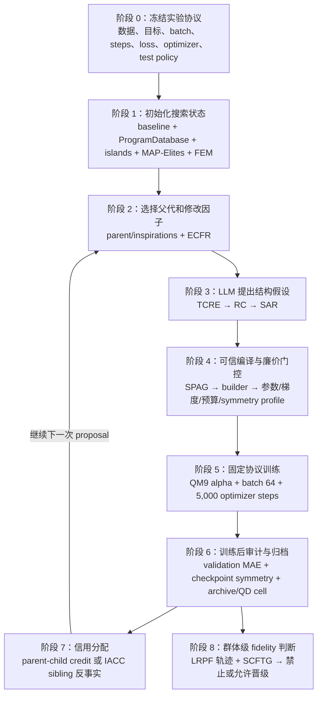

这里的“阶段 8”不是普通单次候选循环中的自动尾步骤。主搜索 pipeline 默认只在候选 endpoint 做完整 validation；若要构造 LRPF，必须让同一候选在预先指定的学习率相位端点产生可比较观测，或运行专门的多 fidelity 校准实验。SCFTG 则必须等到一组共同候选都拥有 proxy 与 reference 两种 fidelity 结果后，才能进行群体排序判断。

### 4.3 阶段 0：冻结实验协议，先定义什么绝对不能搜索

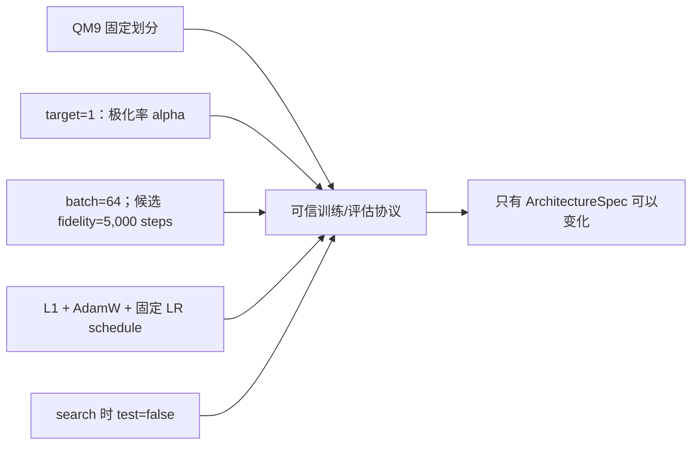

这一阶段没有 LLM 参与。`configs/protocol.json` 固定数据集、target、batch、optimizer、learning rate、weight decay、step budget、参数上限和 test policy。它定义了公平比较的共同坐标系。若让 LLM 改变训练步数或数据划分，较低 MAE 就无法再归因于架构本身。

**输入：** 冻结 protocol 和 QM9 数据。

**输出：** 所有候选共同使用的 evaluator 配置。

**失败处理：** 候选中出现协议字段时直接拒绝；这些字段根本不属于 genotype。

### 4.4 阶段 1：建立 OpenEvolve 搜索状态

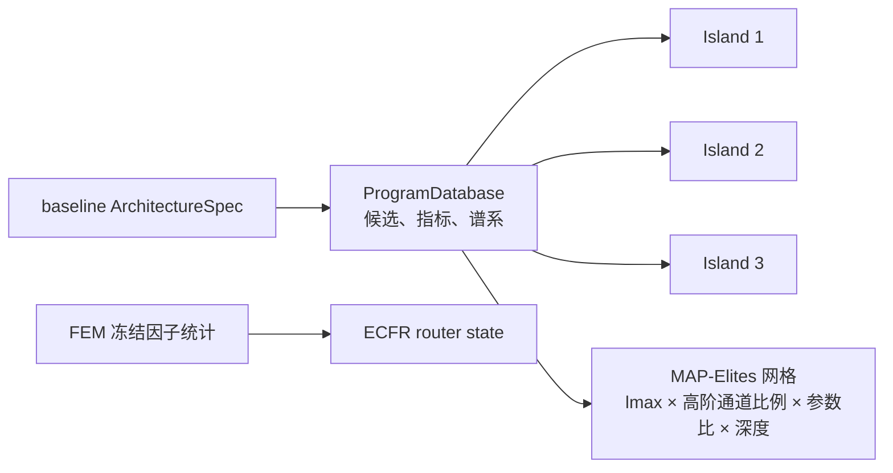

`ProgramDatabase` 是搜索过程的结构化候选库，保存候选代码容器、metrics、父子关系和发现迭代。Island（岛屿）是相对独立的子种群，用于避免所有候选过早集中到同一种结构。MAP-Elites 不是只保存一个全局最优，而是在多个结构特征格子中分别保存表现好的 elite（精英候选），从而同时维持精度与架构多样性。

阶段一实现最多使用 3 个 islands、population size 最多 100、archive size 最多 30。MAP-Elites 的四个维度和格子数为：

| 维度 | 中文含义 | bins |
|---|---|---:|
| `lmax` | 最高角动量阶数 | 3 |
| `higher_order_fraction` | 二阶及以上通道占总通道比例 | 4 |
| `parameter_ratio` | 候选参数量 / baseline 参数量 | 4 |
| `num_layers` | Transformer block 数 | 4 |

这些范围在插入候选前固定，避免动态 min-max 使同一候选因到达顺序不同而落入不同格子。

### 4.5 阶段 2：采样父代并选择本次只改哪个因子

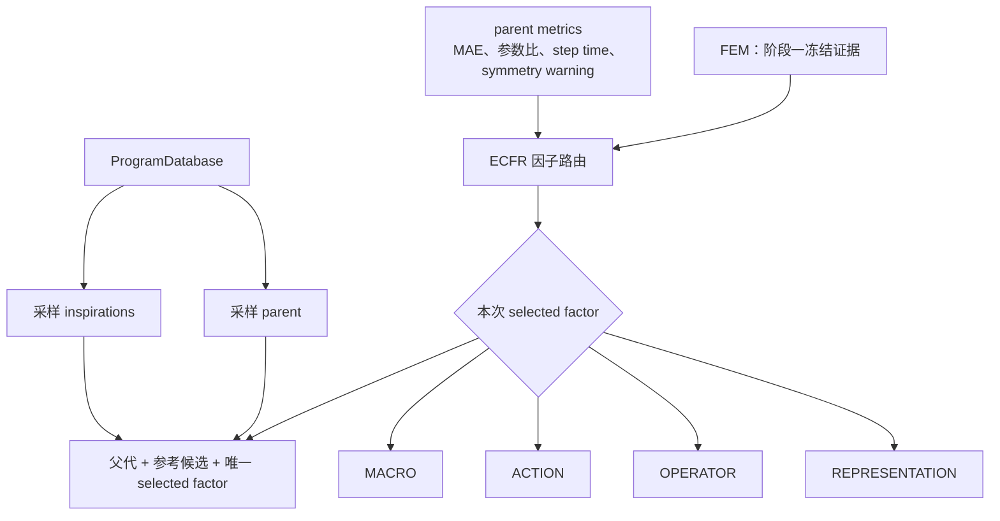

Parent 是本次将被修改的父代；inspirations 是供 LLM 参考的其他已有候选，它们可以提示哪些方向已尝试，但不能被直接拼接为不受约束的代码。ECFR 是一个带探索项的因子路由器，其核心分数可概括为：

```text
factor score
= 平均验证 MAE 收益
+ 0.05 × 平均效率收益
+ exploration × 不确定性项
- 无效候选惩罚
+ 小幅上下文 bonus
```

代码中 `exploration=0.35`。尚未尝试的因子获得最高探索优先级；历史上频繁产生非法候选的因子会被惩罚。上下文 bonus 最大只起小幅辅助作用，主要信用仍来自真实 parent-child 结果。uniform-router 对照跳过这套证据打分，四个因子均匀选择。

**输入：** database、parent metrics、FEM prior。

**输出：** parent、inspirations、唯一 selected factor。

**失败处理：** 该阶段不产生模型；若 prior 与 QM9 target 1 不匹配或未覆盖四个因子，直接停止运行。

### 4.6 阶段 3：TCRE、RC 和 SAR 如何共同生成候选

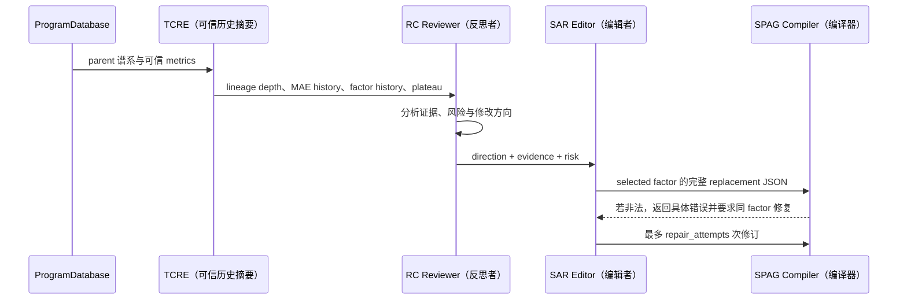

TCRE 的作用不是让 LLM“自由回忆历史”，而是先由代码生成受信任摘要。默认最多观察最近 4 个谱系节点；至少有 3 个同 fidelity validation MAE 才判断 plateau。若近期 best 改善小于 `0.02 a₀³`，标记 plateau=`yes`，SAR 才可在已经选定的 factor 内采用更探索性的修改；证据不足则必须为 `unknown`。

RC 和 SAR 是 SPARK 使用的模块简称；当前仓库材料主要按功能描述它们，并未给出需要在本文强行展开的统一英文全称。本文把 RC 解释为“反思/审阅阶段”：它回答已有测量证据支持什么方向、潜在风险是什么、下一次结构假设为何合理，但不输出 Python，也不直接修改架构。SAR 解释为“结构编辑阶段”：它接收 RC 的方向，只输出 selected factor 的完整 JSON replacement。`--skip-reflection` 是 Phase 2 的 no-RC 消融开关。SPARK 还使用 ASR 来选择 OPERATOR 或 ACTION；本项目没有原样沿用 ASR，而是以四因子的 ECFR 取代其选择职责。

**输入：** parent spec、inspirations、selected factor、可信历史摘要。

**输出：** factor replacement JSON 和 reasoning。

**失败处理：** JSON/schema/科学语义错误可按 `repair_attempts` 在同 factor 内修复；默认只允许 1 次修复，仍失败则记录 invalid proposal。

### 4.7 阶段 4：SPAG 编译和训练前廉价门控

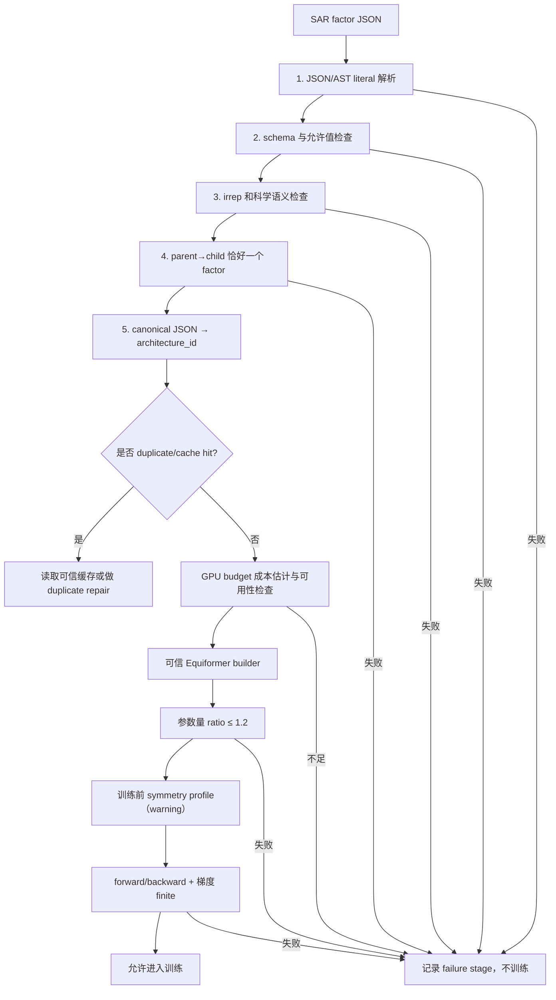

SPAG 是 Symmetry-Preserving Architecture Grammar，即“保持对称性语义的架构语法”。它只解析字面量，不 import LLM 文件。通过 canonical JSON 计算 16 位 architecture ID；同一规格无论字段书写顺序如何，ID 都一致，因此可去重和缓存。

训练前门控的重要参数：

| 参数 | 当前值 | 作用 |
|---|---:|---|
| `parameter_ratio_limit` | 1.2 | 候选参数量不得超过 baseline 的 1.2 倍 |
| `symmetry_warning_threshold` | 0.01 | 超过后记录 warning，但训练前不硬拒绝 |
| `symmetry_threshold` | 0.25 | 训练后 observable symmetry 的灾难性硬阈值 |
| `NAS_GPU_BUDGET_HOURS` | 随 gate 设置 | 整个运行允许消耗的 GPU 小时 |
| `NAS_BUDGET_LEDGER` | 共享 JSONL 路径 | 记录和约束多个方法的共同预算 |

训练前 symmetry/gradient 诊断从 train split 取一个 batch size 为 2 的小批次，默认做 2 次随机旋转、2 次平移以及置换检查。它的目的不是估计 validation MAE，而是在正式 5,000-step 训练前发现明显的数值或梯度故障。

预算估计对已有 fidelity 使用历史中位耗时并增加 20% 安全裕量；新 fidelity 使用保守 fallback。预算不足时必须在训练开始前拒绝。

### 4.8 阶段 5：固定 step 训练到底执行了什么

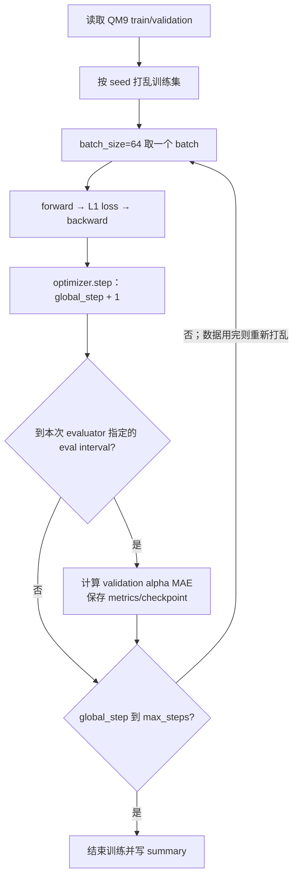

在 Phase 2 搜索中，`max_steps=5000` 表示每个 trained-valid candidate 完成 5,000 次 `optimizer.step()`。batch=64 时每次更新使用 64 个样本；训练集在一个 data cycle 用完后重新按确定性 seed 打乱并继续。`reference_steps_per_epoch=859` 用于推进与原 batch=128 配置一致的学习率参考相位。需要特别区分：当前 NAS pipeline 调用 5,000-step 候选训练时传入 `eval_interval_steps=max_steps`，所以用于候选主评分的 validation 在 5,000-step endpoint 执行；它并不是每 859 steps 都做一次完整 validation。若单独运行长期 fixed-step 训练，可把 `eval_interval_steps` 配置为 859，以获得逐 reference epoch 曲线。

搜索中的 trainer seed 固定为 0，使不同架构尽可能经历相同的随机初始化规则和数据顺序；search seed 101/102/... 则控制 LLM sampling、父代采样、island 和 factor routing。两类 seed 不能混为一谈。

训练输出至少包括：validation MAE、best step、step time、training time、checkpoint、学习率、global step、data cycle 和是否读取 test。搜索期间 `test_evaluated` 必须为 false。

### 4.9 阶段 6：训练后审计、评分和归档

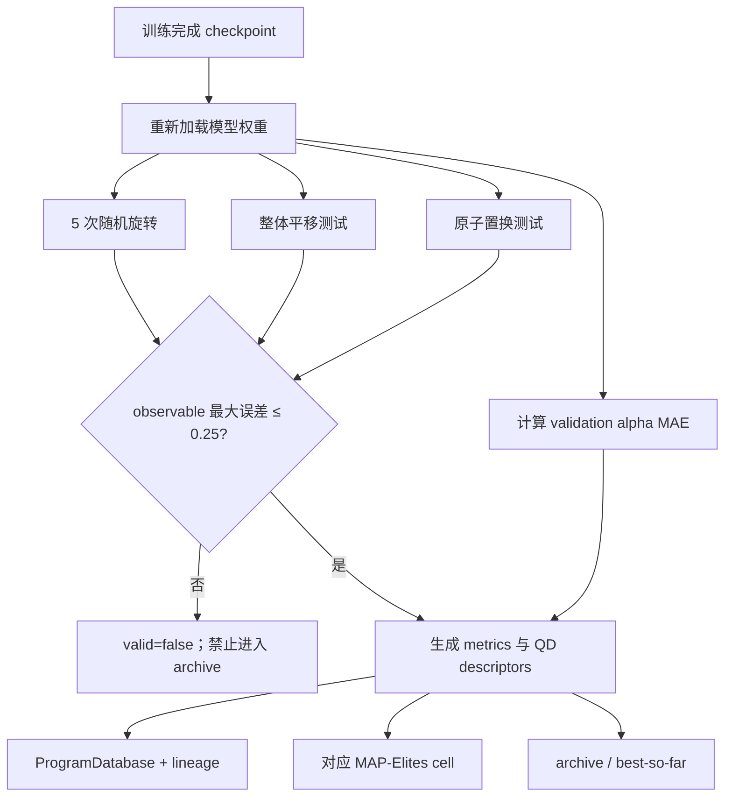

Validation MAE 是架构质量主指标，数值越低越好。参数量和 step time 是辅助效率指标以及 QD descriptors，不会被偷偷混成一个替代 MAE 的目标。`combined_score` 只是 OpenEvolve 接口需要的排序字段，原始 MAE、参数和所有门控状态仍单独保存。

Archive（档案）是保留高质量候选的集合；lineage（谱系）记录父子关系；QD cell 是候选在 MAP-Elites 多样性网格中的位置。一个候选可以不是全局最低 MAE，但因占据不同容量区域而成为某个 cell 的 elite，从而保留为未来父代。

训练后 symmetry audit 使用训练前保留的小批次重新检查 checkpoint，默认做 5 次随机旋转、3 次平移和 1 次原子置换。最终 observable 最大相对误差超过 0.25 时，候选被标记为 invalid；超过 0.01 但未达到 0.25 时保留 warning。未经校准的 layerwise error 即使较大也不单独触发硬拒绝。

### 4.10 阶段 7：普通信用与 IACC 反事实信用

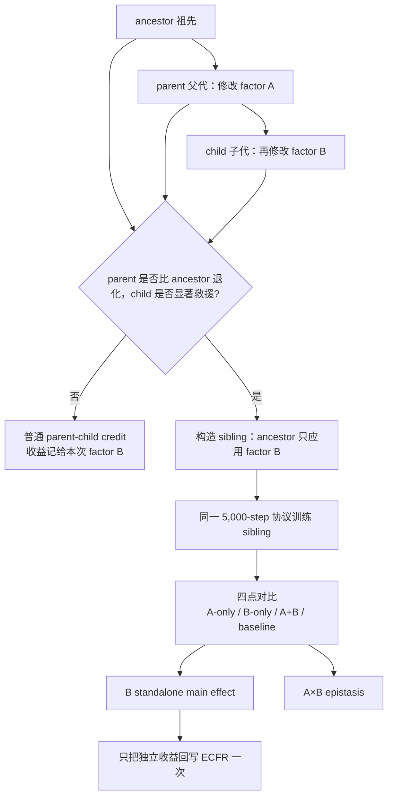

Credit 是“本次结构修改应得到多少收益评价”。普通 parent-child credit 使用 `parent_mae - child_mae`；正数表示 child 更好。IACC 是 Interaction-Aware Counterfactual Credit，即“交互感知反事实信用”。它只在 degraded-parent rescue chain（父代先退化、子代再被救援）出现时触发，不是每个候选都额外训练 sibling。

Sibling 是与原 child 共享同一个新 factor B、但去掉之前 factor A 的兄弟候选。通过四点对比，系统区分 B 独立是否有用，以及 B 是否只在 A 存在时表现特殊。`--disable-iacc` 用于 no-IACC 消融；resolved counterfactual 通过唯一 key 防止重复回写。

### 4.11 阶段 8：LRPF 与 SCFTG 的群体级晋级判断

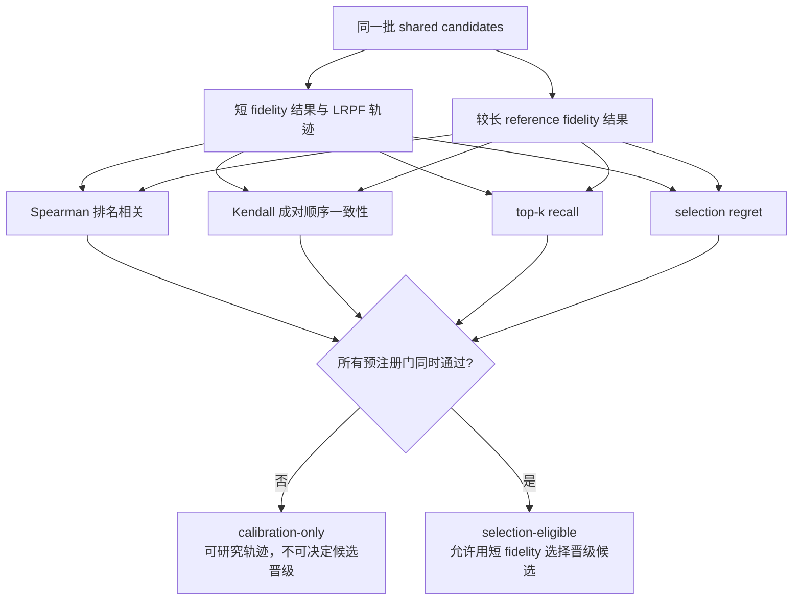

LRPF 是 Learning-Rate-Phase-Aware Fidelity，即“学习率相位感知的保真度描述”。它利用专门保存的多个相位端点，不只比较一个早期 MAE，还描述学习率转换冲击和 warmup 恢复；普通 endpoint-only 搜索结果本身不足以构造完整 LRPF。SCFTG 是 Self-Calibrating Fidelity Trust Gate，即“自校准低保真信任门”。它在一批共同候选上比较短、长 fidelity 排名，而不是判断某个候选自身是否可信。

SCFTG 默认/阶段一使用的核心判据包括：

| 参数或指标 | 含义 | 门控方向 |
|---|---|---|
| `minimum_cohort` | 同时拥有两个 fidelity 的最少共同候选数 | 至少 8 |
| Spearman | 两组完整排名的单调相关性 | 至少 0.5 |
| Kendall τ | 任意候选对的相对顺序一致性 | 越高越好，作为报告指标 |
| `top_k_recall` | 短 fidelity top-k 中有多少仍在长 fidelity top-k | 至少 0.5 |
| normalized selection regret | 按短 fidelity 选出的 winner 在长 fidelity 上比真正最好者差多少 | 不超过 0.1 |

阶段一只有 3 个共享候选，并且 Spearman=-0.5、top-1 recall=0、normalized regret=0.6591，因此 300-step proxy 没有 selection authority。这里的“失败”不是候选训练失败，而是短 fidelity 作为架构选择工具失败。

### 4.12 搜索何时停止，何时继续

单次搜索 run 受三类终止条件共同约束：

1. `valid_target`：达到指定数量的 trained-valid children 后停止；
2. `max_proposals` 或 `iterations`：即使合法候选不足，也不能无限调用 LLM；
3. GPU budget ledger：预计下一个候选会超过共享预算时，训练前停止。

Phase 2 micro 中，`valid_target=2`、`max_proposals=10`、每候选 `max_steps=5000`。完成某个方法的 2 个合法候选不代表自动进入 6 候选实验；必须等 full、uniform 和 typed random 三种方法都完成后，按预注册 gate 统一决定是否继续。

### 4.13 工作流中的英文和缩写解释

| 术语 | 中文解释 | 在本项目中具体指什么 |
|---|---|---|
| NAS | 神经网络架构搜索 | 自动寻找比固定 baseline 更好的 Equiformer 结构 |
| LLM | 大语言模型 | 负责反思证据和提出 factor JSON，不直接执行模型代码 |
| genotype | 基因型/搜索对象表示 | `ArchitectureSpec`，不是任意 Python |
| candidate | 候选架构 | 一份合法规格及其训练/审计结果 |
| parent / child | 父代 / 子代 | 修改前与修改后的架构 |
| ancestor | 祖先 | parent 的上一级，用于 IACC 四点对比 |
| inspiration | 参考候选 | OpenEvolve 采样给 LLM 作为历史参考的其他候选 |
| proposal | 一次提案 | 从选 factor 到产生一个待验证 JSON 的完整尝试 |
| factor | 架构决策因子 | REPRESENTATION、OPERATOR、ACTION、MACRO 之一 |
| valid | 合法/有效 | 通过 schema、构建、资源、训练及相应硬门；不是“精度一定好” |
| trained-valid | 完成训练且有效 | 真正消耗指定训练步数并通过训练后硬门的候选 |
| fidelity | 评估保真度 | 一个候选被训练和评估到什么预算，例如 300 或 5,000 steps |
| proxy fidelity | 代理保真度 | 希望用来预测更长训练排序的便宜训练预算 |
| calibration | 校准 | 可以研究代理关系，但结果没有候选选择权 |
| selection-eligible | 有资格用于选择 | 允许该证据决定候选晋级或保留 |
| validation MAE | 验证集平均绝对误差 | 搜索主指标，越低越好，单位 `a₀³` |
| test split | 测试集 | 搜索期间禁止读取，架构冻结后才使用 |
| checkpoint | 训练检查点 | 模型权重及恢复训练所需状态 |
| metrics | 结构化指标 | MAE、参数量、耗时、symmetry、valid 状态等 |
| archive | 档案 | 保留优秀或有多样性价值的候选集合 |
| lineage | 谱系 | parent-child 关系及历史修改路径 |
| island | 岛屿子种群 | 减少整个种群过早收敛到同一结构区域 |
| MAP-Elites | 质量—多样性档案算法 | 在多个结构特征格子中分别保留 elite |
| elite | 精英候选 | 某个 QD cell 中表现较好的候选 |
| QD cell | 质量—多样性格子 | 按 lmax、通道比例、参数比和深度划分的位置 |
| reflection / RC | 反思/审阅阶段 | 根据可信证据提出方向、理由和风险 |
| ASR | SPARK 中的因子选择模块简称 | 在 SPARK 中选择 OPERATOR/ACTION；本项目以四因子 ECFR 替代 |
| SAR | 结构编辑阶段 | 把 RC 方向转成一个 factor replacement JSON |
| repair | 修复 | 对非法提案在同一个 selected factor 内重试 |
| schema | 数据结构规则 | 字段名、类型、取值范围及组合约束 |
| AST literal | 抽象语法树字面量 | 只读取常量数据，不执行候选 Python |
| irrep | 不可约表示 | 描述旋转下标量、向量、高阶特征如何变换 |
| symmetry | 对称性 | 对旋转、平移、原子置换的等变/不变要求 |
| warning / hard gate | 警告 / 硬门 | warning 记录风险；hard gate 失败则禁止归档 |
| credit | 信用/收益归因 | 本次 factor 修改应获得的 MAE/效率收益 |
| counterfactual | 反事实 | 构造未实际沿原谱系出现的 sibling 来隔离因素 |
| sibling | 兄弟候选 | 从共同 ancestor 出发只应用新 factor 的候选 |
| epistasis | 因子交互效应 | 一个 factor 的效果随另一个 factor 是否存在而变化 |
| plateau | 平台期 | 同 fidelity 的近期最好 MAE 改善不足 |
| promotion | 晋级 | 将候选送到更高训练预算进一步比较 |
| rank correlation | 排名相关性 | 短、长 fidelity 对候选排序是否一致 |
| selection regret | 选择后悔值 | 短代理选出的候选在长训练上比真正最优差多少 |
| telemetry | 遥测 | GPU 利用率、显存、功耗等运行记录 |
| budget ledger | 预算账本 | 按候选记录和限制 GPU 时间的 JSONL 文件 |

### 4.14 控制工作流的主要运行参数

| 参数 | 阶段二典型值 | 通俗解释 |
|---|---:|---|
| `dataset` / `target` | QM9 / 1 | 预测各向同性极化率 α |
| `batch_size` | 64 | 每次 optimizer update 使用的分子数 |
| `loss` | L1 | 优化绝对误差 |
| `optimizer` | AdamW | 参数更新算法 |
| `learning_rate` | 5e-4 | 峰值学习率 |
| `minimum_learning_rate` | 1e-6 | cosine 调度最低学习率 |
| `weight_decay` | 5e-3 | AdamW 权重衰减 |
| `--max-steps` | 5,000 | 每个候选最多执行多少次 optimizer update |
| `reference_steps_per_epoch` | 859（pipeline 内固定） | 每多少次 update 推进一个论文参考学习率 epoch |
| `eval_interval_steps` | 搜索 pipeline 中等于 `max_steps` | 多久做一次完整 validation；5,000-step 搜索候选在 endpoint 评分 |
| `--valid-target` | 2（micro）/6（扩展） | 本方法需要得到多少个 trained-valid children 才停止 |
| `--max-proposals` | 10（micro）/30（扩展） | LLM 最多提出多少次，防止非法提案无限重试 |
| `--seed` | 101 等 | search seed，控制搜索随机性，不是最终训练 seed |
| `--router-mode` | evidence 或 uniform | 使用 ECFR 证据路由还是均匀选 factor |
| `--router-prior` | FEM JSON | full 方法的冻结阶段一因子证据 |
| `--repair-attempts` | 1 | 单个提案编译失败后允许的同 factor 修复次数 |
| `--skip-reflection` | 默认 false | true 时移除 RC，用于消融 |
| `--disable-iacc` | 默认 false | true 时不做交互反事实，用于消融 |
| `--skip-symmetry` | 正式运行 false | 只允许零 GPU smoke 跳过对称性诊断 |
| `--initial-metrics` | baseline 5k result | 避免每个 run 重复训练相同 baseline |
| `--resolved-counterfactuals` | IACC 结果文件 | 将已解析的 standalone credit 一次性写回 router |
| `num_inspirations` | 2（代码内固定） | 每次除 parent 外提供给 LLM 的参考候选数 |
| `num_islands` | 最多 3 | OpenEvolve 并行维护的子种群数 |
| `population_size` | 最多 100 | ProgramDatabase 活跃种群规模上限 |
| `archive_size` | 最多 30 | archive 保存候选的规模上限 |
| `ECFR exploration` | 0.35 | 因子路由的不确定性探索强度 |
| `TCRE window` | 4 | 最多回看多少个谱系节点 |
| `TCRE minimum_points` | 3 | 至少几个同 fidelity MAE 才判断 plateau |
| `plateau_absolute_gain` | 0.02 `a₀³` | 近期最佳改善低于该值时判为平台期 |
| `parameter_ratio_limit` | 1.2 | 参数量相对 baseline 的硬上限 |
| `symmetry_warning_threshold` | 0.01 | 数值对称性警告阈值 |
| `symmetry_threshold` | 0.25 | 训练后 observable symmetry 硬拒绝阈值 |
| pretrain symmetry samples | 2 rotations / 2 translations | 训练前廉价诊断采样数 |
| posttrain symmetry samples | 5 rotations / 3 translations | checkpoint 硬审计采样数 |
| `SCFTG minimum_cohort` | 8 | 校准低 fidelity 至少需要的共享候选数 |
| `NAS_GPU_BUDGET_HOURS` | micro 为 2.8 | 整个 matched gate 的 GPU 小时硬上限 |
| `NAS_BUDGET_LEDGER` | 三方法共享路径 | 保证 full/uniform/random 共用同一预算账本 |

### 4.15 工作流最终产生哪些文件

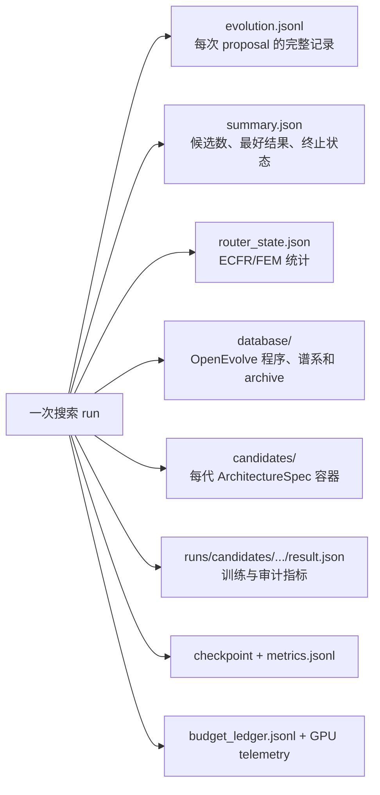

`evolution.jsonl` 是回溯搜索决策的主线；candidate `result.json` 是回溯单个架构评估的主线；checkpoint 是复核训练后模型的主线；budget ledger 是证明成本公平的主线。四者缺一，最终论文图表都不能完整反向追踪。

## 5. 与 OpenEvolve、SPARK 和原始 Equiformer 的准确关系

### 5.1 与 OpenEvolve 的区别

| 维度 | 原始 OpenEvolve | 本项目 |
|---|---|---|
| genotype | 一般源码程序 | 类型化 `ArchitectureSpec` |
| LLM 输出 | diff、rewrite 或代码 | reflection JSON + 单 factor replacement JSON |
| 执行边界 | 通用 evaluator 可执行候选程序 | 不执行 LLM Python，只解析 literal |
| 搜索基础设施 | islands、lineage、ProgramDatabase、MAP-Elites | 直接复用 |
| QD descriptors | 由一般程序特征定义 | `lmax`、高阶通道比例、参数比、深度 |
| QD 范围 | 可动态缩放 | 预先固定，避免到达顺序影响 cell |
| 修改约束 | 取决于任务 prompt | 可信代码强制恰好一个 factor |
| 科学语义 | 无领域内建约束 | α 标量、irrep、radial basis、输出不变性守卫 |
| fidelity | 通用 evaluator 自行决定 | LR 相位感知，并需跨 fidelity 信任门 |
| test 隔离 | 非框架默认职责 | 明确硬协议 |

本项目不是重新实现一个简化 evolutionary loop，而是保留 OpenEvolve 的种群与谱系基础设施，同时替换其科学搜索对象和评价边界。

### 5.2 与 SPARK 的区别

| 维度 | SPARK 提供的思想/实现 | 本项目的改造 |
|---|---|---|
| 编辑流程 | reviewer/RC 后 editor/SAR | 保留双阶段，但输出严格 JSON |
| 搜索区域 | 相对较大的 Python 功能区域 | 四个类型化 factor，不允许任意源码 |
| router | 根据上下文选择编辑方向 | ECFR 使用实测 parent-child/IACC 信用 |
| 历史信息 | 演化历史总结、plateau-aware editing | TCRE 由可信代码生成谱系摘要 |
| plateau | 可由提示上下文解释 | 证据不足必须为 `unknown` |
| repair | 通用可行性修复 | 只能在原 selected factor 内修复 |
| 等变性 | 无 Equiformer 专属约束 | 静态 irrep 语法 + 数值 symmetry audit |
| 训练代价 | 任务相关 | 显式 GPU ledger、候选前预算预留 |
| 因子交互 | 未专门解决 | IACC sibling 反事实拆分主效应与交互 |
| 低保真 | 不负责跨 fidelity 科学可信性 | LRPF/SCFTG 决定是否具有选择权 |

SPARK 的贡献在本项目中体现为“先反思再编辑”和“缩小功能修改面”；本项目增加的是可信结构表示、物理约束、实测信用、反事实和 fidelity 治理。

### 5.3 与原始 Equiformer 的区别

原始 Equiformer 是被评估的模型实现，不是让 LLM 自由修改的程序。项目保留官方模型计算路径和 QM9 训练语义，同时增加：

- 从 `ArchitectureSpec` 到官方 constructor 参数的可信编译；
- fixed-step trainer、data-cycle shuffle 和完整 checkpoint/resume；
- 搜索期 validation-only 开关；
- 训练前/训练后 symmetry 审计；
- 统一结果 JSON、预算和 telemetry；
- 参数量、架构 ID、因子差异和归档资格记录。

## 6. 搜索空间：四个类型化因子

### 6.1 REPRESENTATION：不可约表示容量

| 字段 | 允许值或含义 |
|---|---|
| `lmax` | 1、2、3 |
| `scalar_channels` | 64、96、128、160、192、256 |
| `vector_channels` | 0 或预定义通道集合 |
| `tensor_channels` | 0 或预定义通道集合 |
| `l3_channels` | 0 或预定义通道集合 |
| `head_*_channels` | attention 内部各阶 irrep 通道 |
| `mlp_multiplier` | 2、3、4 |
| `feature_channels` | 256、384、512、640 |

约束：`degree <= lmax` 的 embedding/head 通道必须为正，超过 `lmax` 的通道必须为 0。代码自动生成 embedding irreps、head irreps、spherical harmonics irreps 和 MLP irreps。`irreps_head` 是注意力内部表示，不是最终输出 head。

### 6.2 OPERATOR：消息与径向算子

| 字段 | 允许值 |
|---|---|
| `basis_type` | `gaussian`、`bessel` |
| `num_basis` | 32、64、96、128 |
| `radial_hidden` | `[32,32]`、`[64,64]`、`[96,96]`、`[128,128]` |
| `nonlinear_message` | true/false |
| `num_heads` | 2、4、8 |

该因子控制距离展开和消息算子，但不能改变数据、target、loss 或输出量纲。

### 6.3 ACTION：更新、归一化和正则行为

| 字段 | 允许值 |
|---|---|
| `norm_layer` | layer、instance、graph、fast_layer |
| `rescale_degree` | true/false |
| `alpha_drop` | 0、0.05、0.1、0.2 |
| `projection_drop` | 0、0.05、0.1、0.2 |
| `output_drop` | 0、0.05、0.1、0.2 |
| `drop_path` | 0、0.05、0.1、0.2 |

ACTION 在阶段一真实实验中出现了单独有害、与 OPERATOR 交互后被救援的案例，因此不能只依据 joint child 给它或下一 factor 分配信用。

### 6.4 MACRO：宏观深度与邻域

| 字段 | 允许值 |
|---|---|
| `num_layers` | 3、4、5、6、7、8 |
| `radius` | 4.0、5.0、6.0 Å |

radius 会影响邻居数量、吞吐和归纳偏置；num_layers 会影响参数量与传播深度。二者仍受 baseline `1.2×` 参数上限和资源门约束。

### 6.5 单因子不变量

一次 parent→child 必须满足：

```text
changed_factors(parent, child) == (selected_factor,)
```

即使发生 compiler repair、duplicate repair 或 evaluator repair，也不能切换 factor 或顺手修改其他字段。这条约束由 `ArchitectureSpec.assert_factor_local_change()` 执行，而不是依赖 LLM 自觉。

## 7. 新建或实质性修改的组件：动机、实现、验证与阶段二用途

### 7.1 `equivariant_nas/spec.py`：SPAG 类型化架构语法

**为什么需要。** 任意源码编辑难以保证等变表示合法，也无法稳定判断“一次只变一个因素”。因此把真实 genotype 从 Python 源码改成四个冻结 dataclass 组成的 `ArchitectureSpec`。

**实现内容。**

- `RepresentationSpec` 校验 lmax 与各阶 embedding/head channel 的一致性；
- `OperatorSpec` 限定径向基、basis 数、radial MLP 和 heads；
- `ActionSpec` 限定 normalization/dropout/drop-path；
- `MacroSpec` 限定层数和 radius；
- canonical JSON 生成稳定 `architecture_id`；
- `changed_factors()` 和 `assert_factor_local_change()` 强制单因子变化；
- `capacity_profile()` 为 MAP-Elites 提供高阶通道比例。

**如何验证。** `tests/test_spec.py` 验证 irreps 字符串、JSON round-trip、稳定 architecture ID、单因子断言、lmax/channel 非法组合和未知字段拒绝。

**阶段二用途。** 所有 full、uniform 和 typed-random 方法必须使用同一 schema，避免对照组拥有不同的合法候选空间。

### 7.2 `equivariant_nas/candidate.py`：安全候选解析与同因子 patch

**为什么需要。** 即使 prompt 要求 JSON，直接 import LLM 生成文件仍可能执行任意语句或修改 evaluator。

**实现内容。** 候选文件只能包含一个名为 `ARCHITECTURE_SPEC` 的字面量赋值、可选 docstring 和 `pass`；使用 AST 遍历与 `ast.literal_eval` 解析，不 import、不 `exec`。SAR 输出被解析为“已选 factor 的完整 replacement”，而非任意 diff。

**如何验证。** `tests/test_candidate.py` 验证正常 literal、函数调用等可执行语句拒绝、patch 只改变 MACRO；`tests/test_compiler_repair.py` 验证 schema 失败和科学语义失败只能在同 factor 修复。

**阶段二用途。** 所有候选 `.py` 只是 OpenEvolve ProgramDatabase 的安全容器；真实搜索对象是其中的 literal。

### 7.3 `equivariant_nas/builder.py`：可信 Equiformer 构建器

**为什么需要。** LLM 不能成为模型实现执行路径，否则可能通过修改 forward、loss 或评估逻辑获得虚假分数。

**实现内容。** builder 将合法规格映射到官方 Equiformer V1 构造参数，包括 irreps、layers、radius、RBF、norm、dropout 等；模型参数量由可信代码统计。

**如何验证。** 零 GPU memory smoke 实际构建 baseline 和两代子候选；Gate 1 构建了覆盖四因子的候选；参数比记录在每个 metrics 中并受 1.2× 硬限制。

**阶段二用途。** Equiformer 代码是模型库，不是 LLM 编辑目标；所有方法共用同一 builder。

### 7.4 `equivariant_nas/router.py`：ECFR、FEM 载入与 RC/SAR prompt

**为什么需要。** uniform 因子轮询不利用历史证据；空 UCB 在两到六候选的小预算中会主要花费在“每个 factor 试一次”，无法真正测试自适应路由。

**实现内容。**

- `FactorStats` 保存 attempts、valid、累计 MAE gain、累计 efficiency gain；
- `EvidenceCalibratedRouter` 用有效率、MAE gain、效率和探索项选 factor；
- 可载入冻结 FEM prior，并保留 prior 名称、冻结标志和 evidence SHA-256；
- RC system prompt 强制 α 是各向同性标量，不是 rank-2 tensor target；
- RC 只返回方向、证据、风险；SAR 只返回 selected factor replacement；
- uniform 模式保留相同 RC/SAR，只移除 ECFR，形成干净对照。

**如何验证。** `tests/test_router.py` 覆盖探索、坏 factor 降权、FEM 载入、科学 prompt 和 trajectory prompt；memory smoke 的 `router_state.json` 证明先验及哈希进入真实闭环。

**阶段二用途。** full 方法加载 `configs/stage1_factor_memory.json`；uniform 和 typed-random 禁止读取 FEM。

### 7.5 `equivariant_nas/semantics.py`：科学语义守卫

**为什么需要。** LLM 可能生成语法合法但物理解释错误的修改，例如把 α 称为二阶张量、认为标量输出意味着隐藏高阶 irreps 无用、把 `irreps_head` 当成最终输出头。

**实现内容。** 对 RC/SAR reasoning 做确定性文本规则验证；发现上述误解时进入同 factor repair，而不是让错误解释进入 lineage。

**如何验证。** `tests/test_semantics.py` 参数化覆盖三类错误和正确表述；compiler repair 测试证明错误 reasoning 可被修复且不改变 selected factor。

### 7.6 `equivariant_nas/search_memory.py`：TCRE 可信谱系摘要

**为什么需要。** 把完整历史日志直接交给 LLM 会增加 token 成本、引入非白名单字段，并允许 LLM 把零 step 的可行性结果想象成“收敛平台期”。

**实现内容。** 从 OpenEvolve lineage 由代码提取：

- lineage depth；
- 同 fidelity validation MAE history；
- factor history；
- best validation MAE；
- recent improvement；
- plateau status；
- mutation regime。

指标只保留白名单；大型 layerwise symmetry tensor 压缩为各层 maximum。证据不足时 plateau 必须是 `unknown`；只有实测同 fidelity 序列才能得到 `yes/no`。

**如何验证。** `tests/test_search_memory.py` 覆盖真实 plateau、零 step 不伪造 plateau、指标压缩；memory smoke 第二代观察到 `lineage_depth=1`、`factor_history=[REPRESENTATION]`、`plateau_status=unknown`。

### 7.7 `equivariant_nas/pipeline.py`：可信候选评估边界（SAPF 主体）

**为什么需要。** 最昂贵的错误是先训练后发现 schema、参数量、梯度或对称性不可接受。Pipeline 必须按成本由低到高拒绝候选，并统一写出结构化证据。

**实现顺序。** 当前 pipeline v5 的核心阶段为：

1. 解析与 schema；
2. architecture ID、重复与 cache；
3. builder 和参数量门；
4. forward/backward 与梯度健康；
5. 训练前 symmetry warning profile；
6. GPU 预算预留；
7. fixed-step training；
8. validation 指标读取；
9. 重载 checkpoint；
10. 训练后 observable symmetry hard audit；
11. 计算归档资格、记录 charged GPU seconds 和 failure stage。

**如何验证。** Gate 1 覆盖构建和短训练，阶段一 5,000-step cohort 覆盖完整训练路径，训练后 symmetry JSON 证明 checkpoint 重载审计已执行；`reports/stage1/manifest.json` 对交付文件做 SHA-256 清单。

### 7.8 `equivariant_nas/diagnostics.py`：有限精度对称性诊断

**为什么需要。** 理论等变不保证有限精度、邻居图重建、归一化和径向展开组合后数值误差一定小；但内部 hook 的坐标约定也可能与诊断变换不一致。

**实现内容。** 对单图执行：

- 多次随机旋转后的最终标量不变性；
- 整体平移不变性；
- 原子排列置换不变性；
- 可选 layerwise hook profile。

**关键修订。** 最初计划把 layerwise hook→irrep 变换误差作为硬门。实测官方 Gaussian baseline 也可能出现约 `0.40` layerwise error，表明内部坐标/irrep convention 尚未校准。因此 layerwise profile 降级为 warning；最终 observable scalar 的 rotation/translation/permutation 才决定 archive 资格。

**训练前/后观察。** Bessel 随机初始化 sibling 的 rotation error 可约 `0.725`，而训练后 operator-only 为 `0.0112899`、joint 为 `0.0092583`。这说明训练前随机输出 profile 不能替代训练后 checkpoint 审计。

### 7.9 `equivariant_nas/training/fixed_step_trainer.py`：固定 optimizer-step 训练器

**为什么需要。** 原始 epoch loop 在 batch size 改变后会同时改变 optimizer step 数，不能满足用户“batch=64、step 与 batch=128 原实验一致”的协议。

**实现内容。**

- 以 `global_step >= max_steps` 为唯一停止条件；
- `cycling_batches()` 按 data cycle 重建带 seed 的 shuffled DataLoader；
- `reference_steps_per_epoch=859` 驱动 evaluation 和 LR phase；
- 保存 model、optimizer、scheduler、scaler、global step、data cycle 和随机状态；
- resume 时从 checkpoint 继续，不重置学习率相位；
- test evaluation 为显式可选，搜索默认关闭；
- 支持 ISWT 只加载模型安全子集，绝不继承 optimizer/scheduler。

**如何验证。** 早期 `test_exact_resume.sh` 比较连续与断点恢复，参数最大差异约 `7.2e-6`，属于 CUDA scatter 原子归约的非位级确定性范围；训练过程按 reference step 输出 metrics 和 checkpoint。

### 7.10 `equivariant_nas/trajectory.py` 与 `fidelity_trust.py`：LRPF/SCFTG

**为什么需要。** 阶段一观察到 300-step winner 在学习率阶段转换后排名反转，说明“更早 MAE 更低”不等价于“最终收敛更快”。

**实现内容。** LRPF 提取 pre-transition、post-transition、warmup-end MAE，计算 LR shock ratio、warmup recovery ratio 和 early-rank risk。SCFTG 在共享候选 cohort 上计算 Spearman、Kendall τ、top-k recall 和 selection regret，并要求所有预注册阈值同时通过。

**如何验证。** `tests/test_trajectory.py` 验证 fingerprint；`tests/test_fidelity_trust.py` 同时覆盖排名反转失败和一致排名通过；真实 `fidelity_trust_300_to_5000.json` 判定 `trustworthy=false`。

### 7.11 `equivariant_nas/interaction.py`：IACC 交互感知信用

**为什么需要。** 若 baseline→A 退化，而 A→A+B 大幅改善，不能把全部救援幅度当作 B 的一般收益；需要评估 baseline→B sibling。

**实现内容。** `rescue_requires_counterfactual()` 识别退化后救援链；`interaction_contrast()` 计算：

```text
A-only gain = baseline_mae - A_mae
B gain without A = baseline_mae - B_mae
B gain with A = A_mae - joint_mae
epistasis = B gain without A - B gain with A
```

resolved request 使用唯一 key，只将 standalone main effect 回写 router 一次。

**如何验证。** `tests/test_interaction.py` 覆盖触发、difference-in-differences 语义和一次性 ingestion；真实 sibling 实验见第 10 节。

### 7.12 `equivariant_nas/inheritance.py`：ISWT 等变语义权重继承

**为什么需要。** 同 factor 小改动可能允许复用部分 parent state，但简单的同名同 shape 复制会在径向基、irrep layout 或 normalization 语义变化时错误继承。

**实现内容。**

- REPRESENTATION 变化时禁止 shape-only 继承表示相关 state；
- Gaussian/Bessel、`num_basis` 或 `radial_hidden` 变化时重置 radial basis/network；
- norm 变化时重置 normalization；
- shape changed 或 parent 缺失逐 tensor 记录；
- optimizer/scheduler 永不继承；
- 输出 `selection_eligible=false`、`final_training_allowed=false`。

**如何验证。** `tests/test_inheritance.py` 验证径向语义阻断和 representation 全阻断；baseline→Bessel/64 真实 CPU 审计见第 11 节。

### 7.13 其他支撑组件

| 文件 | 职责 | 关键保证 |
|---|---|---|
| `budget.py` | GPU 账本、鲁棒成本估计、预留 | 超预算候选在 CUDA 前拒绝 |
| `evaluation.py` | 静态评估与缓存 | 重复架构复用可信结果 |
| `fidelity.py` | fidelity observation/scheduler | 只在相同 endpoint 比较 |
| `promotion.py` | 晋级授权 | calibration 永不拥有选择权 |
| `credit.py` | parent-child MAE/效率信用 | 因子局部统计 |
| `search_statistics.py` | best-so-far AUC、sign-flip、bootstrap | 区分 search seed 与 trainer seed |
| `openevolve_adapter/evaluator.py` | OpenEvolve evaluator 接口 | 把 ProgramDatabase 候选交给可信 pipeline |
| `reporting/` | Markdown/HTML/图和 manifest | 可读报告与 hash 可追溯证据 |

## 8. 十个方法 insight：不是名称清单，而是问题—机制—证据

### Insight 1：SPAG——搜索类型化 irrep 流，而不是任意 Python

- **失败模式：** 自由代码编辑面过大，局部改动可能破坏全局表示流或修改协议。
- **机制：** 四因子 dataclass、有限值域、literal AST、可信 builder、单因子断言。
- **阶段一证据：** schema-only LLM 候选在修复后可达到 100% 合法；zero-GPU smoke 2/2 合法唯一；非法 executable statement 与跨 factor patch 被单元测试拒绝。
- **可证伪预测：** 在相同 LLM 调用和 proposal 数下，SPAG 的 trained-valid rate 应高于自由源码编辑。
- **阶段二验证：** 当前微型门不包含 free-edit 对照；若论文主张合法率优势，需要另行预注册该对照，不能用现有 2 个候选证明。

### Insight 2：ECFR——用测量信用决定搜索哪一类结构

- **失败模式：** uniform/random 在巨大搜索空间中浪费候选；空 UCB 在小预算下只做冷启动探索。
- **机制：** factor validity、MAE gain、efficiency gain、探索项与 FEM prior 联合路由。
- **阶段一证据：** 路由器逻辑和 prior 已进入真实 zero-GPU OpenEvolve 闭环；但只有两个 5,000-step evolved children，尚不足以证明优势。
- **可证伪预测：** full 方法的 normalized best-so-far AUC、time-to-threshold 优于 uniform 与 typed random。
- **阶段二验证：** seed 101 的 full/uniform/random matched micro，然后门控扩展。

### Insight 3：有限精度 symmetry stability——理论合法不等于数值审计可省略

- **失败模式：** 合法算子组合仍可能因实现、邻居重建或数值问题产生 observable error；反过来，错误的内部坐标诊断也可能误杀官方 baseline。
- **机制：** 训练后最终标量 rotation/translation/permutation hard gate；未校准 layerwise profile 只 warning。
- **阶段一证据：** 官方 baseline 的约 0.40 layerwise 假阳性促使门策略修订；训练后 joint/operator-only observable errors 均远低于 catastrophic threshold。
- **可证伪预测：** observable gate 能拒绝真正灾难性候选，同时不因 hook convention 拒绝官方 baseline。

### Insight 4：SAPF——先花便宜检查，再花 optimizer steps

- **失败模式：** 参数超限、NaN 梯度、构建失败或预算不足的候选若先训练，会直接浪费 A100 时间。
- **机制：** schema→build→parameter→gradient/resource→warning symmetry→training→checkpoint symmetry。
- **阶段一证据：** pipeline 记录 failure stage 和 charged GPU seconds；zero-step smoke 完整经过模型构建但 GPU training charge 为 0。
- **可证伪预测：** 相比 train-first evaluator，相同 proposal 数的无效候选 GPU 消耗更低。

### Insight 5：LRPF——低保真必须描述学习率相位响应

- **失败模式：** 只看一个早期 MAE 会混淆结构能力和 warmup/transition 瞬态。
- **机制：** 记录 shock、recovery、warmup-end 与 early-rank risk；fidelity endpoint 对齐参考 LR phase。
- **阶段一证据：** factorized 候选 300 steps 更好，但到 5,000 steps 排名落后；fingerprint 显示更大的 LR shock。
- **可证伪预测：** LRPF 特征能解释或预测一部分跨 fidelity 排名反转，优于单点 MAE。

### Insight 6：SCFTG——低成本代理必须先赢得选择权

- **失败模式：** 默认相信短训练会系统性把预算分配给错误候选。
- **机制：** 最小共享 cohort + Spearman + Kendall + top-k recall + normalized regret 多阈值门。
- **阶段一证据：** 300→5,000 实测 `Spearman=-0.5`、`Kendall=-1/3`、`top1=0`、`regret=0.6591`，明确 NO-GO。
- **可证伪预测：** 只有通过门的 source fidelity 才能降低最终 selection regret。

### Insight 7：IACC——单因子变异仍需反事实拆分交互

- **失败模式：** joint rescue 被错误归功于后一个 factor，污染后续 router。
- **机制：** ancestor、A-only、B-only、A+B 四点对比，分离 standalone gain 与 epistasis。
- **阶段一证据：** Bessel/64 在有 drop-path 时救援 0.6597，但 standalone 仅 0.1771；operator-only 甚至比 joint 更好 0.06344 MAE。
- **可证伪预测：** IACC 与 no-IACC 会产生不同 factor posterior 和后续搜索轨迹。

### Insight 8：FEM——让小预算搜索继承可审计证据，而不是重新冷启动

- **失败模式：** 每个 Phase 2 run 前几次 proposal 都用于重复探索已知 factor，掩盖 ECFR 的实际价值。
- **机制：** 冻结 sufficient statistics、每 factor 一个中性虚拟观测、原始证据 SHA-256、IACC-resolved OPERATOR gain。
- **阶段一证据：** `router_state.json` 保存先验名称、冻结标志和 source hashes；no-IACC 有独立 parent-child prior，防止反事实信息泄漏进消融。
- **可证伪预测：** full 方法比从空统计开始更快到达有效 region，同时不降低多样性。

### Insight 9：TCRE——历史必须由可信代码压缩，LLM 只能解释

- **失败模式：** LLM 从零 step 或异 fidelity 指标杜撰 plateau；原始日志过长且混入无关信息。
- **机制：** 确定性 lineage summary、指标白名单、layerwise maximum 压缩、证据不足为 unknown。
- **阶段一证据：** memory smoke 第二代真实接收一层谱系和 `[REPRESENTATION]` 历史，但 plateau 保持 unknown。
- **可证伪预测：** TCRE 相对无 RC 或无历史条件，能提高有效修改率或搜索 AUC；需 Phase 2 消融验证。

### Insight 10：ISWT——权重继承必须服从等变语义，而非 tensor shape

- **失败模式：** 同名同 shape 参数在 radial basis 或 irrep 语义改变后可能代表不同函数。
- **机制：** factor-aware block rules、逐 tensor reason、禁止 optimizer/scheduler、只作 paired calibration。
- **阶段一证据：** baseline→Bessel/64 只有 342/413 tensors、86.16% elements 被判定安全；63 个 radial-semantic tensors 被主动阻断。
- **可证伪预测：** 若 inherited 5,000-step 排名与 scratch 高度一致且 regret 低，才可解锁 selection proxy；最终训练仍从头开始。

## 9. 阶段一实验时间线与结果层级

### 9.1 层级 A：Equiformer 官方完整训练基线

这是 300 epoch、batch=128、257,700 steps 的官方复现，用于确认任务、单位、数据和训练尺度。论文的 `0.046 a₀³` 是 **测试集 MAE**，不是训练集 MAE。复现采用 validation 最优 checkpoint，再报告该 checkpoint 的 test MAE `0.04776 a₀³`。

该结果不能与 5,000-step NAS pilot 的 `0.5-1.3 a₀³` 直接比较优劣，因为训练预算完全不同。阶段一所有 search insight 只在相同 5,000-step fidelity 内比较。

### 9.2 层级 B：Gate 1 搜索空间覆盖与 300-step 早期观察

阶段一先生成覆盖四个 factor 的结构变体，确认类型化空间能产生不同参数量、训练行为和资源特征。代表性 300-step validation MAE 如下：

| 候选 | 主要变化 | 300-step validation MAE (`a₀³`) | 参数量 |
|---|---|---:|---:|
| `macro_depth7` | 层数 7 | 3.0675 | 4,019,715 |
| `representation_lmax3` | lmax 3 | 3.0783 | 4,033,299 |
| `operator_linear_message` | 线性消息 | 3.1359 | 3,008,515 |
| `representation_lmax1` | lmax 1 | 3.2322 | 2,782,531 |
| `macro_depth5` | 层数 5 | 3.4257 | 3,043,715 |
| baseline | 官方类型化 baseline | 3.4780 | 3,531,715 |
| `operator_bessel` | Bessel 径向基 | 3.9059 | 3,531,585 |
| `action_graph_norm` | graph norm | 4.1023 | 3,533,763 |

这些结果只证明搜索字段能够实质改变模型和早期优化行为，不证明 300-step 排名代表最终质量。

### 9.3 层级 C：300→1,000→5,000 step 排名反转

| 方法/轨迹 | 300 steps | 1,000 steps | 5,000 steps |
|---|---:|---:|---:|
| baseline | 3.4780 | 2.8180 | 0.7535 |
| 早期 factorized winner | 2.8402 | 4.9975 | 1.1706 |
| 早期 random candidate | 3.1377 | 3.4220 | 0.7056 |

对应 LRPF 指纹：

| 轨迹 | LR shock | warmup recovery | early-rank risk |
|---|---:|---:|---:|
| baseline | 0.810 | 0.267 | 0.000 |
| factorized | 1.760 | 0.234 | 1.083 |
| random | 1.091 | 0.206 | 0.312 |

SCFTG 对 300→5,000 的真实判定：

- Spearman：`-0.5`；
- Kendall τ：`-1/3`；
- top-1 recall：`0`；
- normalized selection regret：`0.6591`；
- `trustworthy=false`。

因此 300/1,000-step 数据只能保留为 calibration/trajectory evidence，不能给候选选择或晋级授权。这个负结果推翻了最初 Handoff 中“极短训练直接 successive halving”的默认假设。

证据：`reports/stage1/evidence/fidelity_trust_300_to_5000.json`。

### 9.4 层级 D：5,000-step matched pilot

在稳定的 5,000-step endpoint 上，baseline、factorized evolution 和 typed random 使用相同 batch=64、trainer seed 0、数据流和 validation-only 评估。

| 候选 | 来源 | 变化 | validation MAE (`a₀³`) | 解释 |
|---|---|---|---:|---|
| baseline | 固定基线 | 无 | `0.7535404392` | 同 fidelity 参考 |
| evo-1 | factorized | ACTION: `drop_path=0.05` | `1.2996022186` | 单独显著有害 |
| evo-2 joint | factorized | 再加 OPERATOR: Bessel/64 | `0.6398895031` | 救援 parent，优于 baseline |
| random-1 | typed random | MACRO: radius=6 | `1.0195988209` | 劣于 baseline |
| random-2 | typed random | ACTION: `alpha_drop=0` | `0.8915916275` | 劣于 baseline |

这个 pilot 的 best-so-far 是 factorized `0.639890`，优于 random best `0.891592` 和 baseline `0.753540`。但每个搜索策略只有 2 个 trained-valid candidates，且只有一个 search seed，因此只能判为“值得进入门控 Phase 2”的 pilot，不能作为统计优势声明。

证据：

- `reports/stage1/evidence/stable_factorized/evolution.jsonl`；
- `reports/stage1/evidence/stable_random/summary.json`；
- `reports/stage1/evidence/stable_factorized/paired_budget_stop.json`。

### 9.5 层级 E：IACC sibling 反事实

观察链为：

```text
baseline
  └─ ACTION: drop_path 0 → 0.05           MAE 1.299602（退化）
       └─ OPERATOR: Gaussian/128 → Bessel/64  MAE 0.639890（救援）
```

为了判断 Bessel/64 是一般有益，还是只在 drop-path 条件下救援，补跑：

```text
baseline
  └─ OPERATOR: Gaussian/128 → Bessel/64  MAE 0.576447
```

四点对比结果：

| 量 | 数值 (`a₀³`) | 含义 |
|---|---:|---|
| baseline MAE | `0.7535404392` | 祖先 |
| ACTION-only MAE | `1.2996022186` | drop-path 单独有害 |
| OPERATOR-only MAE | `0.5764467747` | Bessel/64 单独有益 |
| joint MAE | `0.6398895031` | 两者组合 |
| ACTION-only gain | `-0.5460617794` | 负值表示退化 |
| OPERATOR gain without ACTION | `0.1770936646` | 应写入 FEM 的 standalone gain |
| OPERATOR gain with ACTION | `0.6597127155` | interaction-contaminated rescue gain |
| epistasis | `-0.4826190510` | 两条件下 B 收益差异 |

最容易误读的一点是：joint 比 parent 好很多，并不代表 joint 最优。operator-only 比 joint 还低 `0.063443 a₀³`，说明保留有害 ACTION 不是合理结论。IACC 的目的不是奖励“组合很神奇”，而是防止 router 把 `0.659713` 全部错误学习为 OPERATOR 的普遍收益。

证据：`reports/stage1/evidence/interaction/results.json`。

### 9.6 层级 F：训练后 observable symmetry 审计

| 候选 | rotation max | translation max | permutation max | 结论 |
|---|---:|---:|---:|---|
| OPERATOR-only sibling | `0.0112899` | `0.0002373` | `0.00004145` | 通过 catastrophic hard gate，rotation 略高于 warning 线 |
| joint candidate | `0.0092583` | `0.0003878` | `0.0001201` | 通过 hard gate |

这些误差不是 MAE，而是对同一图做变换前后输出的相对数值误差。由于 α 为标量，目标是输出不随旋转、整体平移和原子重排变化。

证据：

- `reports/stage1/evidence/interaction/results.json`；
- `reports/stage1/evidence/interaction/trained_joint_symmetry.json`。

### 9.7 层级 G：FEM/TCRE 零 GPU 真实闭环 smoke

运行条件：search seed 117、2 次 proposal、`max_steps=0`、GPU budget=0、跳过 CUDA symmetry，仍真实调用 OpenEvolve、LLM ensemble、FEM/ECFR、TCRE、SPAG、builder 和 MAP-Elites。

| 指标 | 结果 |
|---|---:|
| 新 proposal | 2 |
| 合法且唯一 | 2/2 |
| archive 总程序 | 3 |
| QD cells | 2 |
| 第二代 lineage depth | 1 |
| 第二代 factor history | `[REPRESENTATION]` |
| plateau | `unknown` |
| GPU seconds | `0.0` |

这证明历史、先验和结构约束进入了真实 OpenEvolve 闭环，而非只存在于孤立单元测试；但零 step 没有 accuracy evidence，不能证明 FEM/TCRE 提升搜索效果。

证据目录：`reports/stage1/evidence/memory_smoke/`。

### 9.8 层级 H：ISWT baseline→Bessel/64 CPU 审计

| 项目 | 结果 |
|---|---:|
| child state tensors | 413 |
| safe transferred tensors | 342 |
| tensor coverage | 82.81% |
| child state elements | 3,590,210 |
| safe transferred elements | 3,093,314 |
| element coverage | 86.16% |
| radial semantic blocked | 63 tensors |
| shape changed | 7 tensors |
| missing/new Bessel frequency | 1 tensor |
| selection eligible | false |
| final training allowed | false |

这只证明规则能找到一部分语义安全 state，不证明继承能保留 scratch 排名或减少 time-to-quality。后者必须按 `configs/inheritance_calibration.json` 运行至少 8 个 paired candidates。

证据：`reports/stage1/evidence/state_transfer/baseline_to_bessel64.json`。

## 10. 对称性诊断的失败、排查与最终修订

这是阶段一必须完整保留的负结果，否则阶段二很可能重新犯同样错误。

### 10.1 最初假设

最初认为可在每个 Equiformer block 注册 hook，对旋转前后的 hidden irreps 应用理论表示矩阵，然后以 layerwise relative error 作为硬门。直觉上，这比只看最终标量更早发现等变性破坏。

### 10.2 反例

实际校准发现，官方 Gaussian baseline 在该 hook/坐标变换实现下也可能得到约 `0.40` 的 layerwise error。如果据此硬拒绝，连可信官方基线都会被判失败。

可能原因不是模型不等变，而是：

- hook 张量所处内部坐标约定与外部旋转矩阵不一致；
- e3nn irreps 的基、parity、排列或 normalization convention 未被诊断脚本完全复现；
- 邻居图与内部中间量不适合直接按该公式比较。

### 10.3 修订决定

Pipeline 升级为 v5：

- 训练前 layerwise/observable profile 只作 warning；
- 候选完成指定 fidelity 后重载 checkpoint；
- 使用 5 次旋转以及 translation/permutation 复核最终 scalar observable；
- 最终 observable symmetry 决定 archive 资格；
- layerwise 指标保留给后续 convention calibration 和搜索上下文，但不能单独拒绝候选。

### 10.4 研究含义

等变 NAS 不能因为“模型在理论上由等变模块组成”就省略数值审计，也不能因为“内部误差看起来大”就立刻认定物理约束失效。诊断本身也必须经过 baseline 校准。这个结论直接改变了 evaluator 的硬门定义。

## 11. 预算、运行环境与安全边界

### 11.1 阶段一预算

- 阶段一累计计费约 `4.513295 A100-hours`；
- 阶段一硬上限 5 A100-hours；
- 候选启动前按历史中位成本和安全裕量预留预算；
- 超预算时 evaluator 拒绝启动新的 CUDA training，而不是训练后才发现超额。

### 11.2 网络与密钥

- 服务器访问外部服务只通过 SSH reverse forwarding；
- 不使用火山引擎付费“网际快车”；
- LLM API key 只在服务器 mode-600 env 文件；
- 报告、Git 和 manifest 不包含 key；
- prompt evidence 做字段白名单与压缩，既减少费用也降低敏感信息意外外泄。

### 11.3 test split 隔离

严格搜索协议的 `test_during_search=false`。搜索、fidelity calibration、ISWT calibration 和 architecture promotion 都不得读取 test。只有架构冻结并完成预注册的最终训练后，才执行一次 test evaluation。

此前火山引擎自定义 batch64 速度任务 `t-20260721153052-pxvdh` 的日志包含 `test_mae` 和 `best_test_mae`。该任务的日志、checkpoint 和 telemetry 确实保存在 vePFS：

`/home/20262202788/experiments/qm9_batch64_fixed_steps/t-20260721153052-pxvdh`

但它只能作为训练时间、吞吐、学习率和恢复机制诊断；除非移除训练中 test evaluation 并重新运行，否则不能成为阶段二无泄漏搜索证据。这个附注用于防止后续把“有完整日志”误等同于“协议有效”。

## 12. 代码提交与阶段一增量

| 提交 | 内容 | 研究意义 |
|---|---|---|
| `9317981` | 完成阶段一主框架 | SPAG、ECFR、SAPF、LRPF、SCFTG、IACC、fixed-step、报告与基础测试 |
| `e2da34a` | Phase 2 预注册与统计 | 三方法 matched gate、AUC、sign-flip、bootstrap、预算门 |
| `4a54985` | FEM 与 TCRE | 冻结证据记忆、谱系条件化 RC/SAR、IACC credit ingestion |
| `9964ec5` | ISWT | 等变语义权重继承及 calibration-only 门 |
| `6ec78ee` | verification manifest 同步 | 固定交付 evidence hashes |
| `3afddc2` | 旧版阶段一交接摘要 | 本文所替换的英文简版 |

以上提交都位于非 `main` 分支；阶段一交付不得修改或推送远程 `main`。

## 13. Phase 2 预注册：如何继续而不篡改阶段一结论

机器可读真源是 `configs/phase2_preregistration.json`；文字解释是 `PHASE2_PREREGISTRATION.md`。任何结果观察后的阈值变化都必须作为 deviation 明确记录，不能静默覆盖配置。

### 13.1 Gate 2A-micro：先验证框架健康，不验证论文优势

固定设置：

- 方法：full、uniform-router、typed-random；
- search seed：101；
- trainer seed：0；
- 每方法 2 个 trained-valid candidates，共 6 个；
- 每方法最多 10 proposals；
- 每候选 5,000 optimizer steps；
- 总预计 `2.246 A100-hours`；
- 加 20% reserve 后约 `2.695h`；
- 共享硬上限 `2.8 A100-hours`；
- test 禁止。

只有同时满足以下条件才能延伸同一批 run：

1. 每种方法在 10 proposals 内达到 2 个 trained-valid；
2. full 至少产生一个 novel、non-duplicate 候选；
3. full best validation MAE 不比固定 baseline 差超过 15%；
4. full normalized AUC 不比 typed random 差超过 10%；
5. 无协议或 test split 违规。

这个 gate 的目标是尽早杀死不健康框架，不是以宽松阈值宣布方法胜出。

### 13.2 Gate 2A：同一 seed 延伸到每方法 6 个候选

若 micro 通过，必须继续同一批 run，复用已有 2 个候选，不能丢弃重跑。每方法累计 6 个 trained-valid，总 18 个；包含 micro 的累计硬上限 `8.2 A100-hours`。

进入 seed 102 的解锁条件：

- full valid rate ≥ 0.8；
- full normalized AUC 相对两个 control 均至少改善 5%；
- full final-best MAE 胜过 typed random；
- 无协议/test 违规。

### 13.3 Gate 2A2 与 Gate 2B

- seed 102 不自动启动，只有 Gate 2A 通过后单独批准；
- seed 102 使用相同设置与独立 `8.2h` 上限；
- 101、102 都通过后，才能增加 search seeds 103、104、105；
- publication-scale 共 5 个 search seeds；
- trainer seed 0 作为搜索时 common-random-number 控制，不等于 search seed 重复。

为什么最终需要 5 个 search seeds：LLM sampling、parent/inspiration、islands 和 routing 都引入搜索随机性。只改变训练 seed 无法估计搜索方法方差。对 one-sided exact paired sign-flip test，5 个一致 paired wins 的最小 p 值为 `0.03125`；3 个 seed 最低只能到 `0.125`。

### 13.4 Phase 2 主指标

| 指标 | 为什么需要 |
|---|---|
| normalized best-so-far AUC | 同时奖励更早找到好架构，符合“快速搜索收敛”目标 |
| final best validation MAE | 衡量相同候选预算后的最终最好结构 |
| time-to-threshold | 衡量达到 MAE 0.70 所需候选/时间 |
| trained-valid rate | 衡量提案质量与修复效率 |
| protocol violations | 防止以不公平修改刷分 |
| exact paired sign-flip | 小样本 paired search-seed 统计 |
| paired bootstrap CI | 报告效应量不确定性 |

不能只报告“最优一个候选”，也不能只报告 LLM proposal 数而忽略 invalid/duplicate/repair 和 GPU 时间。

### 13.5 条件消融

| 消融 | 移除什么 | 必须保持什么 |
|---|---|---|
| uniform router | ECFR/FEM 路由 | 相同 SPAG、RC/SAR、evaluator、候选数 |
| no RC | reviewer 反思阶段 | SAR、typed factor 和所有训练协议 |
| no IACC | sibling 反事实信用 | 使用 `stage1_factor_memory_parent_child.json`，避免 IACC 信息泄漏 |
| dynamic QD scaling | 固定 feature ranges | 其余方法不变，只隔离 arrival-order 影响 |
| untrusted short fidelity | 无条件使用短代理 | 只能 calibration，不得选择 |

### 13.6 架构冻结、确认训练与最终训练

只有搜索证据通过后：

1. 对 top frozen architectures 做 20,000-step confirmation，trainer seeds 0/1/2；
2. 基于 validation 冻结一个架构；
3. 运行 `257,700 steps × seeds 0/1/2`，batch=64；
4. 每个 final run 从头训练，ISWT 禁止；
5. 架构冻结后才评估 test；
6. 报告 validation 选模规则、三个 seed、均值/方差及论文 `0.046 a₀³` 对照。

## 14. Phase 2 每次运行必须保存的证据

### 14.1 运行级文件

- 完整命令和展开后的配置；
- Git commit、branch、dirty status；
- search seed 与 trainer seed；
- 开始/结束时间、host/GPU、环境版本；
- `evolution.jsonl`、`summary.json`、router state；
- 共享 budget ledger 与 GPU telemetry；
- LLM model/base URL 的非敏感标识、调用次数、token/费用统计；
- 所有 exception、timeout、OOM、repair、duplicate 和 protocol rejection。

### 14.2 候选级文件

- parent ID、child architecture ID、selected factor；
- 完整 `ArchitectureSpec`；
- RC reflection、SAR replacement 和 repair history；
- inspiration IDs 与 lineage depth；
- 参数量、参数比、QD descriptors/cell；
- fidelity steps、validation MAE、训练时间；
- LRPF trajectory；
- 训练前 warning 与训练后 observable symmetry；
- checkpoint path/hash；
- 是否 archive eligible、selection eligible、test evaluated。

### 14.3 cohort 与跨 seed 文件

- 每方法 best-so-far 序列和 normalized AUC；
- matched candidate counts；
- fidelity trust report；
- IACC requests/resolutions；
- 每个 gate 的 machine-readable pass/fail；
- 五 search seeds 的 paired table、sign-flip p-value 和 bootstrap CI；
- frozen architecture manifest 与最终一次 test report。

若缺少 invalid proposal 或 repair 记录，不能计算真实合法率；若缺少共同 budget ledger，不能证明公平成本；若只保存 best checkpoint，不能重建搜索轨迹。

## 15. 回溯任意候选或结论的操作手册

### 15.1 从报告数字找到原始证据

| 要核对的结论 | 权威证据 |
|---|---|
| 5,000-step baseline/evo 数值 | `reports/stage1/evidence/stable_factorized/evolution.jsonl` |
| typed random 数值 | `reports/stage1/evidence/stable_random/summary.json` |
| 排名信任失败 | `reports/stage1/evidence/fidelity_trust_300_to_5000.json` |
| IACC 四点与 symmetry | `reports/stage1/evidence/interaction/results.json` |
| joint checkpoint symmetry | `reports/stage1/evidence/interaction/trained_joint_symmetry.json` |
| FEM/TCRE 真实 smoke | `reports/stage1/evidence/memory_smoke/` |
| ISWT tensor 级转移 | `reports/stage1/evidence/state_transfer/baseline_to_bessel64.json` |
| 测试结果 | `reports/stage1/test_output.txt` |
| 文件哈希与仓库版本 | `reports/stage1/manifest.json` |

### 15.2 从 architecture ID 重建规格

1. 在 `evolution.jsonl`、run `summary.json` 或 candidate 目录搜索 architecture ID；
2. 读取完整 spec/candidate literal；
3. 用 canonical JSON 重新计算短 SHA-256 ID；
4. 检查 parent ID、selected factor 和 `changed_factors`；
5. 找到对应 `result.json`、checkpoint 与 telemetry；
6. 核对 fidelity、seed、test flag 和 protocol hash 后才能比较。

### 15.3 从一个“好结果”判断它能否用于搜索结论

按以下顺序检查：

```text
相同 dataset/target/split?
→ 相同 batch/max_steps/trainer seed?
→ test_evaluated 是否 false?
→ 参数比是否 <=1.2?
→ 是否 trained-valid 且通过 checkpoint symmetry?
→ 是否与对照处于相同 fidelity?
→ source fidelity 是否通过 SCFTG?
→ 是否属于预注册 candidate count/search seed?
```

任一步为否，就不能直接进入 matched NAS 主结论。它仍可作为 debugging、calibration 或 hypothesis evidence，但必须明确标签。

### 15.4 manifest 的作用与限制

`reports/stage1/manifest.json` 保存交付文件 SHA-256 和三个上游仓库提交。manifest 能证明“当前文件与当时交付内容一致”，但不能单独证明实验设计正确。正确性还需结合 protocol、原始 metrics、test flag、预算账本和测试覆盖。

## 16. 复现与验证命令

服务器根目录：`/home/20262202788/equivariant-nas`。

### 16.1 基础验证

```bash
cd /home/20262202788/equivariant-nas
export PYTHONPATH=.

/home/20262202788/conda-envs/equiformer/bin/python -m pytest -q
/home/20262202788/conda-envs/equiformer/bin/python -m py_compile \
  equivariant_nas/*.py scripts/*.py reporting/generate_stage1_report.py
```

完整测试必须使用 Equiformer 环境，因为 ISWT 测试导入 PyTorch；OpenEvolve 环境虽有 pytest，但不含 torch。阶段一冻结结果：`41 passed`，`py_compile: PASS`。

### 16.2 零 GPU 闭环 smoke

```bash
scripts/run_schema_smoke.sh 48 8
```

正式 FEM/TCRE memory smoke 证据使用 seed 117、2 proposal、零 training steps。该 smoke 只验证控制闭环，不验证准确率。

### 16.3 5,000-step factorized 与 matched random

具体冻结命令见 `REPRODUCE.md`。执行前必须：

```bash
source /home/20262202788/.config/openevolve/apis.env
export http_proxy=http://127.0.0.1:12356
export https_proxy="$http_proxy"
export HTTP_PROXY="$http_proxy"
export HTTPS_PROXY="$http_proxy"
```

不得把付费网际快车代理写入命令。不得为搜索命令添加 `--evaluate-test`。

### 16.4 阶段二微型门

full、uniform、typed random 的完整命令已冻结在 `REPRODUCE.md`；三者必须顺序共享同一个 `NAS_BUDGET_LEDGER` 和 `NAS_GPU_BUDGET_HOURS=2.8`。完成 micro 不自动授权扩展。

## 17. 测试覆盖与仍然存在的验证空白

### 17.1 当前 41 个测试覆盖的核心不变量

- literal-only candidate 和可执行代码拒绝；
- ArchitectureSpec 合法性、稳定 ID 和单 factor change；
- compiler/scientific semantics repair 不扩大 factor；
- router 探索、降权、FEM prior 与 prompt 约束；
- zero-step history 不伪造 plateau；
- QD 固定 feature ranges；
- fidelity rank reversal 检测与 promotion 拒绝；
- IACC contrast 和一次性 credit ingestion；
- ISWT radial/representation semantic blocking；
- budget 估计；
- best-so-far AUC、sign-flip 和 bootstrap 方向。

### 17.2 测试不能替代的实验验证

41 tests 证明实现的局部控制逻辑符合预期，不证明：

- LLM full 方法比 uniform/random 搜索更好；
- TCRE reflection 真能提升 proposal 质量；
- FEM prior 在新 search seeds 上泛化；
- observable symmetry 与 MAE 有预测关系；
- ISWT 能加速且不改变候选排名；
- 最终架构超过论文或 baseline。

这些必须由 Phase 2 matched、多 search-seed、真实 GPU 实验回答。

## 18. 阶段一 Go/No-Go 汇总

| 决策项 | 结论 | 原因 |
|---|---|---|
| 类型化等变 NAS 工程闭环 | GO | OpenEvolve+RC/SAR+可信 builder+evaluator 已端到端运行 |
| 300/1,000-step accuracy proxy | NO-GO | 跨 fidelity 排名显著反转 |
| 5,000-step 作为 Phase 2 搜索 fidelity | 有条件 GO | 已有稳定 pilot，但仍需方法对照和多 search seed |
| ECFR/FEM/TCRE 方法优势 | 未证明 | 当前仅工程验证和小样本 hypothesis evidence |
| IACC 的必要性 | 机制性 GO | 已观察强交互与误归因风险，仍需后续路由消融 |
| ISWT 用于选择 | NO-GO | 只有 state audit，未通过 8-pair rank gate |
| 257,700-step 最终训练 | 当前 NO-GO | 需搜索门通过、架构冻结和显式预算批准 |
| 搜索期间 test | 严格 NO-GO | 防止选择泄漏 |

## 19. 阶段二执行前检查清单

开始任何 Phase 2 GPU 工作前，逐项确认：

- [ ] 当前分支/commit 已记录，工作区变更已解释；
- [ ] `configs/protocol.json` 与 `configs/phase2_preregistration.json` 未被结果后修改；
- [ ] baseline 5,000-step result 路径可读且 hash 已记录；
- [ ] full 使用 IACC-resolved FEM，uniform/random 不读取 prior；
- [ ] 三方法 candidate fidelity、trainer seed、valid target 和 max proposals 一致；
- [ ] 三方法共享同一个 2.8h ledger；
- [ ] 搜索命令没有 `--evaluate-test`；
- [ ] vePFS 输出目录唯一且不覆盖阶段一证据；
- [ ] LLM env 文件权限仍为 600，日志不打印 key；
- [ ] `pytest` 与 `py_compile` 通过；
- [ ] 完成 micro 后先运行 gate 分析，不自动延伸；
- [ ] 任意 deviation 在看到受影响结果前写入新配置/记录。

## 20. 关键文件索引

### 方法与协议

- `METHOD.md`：方法概念与 falsifiable hypotheses；
- `configs/protocol.json`：固定训练协议；
- `PHASE2_PREREGISTRATION.md`：阶段二预注册解释；
- `configs/phase2_preregistration.json`：阶段二机器可读真源；
- `configs/inheritance_calibration.json`：ISWT 解锁门；
- `REPRODUCE.md`：服务器命令。

### 核心代码

- `equivariant_nas/spec.py`：SPAG；
- `equivariant_nas/candidate.py`：literal parser/patch；
- `equivariant_nas/builder.py`：可信模型构建；
- `equivariant_nas/router.py`：ECFR/FEM/RC/SAR；
- `equivariant_nas/search_memory.py`：TCRE；
- `equivariant_nas/pipeline.py`：SAPF 与完整 evaluator；
- `equivariant_nas/diagnostics.py`：symmetry；
- `equivariant_nas/trajectory.py`：LRPF；
- `equivariant_nas/fidelity_trust.py`：SCFTG；
- `equivariant_nas/interaction.py`：IACC；
- `equivariant_nas/inheritance.py`：ISWT；
- `equivariant_nas/training/fixed_step_trainer.py`：固定 step 训练；
- `scripts/run_factorized_evolution.py`：主搜索闭环；
- `scripts/run_random_search.py`：typed random 对照。

### 阶段一证据

- `reports/stage1/evidence/`：冻结 JSON/JSONL；
- `reports/stage1/stage1_report.md` 和 `.html`：第一版结果报告；
- `reports/stage1/manifest.json`：hash 清单；
- `reports/stage1/test_output.txt`：测试与编译结果。

## 21. 最终交接结论

阶段一最重要的成果不是某个单一 MAE，而是建立了一个能够在昂贵等变网络任务上拒绝错误捷径的搜索系统：它不让 LLM 修改实验协议，不执行任意候选代码，不默认相信极短训练，不把交互救援错误归因给单一 factor，不用未经校准的内部 symmetry 指标误杀官方模型，也不把权重覆盖率冒充为加速效果。

与此同时，阶段一也留下了明确、诚实的证据边界：5,000-step pilot 和 IACC 反事实说明方法值得继续，但还没有足够 search seeds 和 matched candidates 支撑优越性声明。Phase 2 的任务不是重新设计一套更漂亮的故事，而是严格按照冻结门控，验证 full 方法是否在相同候选数、相同训练成本和无 test 泄漏条件下，比 uniform router 与 typed random 更快地找到低 validation MAE 的等变架构。

只要后续保留本文列出的 architecture ID、lineage、factor patch、训练协议、fidelity、seed、预算、symmetry、test flag 和文件 hash，阶段二每个结果都可以从最终图表反向追溯到单个候选、单次 LLM 编辑和原始 checkpoint；这正是本阶段完成的可复现基础。
