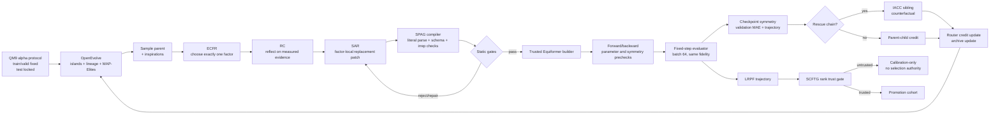

# Stage 1 Traceability Report

## 0. Purpose and Scope

This document is the handoff record for the first stage of the equivariant NAS
project. It is intentionally more operational than a paper narrative: every
claim is tied to a source file, an experiment artifact, a test, or a recorded
negative result. The goal is to make Phase 2 executable and auditable without
reconstructing design decisions from chat history.

The stage-one research question is:

> Can an LLM-driven evolutionary loop search a constrained Equiformer
> architecture space while preserving E(3)-relevant invariants, attributing
> factor effects, and refusing unreliable low-fidelity evidence?

The task is QM9 target 1, isotropic polarizability alpha, with MAE reported in
`a0^3`. Search selection uses validation only. The test split is reserved for a
frozen final architecture; any run that evaluates test during search is marked
protocol-invalid for a publication claim.

## 1. Final Stage-One Status

| Item | Status | Evidence |
|---|---|---|
| OpenEvolve population/lineage/archive integrated | Complete | `scripts/run_factorized_evolution.py`, `equivariant_nas/` |
| SPARK-style reflect-then-edit loop integrated | Complete | `equivariant_nas/router.py`, RC/SAR prompts |
| Trusted Equiformer architecture compiler | Complete | `equivariant_nas/spec.py`, `candidate.py`, `builder.py` |
| QM9 alpha evaluator and fixed-step trainer | Complete | `equivariant_nas/pipeline.py`, `training/fixed_step_trainer.py` |
| Symmetry/resource/gradient gates | Complete | `diagnostics.py`, `pipeline.py` |
| Evidence memory, counterfactual credit, trajectory memory | Complete | `router.py`, `interaction.py`, `search_memory.py` |
| Semantic weight-transfer calibration mechanism | Complete as calibration-only | `inheritance.py`, `configs/inheritance_calibration.json` |
| Zero-GPU end-to-end smoke | Passed | `reports/stage1/evidence/memory_smoke/` |
| Server test suite | Passed: 41 tests | `reports/stage1/test_output.txt` |
| Publication-scale search evidence | Not yet run | Registered in `PHASE2_PREREGISTRATION.md` |
| CCF-A oral result claim | Not established | Requires Phase 2 multi-seed evidence |

The first-stage framework is complete. “Framework complete” is deliberately
not equated with “method superiority statistically proven”.

## 2. End-to-End Workflow



### 2.1 One iteration, concretely

1. OpenEvolve samples a parent and inspirations from its island/database.
2. The evidence router chooses one of `REPRESENTATION`, `OPERATOR`, `ACTION`,
   or `MACRO`. The one-factor invariant is checked by trusted code, not by the
   LLM.
3. RC receives a bounded measured context and returns direction/evidence/risk;
   it does not return code.
4. SAR receives the selected factor and returns a complete replacement object
   for that factor. It cannot edit training, data, loss, optimizer, target,
   batch size, step budget, evaluator, or output invariance.
5. Literal parsing, schema validation, architecture ID deduplication and the
   parameter cap run before GPU training. Compiler/evaluator/duplicate repairs
   remain in the selected factor.
6. The trusted builder maps `ArchitectureSpec` fields to the official
   Equiformer constructor. LLM-generated Python is never executed as a model.
7. Static construction, gradient-health, resource and symmetry checks run before
   the optional fixed-step trainer.
8. Candidates are compared only within the same fidelity endpoint. The trainer
   uses batch size 64 and a global optimizer-step limit; the reference schedule
   keeps the original 859 batch-128 steps/epoch phase axis.
9. A trained checkpoint receives observable rotation, translation and atom-
   permutation audits. Layerwise hook profiles are warning-level until their
   coordinate convention is calibrated; catastrophic observable errors are hard
   rejection gates.
10. Measured parent-child credit updates ECFR. A degraded-parent rescue triggers
    IACC, which evaluates the sibling needed to separate main effect from
    epistasis before strong router credit is applied.
11. LRPF records pre-transition, post-transition and warmup-end behavior.
    SCFTG decides whether a cheap source may influence promotion; a proxy that
    fails rank trust remains calibration data only.

## 3. What Was Reused and What Was Changed

### 3.1 OpenEvolve: reused substrate, changed scientific genotype

OpenEvolve supplies the evolutionary runtime concepts: program database,
islands, parent/inspiration sampling, lineage, archive and MAP-Elites update.
The project uses those capabilities through the OpenEvolve Python modules rather
than copying an independent population implementation.

The important change is the genotype. Vanilla OpenEvolve treats a source
program/file as the evolution object. Here the source file is only a safe
container for a typed `ArchitectureSpec`; the real genotype is an irrep-aware
configuration. The quality-diversity descriptors are fixed equivariant capacity
coordinates (`lmax`, higher-order fraction, parameter ratio and depth), not code
length or arbitrary source statistics. Fixed ranges remove arrival-order
dependent dynamic min-max cells.

Relevant code:

- `scripts/run_factorized_evolution.py`: configures OpenEvolve database,
  islands, archive and the factorized loop.
- `equivariant_nas/spec.py`: typed genotype and allowed values.
- `equivariant_nas/candidate.py`: safe literal extraction/rendering.
- `equivariant_nas/pipeline.py`: trusted evaluator boundary.

### 3.2 SPARK: reused principle, changed editor contract

SPARK contributes the reflect-then-edit separation: one component interprets
evidence and risks, and a second component performs the structural edit. Its
original setting is a general coding/architecture evolution surface; it does
not know Equiformer irreps, scalar alpha semantics, radial-basis meaning, or
the QM9 test policy.

The adapted contract is narrower and typed:

- RC returns JSON direction/evidence/risk, never executable code.
- SAR returns a complete replacement object for exactly one selected factor.
- Scientific semantic guards reject claims that alpha is a rank-2 target, that
  scalar output makes hidden higher irreps useless, or that an internal
  `irreps_head` is the output head.
- TCRE supplies bounded lineage and plateau context; zero-step feasibility is
  explicitly not accuracy evidence.

Relevant code: `equivariant_nas/router.py`, `semantics.py`,
`search_memory.py`, and `scripts/run_factorized_evolution.py`.

### 3.3 Equiformer: trusted model and physics boundary

Equiformer remains the model being evaluated, not an LLM-editable source tree.
The builder translates a valid typed spec to the official Equiformer modules.
The evaluator freezes data split, target, loss, optimizer, batch size, step
budget and test policy outside the genotype. This is the boundary that prevents
reward hacking through shorter training or altered data.

Relevant code: `builder.py`, `training/fixed_step_trainer.py`,
`diagnostics.py`, `pipeline.py`, and `evaluation.py`.

## 4. Components Added or Materially Modified

| Component | Role | Why it exists | Main invariant |
|---|---|---|---|
| `spec.py` | Typed equivariant genotype | Makes search space finite and irrep-aware | One valid schema; parameter cap |
| `candidate.py` | Parse/render/repair | Prevents arbitrary LLM Python | Literal-only candidate text |
| `builder.py` | Trusted constructor | Keeps LLM outside model execution | Official Equiformer path only |
| `router.py` | ECFR + RC/SAR prompts | Routes factors using evidence | Exactly one factor changes |
| `search_memory.py` | TCRE lineage summary | Makes history bounded and deterministic | Unknown plateau stays unknown |
| `interaction.py` | IACC contrast/credit ingestion | Separates main effect and epistasis | Credit applied once |
| `fidelity.py`, `trajectory.py` | LRPF response fingerprints | Aligns fidelity with LR phase | Same endpoint for comparison |
| `fidelity_trust.py` | SCFTG statistics | Disables unreliable proxies | Trust thresholds are explicit |
| `inheritance.py` | ISWT state transfer | Potentially lowers candidate warm-up cost | Semantic, not shape-only transfer |
| `budget.py` | GPU ledger | Enforces auditable caps | Refuses over-budget work |
| `search_statistics.py` | Phase 2 statistics | Prepares paired curves/tests/CI | Search seed is separate from trainer seed |
| `fixed_step_trainer.py` | Global-step trainer | Makes batch-64 comparisons fair | Test optional and locked by default |
| `reporting/` | Report/manifest generation | Makes results reviewable/reproducible | Hash-addressed evidence |

## 5. Insights and Their Falsifiable Meaning

### Insight 1 — SPAG

Search over typed irrep flow instead of arbitrary source rewrites. Falsifiable
prediction: typed candidates have higher executable/valid rates than free edits.

### Insight 2 — ECFR

Use measured factor-local rewards, validity and efficiency to route the next
factor. Falsifiable prediction: evidence routing reaches a target quality with
fewer valid candidates than uniform routing/random controls.

### Insight 3 — Finite-precision symmetry stability

Theoretical equivariance does not guarantee small finite-precision observable
error. Therefore final scalar rotation/translation/permutation errors are hard
gates, while uncalibrated layerwise profiles are warnings. Falsifiable
prediction: observable audits reject catastrophic candidates without rejecting
the official baseline due to coordinate-convention artifacts.

### Insight 4 — SAPF

Spend cheap checks before optimizer steps: schema, build, gradients, resources,
then training, then checkpoint symmetry. Falsifiable prediction: invalid or
unsafe candidates consume less GPU than a train-first loop.

### Insight 5 — LRPF

Step counts across learning-rate phases are not equivalent evidence. Record the
shock/recovery fingerprint rather than one early MAE. Falsifiable prediction:
phase-aware trajectories explain rank reversals that a scalar early score hides.

### Insight 6 — SCFTG

Short fidelity earns promotion authority only after cross-fidelity rank trust.
The stage-one result falsified unconditional trust: 300→5,000-step Spearman was
`-0.5`, Kendall tau was `-1/3`, top-1 recall was `0`, and normalized regret was
`0.6591`.

### Insight 7 — IACC

Factor effects are not additive. For the observed rescue chain, ACTION-only gain
was `-0.546062`, OPERATOR gain without ACTION was `0.177094`, OPERATOR gain with
ACTION was `0.659713`, and epistasis was `-0.482619`. The sibling counterfactual
prevents the rescue gain from being mislearned as a universal OPERATOR benefit.

### Insight 8 — FEM

Low-budget searches should not discard measured factor evidence. FEM freezes
stage-one sufficient statistics with source hashes and warm-starts only the
evidence router; uniform/random controls do not read it.

### Insight 9 — TCRE

RC/SAR should see a trusted, bounded trajectory summary. A zero-step candidate
has no predictive evidence, so plateau status is `unknown`; only measured
same-fidelity history can authorize exploratory escape.

### Insight 10 — ISWT

Parent-state reuse can reduce warm-up cost only if semantic compatibility is
stronger than same-name/same-shape matching. Baseline→Bessel/64 audit found
`86.16%` safe element coverage after blocking radial-semantic changes. This is
calibration-only until the registered 8-candidate rank gate passes; final runs
always start from scratch.

## 6. Stage-One Validation and Evidence

### 6.1 Tests and static checks

- Server test suite: `41 passed`.
- Server `py_compile`: passed for package, trainer, scripts and report generator.
- Zero-GPU smoke (`seed=117`, two proposals): 2/2 valid and unique children,
  three total archive programs, two equivariant capacity cells, `0.0` charged
  GPU seconds.
- Router state records FEM provenance and source hashes.
- State-transfer audit is at
  `reports/stage1/evidence/state_transfer/baseline_to_bessel64.json`.

### 6.2 Short training evidence

The controlled 5,000-step pilot reported (MAE in `a0^3`):

| Cohort | Best validation MAE | Interpretation |
|---|---:|---|
| Baseline | 0.753540 | Reference at this fidelity |
| Factorized evolution best | 0.639890 | Promising pilot, only two valid trained children |
| Typed random best | 0.891592 | Matched pilot control |
| IACC operator-only sibling | 0.576447 | Counterfactual insight, not a final result |

The result supports a hypothesis and engineering feasibility, not statistical
superiority. The small cohort and single search seed are insufficient for a
publication claim.

### 6.3 Symmetry evidence

Training-time observable audits were used as hard safety checks. Layerwise
profiles were downgraded to warnings after the official Gaussian baseline also
showed a large error under an uncalibrated internal-coordinate transform. This
prevents a diagnostic convention error from becoming a false physical failure.

### 6.4 Budget evidence

Stage one charged approximately `4.513295 A100-hours`, under its 5-hour hard
cap. Phase 2 is separately pre-registered: first a 6-candidate micro gate with
an estimated `2.246` A100-hours and `2.8` A100-hours hard cap. It is not included
in the stage-one result and is not automatically launched.

## 7. Known Limitations and Invalid Interpretations

The following statements are not supported by stage-one evidence:

- ECFR is statistically superior to uniform/random routing.
- Layerwise symmetry drift predicts final MAE.
- A candidate beats the Equiformer paper at 257,700 steps and three seeds.
- The framework has already achieved CCF-A oral status.
- A custom task that logs `test_mae` during training is valid search evidence.

The last point matters for the currently running external batch-64 task: its
logs must be treated as a speed/trajectory diagnostic unless test evaluation is
removed or the run is explicitly designated as a test-contaminated run.

## 8. Phase-2 Handoff Protocol

The authoritative rules are in `configs/phase2_preregistration.json` and
`PHASE2_PREREGISTRATION.md`.

1. Run Gate 2A-micro only after explicit budget approval: full evidence router,
   uniform router and typed random; search seed 101; two trained-valid candidates
   per method; maximum ten proposals per method; shared 2.8-hour ledger.
2. Compare normalized best-so-far AUC, final validation MAE, time-to-threshold,
   validity and protocol violations. Do not use test.
3. Extend to six trained-valid candidates only if the micro unlock conditions
   pass. Do not silently rerun or change candidate counts.
4. Only after Gate 2A succeeds may seed 102 be considered. Seeds 103–105 require
   both preceding gates.
5. Freeze one architecture, run 20,000-step confirmation with trainer seeds
   0/1/2, then run the 257,700-step final protocol with seeds 0/1/2.
6. Evaluate test exactly once after architecture freeze. Record all seeds,
   invalid candidates, repairs, API calls, wall time and GPU hours.
7. If ISWT is tested, use `configs/inheritance_calibration.json`; it requires
   eight paired inherited/scratch candidates, no test split, and cannot alter
   the final from-scratch protocol.

### Required Phase-2 artifacts

- Per-method `evolution.jsonl`/`summary.json`.
- Shared budget ledger and GPU telemetry.
- Full candidate specs and architecture IDs.
- Repair and rejection records.
- Fidelity trajectories and trust report.
- Paired statistics, confidence intervals and exact sign-flip tests.
- Frozen architecture manifest and one final test report.

## 9. Reproduction Entrypoints

Server root: `/home/20262202788/equivariant-nas`.

```bash
cd /home/20262202788/equivariant-nas
export PYTHONPATH=.
/home/20262202788/conda-envs/equiformer/bin/python -m pytest -q
/home/20262202788/conda-envs/equiformer/bin/python -m py_compile \
  equivariant_nas/*.py equivariant_nas/training/*.py scripts/*.py
```

The Phase 2 commands and environment variables are documented in
`REPRODUCE.md`; API keys remain in the server-only mode-600 file and are not
part of this repository.

## 10. Version and Evidence Manifest

The stage-one implementation branch is `codex/stage1-framework`. The latest
local commits before this report are:

```text
6ec78ee chore: sync stage one verification manifest
9964ec5 feat: gate semantic weight transfer as calibration proxy
4a54985 feat: add evidence memory and trajectory-conditioned evolution
e2da34a feat: preregister budget-gated phase two search
9317981 feat: complete stage-one equivariant NAS framework
```

The hash-addressed file list is `reports/stage1/manifest.json`. This report is
an additional human-readable index; it does not replace the manifest or raw
JSONL evidence.

## 11. Bottom Line

Stage 1 produced a real, constrained OpenEvolve × SPARK-style × Equiformer
research framework rather than a documentation-only integration. Its strongest
insights are typed irrep-safe evolution, phase-aware fidelity trust,
counterfactual factor credit, persistent evidence memory, trajectory-conditioned
reflection/editing, and semantically gated weight transfer.

The framework is ready for Phase 2. The next scientific claim must be earned by
the registered controls and search seeds; no stage-one number should be
silently promoted to a final test result.
