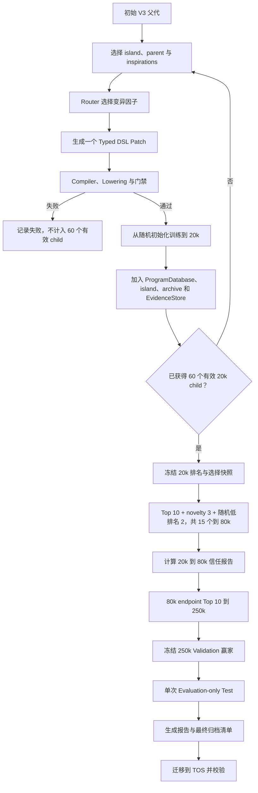

# equiNAS 在线岛屿进化与多保真训练改造计划

> 文档版本：`online-v3-20k-60-plan@1`  
> 制定日期：2026-08-15  
> 目标代码：`equivariant-nas-v3-evolution`  
> 本文是后续代码修改、测试、运行和验收的实施基线；如需改变候选数、训练步数、选择规则或数据协议，必须先更新本文和对应的机器可读协议。

## 一、目标与边界

本次改造新增一条在线多代进化协议，不覆盖历史“固定父代、每周期八个直接子代、`8k → 80k → 250k` 的 `8 → 4 → 2`”实验。

新协议固定为：

1. 使用 OpenEvolve 的种群、岛屿、档案和父代采样思想；
2. 保留 equiNAS 的类型化 DSL、Compiler、Lowering、等变性门禁、数值门禁和实验身份约束；
3. 每轮只生成并评估一个 child；
4. child 完成 20,000 optimizer steps 后立即进入种群，并可参与下一轮父代选择；
5. 累计获得 60 个合法且完成 20k 的 child 后，选择 15 个继续到 80k；
6. 15 个 80k 候选中按终点 Validation MAE 选择 Top 10 继续到 250k；
7. 搜索、晋级和训练期间禁止访问 Test；
8. 全部计划训练和报告完成后，再将实验从 `/mlplatform` 迁移到 TOS。

## 二、总体工作流



在线阶段必须形成真实多代谱系，例如：

```text
P0
├── C1
│   ├── C4
│   │   └── C11
│   └── C9
├── C2
│   └── C5
└── C3
    └── C8
        └── C17
```

每条父子边只允许一次合法 Typed DSL mutation；深层后代可以通过多代逐步积累结构变化。

## 三、冻结实验协议

### 3.1 任务与数据

| 项目 | 固定值 |
|---|---|
| 数据集 | QM9 官方划分 |
| 目标 | `target=1`，各向同性极化率 alpha |
| 搜索 seed | `201` |
| batch size | `8` |
| 20k、80k 数据 | 固定 quarter training subset |
| quarter subset SHA-256 | `d12a515fb90534582880858752b42274b523fa66c686f8a3adba15cabf0b3ba0` |
| 250k 数据 | full training split |
| 搜索期间 Test | 禁止 |
| 最终 Test | Validation 唯一赢家冻结后，单次 Evaluation-only |

### 3.2 候选与训练步数

| 阶段 | 候选数 | 终点 step | 数据 | 选择方式 |
|---|---:|---:|---|---|
| 在线进化 | 60 个合法 child | 20,000 | fixed quarter | 每轮一个，完成后入库 |
| 中保真 | 15 | 80,000 | fixed quarter | 20k Top 10 + novelty 3 + 随机低排名 2 |
| 完整训练 | 10 | 250,000 | full train | 80k endpoint Validation Top 10 |
| 最终评估 | 1 | evaluation-only | Validation + Test | 250k Validation 唯一赢家 |

“60 轮”定义为获得 60 个合法、唯一、完成 20k 训练的 child，而不是只尝试生成 60 次。建议：

```text
valid_child_target = 60
maximum_generation_attempts = 180
```

达到最大尝试数仍不足 60 个有效 child 时，控制器必须停止并报告失败，不得静默放宽 Compiler、等变门禁、参数预算或数据协议。

## 四、20k 低保真的定位

固定 quarter 数据在 batch size 8 下约有：

```text
steps_per_data_epoch = 3437
```

五个 warmup epochs 对应：

$$
3437 \times 5 = 17185\text{ steps}
$$

8k 明显仍在 warmup 内；20k 刚越过 warmup，因此比 8k 更有可能形成有信息的早期排序，但本协议不预先声称 20k 已经是可信代理。

已有真实 V3 数据中的 4 个共享 `8k → 80k` 候选得到：

```text
Spearman = -0.40
Kendall tau = -0.333
Top-1 recall = 0
Top-2 recall = 0.5
```

这不能证明 20k 无效，但要求 20k 在通过信任门前不能拥有纯性能淘汰的唯一权力。因此 80k cohort 必须包含 novelty 和随机低排名校准候选。

## 五、每轮在线进化

每轮执行：

1. 从状态文件恢复数据库和随机状态；
2. 以轮询或预注册策略选择 island；
3. 从 island、elite archive、novelty pool 或全局种群采样 parent；
4. 选择 inspirations；
5. 使用 `EvidenceCalibratedRouter` 选择一个 factor；
6. LLM 只生成一个 Typed DSL Patch，不得改训练代码；
7. 执行 canonicalization、Compiler、类型、Lowering 和作用域检查；
8. 执行参数预算、数值、梯度和等变性门禁；
9. 合法 child 从随机初始化训练到 20k；
10. 保存 checkpoint、metrics、runtime manifest、generation evidence；
11. 将 child 加入 ProgramDatabase、对应 island 和 EvidenceStore；
12. 更新 Router、archive、lineage 和 parent sampling 状态；
13. 原子写入状态后进入下一轮。

无效候选必须保存完整失败证据，但不能成为 parent，也不占 60 个有效名额。

### 5.1 权重继承规则

第一版不允许不同 architecture 之间继承权重。每个新 child 的 20k 训练均从随机初始化开始。

只允许同一 architecture 的：

```text
20k → 80k
80k → 250k
```

恢复 checkpoint，避免将结构收益与权重继承收益混合。

### 5.2 20k 到 80k

保持相同 fixed quarter 数据，恢复：

```text
model
optimizer
scheduler
PyTorch RNG
CUDA RNG
NumPy RNG
global step
```

从 global step 20,000 精确继续到 80,000。

### 5.3 80k 到 250k

切换 full training split，并执行：

```text
model-only resume
allow_data_transition
重建 optimizer
重建学习率计划和 warmup
global step 从 80,000 继续到 250,000
```

## 六、岛屿、种群与父代选择

### 6.1 岛屿数量

第一版固定：

```text
num_islands = 5
```

60 个有效 child 完成后，平均每个 island 约 12 个候选，足以形成基本的岛内竞争和岛间差异。

### 6.2 MAP-Elites 与 novelty 特征

不得使用 OpenEvolve 默认的代码长度作为主要复杂度特征。DSL JSON 长度不等价于模型复杂度。

使用以下结构特征：

```text
lmax
mmax
num_layers
num_channels
num_heads
parameter_ratio
higher_order_fraction
attention_family
ffn_family
radial_family
normalization_family
readout_family
grid_resolution
```

连续特征标准化后分箱；类别特征使用稳定、版本化的枚举 ID。特征定义和分箱边界进入 protocol hash。

### 6.3 初始 parent sampling 概率

20k 尚未通过信任校准，因此第一版不采用 OpenEvolve 默认的高 exploitation 比例，固定为：

|来源|概率|
|---|---:|
|20k elite/archive|30%|
|当前 island 均匀探索|25%|
|当前 island fidelity-aware weighted|20%|
|novelty 优先|15%|
|全局随机或跨 island|10%|

每次采样记录：

```text
sampling_mode
random_value
island_id
parent_id
parent_architecture_id
parent_fidelity
parent_rank
inspiration_ids
```

### 6.4 正值且 fidelity-aware 的 fitness

当前项目常用：

```python
combined_score = -validation_alpha_mae
```

OpenEvolve weighted sampling 使用：

```python
weight = max(fitness, 0.001)
```

如果直接传入负 MAE，所有候选都会得到相同权重，weighted sampling 退化为均匀随机。

第一版使用同 fidelity、同数据协议内的 rank-normalized fitness：

$$
f_i = 1 - \frac{r_i - 1}{\max(n - 1, 1)}
$$

建议组合分数：

$$
s_i = 0.60f_i + 0.25n_i + 0.15u_i
$$

其中：

- $f_i$ 是同 fidelity 的 MAE 排名分数；
- $n_i$ 是结构 novelty；
- $u_i$ 是不确定性或低采样因子奖励。

20k、80k 和 250k 的原始 MAE 不得直接放入同一个权重尺度。

## 七、20k 到 80k 的选择

60 个有效 20k child 全部完成后，先原子冻结 selection snapshot，再选择 15 个唯一候选。

### 7.1 Performance Top 10

按：

```text
20,000-step endpoint validation_alpha_mae
```

选择全局 Top 10。不得用 best Validation MAE 代替终点 MAE。

### 7.2 Novelty Top 3

从未进入 performance Top 10 的候选中，选择到已选集合最小结构距离最大的 3 个。必须与 performance Top 10 不重复。

### 7.3 随机低排名 2 个

从 20k 排名后 50% 的合法候选中，使用固定 seed `201` 抽取 2 个。抽样池必须满足：

```text
valid = true
equivariance_gate = passed
numerical_health = passed
gradient_health = passed
checkpoint_complete = true
```

随机候选用于检查 20k 是否漏掉长训练反超结构，而不是保存训练失败样本。

### 7.4 选择证据

生成：

```text
selection_20k_to_80k.json
selection_20k_to_80k.sha256
```

至少记录：

- 60 个候选的完整 20k 排名；
- Top 10 IDs；
- novelty 3 IDs、特征和距离；
- 随机候选池、随机 seed 和随机 2 IDs；
- 最终 15 个唯一 IDs；
- protocol hash；
- 代码 commit 或 source hash。

## 八、80k 到 250k 的选择

15 个候选全部完成 80k 后，按：

```text
80,000-step endpoint validation_alpha_mae
```

选择 Top 10 继续到 250k，并生成：

```text
selection_80k_to_250k.json
selection_80k_to_250k.sha256
```

本协议按用户确认采用纯 80k Top 10。因此 `80k → 250k` 的相关性只能在已选 Top 10 条件下解释，不声称对被 80k 淘汰的 5 个候选无偏。

## 九、跨保真信任报告

### 9.1 20k 到 80k

15 个共享候选完成后计算：

```text
Spearman rank correlation
Kendall tau
Top-5 recall
selection regret
normalized selection regret
```

建议阈值：

|指标|阈值|
|---|---:|
|共享候选数|至少 12|
|Spearman|至少 0.50|
|Kendall tau|至少 0.30|
|Top-5 recall|至少 0.60|
|normalized selection regret|不超过 0.10|

若失败，本轮实验仍按冻结协议完成 250k，但报告必须说明 20k 不具备强筛选权；后续协议应提高低保真步数或降低 exploitation 权重。

### 9.2 80k 到 250k

在最终 10 个共享候选中计算相同指标。结果只代表 80k Top 10 条件下的相关性。

### 9.3 20k 到 250k

可以在最终 10 个共享候选上计算探索性结果，但由于中间经过 80k 选择，不得解释成对全部 60 个候选的无偏估计。

## 十、运行存储与最终 TOS 归档

### 10.1 代码和环境

继续保留：

```text
/home/yifei/equiNAS
/root/miniconda3/envs/equiNAS
```

### 10.2 高速运行目录

新实验大体积输出统一写入：

```text
/mlplatform/equiNAS/online_v3_20k_60
```

目录建议：

```text
/mlplatform/equiNAS/online_v3_20k_60/
├── protocol/
├── database/
├── evidence/
├── candidates/
│   └── <architecture_id>/
│       ├── architecture.dsl.json
│       ├── generation.json
│       ├── runtime_manifest.json
│       ├── fidelity_20000/
│       ├── fidelity_80000/
│       └── fidelity_250000/
├── selections/
├── state/
├── logs/
├── reports/
└── FINAL_ARCHIVE_MANIFEST.json
```

`/mlplatform` 当前约有 1.1 TiB 可用，但它是平台 overlay/local NVMe 空间，不视为已确认的持久卷。

### 10.3 最终归档到 TOS

按本次确认，运行期间不迁移整套实验。所有计划训练、最终 Test 和报告完成后，再归档至：

```text
tos://c20250512/yifei/equiNAS/online_v3_20k_60_<experiment_id>/
```

归档顺序：

1. 停止写入实验目录；
2. 生成完整文件清单和 SHA-256；
3. 生成 `FINAL_ARCHIVE_MANIFEST.json`；
4. 上传 DSL、数据库、状态、日志、报告和保留 checkpoint；
5. 在 TOS 重新列举对象并核对数量与总字节数；
6. 校验关键文件或全量 SHA-256；
7. 写入归档完成标志；
8. TOS 校验通过前不得删除 `/mlplatform` 原始目录。

### 10.4 风险声明

TOS 迁移安排在完整训练后。如果当前 Pod、容器或实例在实验完成前被重建，`/mlplatform` 数据可能丢失。本计划按用户确认接受该风险。原子状态写入和进程恢复不能替代持久卷或中途对象存储备份。

## 十一、状态机与恢复

状态至少包含：

```text
protocol_hash
stage
attempt_count
valid_20k_count
current_iteration
current_candidate
current_island
program_database_checkpoint
completed_20k
selected_80k
completed_80k
selected_250k
completed_250k
final_validation_winner
test_evaluated
```

阶段固定为：

```text
preflight
evolve_20k
freeze_20k_selection
promote_80k
freeze_80k_selection
promote_250k
freeze_validation_winner
evaluation_only_test
generate_report
ready_for_tos_archive
tos_archived
complete
```

恢复时必须验证：

```text
DSL canonical hash
architecture_id
checkpoint global_step
training dataset identity
protocol hash
runtime manifest hash
source file hashes
optimizer transition policy
Test 隔离状态
```

## 十二、成本与空间预算

当前 V3 实测约为：

```text
0.407 秒 / optimizer step
```

### 12.1 60 个候选到 20k

$$
60 \times 20000 = 1{,}200{,}000\text{ steps}
$$

约 `136 A100 小时`。

### 12.2 15 个从 20k 到 80k

$$
15 \times (80000 - 20000) = 900{,}000\text{ steps}
$$

约 `102 A100 小时`。

### 12.3 10 个从 80k 到 250k

$$
10 \times (250000 - 80000) = 1{,}700{,}000\text{ steps}
$$

约 `192 A100 小时`。

### 12.4 总计

$$
1.2M + 0.9M + 1.7M = 3.8M\text{ steps}
$$

预计约 `430 A100 小时`，即单卡连续训练约 `18 天`；加入验证、审计、LLM、I/O 和失败重试后，预计墙钟时间约 `19～22 天`。

建议为 checkpoint、临时文件、日志和报告至少预留 `150 GiB`；`/mlplatform` 当前容量满足要求。

## 十三、代码修改清单

### 13.1 新增机器可读协议

```text
configs/dsl_v3_online_20k_60_protocol.json
```

内容包括候选数、step、数据身份、seed、island 数量、采样概率、novelty 特征、选择规则、信任阈值、存储根目录和 Test 隔离。

### 13.2 新增在线主控制器

```text
scripts/run_dsl_v3_online_multifidelity.py
```

负责每轮一个 child、60 个有效 20k child、状态恢复、两次选择、80k/250k 晋级、最终 Test、报告和归档状态。

### 13.3 复用 OpenEvolve 基础

复用：

```text
scripts/run_dsl_evolution.py
OpenEvolve ProgramDatabase
islands
archive
inspirations
EvidenceStore
```

新增 fidelity-aware adapter，禁止直接混合不同 fidelity 的原始 MAE。

### 13.4 新增父代采样器

```text
equivariant_nas/dsl/fidelity_aware_parent_sampler.py
```

实现 elite、island exploration、rank-weighted、novelty、global/cross-island 和完整采样审计。

### 13.5 新增晋级模块

```text
equivariant_nas/dsl/online_promotion.py
```

实现：

```text
20k Top 10
novelty Top 3
random lower-half 2
唯一性检查
80k Top 10
selection snapshot
fidelity trust report
```

### 13.6 扩展 V3 mutation

复用并扩展：

```text
equivariant_nas/dsl/v3_structural_evolution.py
```

使其能针对 ProgramDatabase 中任意合法 V3 parent 生成一个直接 child，并接受 global architecture archive、island context、inspirations、Router 结果和已使用 patch signatures。

### 13.7 路径可移植化

新代码不得硬编码旧路径 `/home/20262202788/...`。统一使用：

```text
EQUINAS_ROOT
EQUINAS_RUN_ROOT
EQUIFORMER_ROOT
EQUIFORMER_V3_ROOT
EQUIFORMER_PYTHON
```

正式运行时：

```bash
export EQUINAS_RUN_ROOT=/mlplatform/equiNAS/online_v3_20k_60
```

### 13.8 最终 TOS 归档工具

```text
scripts/archive_online_v3_to_tos.py
```

仅允许在状态为 `ready_for_tos_archive` 时运行，执行清单、SHA-256、上传、远端核对和完成标记。凭据不得写入仓库、日志、manifest 或报告。

## 十四、测试计划

### 14.1 单元测试

新增：

```text
tests/test_v3_online_parent_sampler.py
tests/test_v3_online_promotion.py
tests/test_v3_online_state_machine.py
tests/test_v3_online_storage.py
tests/test_v3_online_fidelity_metrics.py
tests/test_v3_online_tos_archive_gate.py
```

必须覆盖：

- 采样概率边界；
- 负 MAE 不导致权重退化；
- 不同 fidelity 不直接比较原始 MAE；
- Top10 + novelty3 + random2 唯一性；
- 固定 seed 抽样可复现；
- 无效候选不占 60 个有效名额；
- 状态原子写入；
- 恢复时不重复训练；
- 搜索阶段不可访问 Test；
- 最终归档状态门禁。

### 14.2 无 GPU 控制器测试

使用 mock evaluator 完整执行：

```text
60 个有效 20k child
选择 15 个 80k
选择 10 个 250k
冻结赢家
进入 ready_for_tos_archive
```

验证 lineage、island、archive、选择和恢复。

### 14.3 GPU 冒烟测试

正式启动前执行一个真实 V3 child 的：

```text
QM9 数据加载
forward/backward
1～10 optimizer steps
/mlplatform checkpoint 写入
checkpoint 恢复
```

### 14.4 小规模协议演练

将候选数和 step 替换为极小 mock 值，完整演练状态机。演练结果不用于科学结论。

## 十五、正式运行前置条件

1. `/mlplatform` 可写且至少有 150 GiB 可用；
2. Conda `equiNAS` 环境通过运行时 smoke；
3. QM9 数据和 quarter subset SHA-256 正确；
4. OpenEvolve 依赖和 LLM 凭据可用；
5. 新协议测试全部通过；
6. 历史 `8 → 4 → 2` 代码和结果未被覆盖；
7. 当前 `gpu_scheduler` tmux 会话已停止。

正式训练前执行：

```bash
tmux kill-session -t gpu_scheduler
```

该程序会在 GPU 长时间空闲后主动生成矩阵乘法负载，可能与正式训练启动或阶段切换竞争 GPU。

## 十六、Git 实施策略

当前迁移后的目标工作区保留失效的旧 worktree `.git` 指针；远程 `main` 与 NAS 分支没有共同历史，不能安全直接覆盖。

后续代码修改应基于现有：

```text
codex/v3-mapping
```

创建干净实施分支：

```text
codex/v3-online-20k-60
```

不得对远程 `main` 做未经确认的 force push。

## 十七、实施阶段

### Phase 1：协议、路径与状态机

- 新增机器可读协议；
- 新增 `/mlplatform` 运行根配置；
- 新增状态机与原子写入；
- 清除新入口中的旧服务器硬编码路径。

### Phase 2：在线种群搜索

- 接入 ProgramDatabase；
- 实现每轮一个 V3 child；
- 接入 island、archive 和 inspirations；
- 实现 fidelity-aware parent sampling；
- 保存全部成功和失败证据。

### Phase 3：20k 训练与选择

- 首阶段改为 20k；
- 实现 60 个有效候选目标；
- 实现 Top10 + novelty3 + random2；
- 冻结选择快照。

### Phase 4：80k 与 250k

- 15 个精确续训到 80k；
- 计算 `20k → 80k` 信任报告；
- 80k Top 10 切换 full data 并训到 250k；
- 计算条件化跨保真报告。

### Phase 5：最终评估与报告

- 冻结 250k Validation 唯一赢家；
- 单次 Evaluation-only Test；
- 生成 lineage、island、排名、成本和相关性报告；
- 进入 `ready_for_tos_archive`。

### Phase 6：最终 TOS 迁移

- 生成全量清单和 SHA-256；
- 上传到新 TOS prefix；
- 远端核对；
- 标记 `tos_archived` 和 `complete`。

## 十八、验收标准

只有全部满足以下条件，改造才算完成：

1. 每轮只有一个 child，且完成 20k 后才能影响下一轮；
2. 获得 60 个合法、唯一、完成 20k 的 V3 child；
3. ProgramDatabase 中存在可审计的多代 lineage；
4. 五个 island 均有有效候选或明确空岛诊断；
5. 15 个 80k 候选严格来自冻结选择规则；
6. 10 个 250k 候选严格来自 80k endpoint Top 10；
7. 不同 fidelity 的原始 MAE 未被直接混合作为采样权重；
8. 所有训练迁移均验证 checkpoint global step 和数据身份；
9. 搜索期间 `test_evaluated=false`；
10. 唯一赢家冻结后只执行一次 Test；
11. `/mlplatform` 中存在完整运行证据；
12. 最终 TOS 对象数量、大小和 SHA-256 验证通过；
13. 新代码测试通过，历史协议和历史结果未被修改。

## 十九、不在本次改造范围内

- 不同 architecture 之间的权重继承；
- 多 GPU 并发训练；
- 搜索中访问 Test；
- 自动改变 20k、80k、250k 步数；
- 信任门失败后自动修改当前运行协议；
- 自动删除 `/mlplatform` 原始归档；
- 对远程 `main` 做 force push；
- 实验过程中上传整套 checkpoint 到 TOS。

## 二十、后续执行原则

后续代码修改必须按本文 Phase 顺序进行。每个 Phase 完成后，先运行相应测试并更新实施记录，再进入下一 Phase。正式 60 轮训练只能在代码、mock 状态机、GPU 冒烟、存储检查和协议哈希全部通过后启动。
