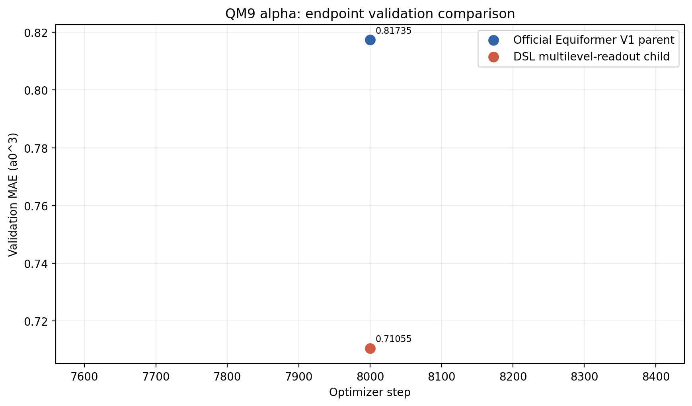
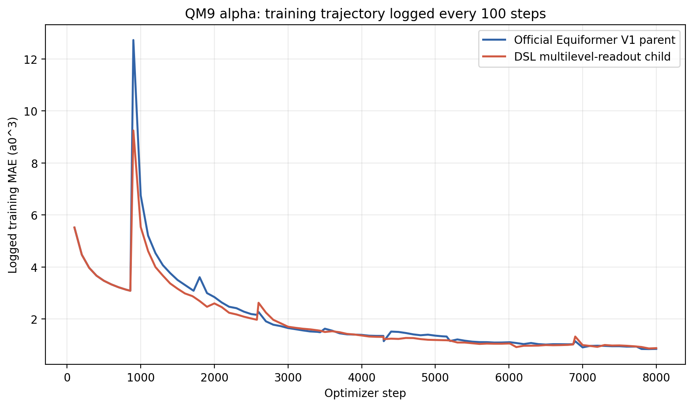
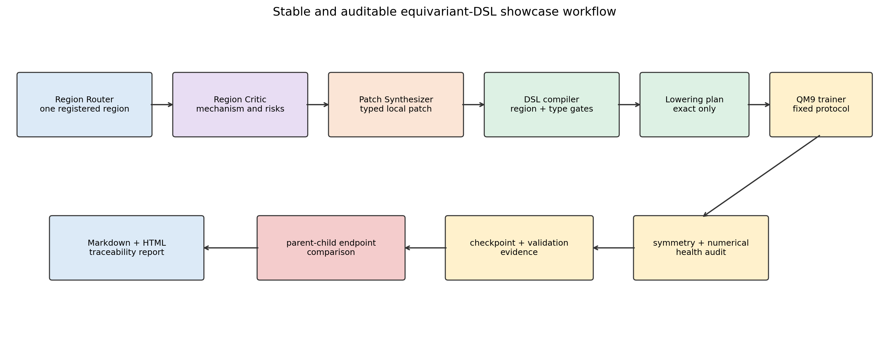

# 等变DSL可信端到端展示实验报告

> 本报告由实验原始JSON、训练指标和checkpoint自动生成。实验只使用validation比较候选，未访问test集。

## 一、结论

本次实验完成了真实Equiformer V1父代与一个LLM生成DSL子代的同协议端到端训练。父代通过`exact_reference`调用官方Equiformer V1构造语义；子代通过`exact_hybrid`保留官方V1主体，仅在认证的`v1_readout`区域增加从`block2`读取的辅助不变量标量头，并用可训练组合器与原始末端readout融合。

在固定seed=201、batch size=32、8000 optimizer steps和固定1/4训练子集下，父代终点validation MAE为`0.81735259`$a_0^3$，子代为`0.71055081`$a_0^3$，差值为`-0.10680178`$a_0^3$，相对幅度为`13.0668%`，当前单seed信号为**子代更优**。该结果只证明本版系统能够稳定生成、编译、训练并比较真实父子架构；不能据此声称形成了多seed稳定改进或发现了V2级新算子。

下图补充展示训练器每100 optimizer steps打印的训练MAE。它用于观察优化动力学，不替代候选选择所使用的终点validation MAE。每个data epoch开始时累计窗口会重新建立，曲线可能出现阶段性跳变。

## 二、完整工作流

流程首先由Region Router（区域路由器）从编译器注册的具名区域中选择唯一可编辑区域；Region Critic（区域审查器）分析该区域的功能、边界、不变量、风险和可证伪假设；Patch Synthesizer（补丁合成器）在冻结边界内生成typed patch（带类型补丁）。编译器随后验证区域授权、等变类型、结构补集hash和lowering能力。只有`exact_reference`或`exact_hybrid`候选能够进入训练，`representation_only`候选会在使用GPU前被拒绝。

通过编译的父子候选使用相同QM9 alpha数据、初始化seed、batch size、optimizer step上限、学习率协议和validation规则从头训练。训练前后执行旋转、平移和置换审计，并记录预测尺度与梯度健康；训练过程按固定间隔保存checkpoint，终点强制validation。控制器使用原子`state.json`记录阶段，监督器在异常退出后复用同一run目录和最新checkpoint恢复。

## 三、预注册训练协议

| 项目 | 值 |
|---|---|
| 数据集与目标 | QM9 alpha极化率 |
| 训练数据 | 固定1/4训练子集：`/home/20262202788/equivariant-nas/data_splits/qm9_train_quarter_seed201.npz` |
| 子集SHA-256 | `d12a515fb90534582880858752b42274b523fa66c686f8a3adba15cabf0b3ba0` |
| 子集样本数 | `27500`，原训练集`110000` |
| 随机种子 | `201` |
| batch size | `32` |
| 终止条件 | `8000` optimizer steps |
| validation节奏 | 每`10`个data epoch；终点强制validation |
| 候选选择指标 | endpoint validation MAE |
| test集 | 禁止访问；审计结果：`true` |

## 四、父代与子代的结构关系

| 项目 | 官方V1父代 | DSL子代 |
|---|---|---|
| architecture ID | `7dd9fec5cc6af301` | `3cebdda4b3529ea4` |
| lowering模式 | `exact_reference` | `exact_hybrid` |
| 后端语义 | `equiformer-v1-official-constructor-v1` | `equiformer-v1-readout-hybrid-v1` |
| 参数量 | `3,531,715` | `3,548,358` |
| 参数比例 | `1.0` | `1.004712` |
| 被授权修改区域 | 官方完整参考模型 | `v1_readout` |
| 新增读取路径 | 无 | `block2`辅助标量readout |
| 区域外结构hash | 参考父代 | `f6ef9962d908e9227d24e74297b7ca961a70a5bd5466641e6cc0b68f526e9fa8` |

子代不是把整个网络交给LLM任意改写，也不是用简化e3nn图近似训练Equiformer。它复用完整官方V1作为数值主体，通过forward hook读取一个中间block的等变输出，只允许将其中的标量不变量通道聚合成图级辅助预测，再与原始官方末端预测进行标量融合。因而新增路径保持输出为旋转不变量标量，同时`scalar_readout→block5`原始路径仍然存在。

## 五、LLM候选生成证据

| 固定角色 | 调用次数 | 职责 |
|---|---:|---|
| Region Router | `1` | 只决定修改哪个已注册区域 |
| Region Critic | `1` | 分析区域机制、风险、边界和可证伪假设 |
| Patch Synthesizer | `1` | 把审查结论合成为typed patch |
| Compiler-guided Repair | `0` | 仅在结构化编译失败时触发 |

本候选由真实LLM调用生成，生成架构ID为`3cebdda4b3529ea4`，固定三阶段均有独立prompt/response证据。本次补丁首次编译通过，因此没有把被动Repair伪装成第三个正常推理阶段。完整生成记录位于`/home/20262202788/equivariant-nas/runs/dsl_showcase_llm_smoke_v2_seed201_20260725/search`。

## 六、训练结果与可信性审计

| 指标 | 官方V1父代 | DSL子代 |
|---|---:|---:|
| 终点validation MAE ($a_0^3$) | `0.81735259` | `0.71055081` |
| 最佳validation MAE ($a_0^3$) | `0.81735259` | `0.71055081` |
| 最佳step | `8000` | `8000` |
| 训练wall time | `0.381`小时 | `0.383`小时 |
| 平均step时间 | `171.44`ms | `172.33`ms |
| 训练前预测RMS | `0.907051` | `0.907413` |
| 梯度norm | `46.5443` | `46.5548` |
| 训练前最大对称误差 | `0.000581762` | `0.00038082` |
| 训练后最大对称误差 | `0.000486485` | `0.000601118` |
| checkpoint存在 | `true` | `true` |
| checkpoint大小 | `41.04`MiB | `41.25`MiB |
| test_evaluated | `false` | `false` |
| training dataset ID一致 | `true` | `true` |

validation轨迹点数为：父代`1`个、子代`1`个。由于8000 steps小于10个data epoch对应的8590 steps，本协议在终点前不会进行额外validation，因此图中正常地只有终点validation点；这不是日志缺失。训练过程仍按100 step打印训练统计，并按859 step保存checkpoint。

训练日志轨迹点数为：父代`89`个、子代`89`个。该轨迹只用于诊断收敛过程，正式父子排序不使用训练MAE。

## 七、稳定性与恢复机制

- 控制器使用原子写入的`/home/20262202788/equivariant-nas/runs/dsl_showcase_pair8k_seed201_20260725/state.json`保存当前阶段和已完成结果。
- 父代完成后才进入子代；已经完成且endpoint一致的候选在控制器重启时不会重复训练。
- 候选训练目录中的`checkpoint_last.pth`每859 step更新；异常退出时pipeline自动把它作为`--resume-step`恢复。
- 本次父子checkpoint完整性合取结果为`true`。
- 父子与总摘要的test隔离合取结果为`true`。
- architecture ID与protocol identity绑定lowering/backend语义，防止不同数值后端错误复用缓存。

## 八、该版本已经解决与尚未解决的问题

### 已经解决

- 第一代父代不再由表示流简化后端冒充，而是精确调用官方Equiformer V1。
- 没有可信lowering的修改图会被标记为`representation_only`并禁止训练排名。
- LLM生成被拆成Router、Critic和Synthesizer三个语义不同的固定调用。
- 子代修改被限制在一个认证region内，region外结构由frozen complement hash证明未改。
- 父子候选通过相同训练协议、数值健康、等变性、断点和test隔离审计。

### 尚未解决

- 当前只开放readout区域，属于可信闭环展示，不足以支持“发现V2式新算子”的主张。
- 当前只有一个LLM子代和一个seed；即使子代更优，也只能视为需要复验的validation信号。
- 还需要实现一个完整message/attention block的精确节点级lowering，才能搜索更具结构新颖性的算子。
- 还没有完成静态DSL、自进化DSL、OpenEvolve和SPARK式基线的同预算对照。
- 语言motif发现必须只消费本类可信lowering候选，不能使用早期数值语义无效的run作为准入证据。

## 九、结论边界

本次实验的有效主张是：系统已经形成一个可展示、可恢复、可审计的真实Equiformer DSL端到端闭环，LLM能够在编译器强制的局部等变约束下生成结构不同的可训练子代，并与官方V1父代进行公平的validation-only比较。

本次实验不能单独证明DSL提高了搜索效率、子代稳定优于V1、语言已经发生有效自进化，或系统能够发现Equiformer V2级新算子。这些结论需要block级lowering、多候选、多seed、多保真和基线对照。

## 十、原始证据索引

- 实验预注册：`/home/20262202788/equivariant-nas/runs/dsl_showcase_pair8k_seed201_20260725/experiment_preregistration.json`
- 生成证据：`/home/20262202788/equivariant-nas/runs/dsl_showcase_pair8k_seed201_20260725/generation_evidence.json`
- 控制器状态：`/home/20262202788/equivariant-nas/runs/dsl_showcase_pair8k_seed201_20260725/state.json`
- 总摘要：`/home/20262202788/equivariant-nas/runs/dsl_showcase_pair8k_seed201_20260725/showcase_summary.json`
- 父代结果：`/home/20262202788/equivariant-nas/runs/dsl_showcase_pair8k_seed201_20260725/parent_result.json`
- 子代结果：`/home/20262202788/equivariant-nas/runs/dsl_showcase_pair8k_seed201_20260725/child_result.json`
- 父代训练指标：`/home/20262202788/equivariant-nas/runs/dsl_candidates/7dd9fec5cc6af301/seed201_steps8000_2ab9202c78/training/metrics.jsonl`
- 子代训练指标：`/home/20262202788/equivariant-nas/runs/dsl_candidates/3cebdda4b3529ea4/seed201_steps8000_1b1f2c2e71/training/metrics.jsonl`
- 父代checkpoint：`/home/20262202788/equivariant-nas/runs/dsl_candidates/7dd9fec5cc6af301/seed201_steps8000_2ab9202c78/training/checkpoint_last.pth`
- 子代checkpoint：`/home/20262202788/equivariant-nas/runs/dsl_candidates/3cebdda4b3529ea4/seed201_steps8000_1b1f2c2e71/training/checkpoint_last.pth`
