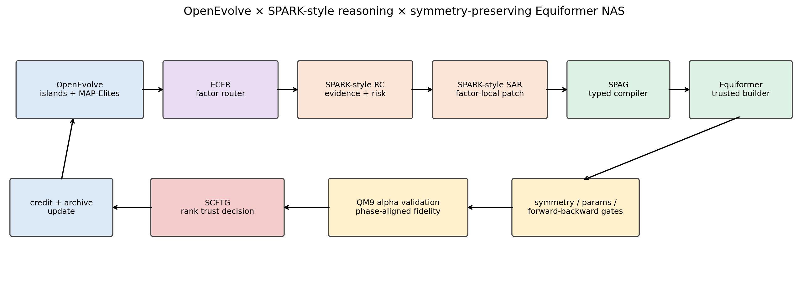
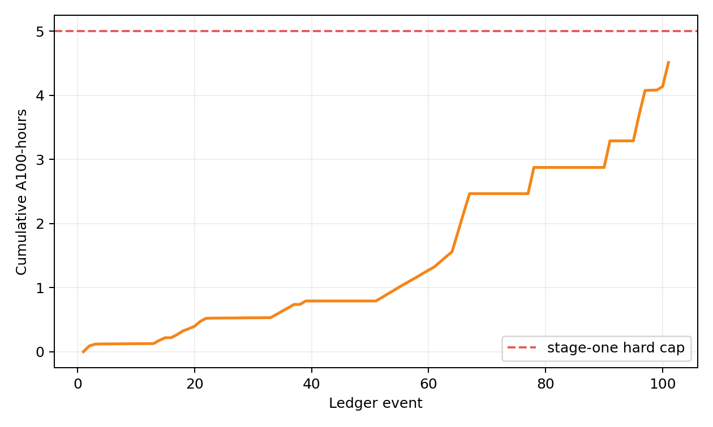
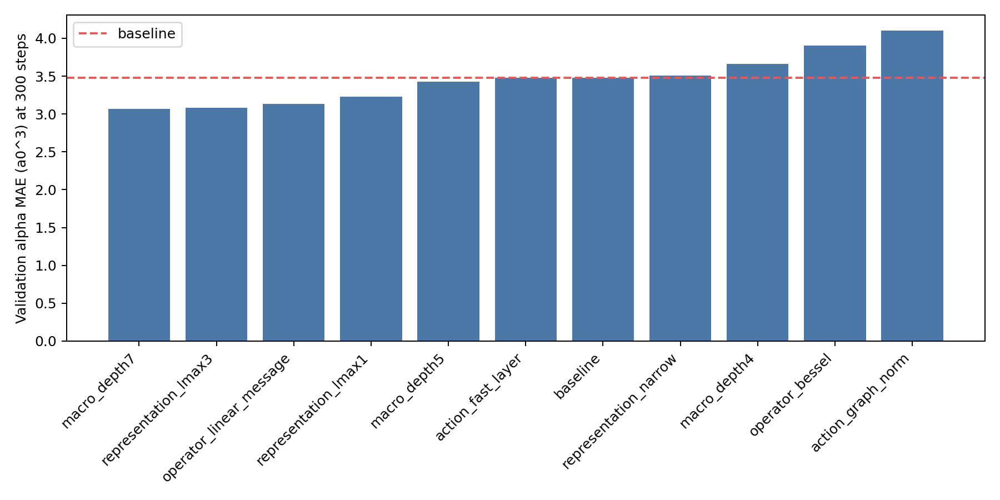
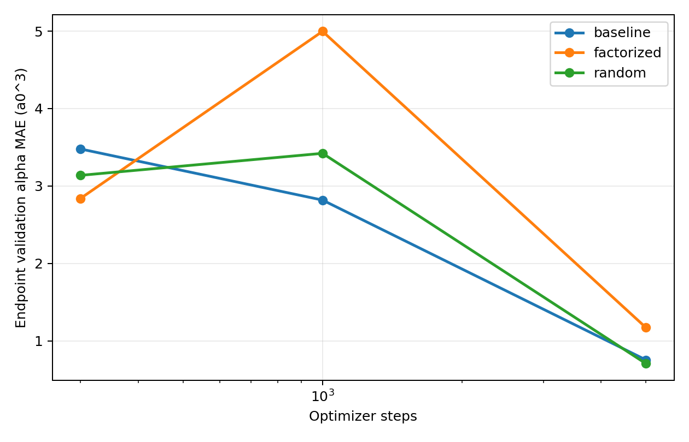
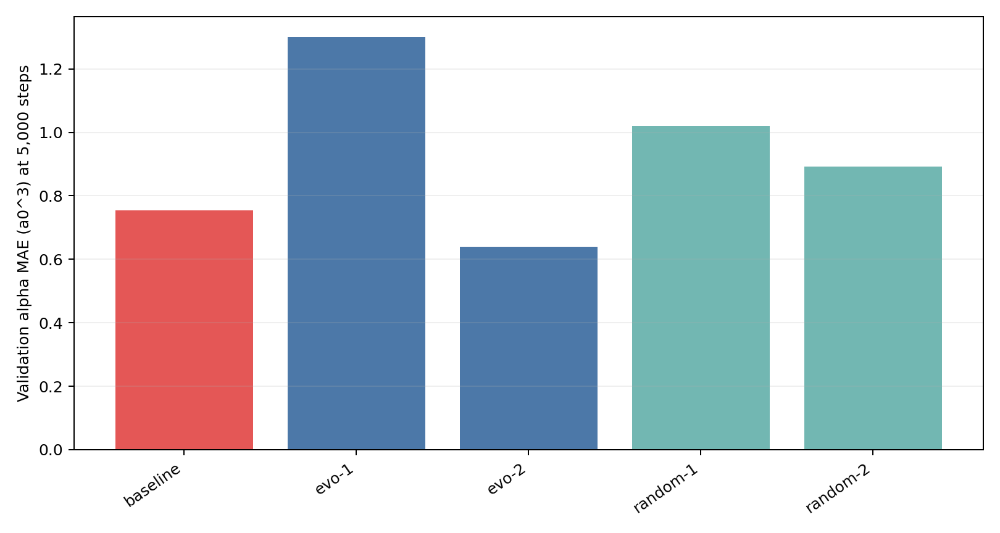
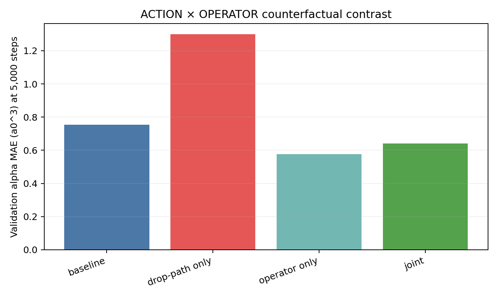

# OpenEvolve × SPARK × Equiformer：等变神经网络架构自进化框架第一阶段报告

> 数据集：QM9；任务：极化率 α（`target=1`，MAE 单位为 a₀³）  
> 硬件：单卡 NVIDIA A100-SXM4-80GB  
> 搜索协议：batch size 64、验证集选择、测试集锁定  
> 最终协议：257,700 optimizer steps × 3 seeds，仅在候选冻结并单独批准后运行  
> 第一阶段预算：累计硬上限 5 A100-hours

## 1. 结论摘要

第一阶段已经形成真实可运行的融合框架，而不是把三个仓库串成脚本：OpenEvolve 提供 islands、lineage、MAP-Elites 和候选采样；SPARK 启发的 RC/SAR 将“反思”和“结构修改”分离；Equiformer 被封装为可信构建器，LLM 只能修改类型化的等变架构描述，不能修改数据、损失、优化器、预算或评测器。

本阶段最重要的研究发现不是“短训练已经找到更好模型”，而是：**QM9 α 上的极短训练排名会在学习率相位变化后系统性反转。** 因而低 fidelity 必须先通过排名信任检验，不能天然拥有候选晋级权。框架据此新增 LRPF 与 SCFTG，使错误代理能够被自动识别和关闭。

当前证据支持“工程与方法原型成立”，但不支持“已经达到 CCF-A oral”或“最终性能超过论文”。这两种结论需要更大候选池、匹配基线、多 seed 和完整训练。

## 2. 融合工作流

核心闭环：

1. **OpenEvolve substrate**：保存谱系、islands 和质量多样性 archive。
2. **ECFR**：只选择 `REPRESENTATION / OPERATOR / ACTION / MACRO` 中一个因子。
3. **RC**：LLM 只分析已有证据、建议方向和风险，不产生代码。
4. **SAR**：LLM 只返回所选因子的完整 replacement patch。
5. **SPAG**：AST 字面量解析、schema/irrep 约束、去重和参数量上限。
6. **可信 Equiformer builder**：候选描述映射到官方算子，不执行 LLM 代码。
7. **SAPF**：等变性、平移/置换不变性、forward/backward 和资源门控先于训练。
8. **LRPF + SCFTG**：学习率相位对齐，并用跨 fidelity 排名统计决定代理能否用于晋级。
9. **父子信用与 archive 更新**：只用同 fidelity 验证 MAE 和真实效率数据更新路由器。

## 3. 方法创新点

### 3.1 SPAG：对称性保持架构语法

基因型不是任意 Python，而是具有 irrep 语义的 `ArchitectureSpec`。未知字段、可执行语句、不合法角动量通道以及超过 1.2× baseline 参数量的候选在训练前被拒绝。baseline spec 精确构建出官方 **3,531,715** 参数模型。

### 3.2 ECFR：证据校准的因子路由

一次父子变化只归属于一个因子，使性能变化具有局部因果解释。路由器综合父子验证 MAE、真实 step time、参数减少、合法率、不确定性和层级对称性漂移。第一阶段审计修复了“参数比例被误当作延迟”的问题，并开始显式记录 `step_time_ms`。

### 3.3 等变容量质量多样性地图

OpenEvolve 的 MAP-Elites 坐标被改为 `lmax`、高阶通道比例、参数比例和网络深度，而不是源代码长度。这使 archive 保留不同角动量容量与计算规模的精英，而不只是单一 MAE 最优点。

零训练 smoke 中共有 **5** 个唯一架构，并占据 **3** 个等变容量 cell。为避免 OpenEvolve 动态 min–max 导致旧 cell 随生成顺序失真，分箱尺度预注册为 `lmax 1–3`、高阶比例 `0–1`、参数比 `0.5–1.2`、深度 `3–8`；本次实际观测覆盖 `lmax=2–3`、高阶通道比例 `0.1429–0.1724` 和参数比例 `0.9224–1.1767`。4 个新候选全部合法，其中 **1** 次 schema 错误由同因子 compiler repair 实时修复。该结果验证了 OpenEvolve archive 和修复闭环确实运行，而非仅在文档中声明。

### 3.4 LRPF：学习率相位感知 fidelity

300、1,000 和 5,000 steps 分别处于不同优化器相位。框架记录跃迁前 MAE、跃迁冲击比、warmup 恢复比和 early-rank risk，禁止把不同相位的历史最优值混为同一 fidelity 端点。

### 3.5 SCFTG：自校准 fidelity 信任门

低成本代理只有在最小共享候选池上同时通过 Spearman、Kendall τ、top-k recall 和 selection regret 阈值，才获得晋级权；否则只保留为轨迹数据。该机制直接针对“快速但误导”的等变 NAS 搜索。

### 3.6 科学语义与统一修复门

schema 编译失败、重复架构和 evaluator 拒绝均进入同一因子内的修复循环；修复不能改变路由器选定的因子。同时，确定性语义守卫阻止两类物理错误进入 lineage：把 QM9 α 错称为二阶张量目标，以及由标量输出错误推出高阶隐藏 irreps 无用。`irreps_head` 被明确限定为内部注意力表示，而非输出头。

### 3.7 IACC：交互感知反事实信用

因子局部修改并不意味着因素效应可加。若一个候选显著救援了相对祖先已经退化的父代，IACC 自动提出 sibling 反事实：把新因子 patch 直接应用到祖先，移除前一个因子变化。2×2 difference-in-differences 将新因子的主效应与 ACTION×OPERATOR 等交互效应分离；在反事实完成前，该次 MAE 信用保持 provisional，不直接强化路由器。

## 4. 安全性、可复现性与预算

- 已审计 **35** 个训练 summary，`test_evaluated=true` 数量为 **0**；搜索期间测试集保持锁定。
- LLM 密钥仅保存在服务器 mode-600 的 `~/.config/openevolve/apis.env`；代码与报告不含密钥。网络使用 SSH 反向代理 `127.0.0.1:12356`，未使用火山引擎付费网际快车。
- batch size 固定为 64，总 step 轴与原 batch-128 的 859 steps/epoch 学习率协议一致。
- 固定 seed 和按 data-cycle 派生的 shuffle；断点恢复参数最大差异约 `7.2e-6`，符合 CUDA scatter 原子归约的非位级确定性。
- 训练前执行参数量、构建、对称性和预算检查。
- 最终标量输出的旋转/平移/置换误差是硬门；layerwise hook profile 仅作 warning。第一阶段发现未校准的内部 irrep 变换公式也会把官方 Gaussian baseline 标为约 0.40，因此不能把该 profile 直接当结构失效证据。
- Bessel 家族还出现“随机初始化 sibling 的输出旋转误差 0.738，而训练后联合候选为 0.00926”的差异。因此训练前 profile 只预警；真正决定 archive 资格的是同 fidelity 训练完成后的 checkpoint 审计。
- 最终自动化测试记录：`39 passed in 0.24s`。
- 当前累计计费 **4.513 A100-hours**；硬上限 5 小时。
- 预算估计使用同 fidelity 历史中位耗时并加 20% 安全裕量。

代码版本：Equiformer `64cb7866f48b9aa156e74a9d6a2ef2663b367437`（dirty=True）；OpenEvolve `411fb59c886c18704caaffb611e17cf9e7d824d2`（dirty=True）；SPARK `e4f5a7f45fd5e9652fe20cbadc6ddc78e87db2c9`（dirty=False）。Equiformer/OpenEvolve 的 dirty 状态包含本实验适配器、配置、缓存或数据；最终 manifest 对交付代码和证据逐文件计算 SHA-256。

## 5. Gate 1：搜索空间覆盖实验

| 候选 | 300-step Val MAE (a₀³) | 参数量 | 训练秒 |
|---|---|---|---|
| macro_depth7 | 3.0675 | 4,019,715 | 125.9 |
| representation_lmax3 | 3.0783 | 4,033,299 | 189.9 |
| operator_linear_message | 3.1359 | 3,008,515 | 70.2 |
| representation_lmax1 | 3.2322 | 2,782,531 | 89.1 |
| macro_depth5 | 3.4257 | 3,043,715 | 103.5 |
| action_fast_layer | 3.4773 | 3,531,715 | 109.4 |
| baseline | 3.4780 | 3,531,715 | 110.2 |
| representation_narrow | 3.5080 | 2,093,491 | 98.3 |
| macro_depth4 | 3.6626 | 2,555,715 | 82.5 |
| operator_bessel | 3.9059 | 3,531,585 | 104.2 |
| action_graph_norm | 4.1023 | 3,533,763 | 114.7 |

这些结果证明四类结构决策能够改变优化行为和计算规模，但 300-step 指标不能作为最终架构优劣证据。

## 6. 初始自进化与随机搜索

- 改进后的 schema-only LLM 候选合法率：**100.0%**。
- 新质量多样性地图首次 smoke 在缺少 compiler repair 时合法率为 **75.0%**；统一 compiler/duplicate repair 后，8 个候选合法率为 **100.0%**。
- 300-step 自进化最佳：**2.8402**。
- 300-step random best：**3.1377**。
- 300-step baseline：**3.4780**。
- 自进化短期相对 baseline 改善：**18.3%**。

历史最佳父子链为 `alpha_drop 0.2→0.1`，再将 `radial_hidden [64,64]→[32,32]`；参数减少约 7.5%。但该候选在 5,000 steps 退化，因此它只能支持“早期优化动力学 insight”，不能支持最终架构结论。

## 7. 跨 fidelity 排名反转

| 方法 | 300 steps (a₀³) | 1,000 steps | 5,000 steps |
|---|---|---|---|
| baseline | 3.4780 | 2.8180 | 0.7535 |
| factorized | 2.8402 | 4.9975 | 1.1706 |
| random | 3.1377 | 3.4220 | 0.7056 |

| 方法 | LR shock | warmup recovery | early-rank risk |
|---|---|---|---|
| baseline | 0.810 | 0.267 | 0.000 |
| factorized | 1.760 | 0.234 | 1.083 |
| random | 1.091 | 0.206 | 0.312 |

300→5000 steps 的 Spearman=-0.500、Kendall τ=-0.333、top-1 recall=0.000、normalized selection regret=0.659；信任判定为 **FAIL**（failed: cohort, spearman, top_k_recall, selection_regret）。

这意味着当前 300-step 代理被 SCFTG 明确判为 **NO-GO**。特别是 300-step winner 到 5,000 steps 反而最差，而随机候选成为最好；隐藏这一点会产生错误的 NAS 结论。

## 8. Warmup-end 匹配实验

按配对预算设计，自进化侧在完成 2 个候选后有意停止。 匹配随机对照已完成 2 个提案、2 个训练合法候选。

| 候选 | 修改因子 | 5,000-step Val MAE (a₀³) | 参数量 |
|---|---|---|---|
| baseline | BASELINE | 0.753540 | 3,531,715 |
| evo-1 | ACTION | 1.299602 | 3,531,715 |
| evo-2 | OPERATOR | 0.639890 | 3,502,849 |
| random-1 | MACRO | 1.019599 | 3,531,715 |
| random-2 | ACTION | 0.891592 | 3,531,715 |

该实验只用于判断搜索策略是否值得扩大，不用于宣称最终测试性能。本配对实验仅完成 2 次自进化评估，尚未覆盖全部因子，也不足以验证 ECFR 的自适应路由优势；后续必须在独立批准的更大候选池中运行超过四次迭代。

**匹配 pilot 判定：** best-so-far pilot 为 GO：自进化最佳 0.639890，随机最佳 0.891592，baseline 0.753540；但每侧仅 2 个训练合法候选，不能作统计优越性声明。

联合候选 checkpoint 的 5 次旋转复核：rotation max=0.009258，translation max=0.000388，permutation=0.000120。

## 9. IACC 交互反事实

第二个自进化候选形成“退化后救援”链：baseline → `drop_path=0.05` → `drop_path=0.05 + Bessel/64 bases`。IACC 不把救援幅度直接全部记给 OPERATOR，而是补跑移除 ACTION 改动的 sibling。

operator-only MAE 为 **0.576447 a₀³**；OPERATOR 在无 drop-path 时的增益为 **0.177094**，在 drop-path=0.05 条件下的增益为 **0.659713**，difference-in-differences epistasis 为 **-0.482619**。ACTION-only 增益为 **-0.546062**，且 joint 比 operator-only 高 **0.063443** MAE；因此负 epistasis 表示 OPERATOR 对有害 ACTION 的救援强于加性预期，并不表示保留 ACTION 后的 joint 最优。

反事实候选的训练前梯度门：loss=10.965077，global L2 norm=42.029029，max |grad|=5.990780，all_finite=True。 训练后 rotation max=0.011290、translation max=0.000237、permutation=0.000041；低于 0.25 硬阈值，但 rotation 略高于 0.01 warning。

## 10. 当前可以成立与不能成立的结论

可以成立：

- OpenEvolve、SPARK 式双阶段推理和可信等变架构编译器形成了真实闭环。
- 类型化 genotype 显著提高候选合法率，并阻止 LLM 修改实验协议。
- 极短 fidelity 会被学习率相位系统性误导；LRPF/SCFTG 是由实验反例驱动的必要机制。
- 搜索期间没有使用测试集，预算有可审计硬约束。

不能成立：

- 尚不能证明 ECFR 比匹配随机搜索具有统计显著优势。
- 尚不能证明对称性漂移可以预测最终 MAE。
- 尚不能证明任何候选在 257,700 steps、3 seeds 下超过 Equiformer 论文结果。
- 尚不能声称达到 CCF-A oral；当前是具备明确创新假设和负结果证据的第一阶段研究原型。

## 11. 第一阶段 Go/No-Go

- **框架工程：GO。** 安全 genotype、真实 Equiformer 构建、OpenEvolve archive、RC/SAR、预算与测试集隔离均已实现。
- **300/1,000-step accuracy proxy：NO-GO。** 排名证据不可信。
- **5,000-step 稳定搜索策略：best-so-far pilot 为 GO：自进化最佳 0.639890，随机最佳 0.891592，baseline 0.753540；但每侧仅 2 个训练合法候选，不能作统计优越性声明。**
- **257,700-step 完整训练：NO-GO（当前阶段）。** 只有稳定搜索产生可信候选且完成预注册消融后才单独批准。

## 12. 复现入口与证据目录

- 方法说明：`METHOD.md`
- 搜索入口：`scripts/run_factorized_evolution.py`
- 随机基线：`scripts/run_random_search.py`
- 可信评测：`equivariant_nas/pipeline.py`
- fixed-step trainer：`equivariant_nas/training/fixed_step_trainer.py`
- fidelity trust：`equivariant_nas/fidelity_trust.py`
- 预算账本：`runs/budget_ledger.jsonl`
- 固定分箱 QD/repair smoke：`runs/smoke_qd_repair_seed51/`
- 300→5,000 fidelity 信任报告：`runs/fidelity_trust_300_to_5000.json`
- 第一阶段稳定搜索：`runs/stable_factorized_seed45/`
- 第一阶段匹配随机搜索：`runs/stable_random_seed45/`
- 交互反事实：`runs/stage1_interaction_ablation/`

## 13. 直接相关文献与软件

1. Yi-Lun Liao, Tess Smidt. *Equiformer: Equivariant Graph Attention Transformer for 3D Atomistic Graphs*. ICLR 2023. [OpenReview](https://openreview.net/forum?id=KwmPfARgOTD), [arXiv:2206.11990](https://arxiv.org/abs/2206.11990).
2. Asankhaya Sharma. *OpenEvolve: an open-source evolutionary coding agent*. GitHub software, 2025. [Repository](https://github.com/algorithmicsuperintelligence/openevolve).
3. Zhen Liu et al. *Structured Progressive Knowledge Activation for LLM-Driven Neural Architecture Search*. arXiv preprint 2605.04057, 2026. [arXiv](https://arxiv.org/abs/2605.04057). 本报告将其作为 SPARK 方法来源，不把预印本状态表述为正式会议录用。

## 14. 第一阶段框架补强：从双阶段提示升级为有记忆的自进化闭环

在第一版报告之后完成的代码审计发现：如果 ECFR 每次从空统计开始，低预算实验的前几次提案主要用于轮询尚未尝试的因子；同时，IACC 虽然能够计算 sibling 反事实，但反事实主效应尚未自动回写路由器。这两个问题会让“证据驱动的自进化”弱化成一次性的提示工程。当前版本新增以下两个机制：

1. **Frozen Evidence Memory（FEM）**：把第一阶段因子统计冻结为机器可读先验，并记录两份原始证据的 SHA-256。每个因子都有一个中性虚拟观测，避免未观测因子产生无穷 UCB；ACTION 使用实测有害增益 `-0.546062`，OPERATOR 使用 IACC 隔离后的 standalone gain `0.177094`，而不是受 ACTION 交互污染的 rescue gain `0.659713`。该先验仅供 full evidence-router 使用，uniform-router 与 typed-random 对照不读取。
2. **Trajectory-Conditioned Reflect–Edit（TCRE）**：在 SPARK 式 RC/SAR 之前，由可信代码生成有界谱系摘要，包括 lineage depth、因子历史、同 fidelity 验证 MAE 历史、近期最优改善和 plateau status。证据不足时 plateau 必须为 `unknown`；因此零步可行性检查不能被 LLM 错称为收敛或平台期。只有出现实测平台期时，SAR 才被允许在已选因子内部采用更探索性的修改。
3. **IACC credit ingestion**：已经解决的反事实主效应会以唯一 key 回写路由器一次；interaction-specific rescue 不再被当作一般因子收益重复强化。
4. **Bounded scientific context**：父代和 inspiration 只向 LLM 暴露白名单指标；大型逐层对称性张量被压缩为每层最大值，减少 API token 成本，并防止无关细节淹没科学证据。

### 14.1 零 GPU 真实闭环证据

在服务器运行了 `seed=117`、2 次提案的端到端 smoke，强制设置 `NAS_GPU_BUDGET_HOURS=0`、`max_steps=0` 且跳过 CUDA 对称性诊断。该测试真实调用 OpenEvolve `ProgramDatabase`、LLM ensemble、FEM/ECFR、TCRE、SPAG compiler、可信 Equiformer builder 和 MAP-Elites。

| 指标 | 结果 |
|---|---:|
| 新提案数 | 2 |
| 合法且唯一候选 | 2/2 |
| 总 archive 程序数 | 3 |
| 占据的等变容量 cells | 2 |
| 第一代修改因子 | REPRESENTATION |
| 第二代修改因子 | MACRO |
| 第二代观测 lineage depth | 1 |
| 第二代观测因子历史 | `[REPRESENTATION]` |
| 零证据 plateau 判定 | `unknown` |
| 三次构建累计 GPU 秒数 | `0.0` |

两代候选分别达到参数比 `1.142023`，均低于 `1.2×` 硬上限。第二代记录证明谱系信息确实穿过 OpenEvolve parent-child 链进入 RC/SAR，而不是仅存在于独立单元测试。router state 同时保存先验名称、冻结标志和证据哈希。

证据文件：

- `reports/stage1/evidence/memory_smoke/evolution.jsonl`
- `reports/stage1/evidence/memory_smoke/summary.json`
- `reports/stage1/evidence/memory_smoke/router_state.json`
- `reports/stage1/evidence/memory_smoke/database_metadata.json`
- `reports/stage1/evidence/memory_smoke/budget_ledger.jsonl`

### 14.2 更新后的严谨结论

该补强证明 OpenEvolve、SPARK 的历史条件化 reviewer/editor 思路和类型化 Equiformer 搜索已经形成带持久证据记忆、谱系上下文和反事实信用回写的可执行闭环。它显著强于“两个 LLM 顺序调用”的表面融合。但零 GPU smoke 仍只证明工程语义和控制逻辑；FEM/ECFR/TCRE 是否提高 5,000-step 搜索效率，仍必须由预注册的 matched controls 和独立 search seeds 验证，不能提前声称达到 CCF-A oral 证据标准。

## 15. ISWT：等变语义约束权重继承

为了降低架构搜索的单候选成本，本阶段新增 Irrep-Semantic Weight Transfer（ISWT）。它不是按同名同形状盲目复制 checkpoint，而是将 state-dict 兼容性与改变因子的语义约束求交：表示阶数变化时重置全部表示相关状态；Gaussian/Bessel、basis 数量或 radial hidden 改变时重置径向基和径向网络；归一化语义变化时重置 normalization 参数；optimizer 和 scheduler 永不继承。

现有 baseline → Bessel/64 checkpoint 的零训练审计：

| 项目 | 结果 |
|---|---:|
| 子模型 state tensors | 413 |
| 安全继承 tensors | 342 |
| tensor coverage | 82.81% |
| 子模型 state elements | 3,590,210 |
| 安全继承 elements | 3,093,314 |
| element coverage | 86.16% |
| blocked radial-semantic tensors | 63 |
| blocked shape-changed tensors | 7 |
| selection eligible | false |
| final training allowed | false |

这项覆盖率只证明“有一部分状态在语义上可以安全复用”，不证明继承短跑可以作为搜索代理。`configs/inheritance_calibration.json` 预注册至少 8 个跨因子 paired candidates，对 inherited 与 scratch 的 5,000-step 排名比较 Spearman、Kendall、top-1 recall 和 normalized selection regret；所有阈值通过前才可能解锁代理选择权。继承模式禁止 test split，且最终 257,700-step × 3 seeds 永远从头训练。

证据文件：`reports/stage1/evidence/state_transfer/baseline_to_bessel64.json`。
