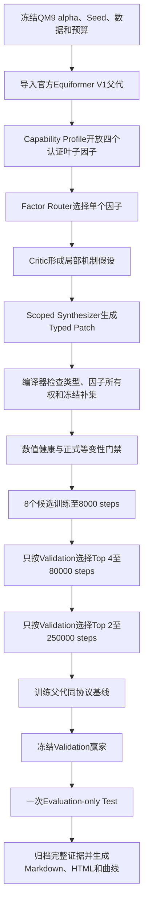

# 等变DSL正式V1入口

## 一、版本定位

本分支实现的是一版可直接执行正式实验的等变神经网络架构自进化系统。它以官方Equiformer V1为父代，在QM9极化率任务上，通过叶子因子路由、类型化DSL、冻结补集、编译门禁、等变性审计和多保真训练完成候选生成与选择。

正式分支为`codex/equivariant-dsl`。当前功能冻结基线为`3744bdd`；收尾报告增强Commit为`c65d06b`。正式训练期间A100服务器工作树保持功能冻结基线，后续Commit只导入暂存引用，实验结束后再统一Fast-forward，避免运行源码身份变化。

## 二、从哪里开始阅读

建议按以下顺序阅读：

1. [正式V1可运行实验实现计划](./设计文档/正式V1可运行实验实现计划.md)：研究问题、边界、完整工作流和验收标准。
2. [正式V1实现状态与运行证据](./设计文档/正式V1实现状态与运行证据.md)：已实现组件、A100证据、当前Run状态和尚未完成结论。
3. [等变NAS因子划分与单因子到多因子路由设计](./设计文档/等变NAS因子划分与单因子到多因子路由设计.md)：因子本体、因子选择和冻结范围。
4. [当前等变DSL代码审计问题清单](./设计文档/当前等变DSL代码审计问题清单.md)：正式V1修复所依据的原始审计问题。

GitHub可见分支：[tju-yxq/openevolve的codex/equivariant-dsl分支](https://github.com/tju-yxq/openevolve/tree/codex/equivariant-dsl)。

## 三、正式V1工作流



LLM不能直接修改任意Python代码。它只能在Router选中的单个叶子因子范围内生成Typed Patch；编译器证明其他因子保持冻结，并拒绝未认证后端、越界修改、身份不一致和等变性不合格候选。

## 四、正式开放的四个因子

|因子|中文含义|正式编辑范围|后端|
|---|---|---|---|
|`F2.2`|径向编码|径向基数量和径向网络容量|官方Equiformer V1构造器|
|`F4.4`|多头组织|注意力头数量及合法通道组织|官方Equiformer V1构造器|
|`F5.3`|归一化与尺度稳定|认证的归一化和degree rescaling组合|官方Equiformer V1构造器|
|`F6.3`|多层融合与输出构造|认证的多层readout Motif|`exact_hybrid`后端|

正式V1只支持单因子隔离修改。双因子交互、新算子发现、完整21因子和语言在线进化属于后续版本，不在本次实验结论范围内。

## 五、冻结实验协议

|项目|正式设置|
|---|---|
|任务|QM9极化率`alpha`|
|Seed|201|
|batch size|32|
|第一阶段|8个候选，固定训练集1/4，8000 optimizer steps|
|第二阶段|Top 4，固定训练集1/4，80000 optimizer steps|
|第三阶段|Top 2，完整训练集，250000 optimizer steps|
|验证间隔|每10个data epochs，阶段终点强制Validation|
|数据切换|model-only恢复，重建Optimizer和学习率计划|
|父代|执行相同8k→80k→250k协议|
|Test|Validation赢家冻结后仅一次Evaluation-only访问|

搜索、Repair、晋级和父代训练期间必须保持`test_evaluated=false`。

## 六、代码入口

|功能|入口文件|
|---|---|
|正式Launcher|`scripts/launch_dsl_formal_v1.sh`|
|自动恢复Supervisor|`scripts/supervise_dsl_formal_v1.sh`|
|DSL候选生成|`scripts/run_dsl_evolution.py`|
|8→4→2控制器|`scripts/run_dsl_multifidelity_cycles.py`|
|候选编译和训练管线|`scripts/run_pipeline.py`|
|固定step训练器|`equivariant_nas/training/fixed_step_trainer.py`|
|因子定义|`equivariant_nas/dsl/factors.py`|
|Capability Profile|`equivariant_nas/dsl/capabilities.py`|
|三阶段LLM协议|`equivariant_nas/dsl/llm_protocol.py`|
|身份与Runtime Manifest|`equivariant_nas/dsl/identity.py`、`equivariant_nas/dsl/runtime_manifest.py`|
|最终冻结、Test和报告|`scripts/finalize_dsl_formal_v1.py`|

## 七、A100运行位置

```text
仓库：/home/20262202788/equivariant-nas
主Run：/home/20262202788/equivariant-nas/runs/dsl_formal_v1_seed201
搜索目录：/home/20262202788/equivariant-nas/runs/dsl_formal_v1_seed201/search
多保真目录：/home/20262202788/equivariant-nas/runs/dsl_formal_v1_seed201/multifidelity
```

只执行Preflight：

```bash
cd /home/20262202788/equivariant-nas
bash scripts/launch_dsl_formal_v1.sh \
  /home/20262202788/equivariant-nas/runs/dsl_formal_v1_seed201 \
  --preflight-only
```

启动或恢复同一正式Run：

```bash
cd /home/20262202788/equivariant-nas
bash scripts/supervise_dsl_formal_v1.sh \
  /home/20262202788/equivariant-nas/runs/dsl_formal_v1_seed201
```

不得为异常恢复新建替代Run。必须核对Program ID、Executable ID、Protocol ID和Checkpoint后，在同一候选目录恢复。

## 八、当前状态与结论边界

截至2026年7月26日，8个8000-step候选已经完成，控制器正在执行Top 4的80000-step训练。第一个候选`507b05538a084e39`属于`F4.4`方向，当前已在42950步得到Validation MAE`0.2712767345`。这是中间Validation结果，不是80k终点结果，也不是最终Test结果。

正式V1只有在以下条件全部满足后才算完成：

1. 4个80k候选和2个250k候选全部完成；
2. 父代完成同协议250k训练；
3. Validation规则冻结唯一赢家；
4. 只执行一次Evaluation-only Test；
5. Markdown、HTML、完整MAE轨迹、因子比较图和候选证据包通过核验；
6. 本地、GitHub和A100服务器仓库同步到同一最终Commit。

