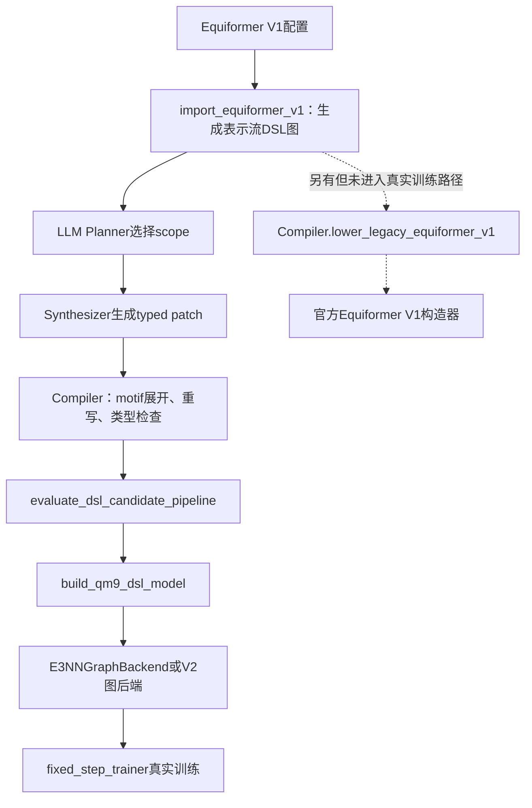
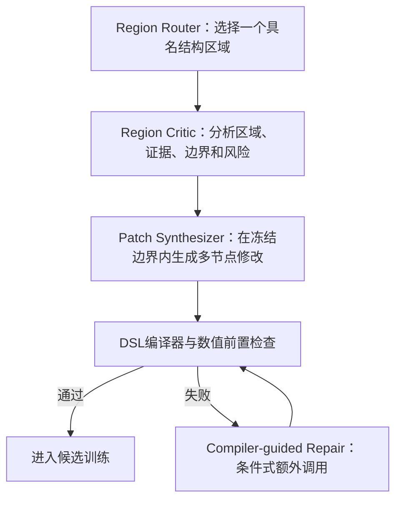
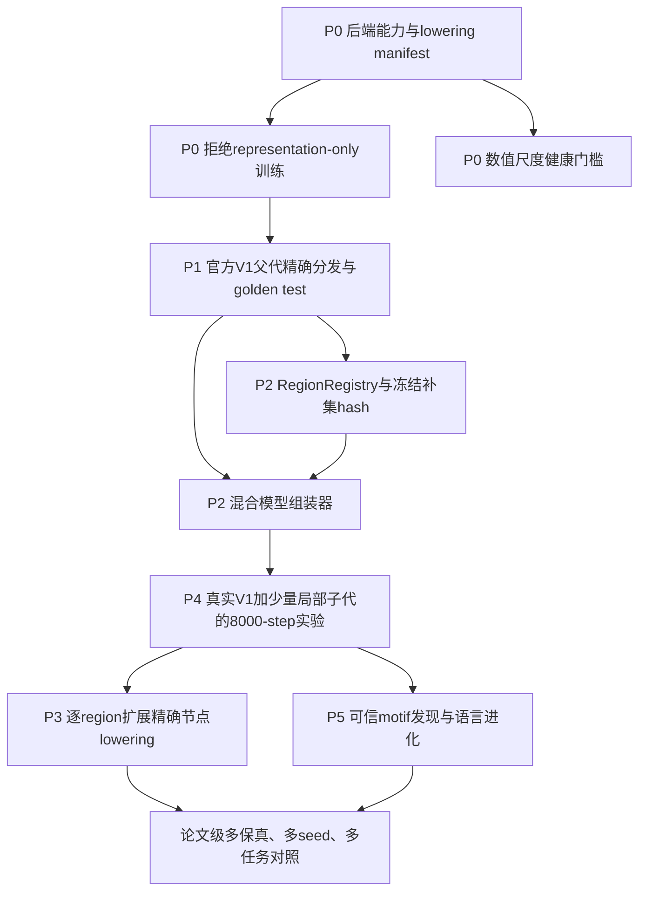

# 当前等变DSL端到端实验关键缺口与实现优先级

> 项目：EvoEquiLang等变网络架构DSL与LLM驱动搜索
>
> 审计日期：2026年7月25日
>
> 审计范围：当前`codex/equivariant-dsl`分支、服务器小规模DSL实验、既有设计文档、SPARK实现及前序讨论中确定的研究目标

## 一、执行结论

当前项目最急需完成的，不是继续增加候选数量、训练步数或语言进化规则，而是修复**DSL程序所表达的架构与实际训练模型之间的数值语义断裂**。

目前系统已经具备较完整的结构层基础：任务契约、等变类型、架构AST、motif展开、typed patch、Planner/Synthesizer/Repairer、编译诊断、OpenEvolve种群、SQLite证据库、test隔离和语言版本机制均已有实现。但是，真实训练入口会把导入的Equiformer V1表示流图统一交给简化的e3nn图后端执行，而没有把未修改父代分发到官方Equiformer V1构造器。因此，第一代父代虽然在DSL中名为Equiformer V1，实际训练的却不是论文中的Equiformer V1数值模型。

这不是一般的“效果不好”，而是会使科学结论失效的P0级问题。服务器小规模实验中：

- 父代验证MAE为`845458.97205`；
- 第一个子代验证MAE为`5558.13400234375`；
- 二者都被当前pipeline标记为`valid=true`；
- 二者的后端均为`e3nn-graph-v1`；
- 二者均通过了有限梯度检查和等变性检查；
- 但QM9 alpha训练集均值约为`75.2737`，标准差约为`8.2513`，上述MAE显然属于数值爆炸；
- 因而不能把子代相对父代的下降解释为“进化出了更优架构”。

当前最合理的实施路线是：

1. 先建立显式lowering计划和可信后端身份，禁止表示流近似图被静默当作Equiformer候选训练；
2. 让未修改的第一代父代精确实例化官方Equiformer V1，并通过数值等价和短训练曲线验收；
3. 将SPARK式“先选区域、再局部修改”落实为编译器强制的区域边界，而不只是prompt中的scope数组；
4. 采用混合后端：未修改区域复用官方V1模块，只替换一个有明确边界契约的区域；
5. 在真实V1父代和2至3个局部子代上重新运行小规模validation-only实验；
6. 只有候选训练语义可信后，才启动motif发现、语言准入和更大规模多保真搜索。

简言之，当前课题已经有“语言和控制系统”，但尚缺一座可信的“语言到真实Equiformer模型”的桥。现在应优先建桥，而不是继续扩张语言或种群。

## 二、研究目标与当前审计标准

本课题的目标不是让LLM调Equiformer超参数，也不是让LLM自由改写整个Python模型，而是：

> 从真实Equiformer V1出发，在等变性、任务接口和计算预算约束下，由LLM使用可编译DSL提出局部但非平凡的结构修改，经过真实训练证据筛选，逐步形成更优架构，并将重复出现、可重放的有效结构沉淀为下一版本语言中的motif。

因此，一个端到端实验至少必须同时满足四类真实性：

| 真实性 | 必须回答的问题 | 当前状态 |
|---|---|---|
| 父代真实性 | 第一代父代是否就是官方Equiformer V1 | **不满足**：DSL训练路径未调用构造器锁定lowering |
| 修改真实性 | 子代是否只修改被授权的结构区域 | **部分满足**：有typed scope，但没有区域级冻结证明 |
| 训练真实性 | 相同数据、seed、step和优化协议下，MAE是否可比较 | **协议大体具备，数值后端不满足** |
| 进化真实性 | 新motif是否来自有效候选证据并跨谱系重放 | **机制已实现，尚无可信候选可供准入** |

只要父代真实性不成立，后面三项即使形式上运行成功，也不能支持“从V1进化出更优等变架构”的论文主张。

## 三、当前真实调用链及错误位置

### 3.1 当前调用链

`import_equiformer_v1()`已经在注释和annotation中明确说明，导入图只是表示类型和连接关系的视图，数值lowering仍应由构造器锁定。但`evaluate_dsl_candidate_pipeline()`无条件调用`build_qm9_dsl_model()`，后者构建展开后的图后端，没有检查导入图是否未修改，也没有调用`Compiler.lower_legacy_equiformer_v1()`。

因此，代码中虽然存在构造器锁定接口，真实训练路径却绕过了它。现有设计文档中“未修改参考图可调用官方构造器”的描述反映的是设计能力，而不是当前端到端训练已经实际执行的事实。

### 3.2 为什么简化后端会产生巨大MAE

简化e3nn图后端保留了表示类型、张量积、聚合和残差等结构，所以能够通过旋转、平移和节点置换测试。但它没有忠实实现Equiformer V1中的完整数值机制，例如：

- 径向基和cutoff权重的真实使用方式；
- 注意力权重生成与归一化；
- degree rescaling和消息尺度控制；
- Equiformer专用归一化、门控与残差比例；
- 官方block内部参数共享和初始化语义；
- readout及任务标准化路径的精确组合。

当多层张量积、原始`segment_sum`和残差相加反复堆叠时，即使每个运算都保持等变，激活幅值仍可能逐层膨胀。等变性只约束“输入变换后输出如何变换”，不约束数值大小，更不保证模型具有合理训练动力学。

这解释了为什么当前模型可以同时满足：

- 等变误差小；
- 梯度全部有限；
- 编译证明义务全部消解；
- 但MAE达到数千至数十万。

### 3.3 当前实验为何必须标记为无效

本次运行可以证明以下工程事实：

- LLM能够生成符合DSL格式的patch；
- 编译器能够拒绝一部分非法patch；
- 合法子代能够进入训练入口；
- checkpoint、metrics、summary和test隐藏机制可运行；
- 语言cycle snapshot可以生成。

但它不能证明：

- 父代是Equiformer V1；
- 子代优于Equiformer V1；
- 当前DSL提高了QM9 alpha性能；
- 当前局部结构改动是有效的架构发现；
- 当前候选可以作为motif准入的性能证据。

因此，该run应保留作失败诊断和工程回归证据，但不得进入架构排行榜、论文主结果或语言准入数据库中的正向性能证据。

## 四、已实现、实现不足和完全缺失的部分

| 组件 | 已实现内容 | 当前不足 | 紧急程度 |
|---|---|---|---|
| DSL任务契约 | 群、输入、输出、任务和hash绑定 | 尚未与具体训练后端身份共同形成完整protocol identity | P1 |
| 等变类型系统 | irrep、frame、carrier、measure及证明义务 | 类型正确不等于数值语义等价，需要后端语义证书 | 已有基础 |
| V1导入器 | 能生成带稳定节点ID的表示流图 | 不是官方V1逐节点数值展开 | P0 |
| V1构造器lowering | `lower_legacy_equiformer_v1()`存在且能拒绝变化图 | 真实DSL训练pipeline未调用 | P0 |
| e3nn图后端 | 支持一批原语并通过等变测试 | 被误用于完整V1父代；缺少注意力、归一化和尺度语义 | P0 |
| V2后端 | 支持部分封闭SO(2)/S²路径 | 尚不能表达完整V2 block | P3 |
| typed patch | 检查父代ID、语言版本、scope、pre/postcondition和liveness | scope是任意节点集合，不是结构区域；无冻结补集hash | P2 |
| Planner/Synthesizer/Repairer | where-then-how流程已形成，Repairer不能扩大scope | Planner可同时选择相距很远的多个节点和输出 | P2 |
| OpenEvolve集成 | 种群、谱系、island和候选评估已接通 | 当前有效性分数来自不可信数值后端 | P0阻塞 |
| 固定step训练 | subset、batch、seed、验证、checkpoint和resume已实现 | 缺少数值尺度、激活增长和梯度上界门槛 | P0 |
| test隔离 | 搜索时不传`--evaluate-test`，结果检查`test_evaluated=false` | 应继续保持，不是当前主要缺口 | 已实现 |
| 证据数据库 | 候选、patch、prompt、编译、重写、评估和语言证据可持久化 | 需增加backend/lowering identity和无效实验状态 | P1 |
| motif发现 | typed subgraph、support/heldout、fold-expand replay已实现 | 尚未在可信真实候选上验证 | P5 |
| motif准入 | 独立谱系、描述长度、回归、重放、test隐藏等合取门槛 | matched generation和跨任务证据尚未真实产生 | P5 |
| 二维通用性 | 设计规范支持SO(2)/O(2)抽象 | 没有二维数值后端和任务实验 | 论文扩展 |

## 五、最急需完成的实施部分

### 5.1 P0：立即阻止无效科学实验继续产生

### 目标

任何只表示“类型和连接关系”但没有可信数值lowering的DSL程序，都不得被标记为可训练Equiformer候选。

### 必须实现

1. 为编译产物增加显式`LoweringPlan`，至少记录：
   - `backend_family`；
   - `backend_semantics_version`；
   - `lowering_mode`；
   - `supported_regions`；
   - `unsupported_nodes`；
   - `reference_model_identity`；
   - 依赖仓库commit和关键库版本。
2. 区分三种状态：
   - `exact_reference`：未修改父代，可精确构造官方模型；
   - `exact_hybrid`：官方模型加已认证的局部替换区域；
   - `representation_only`：只能做类型分析和结构可视化，不允许训练排名。
3. `evaluate_dsl_candidate_pipeline()`必须在模型构建前验证lowering状态。`representation_only`候选直接返回结构化失败，不能进入GPU训练。
4. architecture ID和evaluation protocol ID必须绑定后端与lowering语义。相同AST由不同后端执行时，不能复用同一缓存或被视为同一实验。
5. 现有失败run标注为`invalid_backend_semantics`，从后续候选选择和motif准入中排除。

### 数值健康门槛

当前门槛只拒绝NaN、Inf和过大等变误差，仍会放过“有限但爆炸”的模型。应增加：

- 初始标准化预测的均值、标准差和RMS；
- 反标准化预测相对训练集均值基线的MAE；
- 每个主要region的激活RMS和最大绝对值；
- 相邻block激活放大倍数；
- loss和global gradient norm的预注册上界；
- 一至数个optimizer step后的参数、激活和loss变化；
- 与常数均值预测器相比的合理性检查。

阈值应由官方V1在相同batch和dtype下的分布校准，而不是在看到失败候选后任意设置。

### 验收标准

- 表示流近似父代在训练前被明确拒绝；
- 当前`e3nn-graph-v1`父代不会再得到`valid=true`；
- 后端身份出现在`result.json`、证据库、缓存路径和compiler manifest中；
- 人为构造的有限爆炸模型被数值健康门槛拒绝；
- 官方V1通过同一门槛。

### 5.2 P1：建立真实Equiformer V1父代

### 目标

第一代父代必须是用户所要求的真实Equiformer V1，而不是具有相似节点名称的简化图。

### 必须实现

1. 在DSL pipeline中识别未修改的V1导入图，并调用`Compiler.lower_legacy_equiformer_v1()`。
2. 由lowering返回官方`builder.build_equiformer()`或官方model registry创建的真实模型实例。
3. 固定以下内容：
   - Equiformer源码commit；
   - 模型构造参数；
   - 参数初始化；
   - optimizer、weight decay、学习率、warmup和cosine相位；
   - 标准化方式；
   - batch size、训练subset、seed和optimizer steps。
4. 建立golden test，比较DSL父代路径和直接官方路径：
   - 模型类或构造器身份；
   - 参数名、shape和总参数量；
   - 同一state dict下的forward输出；
   - 输入梯度与参数梯度；
   - 一步optimizer更新；
   - 短训练曲线。
5. 明确“结构等价”和“数值等价”的不同：canonical AST相同只能证明结构身份，golden test才证明执行身份。

### 验收标准

- generation 0的参数量与官方V1完全一致；
- 相同权重和输入下，forward与梯度在预注册容差内一致；
- 同一seed下前若干step的loss、MAE和学习率轨迹一致；
- 8000-step父代MAE回到合理量级；
- 父代result中显示`lowering_mode=exact_reference`，而不是`e3nn-graph-v1`表示流执行。

### 5.3 P2：把SPARK式局部修改落实为可证明的结构区域编辑

### 当前问题

现在`run_dsl_evolution.py`把父代全部节点ID和全部`output:<name>`都传给Planner。Planner可以一次选择多个任意且相距很远的节点。首个子代同时选择了：

- `block3`；
- `block5`；
- `scalar_readout`；
- `graph_pool`；
- `output:prediction`。

形式上这些目标都在scope内，但它已经不是一个清晰的局部区域。这会扩大搜索自由度、降低可归因性，也不利于复用官方V1未修改模块。

### 必须实现

1. 建立`RegionRegistry`，用具名结构区域替代任意节点集合，例如：
   - `embedding_region`；
   - `block_0`至`block_5`；
   - `readout_region`；
   - 后续可细分为`radial_region`、`attention_region`、`message_region`、`norm_gate_region`。
2. 每个region必须声明：
   - 内部节点集合；
   - 输入和输出端口；
   - irrep、carrier、frame和measure边界类型；
   - 可用原语和motif；
   - 参数/FLOPs/显存预算；
   - 是否已有可信lowering；
   - 允许的边界adapter类型。
3. 一次mutation默认只选择一个region，但允许在该region内部进行多个协同节点编辑。这样既避免“每次只改一个属性过于保守”，也避免全网任意改写。
4. 允许一个有限的boundary adapter halo，用于修复region输出与冻结下游输入之间的类型适配，但halo必须有独立预算，不能借此跨区域重写。
5. 对region外的规范结构计算`frozen_complement_hash`，子代编译后重新计算并要求完全一致。
6. 记录`region_id`、边界hash、补集hash和实际修改节点diff，进入patch证据和候选身份。
7. 将架构冻结与权重冻结明确区分：搜索时冻结的是region外的**结构定义**；从头公平训练时，region外权重通常仍参与训练。

### 与SPARK的关系

应借鉴SPARK的“ASR决定改哪里，RC分析该区域，SAR执行局部修改”工作流，但不能只依赖prompt中的“其他代码被冻结”语句。对当前DSL而言，最强优势应是：局部性由typed patch、region边界和补集hash在编译器中强制，而不是相信LLM自觉遵守。

### 候选生成应升级为固定三阶段LLM调用

当前实现不是每个候选固定调用三次LLM，而是：

1. `Planner`调用一次，同时决定修改假设和scope；
2. `Synthesizer`调用一次，生成typed patch；
3. 只有patch解析、类型检查、作用域检查或编译失败时，才调用`Repairer`。

因此，当前单个候选最少使用两次LLM调用。默认`repair_attempts=2`时，Planner协议和patch生成各自最多修复两次，理论最大为六次LLM调用。刚才第一个成功子代的`planner_repair_count=0`、`repair_count=1`，实际经历了Planner、Synthesizer和Repairer共三次调用，但第三次是失败后的被动修复，不是独立的区域审查。

后续应将正常候选生成固定为三个语义不同的阶段，并把编译修复保留为条件式第四阶段：

三个固定角色的职责应严格分离：

| 阶段 | 主要问题 | 输入 | 输出 | 不允许做的事情 |
|---|---|---|---|---|
| Region Router | 改哪里 | region registry、父代摘要、预算和历史证据索引 | 唯一`region_id`、选择理由和预期价值 | 不生成具体节点patch，不选择多个远距离区域 |
| Region Critic | 为什么这样改、怎样改才合理 | 被选region的局部AST、边界类型、该区域历史候选和失败记录 | 局部机制分析、修改假设、风险、反例、必须保持的不变量和建议编辑计划 | 不扩大region，不直接输出最终patch |
| Patch Synthesizer | 如何把假设实现成合法结构 | Critic报告、region局部AST、可用原语/motif及patch schema | 一个region内允许包含多节点协同修改的typed patch | 不修改region外结构，不改变Critic冻结的科学假设 |
| Compiler-guided Repair | 如何修复已发现的形式错误 | 被拒patch、结构化诊断、可信completion建议 | 同一region、同一假设下的修复patch | 不扩大scope，不把性能失败伪装成编译错误修复 |

`Region Critic`不能只是把Planner的话换一种说法。它至少应输出：

- 当前region在父代中的计算职责；
- 输入和输出的irrep、carrier、frame、shape及尺度契约；
- 与上下游冻结模块的接口；
- 该区域历史候选的validation结果和失败类型；
- 本次修改的因果假设；
- 预期影响的表示路径、参数量和计算量；
- 可能破坏等变性、数值稳定性或训练公平性的风险；
- 可证伪的验收指标；
- 明确禁止修改的结构和语义。

这一步的价值不是简单增加一次LLM调用，而是把“选择位置”和“设计局部机制”分离。Router负责搜索策略，Critic负责结构推理，Synthesizer负责代码化，Compiler负责可信验证。这样可以提高候选假设质量，也使后续消融能够分别研究区域路由、Critic和DSL约束各自带来的收益。

为了控制成本，Critic只应看到选中region及有限边界halo，而不是完整源码；历史证据应先由数据库检索和压缩，再提供最相关的成功、失败和反事实候选。固定三阶段会增加单个候选的LLM成本，但相对于8000至250000 step的GPU训练成本很小。如果它能够减少无效候选，整体搜索成本反而可能下降。

### 验收标准

- Planner只能从已注册region中选择一个；
- 每个正常候选都保存Router、Critic和Synthesizer三份独立prompt/response证据；
- Critic输出必须绑定唯一region、边界契约、历史证据ID和可证伪假设；
- Synthesizer的patch必须与Critic的假设和region完全一致；
- Repairer仅由结构化编译诊断触发，并保持region和假设不变；
- region内部可以产生多节点结构变化；
- region外任何节点、边或属性变化都会被编译器拒绝；
- boundary adapter不能越过预注册halo；
- 每个子代result都能回答“改了哪个region、改了哪些节点、哪些结构被证明未改”。

### 5.4 P2：实现可训练的混合模型组装器

### 为什么这是近期最可行路线

完整重写Equiformer V1全部节点级数值语义工作量很大，而继续使用简化图后端又没有科学有效性。短期应采用混合后端：

这里“冻结结构”表示模块拓扑不被LLM修改，不表示权重一定停止训练。

### 首个region选择建议

优先级建议如下：

1. **readout region**：边界是图级标量，工程风险最低，适合先验证混合组装、hash和训练公平性；但结构新颖性有限。
2. **一个完整message/attention block**：更接近真正架构发现，能够改变block内部多个节点；但必须完整处理径向、attention、norm、gate和residual语义。
3. **跨层路由region**：例如合法的中间层读取和融合；需要严格控制边界，避免一次修改多个远距离region。

建议分两步：先以readout region打通可信端到端闭环，再以一个完整block作为第一篇论文真正的搜索区域。不能把readout实验本身当作“发现V2类新算子”的充分证据。

### 验收标准

- 未修改region的混合模型与官方V1完全等价；
- identity replacement能恢复官方V1输出；
- 修改region后，官方前缀和后缀的结构hash不变；
- checkpoint能保存、恢复并重建同一混合模型；
- region替换模型通过类型、等变、数值健康和短训练测试。

### 5.5 P3：逐区域补齐真实节点级lowering

混合后端解决“先得到有效实验”的问题，但如果研究目标是从V1逐步发现V2式新结构，最终仍需扩大可编辑区域的真实数值覆盖。

建议按下列顺序实现：

1. radial basis与cutoff envelope；
2. edge embedding与球谐特征；
3. attention logits、权重归一化和value路径；
4. tensor product的真实参数化和路径归一化；
5. degree rescaling、segment aggregation和残差缩放；
6. Equiformer V1的norm、gate和drop path；
7. scalar readout和graph pooling；
8. V2的SO(2)卷积、局部frame、S²激活及完整block组装。

每完成一个region，都要增加三类测试：

- 与官方模块的输出和梯度等价测试；
- 随机旋转、平移和置换属性测试；
- 在真实QM9 batch上的数值尺度和短训练曲线测试。

只有通过上述测试的原语或motif，才能被标记为`trainable_exact`并暴露给LLM。仅通过类型测试的原语应标记为`analyzable_only`。

### 5.6 P4：重跑第一个可信小规模端到端实验

### 实验目的

第一次有效实验不应试图证明完整论文，而应回答一个更严格、可证伪的问题：

> 在真实Equiformer V1父代上，DSL能否在一个预注册region内生成至少一个结构不同、仍保持等变、数值健康且训练性能可比较的子代？

### 建议协议

- 数据集：QM9；
- 目标：alpha；
- 训练集：固定seed=201的1/4训练子集；
- batch size：32；
- 终止条件：8000 optimizer steps；
- 验证间隔：每10个当前数据集data epoch，终点强制验证；
- 候选：真实V1父代加2至3个LLM子代；
- 初始化：各候选同一seed从头训练；
- 选择：endpoint validation MAE；
- test：禁止访问；
- 对称性：训练前后都检查；
- 局部性：region外补集hash必须一致；
- 数值健康：训练前和训练中检查激活与梯度尺度。

### 为什么先用少量候选

在lowering和混合组装刚完成时，大量候选只会放大基础设施错误。2至3个子代足以验证：

- 父代是否可信；
- LLM是否能在region内提出非平凡改动；
- 子代能否编译、训练和恢复；
- 评估结果是否处于合理尺度；
- 局部性证据是否完整。

### 验收标准

- 父代和子代均处于合理MAE量级；
- 所有候选`test_evaluated=false`；
- 候选之间训练协议hash一致；
- 至少一个子代结构ID不同且region外hash相同；
- 所有结果可由checkpoint恢复；
- 如果子代优于父代，只表述为单seed小规模validation信号，至少重复一个seed后才能称为稳定改进。

### 5.7 P5：在可信候选之后启用语言进化

当前语言进化代码并非空壳。已有实现包括：

- SQLite证据存储；
- support与held-out replay划分；
- typed connected subgraph枚举；
- 保守anti-unification；
- fold-expand语义ID重放；
- 独立谱系、描述长度、生成合法率、回归、新颖性和test隐藏门槛；
- 每个boundary最多发布一个motif版本；
- cycle preregistration和registry hash检查。

这些机制当前不应优先扩展，原因是它们只能保证“重复结构可以被语言压缩并重放”，不能修复源候选的错误数值语义。无效后端产生的候选即使反复出现，也不应成为新语言规则。

在P0至P4完成后，语言进化还需补齐：

1. 只接纳`exact_reference`或`exact_hybrid`候选；
2. performance evidence绑定训练protocol和backend identity；
3. matched generation实验真实测量新motif是否提高合法候选率或样本效率；
4. 跨独立谱系复现，而不是同一父代的重复拷贝；
5. held-out程序和至少一个held-out任务重放；
6. 语言版本升级后的回滚和兼容性测试。

## 六、训练协议审计

### 6.1 当前已经正确实现的部分

`quarter_multifidelity_protocol.json`当前定义：

| 阶段 | 候选数 | 终止step | 训练数据 | 验证 |
|---|---:|---:|---|---|
| quarter_8k | 8 | 8000 | 固定1/4训练集 | 每10个data epoch，终点强制验证 |
| quarter_80k | 4 | 80000 | 同一固定1/4训练集 | 同上 |
| full_250k | 2 | 250000 | 完整训练集 | 同上 |

并且：

- batch size固定为32；
- 1/4子集文件固定为`qm9_train_quarter_seed201.npz`；
- 子集大小为27500；
- 数据顺序按`seed+data_cycle`确定性打乱；
- 训练终止由global optimizer step决定；
- checkpoint每859 step保存；
- validation间隔按当前训练集的data epoch计算；
- 搜索pipeline禁止test；
- 最终架构和checkpoint冻结后才允许单次test报告。

`openevolve_adapter/evaluator.py`的seed传播缺口已经在未提交修改中修复：`NAS_SEED`会进入`--seed`。该修改和对应回归测试应保留并提交。

### 6.2 仍需明确或修正的部分

1. **endpoint与best的用途**：当前候选`combined_score`使用终点validation MAE，这是合理的固定预算比较；`best_validation_alpha_mae`只作诊断，不应偷偷替代终点分数。
2. **250000阶段的数据切换**：从1/4训练集切换到完整训练集时，需预注册是继续optimizer/LR状态，还是仅继承模型并重新warmup。当前代码同时提供`allow_data_transition`、`resume_model_only`和`lr_schedule_origin_step`，但论文协议必须唯一确定一种方式。
3. **全量阶段test策略**：用户此前提出“最后一轮用测试集验证”，更严谨的做法仍是用validation完成架构和checkpoint选择，冻结后只对最终唯一模型评一次test。不能用test筛选两个候选。
4. **协议身份**：需把subset hash、seed、batch、step、验证规则、LR origin、后端身份和源码commit一起写入protocol hash。
5. **异常恢复**：resume后必须验证数据集ID、global step、scheduler相位、模型后端身份和architecture ID完全一致。

## 七、两条后端实现路线的取舍

| 路线 | 方法 | 优点 | 局限 | 建议 |
|---|---|---|---|---|
| 短期混合后端 | 官方V1保留大部分模块，只替换一个typed region | 最快获得科学有效的小实验；易做数值对照 | 初期搜索区域和新颖性有限 | **立即实施** |
| 长期完整节点lowering | 把V1/V2全部机制实现为可组合DSL原语 | 可以搜索V2式甚至未知新算子 | 工程量大，容易出现细微数值偏差 | 按region增量实施 |

两条路线不是二选一。混合后端应成为完整lowering的过渡架构：每完成一个精确region，就把它从官方黑盒模块逐步替换为DSL可编辑实现。

## 八、依赖关系与推荐实施顺序

推荐按以下迭代交付：

### 迭代A：可信父代

- 后端manifest；
- exact V1 dispatch；
- representation-only拒绝；
- golden forward/gradient/step test；
- 数值健康门槛。

### 迭代B：可信局部子代

- RegionRegistry；
- Region Router、Region Critic和Patch Synthesizer固定三阶段生成；
- 条件式Compiler-guided Repair；
- frozen complement hash；
- readout region混合组装；
- 真实V1加2至3个子代的短实验。

### 迭代C：真正block级架构发现

- 一个完整message/attention block的精确lowering；
- block内部多节点patch；
- 多seed的8000-step和80000-step比较；
- 失败诊断和checkpoint恢复。

### 迭代D：语言自进化

- 从可信谱系发现motif；
- matched generation实验；
- held-out replay；
- 新语言版本与回滚；
- 证明新语言提高合法率、候选质量或搜索样本效率。

## 九、逐文件实施地图

| 文件或新组件 | 需要修改的内容 |
|---|---|
| `equivariant_nas/dsl/compiler.py` | 生成`LoweringPlan`；暴露exact reference、exact hybrid和representation-only状态 |
| `equivariant_nas/dsl/reference_programs.py` | 保存官方V1构造身份、spec hash和region映射 |
| `equivariant_nas/dsl/pipeline.py` | 按lowering plan分发；加入数值健康门槛；绑定backend identity；拒绝无可信lowering |
| `equivariant_nas/dsl/backends/qm9_model.py` | 不再无条件构建简化图；增加exact/hybrid model factory |
| `equivariant_nas/dsl/backends/e3nn_backend.py` | 明确能力矩阵；未认证完整语义的原语只允许分析或局部实验 |
| `equivariant_nas/builder.py` | 提供可复用的官方V1模块边界和构造元数据 |
| 新建`equivariant_nas/dsl/regions.py` | RegionRegistry、边界契约、halo和补集hash |
| 新建`equivariant_nas/dsl/backends/hybrid_v1.py` | 官方V1前缀/DSL region/官方V1后缀组装 |
| `equivariant_nas/dsl/llm_protocol.py` | 增加Region Router、Region Critic和Patch Synthesizer三类独立协议；Router从region列表选择，不直接看全部节点能力 |
| `equivariant_nas/dsl/patch.py` | 验证region授权、halo预算和冻结补集 |
| `equivariant_nas/dsl/search.py` | 将候选生成重构为固定Router→Critic→Synthesizer流程及条件式Repair；记录region选择、Critic报告、结构diff和失败原因 |
| `scripts/run_dsl_evolution.py` | 不再把所有节点作为scope candidates；写入region和lowering preregistration |
| `equivariant_nas/training/fixed_step_trainer.py` | 保存backend/lowering identity；加入激活/预测/梯度尺度日志和resume一致性检查 |
| `equivariant_nas/dsl/evidence_store.py` | 增加backend manifest、protocol hash、实验有效性和排除原因 |
| `scripts/run_dsl_language_evolution.py` | 只消费可信lowering且科学有效的候选 |
| `tests/` | 增加V1 golden、representation-only拒绝、region冻结、hybrid identity和爆炸模型拒绝测试 |

## 十、当前不应优先投入的工作

以下工作有价值，但不是当前阻塞有效端到端实验的部分：

1. 增加更多LLM模型或扩大prompt长度；
2. 将候选数立即恢复到8、4、2的完整多保真规模；
3. 直接运行80000或250000 step；
4. 扩大motif自动准入规则；
5. 实现完整e-graph和通用等价饱和；
6. 立即增加二维SO(2)/O(2)任务；
7. 先做大量OpenEvolve、SPARK对照实验；
8. 根据当前无效MAE调学习率、clip gradient或其他超参数。

最后一点尤其重要：当前问题不是简单的训练超参数不合适。用梯度裁剪把数值压住，可能让loss看起来下降，但不能把简化表示流后端变成真实Equiformer V1。

## 十一、论文主张的边界

### 当前可以如实主张

- 已实现一种带等变类型、typed patch和编译证据的架构DSL核心；
- 真实LLM能够在该协议下生成可解析、可类型检查的结构候选；
- 已实现scope不可变、test隐藏、证据持久化和第一版语言进化机制；
- 失败实验暴露了结构语义与数值lowering必须共同认证这一关键设计要求。

### 当前不能主张

- 已经从Equiformer V1进化出更优架构；
- 当前子代优于官方V1；
- DSL比SPARK或OpenEvolve更快收敛；
- DSL能够自动发现V2式新算子；
- 语言自进化已经提高候选质量；
- 方法对二维和三维等变网络具有普适性。

### 达到论文级主张还需的证据

1. 真实V1父代和可信局部子代；
2. 多seed、多保真训练；
3. 相同prompt信息、LLM、种群和训练预算下的OpenEvolve/SPARK/静态DSL/自进化DSL对照；
4. 候选合法率、达到目标MAE所需GPU小时、最好validation MAE和结构新颖性；
5. QM9 alpha之外至少一个分子任务；
6. 若声称通用等变DSL，还需至少一个不同群或二维任务；
7. motif语言升级前后的matched generation和held-out transfer实验。

## 十二、最终优先级清单

### 现在立即做

1. 修复DSL训练分发，让未修改父代走官方V1构造器；
2. 增加lowering/backend manifest并绑定候选身份；
3. 拒绝representation-only候选进入训练；
4. 增加数值尺度健康门槛；
5. 完成V1 golden equivalence和短训练回归测试；
6. 提交当前seed传播修复。

### 紧接着做

1. 实现RegionRegistry；
2. 将每个正常候选重构为Region Router、Region Critic和Patch Synthesizer三次固定LLM调用；
3. 保留由编译诊断触发的条件式Repairer；
4. 实现region外冻结补集hash；
5. 实现第一个V1混合region；
6. 用真实V1父代和少量局部子代重跑8000-step实验。

### 得到可信小实验后做

1. 扩展到完整block级真实lowering；
2. 运行多seed和80000-step筛选；
3. 启动真实motif发现和语言升级；
4. 再扩大到8、4、2多保真流程；
5. 开始正式baseline和跨任务实验。

## 十三、对当前项目状态的准确表述

当前系统不是“已经实现完成、只需要优化”，也不是“从头尚未实现”。更准确的表述是：

> 等变架构DSL的结构语言、LLM补丁协议、编译约束、搜索外壳和证据机制已经形成可运行原型；但从DSL架构到真实Equiformer数值模型的可信lowering尚未闭环，SPARK式局部修改也尚未落实为区域级冻结证明。因此，当前最优先工作是建立真实V1父代和可验证的局部混合后端。在此之前，任何大规模搜索或语言进化结果都不能作为架构性能证据。

这一定义同时保留了已完成工程的价值，也如实指出了当前端到端实验失效的根因和下一步最短路径。
