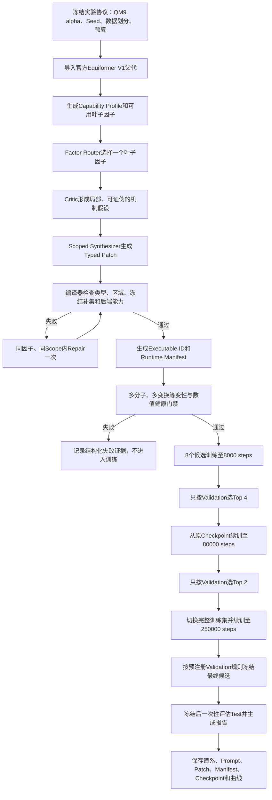
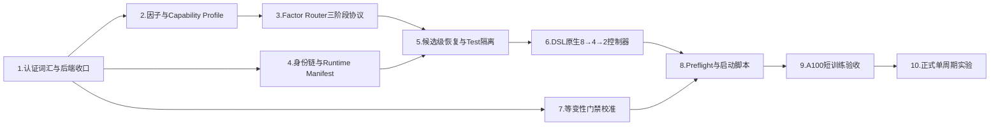

# 正式V1可运行实验实现计划

> 文档目的：把当前等变DSL原型收敛为一版能够直接运行正式实验、验证核心Idea和完整回溯结果的V1系统
>
> 参考审计：[当前等变DSL代码审计问题清单](./当前等变DSL代码审计问题清单.md)
>
> 因子基线：[等变NAS功能因子本体与单因子到多因子路由设计](./等变NAS因子划分与单因子到多因子路由设计.md)
>
> 当前分支：`codex/equivariant-dsl`
> 制定日期：2026年7月25日

## 一、执行结论

当前代码已经能够完成“官方Equiformer V1父代→LLM三阶段生成→readout区域DSL子代→真实训练→验证MAE”的展示实验，但还不能直接作为正式V1实验系统。阻止正式实验的核心问题不是界面、报告或代码整洁度，而是以下五项证据链尚未闭合：

1. 当前只开放`F6.3多层融合与输出构造`一个叶子因子，Factor Router没有真实选择空间。
2. 通用e3nn后端存在声明语义与实际数值实现不一致的问题，不能让未经认证的Primitive进入排名。
3. 候选架构、实际后端、源码版本、训练协议、Checkpoint和缓存没有形成不可混淆的统一身份。
4. DSL候选尚未接入真正的`8→4→2`多保真控制器，候选训练中断也不能稳定恢复到同一候选。
5. 当前等变性检查只属于Smoke Test，阈值和采样规模不足以充当正式搜索的硬门禁。

正式V1不应尝试一次实现全部21个叶子因子，也不应宣称已经能够自动发现Equiformer V2。最合理的V1目标是实现一个**小而真实的多因子搜索切片**：每个开放因子都有官方数值执行路径、至少一个父代恒等选项和一个真实替代选项；LLM只能修改被路由选中的叶子因子；其余区域由编译器冻结；候选通过等变性、协议和训练门禁后进入统一的多保真搜索。

## 二、正式V1要验证的核心Idea

### 2.1正式V1的研究问题

在相同任务、父代、训练预算、LLM模型和候选数量下，把等变网络架构表示为带有类型、因子所有权、边界合同和编译约束的DSL，是否能够让LLM：

1. 更稳定地产生可编译、可执行且保持等变约束的候选；
2. 在一次只修改一个叶子因子的条件下，形成可解释、可回溯的架构谱系；
3. 用更少的无效候选和Repair次数找到验证集MAE优于Equiformer V1父代的候选；
4. 为后续开放双因子交互和V1到V2类算子发现建立可信执行基础。

### 2.2正式V1允许支持的结论

若实验成功，正式V1可以支持如下结论：

> 因子路由、类型化DSL、冻结补集和编译门禁能够构成一条真实可训练的等变架构搜索链，并能在预注册的有限因子空间内产生优于父代的候选。

### 2.3正式V1不能声称的结论

即使正式V1找到更低MAE，也不能直接声称：

- DSL已经覆盖全部二维和三维等变网络；
- 系统已经实现DSL语言自身的在线进化；
- 系统已经自动发现Equiformer V2的完整核心算子；
- 单个Seed结果已经证明DSL优于SPARK或OpenEvolve；
- 改善一定来自“架构创新”，而不是有限搜索空间中的结构或配置选择；
- 当前因子划分是唯一正确或最优的因子本体。

这些主张需要V1.1或论文级实验继续验证。

## 三、正式V1的最小开放搜索空间

### 3.1为什么不直接开放21个叶子因子

21个叶子因子是面向二维和三维等变网络的完整本体候选，不等于当前Equiformer V1后端已经具备21个可信执行能力。正式实验中，任何开放因子都必须同时满足：

1. 有清楚的科学机制和唯一所有权；
2. 有稳定的输入输出类型合同；
3. 有父代恒等选项和至少一个真实替代选项；
4. 有真实数值后端，不得静默忽略参数或节点；
5. 能证明未选区域保持冻结；
6. 有运行时等变性和数值健康测试；
7. 能进入QM9极化率训练链。

因此，V1只开放3至4个经过认证的叶子因子，比名义上开放21个但多数落入近似后端更可信。

### 3.2建议的V1开放因子

| 叶子因子 | V1编辑区域 | 父代选项 | 至少一个真实替代选项 | 推荐执行路径 | V1作用 |
|---|---|---|---|---|---|
| `F2.2径向编码` | 径向基与径向网络配置 | 官方V1径向配置 | Bessel/Gaussian基或基数量的合法替代 | 官方V1构造器后端 | 验证几何编码因子可独立路由 |
| `F4.4多头组织` | 注意力头数量及其合法组织 | 官方V1头配置 | 在通道可整除和表示合同不变条件下改变头数 | 官方V1构造器后端 | 验证路由结构因子可独立修改 |
| `F5.3归一化与尺度稳定` | 等变归一化与degree rescaling | 官方V1归一化配置 | 已被官方实现支持的归一化或rescaling替代 | 官方V1构造器后端 | 验证状态稳定机制因子可独立修改 |
| `F6.3多层融合与输出构造` | `v1_readout` | 官方终端readout | 已实现的多层readout Motif | `exact_hybrid`后端 | 保留当前已验证的结构性DSL改动作为对照 |

上述前三项优先复用官方Equiformer V1构造器支持的真实参数和模块路径，不经过当前通用e3nn计算图重建。`F6.3`继续使用已经存在的可信混合后端。这样能够在较短工程周期内获得四个真实因子方向，同时避免把数值不忠实的通用后端带入正式排名。

### 3.3关于“这些是不是超参数搜索”的边界

`F2.2`、`F4.4`和`F5.3`中的部分选项会映射到构造参数，因此V1不能把全部结果描述为新算子发现。但它们在DSL中不是无约束超参数列表，而是具有以下结构：

- 每个选项属于唯一叶子因子；
- LLM先选择科学机制，再生成该机制内的类型化修改；
- 编译器冻结其他因子；
- 每个修改带有可证伪假设、边界合同和执行身份；
- `F6.3`至少提供一个真实计算图结构变化。

所以V1验证的是**受约束的架构生成工作流是否成立**，而不是证明系统已经能创造V2类全新核。V1.1再开放`F3.3等变核实现族`、`F5.2等变非线性`等更强结构区域。

### 3.4暂不进入正式V1排名的能力

以下能力在V1中应保留代码或本体定义，但默认关闭：

- 当前通用e3nn计算图后端中的未认证Primitive；
- `core.cutoff_envelope@1`，除非真实公式和边界测试已经完成；
- Equiformer V2的SO(2)融合原型；
- 任意新增算子；
- 双因子和多因子联合修改；
- 全局表示模式迁移`G1`；
- 宏拓扑和资源迁移`G2`；
- 学习到的Motif自动进入下一轮语言。

## 四、正式V1端到端工作流



工作流的核心不是让LLM直接输出任意代码。Factor Router首先在Capability Profile允许的叶子因子中选择一个方向；Critic只分析该因子的局部机制；Synthesizer只能生成该因子Scope内的Typed Patch。编译器随后证明未选区域没有变化，并验证所选操作存在经过认证的执行后端。

候选只有在编译、后端能力、等变性和数值健康全部通过后才消耗训练预算。第一阶段产生8个有效候选并训练到8000个optimizer steps；按验证集MAE选择Top 4续训到80000 steps；再选Top 2切换完整训练集续训到250000 steps。测试集不能参与Router证据、候选修复或晋级；最终候选规则冻结后才能进行一次性测试评估。

每个候选必须形成独立证据包。即使进程中断，系统也应从`current_candidate.json`、程序文件、Protocol Manifest和`checkpoint_last.pth`恢复同一候选，而不是重新调用LLM生成另一个候选。这样实验结果才能回答“哪个因子、哪个假设、哪个Patch、哪个后端和哪段训练产生了该MAE”。

## 五、实现优先级总览

| 优先级 | 工作包 | 是否阻止正式实验 | 完成判据 |
|---|---|---|---|
| P0-A | 认证词汇与后端语义收口 | 是 | 正式词汇中不存在静默忽略语义的操作 |
| P0-B | 叶子因子、区域和Capability Profile | 是 | Router至少有3个真实可选叶子因子 |
| P0-C | Factor Router三阶段协议 | 是 | Router、Critic和Synthesizer全程保持同一因子和Scope |
| P0-D | Program ID、Executable ID和Runtime Manifest | 是 | 架构、后端、源码、数据和训练协议不可混淆 |
| P0-E | 候选级恢复与Test隔离 | 是 | 中断后恢复同一候选，任何搜索记录均为`test_evaluated=false` |
| P1-A | DSL原生`8→4→2`控制器 | 是 | 8k、80k和250k使用同一DSL候选和强绑定Checkpoint |
| P1-B | 正式等变性与数值门禁 | 是 | 多分子、多旋转、平移和置换全部达到校准阈值 |
| P1-C | 可直接启动的配置、环境检查和状态文件 | 是 | 单条启动命令可运行，失败原因可定位 |
| P1-D | 正式V1测试矩阵 | 是 | 本地测试和A100运行时测试全部通过 |
| P2 | 语言在线进化、双因子交互和完整21因子 | 否 | 第一版正式实验后再实现 |

## 六、P0实现任务

### 6.1P0-A：认证词汇与后端语义收口

**需要修改的文件**：

- `equivariant_nas/dsl/backends/e3nn_backend.py`
- `equivariant_nas/dsl/compiler.py`
- `equivariant_nas/dsl/registry.py`
- `equivariant_nas/dsl/backends/qm9_model.py`
- `tests/test_dsl_backend_support.py`
- 新增`tests/test_dsl_backend_semantics.py`

**必须完成**：

1. 把当前所有非Legacy程序的`exact_node_graph`默认标签降级为`experimental_node_graph`。
2. 后端输出逐节点Support Report，区分`certified`、`experimental`和`unsupported`。
3. 正式搜索词汇只暴露`certified`操作。
4. `core.cutoff_envelope@1`有两种允许处理方式：实现真实数值语义并通过测试，或从正式词汇和Support Report的认证集合中移除。为了尽快启动V1，推荐先隔离，V1.1再实现。
5. 任何近似实现、Identity占位或未覆盖参数都必须导致正式编译拒绝，不允许只产生Warning。

**验收测试**：

- 改变一个已认证Primitive的参数会按定义改变前向结果；
- 未认证Primitive不能获得`exact`执行计划；
- 正式搜索不能生成包含未认证Primitive的候选；
- 旧的readout混合路径仍能通过现有回归测试。

### 6.2P0-B：叶子因子、区域和Capability Profile

**建议新增文件**：

- `equivariant_nas/dsl/factors.py`
- `equivariant_nas/dsl/capabilities.py`
- `equivariant_nas/dsl/backends/equiformer_v1_constructor.py`
- `tests/test_dsl_factors.py`
- `tests/test_dsl_capabilities.py`

**需要修改的文件**：

- `equivariant_nas/dsl/regions.py`
- `equivariant_nas/dsl/reference_motifs.py`
- `equivariant_nas/dsl/reference_programs.py`
- `equivariant_nas/dsl/language.py`
- `equivariant_nas/builder.py`

**数据结构要求**：

每个`LeafFactorDefinition`至少包含：

```text
factor_id
family_id
scientific_role
owned_regions
read_only_dependencies
forbidden_regions
input_contract
output_contract
required_backend_capability
identity_option
alternative_options
```

每个`Capability Profile`必须根据父代和实际后端声明：

- 哪些叶子因子可用；
- 每个因子的可编辑Region；
- 可使用的Motif或构造选项；
- 禁止的全局迁移；
- 后端语义版本；
- 关闭某个因子的具体原因。

**V1实现要求**：

1. 将`F2.2`、`F4.4`、`F5.3`和`F6.3`映射为独立Region。
2. 每个Region至少包含父代恒等选项和一个真实替代选项。
3. 未选因子的DSL表示、构造参数和结构Hash必须保持不变。
4. 构造器型因子编译为经过白名单验证的`ArchitectureSpec`差异，不允许执行LLM生成的Python代码。
5. `F6.3`继续使用现有Typed Patch和`exact_hybrid`路径。

**验收测试**：

- 四个因子的节点或字段所有权无重叠；
- 每个替代选项都能实例化真实官方V1模型；
- 修改`F2.2`时，`F4.4`、`F5.3`和`F6.3`Hash不变，其他因子同理；
- Capability Profile关闭的因子无法被Router或Patch绕过；
- 相同父代和相同Patch产生相同Program ID。

### 6.3P0-C：把Region Router升级为Leaf Factor Router

**需要修改的文件**：

- `equivariant_nas/dsl/llm_protocol.py`
- `equivariant_nas/dsl/search.py`
- `scripts/run_dsl_evolution.py`
- `tests/test_dsl_evidence_and_llm.py`
- `tests/test_dsl_search_engine.py`

**候选生成固定为三次LLM调用**：

1. `Factor Router`：从当前Capability Profile中选择一个`factor_id`和其唯一`region_id`，不得输出代码。
2. `Factor Critic`：读取父代局部AST、成功与失败证据，形成可证伪的机制假设和局部编辑计划。
3. `Scoped Synthesizer`：在固定`factor_id`、`region_id`和Scope内生成Typed Patch。

Router响应至少包含：

```text
factor_id
region_id
rationale
evidence_refs
expected_value
risk
```

Critic和Synthesizer必须逐级重复并校验`factor_id`与`region_id`。Repair只能修复语法、类型或局部连线，不能改变因子、扩大Scope或更换科学假设。

在第一轮强制覆盖实验中，可以按预注册顺序确定因子，此时候选只调用Critic和Synthesizer两次；进入正常自适应搜索后再启用Factor Router调用。两种模式必须在结果中明确记录，不能混为同一种搜索成本。

**验收测试**：

- Router能在至少三个Capability-enabled叶子因子之间作出不同选择；
- 解析器拒绝未知、禁用或与Region不匹配的`factor_id`；
- Critic或Synthesizer试图切换因子时被拒绝；
- Repair不能扩大Scope；
- 每次LLM调用的Prompt Hash、响应Hash、模型名、temperature和时间戳进入Generation Record。

### 6.4P0-D：建立不可混淆的身份链

**建议新增文件**：

- `equivariant_nas/dsl/runtime_manifest.py`
- `equivariant_nas/dsl/identity.py`
- `tests/test_dsl_runtime_manifest.py`

**需要修改的文件**：

- `equivariant_nas/dsl/canonicalize.py`
- `equivariant_nas/dsl/compiler.py`
- `equivariant_nas/dsl/pipeline.py`
- `equivariant_nas/dsl/backends/qm9_model.py`
- `equivariant_nas/dsl/backends/equiformer_v2_backend.py`

必须区分：

- `Program ID`：只描述规范化后的DSL程序语义；
- `Executable ID`：绑定Program、Lowering Plan、Backend Semantics、后端源码身份和官方Equiformer源码身份；
- `Protocol ID`：再绑定数据集、固定训练子集、Seed、batch size、step终点、验证间隔、优化器、学习率计划和恢复方式；
- `Run ID`：绑定一次具体运行目录和启动时间。

Runtime Manifest至少记录：

- 当前仓库Git Commit和dirty状态；
- Trainer、Compiler和Backend关键文件SHA-256；
- 官方Equiformer V1源码Git Commit或关键文件Hash；
- 若使用V2源码，记录其真实Commit或文件Hash，不使用常量冒充核验结果；
- Python解释器、PyTorch、CUDA、e3nn和timm版本；
- GPU型号；
- 数据路径、数据划分文件及SHA-256；
- 全部训练参数和恢复参数；
- Program、Patch、Lowering Plan和Prompt记录的Hash。

**验收测试**：

- 相同Program使用不同Backend会得到不同Executable ID；
- Trainer代码、数据子集或训练参数变化会得到不同Protocol ID；
- 缓存命中前逐项比较Manifest，任何关键差异都拒绝复用；
- Checkpoint中的身份字段与结果文件完全一致。

### 6.5P0-E：候选级恢复、Initial Metrics校验和Test隔离

**需要修改的文件**：

- `scripts/run_dsl_evolution.py`
- `equivariant_nas/dsl/pipeline.py`
- `equivariant_nas/training/fixed_step_trainer.py`
- `tests/test_dsl_evolution_entry.py`
- `tests/test_dsl_pipeline_dispatch.py`

**恢复状态机**：

```text
planned
→compiled
→symmetry_passed
→training
→evaluated
→committed_to_population
```

启动时如果存在`current_candidate.json`，必须先核对Program ID、Executable ID、Protocol ID、程序文件和Checkpoint。身份一致则恢复同一候选；身份不一致则停止并报告，不得重新生成候选覆盖证据。

`--initial-metrics`只允许加载带完整Manifest的验证集记录，并强制校验：

- `test_evaluated=false`；
- Task、Seed、Fidelity和数据子集一致；
- Program ID、Executable ID和Protocol ID一致；
- Checkpoint存在且身份一致。

**验收测试**：

- 在训练中途模拟终止，重启后不产生新的LLM调用并恢复原Checkpoint；
- 重复启动不会把同一候选加入种群两次；
- 带Test指标、错误Seed或错误数据子集的Initial Metrics被拒绝；
- 所有搜索和晋级阶段的结果都明确记录`test_evaluated=false`。

## 七、P1实现任务

### 7.1P1-A：实现DSL原生`8→4→2`多保真控制器

**建议新增文件**：

- `scripts/run_dsl_multifidelity_cycles.py`
- `tests/test_dsl_multifidelity_protocol.py`

**可复用但不能直接照搬的文件**：

- `scripts/run_quarter_multifidelity_cycles.py`
- `scripts/run_dsl_showcase_pair.py`

旧控制器读取`iteration_xxxx.py`，而DSL候选文件是`iteration_xxxx_<architecture_id>.dsl.json`。新控制器必须以Program ID和Executable ID为主键，不再依赖Python候选文件名。

**预注册协议**：

| 阶段 | 有效候选数 | 训练数据 | batch size | 终点 | 评估依据 |
|---|---:|---|---:|---:|---|
| Benchmark 1 | 8 | 固定的QM9训练集1/4子集 | 32 | 8000 steps | Validation MAE |
| Benchmark 2 | 4 | 同一固定1/4子集 | 32 | 80000 steps | Validation MAE |
| Benchmark 3 | 2 | 完整训练集 | 32 | 250000 steps | Validation MAE |
| Final Test | 冻结后的候选 | 固定测试集 | 32 | 不训练 | Test MAE，只报告不反馈搜索 |

验证间隔按当前数据划分下的**10个data epochs**计算，不是写死为8590 steps。训练终止条件始终使用固定optimizer steps。阶段切换时必须记录data epoch定义、数据子集大小和起始step，避免把“参考epoch”和真实数据遍历混淆。

从1/4训练集切换到完整训练集时，V1必须预注册并只允许一种策略：

- 推荐：加载模型权重，重建优化器并从80k位置重新定义完整训练阶段的学习率计划；
- 备选：继续全部优化器状态，但必须单独作为协议，不得与推荐策略共享Protocol ID。

两种策略不能在同一Run中临时切换。

**验收测试**：

- 8k候选全部来自DSL文件且有强绑定Checkpoint；
- Top 4和Top 2只依据Validation MAE选择；
- 晋级候选从原Checkpoint继续，不重新初始化模型；
- 数据切换时Protocol ID和状态转移记录正确；
- Test结果不进入Evidence Store、Router Prompt或种群排序。

### 7.2P1-B：正式等变性和数值健康门禁

**建议新增文件**：

- `equivariant_nas/dsl/symmetry_audit.py`
- `configs/dsl_v1_symmetry_protocol.json`
- `tests/test_dsl_symmetry_protocol.py`

**需要修改的文件**：

- `equivariant_nas/dsl/pipeline.py`
- `scripts/audit_checkpoint_symmetry.py`

正式门禁至少包含：

- 固定审计分子集合，不少于16个不同规模分子；
- 每个分子不少于4次预注册随机旋转；
- 固定平移组；
- 多种节点置换；
- 绝对误差、相对误差和稳定归一化误差；
- 输出有限性、梯度有限性、非零敏感性和参数更新检查。

阈值不能继续固定为0.25。应先在官方V1父代上重复运行审计，得到数值噪声分布，再预注册候选阈值，例如父代高分位误差乘以安全系数，并设置绝对上限。阈值确定后写入协议文件，在正式Run中不可修改。

对于构造器型因子，执行整网级审计；对于`F6.3`混合readout，同时执行新增head的局部不变性检查和整网检查。V1暂不开放新算子，因此不要求任意算子准入流程。

### 7.3P1-C：启动配置、环境预检和状态输出

**建议新增文件**：

- `configs/dsl_v1_qm9_alpha_seed201.json`
- `scripts/preflight_dsl_v1.py`
- `scripts/launch_dsl_v1.sh`
- `scripts/supervise_dsl_v1.sh`

**需要修改的文件**：

- `equivariant_nas/dsl/pipeline.py`
- `pyproject.toml`

环境要求：

1. Python解释器优先读取`EQUIFORMER_PYTHON`，不得只使用硬编码绝对路径。
2. Preflight检查数据集、1/4子集Hash、官方源码、依赖、GPU显存、磁盘空间和LLM配置。
3. 禁止把API Key写入仓库、Prompt记录或Runtime Manifest；只记录提供商、Base URL标识和模型名。
4. Run目录一旦创建，协议文件只读；恢复必须复用同一目录。
5. 每个Run持续维护`state.json`、`STATUS.md`、`heartbeat.json`和阶段日志。
6. Supervisor只恢复同一Run，不新建替代Run。

`pyproject.toml`增加pytest配置：

```text
testpaths = tests
pythonpath = .
norecursedirs = 第三方源码 reports tmp
```

### 7.4P1-D：正式V1测试矩阵

| 测试层 | 环境 | 必须覆盖 | 通过标准 |
|---|---|---|---|
| 静态单元测试 | 本地CPU | AST、Schema、因子、Region、Patch、身份、协议 | 全部通过，无意外跳过 |
| 编译集成测试 | 本地CPU | 四因子父代和替代选项、冻结补集、Capability拒绝 | 所有合法项可编译，非法项可定位拒绝 |
| 后端运行时测试 | A100环境 | 官方V1构造器、混合readout、真实前向和反向 | 输出与梯度有限，参数发生更新 |
| 等变审计回归 | A100环境 | 父代和每个开放选项 | 全部低于预注册阈值 |
| 恢复测试 | A100环境 | 编译后、训练中和评估前中断 | 恢复同一候选且不重复调用LLM |
| 协议隔离测试 | 本地和A100 | 错误Test标志、Seed、数据Hash、后端身份 | 全部硬拒绝 |
| 短训练Smoke Test | A100环境 | 父代加每因子至少一个候选 | 能完成300至1000 steps并生成完整证据包 |

当前`128 passed, 6 skipped`只能作为静态基线。正式V1启动前，服务器环境中的e3nn、QM9、Trainer和V2相关运行时测试不能继续因缺少依赖而跳过；V2测试可以保留为非V1实验测试，但必须明确分类。

## 八、正式V1实验方案

### 8.1启动前校准实验

正式周期前只运行一次，不参与最终性能结论：

1. 官方V1父代在固定审计集上重复执行等变性审计，用于确定硬阈值。
2. 父代与四个因子各一个替代选项运行300至1000 steps，验证真实训练、日志、Checkpoint和恢复。
3. 人工终止一个候选后恢复，确认没有新增LLM调用和候选身份漂移。
4. 检查GPU显存、每step时间和磁盘增长，估算正式周期耗时。

只有上述四项全部通过，才生成`READY_TO_LAUNCH.json`。该文件应包含测试报告Hash、协议Hash和代码Commit。

### 8.2正式单周期实验

- **父代**：官方Equiformer V1 QM9 alpha配置。
- **任务**：QM9极化率alpha。
- **Seed**：首先固定201，完成端到端Idea验证后再扩展多Seed。
- **数据**：固定1/4训练子集用于8k和80k；完整训练集用于250k。
- **batch size**：32。
- **候选规模**：8个有效候选→Top 4→Top 2。
- **验证间隔**：每10个data epochs，并在阶段终点强制验证。
- **训练终点**：8000、80000和250000 optimizer steps。
- **搜索期间Test**：禁止。
- **最终Test**：候选和选择规则冻结后执行一次。

第一轮建议采用**强制因子覆盖**：四个开放因子各生成两个候选，从而避免仅有8个候选时Factor Router偶然集中到一个方向。该阶段每个候选调用Critic和Synthesizer两次。它验证的是四个因子方向均可真实工作，不用于评估Router质量。

第二个周期再启用Factor Router，根据第一周期的成功和失败证据自适应选择因子。这样可以把“DSL执行链是否成立”和“LLM因子选择是否有效”两个问题分开，避免第一轮实验失败时无法定位原因。

### 8.3V1至少需要的对照

第一版正式实验先保留最小对照，不等待完整论文矩阵：

1. `Parent`：官方Equiformer V1父代。
2. `Random-in-DSL`：在相同四因子和相同候选预算内随机选择合法选项。
3. `LLM-in-DSL`：使用相同候选预算和训练协议，由Critic与Synthesizer生成候选。

若GPU预算暂时不足，先完成`Parent`和`LLM-in-DSL`的正式周期，`Random-in-DSL`至少完成8k阶段。后续论文实验再增加Raw Code、OpenEvolve、SPARK式因子Prompt、Static DSL和Evolving DSL对照。

### 8.4第一版要采集的指标

**生成与编译指标**：

- LLM调用次数；
- 首次JSON协议成功率；
- 编译成功率；
- 平均Repair次数；
- 重复Program ID比例；
- 因子越界拒绝次数；
- 后端能力拒绝次数。

**等变与运行指标**：

- 等变审计通过率；
- 最大和分位数对称性误差；
- 数值健康失败率；
- 峰值显存；
- 每step训练时间；
- 候选总GPU小时。

**搜索效果指标**：

- 8k、80k和250k Validation MAE；
- 相对父代的MAE差值；
- 最佳候选所属因子和完整谱系；
- 找到首个优于父代候选所需LLM调用数和GPU小时；
- 低保真排序与高保真排序的一致性。

第一版不实现架构创新率Benchmark，但必须保存Program和Patch，以便后续离线计算结构距离、机制新颖性和有用创新率。

## 九、必须生成的实验材料

每个候选目录至少包含：

```text
parent.dsl.json
candidate.dsl.json
typed_patch.json
factor_router.json
factor_critic.json
synthesizer.json
generation_record.json
compiler_report.json
lowering_plan.json
runtime_manifest.json
symmetry_audit.json
training/progress.json
training/metrics.jsonl
training/checkpoint_last.pth
result.json
```

主Run目录至少包含：

```text
protocol.json
READY_TO_LAUNCH.json
state.json
STATUS.md
heartbeat.json
candidate_index.json
evolution.jsonl
promotion_history.jsonl
failure_evidence.jsonl
full_fidelity_archive.jsonl
controller.log
supervisor.log
final_report.md
final_report.html
assets/mae_vs_step.png
assets/factor_comparison.png
```

所有JSON写入采用临时文件加原子替换。任何结果进入种群前，必须同时存在完整Manifest和Checkpoint；只有错误发生在训练前时才允许没有Checkpoint。

## 十、Ready to Launch定义

只有同时满足以下条件，正式V1才可以启动完整`8→4→2`实验：

- [ ] 至少3个叶子因子拥有真实可执行Region，推荐完成4个；
- [ ] 每个开放因子包含父代恒等选项和至少一个真实替代选项；
- [ ] 正式词汇中不存在已知静默语义占位；
- [ ] Router、Critic、Synthesizer和Repair不能跨因子或扩大Scope；
- [ ] Program ID、Executable ID、Protocol ID和Run ID全部实现并测试；
- [ ] 缓存、Initial Metrics和Checkpoint均执行身份校验；
- [ ] Test在搜索和晋级阶段被硬锁定；
- [ ] 多分子等变审计阈值已经由父代校准并预注册；
- [ ] DSL原生多保真控制器通过模拟和短训练测试；
- [ ] 候选中途终止后能够在同一目录恢复；
- [ ] A100短训练覆盖父代和每个开放因子；
- [ ] `pytest`默认命令只收集项目测试并全部通过；
- [ ] Preflight生成`READY_TO_LAUNCH.json`；
- [ ] 单条启动命令和Supervisor已在空Run目录验证。

## 十一、明确延期到V1.1或V2的内容

以下工作不应阻塞第一版正式实验：

1. 实现全部21个叶子因子。
2. 开放`F3.3`的完整SO(3)到SO(2)核替换。
3. 任意新算子生成和算子准入。
4. 单因子主效应后的自动双因子交互发现。
5. `P/A/B/AB`因子交互对照。
6. DSL语言和Motif Registry的在线自进化。
7. 失败记忆的高级检索和成功率学习；V1只需结构化记录并提供给Critic。
8. 架构创新率Benchmark。
9. 二维等变网络、其他QM9目标和其他数据集泛化。
10. 多Seed论文级显著性分析。
11. 完整的Raw Code、OpenEvolve、SPARK、Static DSL和Evolving DSL对照矩阵。
12. Web界面、复杂可视化和非关键报告美化。

延期不等于删除。V1必须在数据结构中保留未来扩展点，例如Capability-gated叶子因子、语言版本和Failure Evidence，但不要求第一轮实验已经使用所有扩展能力。

## 十二、建议实施顺序与依赖关系



建议按以下顺序提交，避免一次大改无法定位回归：

1. 提交一：pytest配置、认证词汇和`exact`标签降级。
2. 提交二：Factor Registry、Capability Profile和四个V1 Region。
3. 提交三：Factor Router、Critic和Synthesizer协议升级。
4. 提交四：Program/Executable/Protocol身份链和缓存校验。
5. 提交五：候选恢复、Initial Metrics校验和Test锁。
6. 提交六：DSL原生多保真控制器。
7. 提交七：正式等变审计、Preflight、Launcher和Supervisor。
8. 提交八：A100运行时修复和实验冻结。

每个提交都必须附带对应测试，不能先积累大量未验证代码再统一调试。

## 十三、预计时间与计算成本

### 13.1工程时间

在不扩展到V2核替换和在线语言进化的前提下，预计：

| 工作 | 预计时间 |
|---|---:|
| 认证词汇、后端隔离和pytest配置 | 0.5至1天 |
| 四因子Region、构造器后端和Capability Profile | 1.5至2.5天 |
| Factor Router协议和搜索接入 | 1至1.5天 |
| 身份链、缓存和Checkpoint校验 | 1至1.5天 |
| DSL多保真控制器和候选级恢复 | 1.5至2天 |
| 等变审计、Preflight和A100运行时验收 | 1至1.5天 |
| 合计 | 6.5至10天 |

该估计假设官方Equiformer V1构造器已经稳定，且四个选项都能通过现有训练入口。若必须侵入官方attention block实现新的局部hook，工程时间会额外增加2至4天。

### 13.2GPU实验时间

正式耗时不能只按batch size线性估计，必须在A100上用300至1000 steps实测每step时间后计算。设实测平均每step时间为$t_s$秒，则单周期训练总step预算约为：

$$
8\times8000+4\times(80000-8000)+2\times(250000-80000)=692000.
$$

单卡纯训练时间近似为：

$$
T_{GPU}=\frac{692000\times t_s}{3600}\text{小时},
$$

再增加验证、等变审计、Checkpoint和候选生成开销。若$t_s=0.08$秒，纯训练约15.4小时；若$t_s=0.12$秒，约23.1小时；若$t_s=0.20$秒，约38.4小时。正式启动前必须用当前batch size 32和真实数据协议测得$t_s$，不能继续沿用batch size 128的epoch耗时直接外推。

如果按用户此前估计，单个250000-step候选约5小时，则完整单周期大致为15至25小时，具体取决于8k/80k阶段吞吐、验证耗时以及两个全量候选是否串行执行。

## 十四、主要风险与回退策略

| 风险 | 影响 | V1处理方式 |
|---|---|---|
| 四个因子中部分选项本质偏配置而非新结构 | 论文主张过强 | 将V1主张限定为工作流和候选质量验证，保留`F6.3`结构改动，V1.1开放核心算子区域 |
| 通用e3nn后端数值不忠实 | MAE无意义 | 正式V1禁用未认证路径，优先使用官方V1构造器和已验证混合后端 |
| Factor Router在8个候选中偏向单一方向 | 搜索覆盖不足 | 第一周期强制每因子两个候选，第二周期再评估自适应Router |
| 1/4数据上的排序不能外推到完整数据 | 低保真误选 | 记录8k、80k与250k排序相关性；Top 2都完成全量训练 |
| 数据集切换破坏优化器或学习率语义 | 阶段不可比 | 预注册唯一状态转移策略并绑定Protocol ID |
| 等变阈值过紧或过松 | 错杀或放过非法候选 | 用官方V1父代噪声分布校准，并冻结阈值 |
| LLM服务波动 | 候选生成不可复现 | 保存完整Prompt和响应；协议解析失败只允许有限Repair；已生成候选恢复时不重复调用 |
| A100进程中断 | 证据丢失或候选漂移 | 原子状态文件、859-step Checkpoint和同候选恢复 |
| 正式周期过长 | 验证Idea延迟 | 先完成300至1000-step全链Smoke Test；只在Ready门通过后消耗完整预算 |

## 十五、实施后的第一项实验判据

第一版实验不要求立即证明DSL达到论文级领先。它至少要同时回答以下问题：

1. LLM是否能在四个真实叶子因子中生成合法候选，而不是只修改readout？
2. 未选因子是否由代码证明确实冻结？
3. 每个候选是否使用声明一致的真实后端数值语义？
4. 所有合法候选是否通过预注册等变性门禁？
5. 完整`8→4→2`流程是否能够中断恢复并保持候选身份？
6. 是否至少出现一个Validation MAE优于父代的候选？
7. 相同预算下，LLM-in-DSL相对Random-in-DSL是否减少无效候选或更早找到改善？

其中前五项是系统正确性要求，必须全部满足；第六和第七项是需要由实验回答的研究结果，不能在实验前保证。如果没有找到更优候选，但前五项成立，这一轮仍然能够可靠定位问题位于搜索空间、LLM策略或低保真排序，而不是执行链失真。

## 十六、最终建议

现在最合理的行动不是继续扩充Prompt或一次实现完整DSL愿景，而是先完成以下最短可信路径：

```text
隔离未认证语义
→开放4个真实叶子因子
→实现Factor Router三阶段协议
→绑定架构、后端、协议和Checkpoint身份
→强化等变门禁和Test隔离
→接入DSL原生8→4→2控制器
→通过A100短训练和恢复验收
→启动第一轮正式实验
```

这版V1足以验证当前Idea和实现路径是否成立，同时不会用大量尚未认证的功能拖延第一轮实验。若第一轮成功，再进入V1.1的核心结构阶段：开放`F3.3`、`F5.2`等V1到V2关键机制，加入双因子交互，并让成功Motif进入下一轮语言。
