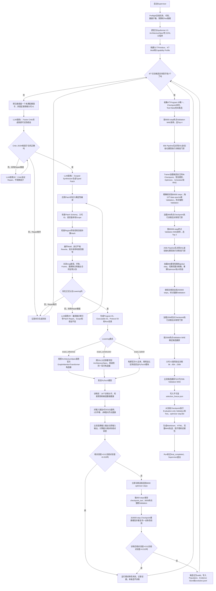

# 正式V1完整端到端工作流与机制说明

> 本文依据正式Run所使用的冻结Commit`3744bddae2628f0f87e2084d0e763e529a540cf1`逐段核对代码后重写。
>
> 任务：QM9极化率$\alpha$预测
>
> 父架构：官方Equiformer V1
>
> 正式协议：Seed 201、batch size 32、固定训练集$1/4$、`8→4→2`多保真晋级
>
> 更新时间：2026年7月26日

## 一、先明确当前系统到底是什么

当前系统是一条**LLM驱动、DSL约束、编译器验证、真实PyTorch执行、多保真晋级**的等变网络架构搜索链。

其核心不是让LLM直接生成Python网络源码，而是让LLM在一个受限的等变架构语言中生成`Typed Patch`，即带类型、作用域和结构条件的架构修改。随后由确定性的编译器和可信后端决定该修改是否合法、如何变成真正的PyTorch模型、是否保持任务要求的对称性，以及是否有资格消耗训练预算。

当前正式实验的真实执行顺序是：

1. 冻结QM9任务、数据、训练和Test隔离协议；
2. 把官方Equiformer V1导入为DSL父程序；
3. 每次确定一个允许修改的叶子因子；
4. LLM调用一：Factor Critic提出局部机制假设；
5. LLM调用二：Scoped Synthesizer生成Typed Patch；
6. 如果LLM输出不符合协议或编译失败，允许在同一因子和同一Scope内追加一次LLM Repair；
7. 编译器检查类型、Region、冻结补集、任务输出和真实后端能力；
8. 根据Lowering Plan构建真实PyTorch模型；
9. 在训练前检测数值健康、梯度健康以及旋转、平移和节点置换对称性；
10. 通过门禁的候选立即训练到8000 steps，并在训练后重新检测对称性；
11. 重复生成和训练，直到得到8个合法候选，并且四个因子各有2个；
12. 按8000-step终点Validation MAE选Top 4续训到80000 steps；
13. 按80000-step终点Validation MAE选Top 2，切换完整训练集后训练到250000 steps；
14. 官方Equiformer V1父代按同一协议训练到250000 steps；
15. 冻结Validation赢家后，使用其Checkpoint进行唯一一次Evaluation-only Test；
16. 归档程序、Prompt、Patch、编译证据、Checkpoint、曲线和最终报告。

## 二、完整工作流总图



## 三、入口脚本如何串起整条链

正式Run由三个层次的脚本控制。

### 3.1Supervisor

`scripts/supervise_dsl_formal_v1.sh`持有文件锁并循环启动Launcher。如果训练异常退出但Run没有`STOP`文件，它会等待30秒后重新启动同一个Run。它不会创建替代Run。

Supervisor只有在`multifidelity/state.json`的阶段变为`final_completed`后才写入`COMPLETED`并退出。

### 3.2Launcher

`scripts/launch_dsl_formal_v1.sh`严格顺序执行：

```text
preflight_dsl_formal_v1.py
→run_dsl_evolution.py
→run_dsl_multifidelity_cycles.py
→finalize_dsl_formal_v1.py
```

重新启动Launcher时，各阶段读取已有状态、程序和Checkpoint继续运行，而不是从头重建结果。

### 3.3Preflight

正式生成前，Preflight检查：

- Equiformer、OpenEvolve、QM9、数据子集和Python环境是否存在；
- `GLM_API_KEY`是否已经配置；
- A100是否可见；
- 正式代码Commit和关键文件Hash是否匹配准入证据；
- GPU预算和预算账本是否正确；
- 四个叶子因子的参数所有权是否唯一；
- 每个认证构造选项能否得到正确Lowering；
- 固定训练集$1/4$、父代DSL和任务协议是否在训练开始后保持不可变；
- 搜索期间`test_evaluated=false`。

## 四、Equiformer V1如何变成DSL

### 4.1输入不是任意V1源码文本

系统首先用`baseline_spec()`表示当前官方Equiformer V1配置，再由`import_equiformer_v1()`导入DSL。`ArchitectureSpec`中的字段与官方`GraphAttentionTransformer`构造参数一一对应，例如：

- 隐藏Irrep通道；
- 球谐最高阶$l_{\max}$；
- 径向基数量和径向MLP宽度；
- 注意力头数；
- 归一化类型；
- degree rescaling；
- 层数和截断半径。

导入后的DSL父图包含6个消息块、一个标量选择节点和一个图池化节点：

```text
node_features和edge_sh
→block0：V1初始消息Motif
→block1至block5：V1残差消息Motif
→scalar_readout：选择1个标量通道
→graph_pool：图级池化
→prediction：图级1x0标量
```

### 4.2父图是“可检查的表示流”，不是V1内部源码的逐算子重建

代码中的注释明确说明：导入图用于暴露表示、连接和聚合语义；官方V1的真实数值执行仍然是构造器锁定的。

这意味着父DSL能够让编译器检查：

- 每一层的Irrep类型；
- 节点和图载体；
- 消息块之间的表示流；
- 读出是否只使用标量；
- 输出是否满足QM9极化率合同；
- 哪些构造参数属于哪个因子。

但系统不会假装用31个通用Primitive逐行复刻了官方V1全部内部实现。正式V1正是通过`legacy_lock_architecture_id`保证未修改父图只能回落到官方构造器。

## 五、DSL语言基础是什么

### 5.1六个层次

|层次|代码中的对象|作用|
|---|---|---|
|任务合同|`TaskContract`|固定群、输出类型、证据Split和资源上限|
|类型系统|`EquivariantType`|描述群、Irrep、载体、Frame、轴和数据类型|
|基础操作|`PrimitiveRegistry`|注册基础等变操作及其输入、输出和类型规则|
|复合结构|`MotifRegistry`|把多个Primitive封装为可复用结构模板|
|完整架构|`ArchitectureProgram`|保存输入、节点、连接、参数、输出和注解|
|局部修改|`TypedPatch`|表达LLM对已授权Region的修改|

### 5.2当前注册31个Typed Primitive

|类别|Primitive|
|---|---|
|几何输入|`relative_position`、`distance`、`radial_basis`、`cutoff_envelope`、`spherical_harmonics`|
|表示与Frame|`edge_lift`、`to_edge_frame`、`from_edge_frame`、`change_multiplicity`、`select_scalars`|
|等变线性与耦合|`irrep_linear`、`tensor_product`、`so2_convolution`|
|注意力|`invariant_compatibility`、`segment_softmax`、`invariant_weight`|
|聚合与读出|`segment_sum`、`segment_mean`、`global_pool`|
|非线性|`scalar_activation`、`norm_activation`、`gate`、`s2_activation`、`separable_s2_activation`|
|归一化与正则|`equivariant_norm`、`invariant_dropout`、`stochastic_depth`|
|结构组合|`identity`、`residual_add`、`irrep_concat`、`irrep_slice`|

每个Primitive包含：

- 输入端口；
- 输出端口；
- 支持的群；
- 必选和可选属性；
- 类型推导函数；
- 语义约束；
- 可能产生的证明义务；
- 对LLM可见的编辑指导。

### 5.3当前注册4个Motif

|Motif|用途|正式V1能否搜索|
|---|---|---|
|`motif.v1_initial_message@1`|表示V1初始消息块|父架构表示，不能任意改写|
|`motif.v1_residual_message@1`|表示V1残差消息块|父架构表示，不能任意改写|
|`motif.v1_multilevel_readout@1`|融合终端输出和一个较早层标量表示|F6.3允许使用|
|`motif.v2_so2_residual_message@1`|V2式SO(2)消息路径原型|当前不进入正式排名|

### 5.4注册表不等于正式搜索空间

虽然Critic和Synthesizer的Prompt能够看到31个Primitive和4个Motif的类型合同，但正式候选还必须通过Region和Lowering门禁。当前正式搜索只允许：

- F2.2、F4.4、F5.3使用Capability Profile列出的离散构造选项；
- F6.3把`graph_pool`替换为`motif.v1_multilevel_readout@1`，辅助输入只能来自`block0`至`block4`之一；
- 未认证的通用节点图、V2 Motif、任意新Primitive和全局拓扑迁移不能进入正式训练。

因此，当前V1拥有较大的语言知识库，但只开放一个经过数值认证的小搜索切片。

## 六、LLM到底在哪里介入

### 6.1LLM的实际配置

正式Run通过OpenEvolve的`LLMEnsemble`调用中转站上的`glm-5.2`：

- API Base：`https://glm.llm.autos/v1`；
- 模型：`glm-5.2`；
- temperature：`0.7`；
- top_p：`0.95`；
- 单次最大输出：8192 tokens；
- 请求超时：180秒；
- API层最多重试3次。

API Key只通过环境变量传递，不写入候选程序或报告。

### 6.2当前正式首轮没有调用LLM Factor Router

代码支持LLM Factor Router，但正式首轮启动参数包含：

```text
--forced-factor-sequence F2.2,F4.4,F5.3,F6.3,F2.2,F4.4,F5.3,F6.3
--valid-per-factor-target 2
```

因此，当前首轮由确定性调度器选择尚未达到2个合法候选的因子。它不是简单按迭代编号机械循环，而是结合`valid_factor_counts`跳过已经满配额的因子。

每个首轮候选都从唯一的iteration-0根父代V1生成，`parent_policy=root_isolated`。即使OpenEvolve数据库中已经有其他子代，正式首轮也不会从子代继续叠加修改。这保证8个候选都是“父代V1＋一个叶子因子修改”的单因子对照。

OpenEvolve仍会从数据库采样最多2个`inspirations`，把它们的Validation结果作为Critic理解既有证据的上下文；但在`root_isolated`策略下，这些Program不会成为结构父代，也不会与根父代进行交叉、拼接或参数继承。换言之，`inspirations`只影响LLM看到的证据，不改变本轮候选的谱系定义。

### 6.3LLM调用一：Factor Critic

Factor Critic接收：

- 固定任务合同；
- 当前被调度的`factor_id`和唯一`region_id`；
- Region边界、允许参数或Motif；
- 父代局部AST；
- Train或Validation证据；
- 31个Primitive和4个Motif的语言合同。

这里的“父代局部AST”需要按Region类型理解。F2.2、F4.4和F5.3拥有的是`constructor.*`参数路径，并不对应DSL节点ID，所以它们传给Critic的`local_parent_ast`为空；Critic主要依据Region说明、允许的完整参数组合、任务语义和已有Validation证据提出机制假设。F6.3拥有真实节点`graph_pool`及其声明的边界输入，所以Critic能够看到该节点的局部AST。无论Critic阶段局部AST是否为空，下一步Synthesizer都会收到完整父代DSL，因而能够生成带正确父Program ID和完整前置条件的Patch。

它必须输出严格JSON，包括：

- 可证伪的局部科学假设；
- 该修改可能影响极化率的机制；
- 局部编辑步骤；
- 必须保持的不变量；
- 证据引用；
- 不确定性与风险；
- 可以用Validation否证的指标。

Critic不输出Patch或Python代码，也不能改变因子和Region。

### 6.4LLM调用二：Scoped Synthesizer

Synthesizer接收完整父DSL、Critic计划、不可变Scope、可见词汇合同和正式Patch JSON Schema。它输出`Typed Patch`。

对于F2.2、F4.4和F5.3，Patch的核心是`change_parameters`；对于F6.3，Patch替换`graph_pool`的操作和输入连接。

Synthesizer必须满足：

- `parent_architecture_id`等于当前父代；
- `language_version`一致；
- `scope`与Region完全一致；
- 只能使用真实存在的父节点ID；
- 构造参数必须属于Capability允许的完整选项；
- 不能修改任务、数据、训练器或编译器；
- 不能生成Python源码。

### 6.5什么时候会额外调用LLM Repair

正式Run的`--repair-attempts 1`表示Critic和Patch各最多允许一次附加Repair调用。

#### Critic Repair

当Critic输出JSON字段不完整、带额外字段、因子不一致或Region不一致时，系统调用`region_critic_repair_prompt()`。Repair只能修复协议外壳，不能改变原科学机制、因子或Region。

#### Compiler-guided Patch Repair

当Patch Schema、条件合同、Scope、参数选项、类型、连接或Lowering失败时，编译器把结构化诊断反馈给LLM。Repair必须保持原父代、科学假设、语言版本和Scope。

如果一次Repair后仍失败，本次生成尝试结束，失败写入`evolution.jsonl`，下一次迭代重新调用LLM生成新的候选。

### 6.6当前Run中的实际LLM调用证据

正式搜索为了得到8个合法候选，共进行45次生成迭代。Evidence Store记录：

|LLM角色|调用次数|
|---|---:|
|`region_critic`|45|
|`region_critic_repairer`|5|
|`patch_synthesizer`|35|
|`compiler_guided_repairer`|30|
|`factor_router`|0|

这里Patch Synthesizer少于Critic，是因为部分Critic在协议解析和一次Repair后仍失败，没有进入Patch生成。Patch Repair次数较多，是因为许多初始Patch违反严格JSON条件合同、重复架构、Region能力或认证Lowering规则。

45次生成尝试最终得到8个合法候选，其余失败包括：

- Critic JSON Schema不符；
- 重复语义架构；
- Patch条件合同错误；
- 没有认证Lowering；
- 参数不在Capability选项中；
- Patch没有真正修改因子；
- 一次训练进程被终止。

这也说明当前系统不是“LLM生成什么就训练什么”，而是LLM负责提出候选，确定性系统负责拒绝、执行和计量。

### 6.7后续自适应模式中的第三个LLM调用

如果不提供`--forced-factor-sequence`，系统才会在Critic之前调用`Factor Router`。Router读取可用Region和已有Validation证据，从中选择一个`factor_id`和对应`region_id`，但不生成具体修改。

因此：

- 当前正式首轮：确定性因子调度＋Critic LLM＋Synthesizer LLM；
- 后续自适应搜索：Router LLM＋Critic LLM＋Synthesizer LLM；
- 两种模式都可能追加协议Repair或编译器引导Repair调用。

## 七、四个叶子因子和当前真实变异范围

|因子|Region|允许的父代与替代选项|最终PyTorch执行|
|---|---|---|---|
|F2.2径向编码|`v1_radial_encoding`|父代Gaussian 128基、`[64,64]`；允许的三个替代完整组合为Gaussian 96基＋`[96,96]`、Gaussian 64基＋`[64,64]`、Gaussian 128基＋`[96,96]`|修改`number_of_basis`、`basis_type`、`fc_neurons`后调用官方V1构造器|
|F4.4多头组织|`v1_attention_heads`|父代4头；替代2头或8头|修改`num_heads`后调用官方V1构造器|
|F5.3归一化与尺度|`v1_normalization`|父代LayerNorm且不rescale；替代degree rescaling或Fast LayerNorm|修改`norm_layer`或`rescale_degree`后调用官方V1构造器|
|F6.3多层读出|`v1_readout`|父代终端读出；替代为终端预测＋一个非终端block辅助读出|官方V1主体外附加`auxiliary_head`和二输入`combine`模块|

Capability Profile中还保存了已经被A100等变门禁排除的选项，例如Bessel径向基、InstanceNorm和GraphNorm。这些选项即使LLM提出，也会被Region验证拒绝。

## 八、编译器实际做了什么

### 8.1编译分为“分析”和“Lowering”

#### 分析阶段

`Compiler.analyze()`执行：

1. 展开Motif为Primitive子图；
2. 执行严格、语义保持的Rewrite；
3. 检查拓扑顺序和死节点；
4. 从输入沿图推导每个节点的`EquivariantType`；
5. 检查Primitive端口、属性和支持的群；
6. 检查节点声明类型与推导类型一致；
7. 关闭所有证明义务；
8. 检查程序输出等于QM9任务要求的图级`1x0`；
9. 计算规范化后的Program ID。

当前父图会产生并关闭以下典型证明义务：

- `IRREP_PATH_EXISTS`：请求的输出Irrep确实能由输入张量积产生；
- `PARITY_MATCH`：宇称匹配；
- `PERMUTATION_SAFE_AGGREGATION`：边到节点聚合对邻居顺序安全；
- `FRAME_BALANCE`：进入局部Edge Frame后必须回到Global Frame；
- `OUTPUT_CONTRACT_MATCH`：输出满足任务合同。

#### Region审计

`validate_region_transition()`额外检查：

- Patch只修改选中因子拥有的参数或节点；
- 参数值属于预注册完整组合，而不是任意交叉组合；
- 插入和删除节点没有越界；
- 编辑节点只能读取声明过的边界输入；
- 父代与子代的冻结补集Hash相同。

#### Lowering阶段

类型正确不代表一定有可信数值实现。`Compiler.plan_lowering()`还要决定DSL语义如何映射到真实模型。

### 8.2DSL不是直接生成Python源文件

正式Pipeline不会执行LLM生成的代码。它把DSL保存为`architecture.dsl.json`，生成Lowering Plan，再调用受信任的Python Builder。

|Lowering|适用程序|模型构建方式|正式排名|
|---|---|---|---|
|`exact_reference`|未修改父代|从父程序注解恢复原`ArchitectureSpec`，调用官方`GraphAttentionTransformer`|允许|
|`exact_constructor`|只修改认证V1构造参数|把DSL参数写回`ArchitectureSpec`，调用同一个官方`GraphAttentionTransformer`|允许|
|`exact_hybrid`|认证F6.3读出结构|构建官方V1主体，再附加手写且受信任的PyTorch读出模块|允许|
|`experimental_node_graph`|通用Primitive节点图|通用e3nn或V2图后端|正式V1拒绝|
|`representation_only`|只有表示语义但没有认证后端|不构建模型|拒绝|

## 九、V1变成DSL后再变为PyTorch，和原来一样吗

答案要分父代和子代。

### 9.1父代：数值模型和原来一样

未修改的父代走`exact_reference`：

```text
官方V1 ArchitectureSpec
→导入DSL供检查和搜索
→编译器确认DSL仍等于Legacy Lock
→从DSL注解恢复同一个ArchitectureSpec
→调用同一个GraphAttentionTransformer构造器
```

为了验证这一点，已经在服务器正式Equiformer环境中使用Seed 201进行实际Round-trip对照：

|项目|直接构建官方V1|父代DSL编译后构建|
|---|---|---|
|PyTorch类|`nets.graph_attention_transformer.GraphAttentionTransformer`|相同|
|可训练参数量|3,531,715|3,531,715|
|State Dict张量数量|416|416|
|State Dict键|相同|相同|
|相同Seed下最大参数差异|0|0|

因此，对父代而言，DSL是一个可检查、可编辑和可追踪的中间表示，不会改变原始V1数值模型。

### 9.2F2.2、F4.4和F5.3子代：仍是原来的官方V1实现，但构造参数变化

这三个因子走`exact_constructor`。网络类和内部官方代码仍然是`GraphAttentionTransformer`，区别是DSL中允许的构造参数被写回`ArchitectureSpec`后再实例化。

因此它们不是用通用Primitive重新实现V1，也不是LLM生成新的PyTorch类；它们是官方V1构造器能够真实表达的架构变体。

### 9.3F6.3子代：V1主体相同，但PyTorch模型不再与父代完全相同

F6.3走`exact_hybrid`：

1. 构建完整官方V1主体；
2. 在选定的非终端block注册Forward Hook；
3. 取该block的标量Irrep通道；
4. 用一个两层MLP生成辅助图级标量；
5. 与官方终端预测拼接；
6. 用可训练线性层合并为最终极化率预测。

组合层初始为`[1,0]`，因此初始输出等于官方终端预测，辅助分支在训练中逐渐学习。这是当前V1中真正改变PyTorch计算图和信息路径的结构变异。

## 十、等变检测到底检测输入还是输出

### 10.1检测的是函数关系

系统先对输入施加群变换，再比较模型输出是否满足理论关系。一般的等变条件是：

$$
f(g\cdot x)=\rho_{\mathrm{out}}(g)f(x)
$$

所以：

- 输入侧负责施加测试变换；
- 输出侧负责计算误差并作出通过或拒绝判定；
- 只检查输入是否合法或只看一次输出都不能验证等变性。

### 10.2为什么当前输出应当不变

QM9极化率$\alpha$在当前任务中是图级零阶标量`1x0`。零阶表示的输出变换矩阵为1，因此一般等变式退化为不变性：

$$
f(Rx)=f(x)
$$

$$
f(x+t)=f(x)
$$

$$
f(Px)=f(x)
$$

其中$R$是SO(3)旋转，$t$是整体平移，$P$是图内节点置换。

网络内部的$l=1$、$l=2$特征仍然按照各自Irrep等变变换；最终只比较标量输出，是因为任务合同要求模型把内部等变特征合法收缩为不变量。

## 十一、正式等变检测的真实代码步骤

### 11.1检测数据

Pipeline从训练Split读取QM9；8k和80k阶段使用固定训练集$1/4$，250k阶段使用完整训练集。随后取DataLoader的第一个batch，共16个分子，移到A100。

Validation和Test分子不参与对称性门禁。

### 11.2先计算参考输出

在`model.eval()`和`torch.no_grad()`下计算：

$$
y=f(x,z,b)
$$

其中$x$包括原子坐标和特征，$z$是原子序数，$b$是图归属。

### 11.3四次随机SO(3)旋转

使用`e3nn.o3.rand_matrix()`生成4个旋转矩阵$R_i$，把坐标变为：

$$
x_i'=xR_i^{\mathsf T}
$$

原子特征、原子类型和图归属保持不变。模型根据旋转后坐标重新构图并重新计算球谐和消息传递，得到$y_i'$。

由于输出是标量，期望$y_i'=y$。

### 11.4两次固定平移

对整个batch分别加入：

```text
(1.25,-0.75,0.5)
(-0.4,0.9,1.1)
```

模型应当只依赖相对坐标，因此期望平移前后输出相同。

### 11.5两种图内节点置换

系统分别对每个分子内部执行：

- 节点顺序反转；
- 节点顺序循环移动一位。

坐标、原子特征、原子序数和batch索引使用同一个置换。置换测试时不复用原来的边缓存，而是让模型依据新节点顺序重新构图。

这检测模型预测是否依赖任意的原子编号。

### 11.6误差公式

对每个旋转、平移和置换分别计算相对误差：

$$
e_{\mathrm{rel}}=\frac{\left\|y'-y\right\|_2}{\max\left(\left\|y\right\|_2,\sqrt{N}\times10^{-6}\right)}
$$

以及最大逐元素绝对误差：

$$
e_{\mathrm{abs}}=\max_j\left|y_j'-y_j\right|
$$

8种变换分别得到误差，报告取：

$$
E_{\mathrm{rel}}=\max_g e_{\mathrm{rel}}(g)
$$

$$
E_{\mathrm{abs}}=\max_g e_{\mathrm{abs}}(g)
$$

### 11.7为什么同时看相对误差和绝对误差

如果参考输出接近0，即使只有很小的float32数值差异，相对误差也可能被放大。反过来，当输出尺度较大时，只看绝对误差又可能忽略明显的相对漂移。

因此，运行期硬拒绝条件是：

$$
E_{\mathrm{rel}}>0.01\quad\text{并且}\quad E_{\mathrm{abs}}>0.015
$$

注意代码使用逻辑“并且”，不是任何一项越界就拒绝。

对应的Warning条件是：

$$
E_{\mathrm{rel}}>0.005\quad\text{并且}\quad E_{\mathrm{abs}}>0.008
$$

Warning会记录，但不直接使候选失效。

### 11.8阈值为什么是0.01和0.015

这两个阈值不是任意指定的。正式协议先在A100上对官方Equiformer V1父代使用Seed 201至205进行校准，观察到：

- 最大相对误差：`0.0045357101`；
- 最大绝对误差：`0.0071372986`。

安全规则是至少取父代观测最大值的两倍并向上取整：

- $2\times0.0045357101=0.0090714202$，向上取`0.01`；
- $2\times0.0071372986=0.0142745972$，向上取`0.015`。

这样既能容纳官方父代在A100、float32、随机旋转和动态图构图条件下的数值噪声，又能拒绝远超父代数值基线的结构。

### 11.9正式运行门禁与Capability准入的区别

运行期搜索使用“双阈值同时越界才硬拒绝”，避免近零输出造成误判。

但一个结构选项要进入正式Capability Profile，离线准入证据更严格：认证选项必须同时满足：

```text
最大相对误差≤0.01
最大绝对误差≤0.015
```

因此，搜索只会从已经经过更严格离线准入的选项中生成候选；运行期联合门禁是第二层数值保险。

### 11.10检测发生两次

#### 训练前

真实模型构建后立即运行对称性门禁。失败则不进入8000-step训练。

#### 训练后

训练结束后重新创建同一DSL模型，加载`checkpoint_last.pth`中的`model`权重，再对同一个16分子batch重复完整的4旋转、2平移、2置换测试。

这检测：

- 训练后的参数是否仍保持数值对称性；
- Checkpoint是否能正确加载到同一Executable；
- Hybrid读出等新增模块是否在实际训练后仍满足标量不变性。

80k和250k晋级阶段有一个容易误写的实现细节：Pipeline刚启动时的“训练前门禁”检查的是由同一DSL重新构建、按当前Seed新初始化的模型；随后Trainer才加载传入的上一阶段Checkpoint并恢复训练。代码当前没有在续训开始前，专门对“刚加载完成的传入Checkpoint”再执行第三次门禁。现有Checkpoint证据链是：上一阶段结束时已经对该Checkpoint完成训练后门禁，当前阶段保持Program ID和Executable ID不变，当前阶段结束后又会对新`checkpoint_last.pth`执行训练后门禁。因此，文档不能把80k或250k的训练前门禁描述成对传入Checkpoint的即时复检。

## 十二、除了等变性还检测什么

训练前同一16分子batch还执行：

### 12.1参数预算

候选参数量不得超过父代的1.2倍。父代为3,531,715个参数，因此正式上限约为4,238,058。

### 12.2预测数值健康

要求：

- 所有预测均为有限数；
- Prediction RMS不超过50；
- 最大绝对预测不超过100；
- 标准化batch MAE不超过100。

### 12.3梯度健康

在训练batch上计算一次L1 Loss并反向传播，要求：

- 至少存在梯度；
- 所有梯度有限；
- 全局梯度L2范数不超过$10^5$。

只有参数、数值、梯度和对称性全部通过，候选才会启动正式训练。

## 十三、候选生成失败后到底怎么处理

### 13.1编译前或编译期失败

如果是Critic JSON或Patch错误，系统最多追加一次LLM Repair。Repair失败后：

- 记录错误类型、诊断和LLM响应；
- 不训练；
- 不加入Population；
- 不计入该因子的2个合法候选配额；
- 下一次迭代继续为尚未满配额的因子生成新候选。

### 13.2训练前门禁失败

数值、梯度、参数预算或对称性失败后，该候选结果为`valid=false`，不进入8000-step训练，也不计入配额。

### 13.3训练异常中断

如果已经存在该候选自己的`checkpoint_last.pth`，搜索入口会对同一个候选调用Evaluator重试。重启时还会读取`current_candidate.json`，校验迭代号、候选文件SHA-256、父代ID和生成元数据。

身份一致时设置`recovered_without_llm_call=true`并继续评估，不重新调用LLM。

### 13.4对称性失败后是否让LLM原地修改同一个候选

当前V1不会把一个已经有Program ID的失败候选悄悄改成另一个结构。失败结果进入证据记录；下一次生成迭代重新调用LLM并产生新的Program ID。

这比“循环修改同一个文件直到通过”更适合实验回溯，因为每个失败架构和成功架构都有独立身份。

## 十四、8000-step阶段的真实形成方式

上一版把“生成8个候选”和“训练8个候选”画成两个分离步骤，这不符合代码。

真实流程是：

```text
生成候选1→编译→训练前门禁→训练到8k→训练后门禁→若valid则计数
生成候选2→编译→训练前门禁→训练到8k→训练后门禁→若valid则计数
……
直到累计8个valid候选，并且F2.2、F4.4、F5.3、F6.3各2个
```

正式Run最多允许48次生成尝试。实际在第45次迭代完成目标：

|因子|合法8k候选数|
|---|---:|
|F2.2|2|
|F4.4|2|
|F5.3|2|
|F6.3|2|

## 十五、8进4进2晋级策略

### 15.1收集8个8k候选

多保真控制器只接收同时满足以下条件的候选：

- `iteration>0`，排除父代；
- `valid=true`；
- `test_evaluated=false`；
- `endpoint_step=8000`；
- Program ID唯一；
- 候选DSL文件存在；
- `checkpoint_last.pth`存在。

8个候选按8000-step终点`validation_alpha_mae`排序。

### 15.2为什么是终点MAE，不是历史最佳MAE

Pipeline同时记录：

- `validation_alpha_mae`：阶段终点Validation MAE；
- `best_validation_alpha_mae`和`best_step`：轨迹中的历史最佳。

多保真控制器排序时明确使用`metrics_8000/80000/250000["validation_alpha_mae"]`。因此历史最佳只用于分析曲线，不能改变预注册的终点评分。

### 15.3Top 4续训到80000 steps

控制器取8k排序前4名，逐个执行：

- 加载该候选自己的8k Checkpoint；
- Program ID必须保持不变；
- 使用同一个固定训练集$1/4$；
- 保留Optimizer、Scheduler和随机数状态，属于精确续训；
- 全局step从8000继续到80000；
- 每10个data epochs进行Validation；
- 80000终点强制Validation；
- 训练前后仍执行对称性门禁；
- Test必须保持未访问。

完成4个80k结果后，按80000-step终点Validation MAE选择Top 2。

### 15.4Top 2训练到250000 steps

250k阶段执行预注册的数据切换：

- 从候选自己的80k Checkpoint加载模型权重和global step；
- 训练集从固定$1/4$切换为完整QM9训练集；
- 使用`--allow-data-transition`允许训练数据身份变化；
- 使用`--resume-model-only`，不加载旧Optimizer和Scheduler；
- 新建Optimizer和Scheduler；
- `data_epoch_origin_step=80000`；
- `lr_schedule_origin_step=80000`；
- 从全局80000继续到全局250000，即新增170000次optimizer update。

完成2个250k结果后，按250000-step终点Validation MAE确定候选赢家。

## 十六、data epoch、参考epoch、Validation和Checkpoint的关系

### 16.1训练终止条件

三个阶段始终由optimizer step终点决定：

```text
8000
80000
250000
```

### 16.2data epoch

训练Loader使用`drop_last=true`，因此：

$$
\text{steps per data epoch}=\left\lfloor\frac{N_{\mathrm{train}}}{32}\right\rfloor
$$

固定训练集$1/4$有27,500个样本，所以：

$$
\left\lfloor\frac{27500}{32}\right\rfloor=859
$$

其10个data epochs正好是8590 steps。

完整训练集有110,000个样本，因此：

$$
\left\lfloor\frac{110000}{32}\right\rfloor=3437
$$

完整训练集的10个data epochs是34,370 steps。

Validation按当前数据阶段动态计算，阶段终点即使不在10个data epochs边界也强制评估。

### 16.3参考epoch

学习率Scheduler仍使用`reference_steps_per_epoch=859`，用于复用原有训练配方的学习率相位。这与data epoch概念分离。

250k数据切换后，Scheduler从global step 80,000重新设为参考epoch 0，随后每859 steps更新一次Scheduler相位。

### 16.4Checkpoint

`checkpoint_last.pth`的边界固定为每859 steps以及阶段终点。Checkpoint保存：

- 模型；
- global step；
- Optimizer；
- Scheduler；
- 随机数状态；
- 当前最佳Validation；
- 训练数据身份和参数。

所以Validation间隔、学习率参考epoch和Checkpoint间隔是三个不同概念，虽然在$1/4$训练集阶段859恰好也是一个data epoch。

## 十七、父代和最终Test

### 17.1父代同协议训练

Top 2候选250k完成后，控制器再训练未修改的官方V1父代：

```text
父代8k：固定训练集1/4
→父代80k：同一子集精确续训
→父代250k：模型权重续接、切完整训练集、重建Optimizer和LR阶段
```

父代不是8k候选晋级体系的一部分，也不会挤占8个候选名额。

### 17.2冻结Validation赢家

Finalizer要求：

- 两个候选250k结果完成；
- 父代250k结果完成；
- 候选和父代均`test_evaluated=false`；
- 赢家程序和Checkpoint存在；
- Checkpoint Hash、Program ID和Executable ID可验证。

随后把赢家和父代比较写入`selection_freeze.json`。如果重跑Finalizer时冻结内容发生变化，程序直接报错。

### 17.3唯一一次Evaluation-only Test

Finalizer用冻结的250k Checkpoint启动Trainer，并同时传入：

```text
--evaluate-test
--evaluation-only
```

Trainer要求Checkpoint的global step等于250000，并且不进入训练循环。它只执行一次完整Validation和Test评估，记录：

- `steps_executed_current_job=0`；
- `evaluation_only=true`；
- `test_evaluated=true`。

Test结果不会返回LLM、Evidence Store或晋级控制器。

## 十八、身份、缓存与恢复

|身份|绑定内容|用途|
|---|---|---|
|Program ID|展开Motif、严格Rewrite后的DSL语义和任务合同|判断是不是同一个架构程序|
|Executable ID|Program、Lowering Plan、后端语义、关键源码和环境|判断是不是同一个真实执行模型|
|Protocol ID|Executable、Seed、step、batch、数据子集、对称性阈值和恢复策略|判断是不是同一个实验协议|
|Run目录|Program ID、Seed、最大step和Protocol ID|保存本次运行全部材料|

缓存复用前必须比较Runtime Manifest；如果源码、后端、数据或协议变化，就不能把旧结果当作当前结果。

## 十九、当前V1已经验证和尚未验证的边界

### 19.1已经验证

- 官方V1能够无损导入DSL并通过`exact_reference`回到相同PyTorch模型；
- LLM能够基于因子、Region和DSL合同生成Typed Patch；
- 编译器能够拒绝越界、重复、无类型或无认证后端的候选；
- F2.2、F4.4和F5.3能通过官方V1构造器形成真实架构变体；
- F6.3能改变真实PyTorch计算图和信息流：父代`graph_pool`只读取`scalar_readout`，两个正式候选把它替换为`motif.v1_multilevel_readout@1`，分别额外读取`block4`和`block3`的零阶标量通道，并在PyTorch中新增`auxiliary_head`与`combine`；参数量由父代3,531,715增加为3,548,358，两个候选的Executable ID也不同；
- 8个正式候选均完成训练前、8000-step训练和训练后对称性门禁；
- 搜索期间Test保持隔离。

其中两个F6.3新结构的8000-step对称性实测如下。它们不是只在DSL文本中改名，而是都走`exact_hybrid`后端并执行新增分支。

|Program ID|新增辅助连接|训练前最大相对误差|训练前最大绝对误差|训练后最大相对误差|训练后最大绝对误差|运行期门禁|
|---|---|---:|---:|---:|---:|---|
|`1e21dfb5b2f4513d`|`block4`|0.00162809|0.00390625|0.00076949|0.00759315|通过|
|`b8b106e0c4adde59`|`block3`|0.00152973|0.00244141|0.00071932|0.00770187|通过|

这组证据能够支持“当前变异策略可以从V1生成真实新计算路径，并使具体实例通过当前标量输出级对称性检测”。它不能被扩大解释为“LLM已经从零发明了未注册Primitive”，因为`motif.v1_multilevel_readout@1`仍是预注册、受信任Lowering实现的Motif；LLM当前负责在受限语言内选择连接位置并形成合法Patch。

### 19.2尚未验证

- 当前首轮没有验证LLM Factor Router优于固定因子调度；
- 当前没有开放任意新Primitive或任意算子内部程序生成；
- 当前没有实现多因子联合修改；
- 当前31个Primitive并非全部拥有正式数值后端；
- 有限数值对称性测试不是对所有连续群元素的形式化证明；
- 单Seed结果不能证明方法相对SPARK或OpenEvolve具有统计显著优势。

## 二十、当前Run位置

- 服务器Run：`/home/20262202788/equivariant-nas/runs/dsl_formal_v1_seed201`；
- 正式功能冻结Commit：`3744bddae2628f0f87e2084d0e763e529a540cf1`；
- 8个合法8k候选已完成；
- 当前处于Top 4候选80k训练阶段；
- 服务器由Supervisor在同一Run和同一Checkpoint上自行恢复；
- Codex每4小时检查一次阶段和异常；
- 最终Test尚未访问。
