# 正式V1完整端到端工作流与机制说明

> 文档范围：当前正在服务器上运行的等变DSL正式V1，而不是尚未实现的V2设想
>
> 任务：QM9极化率$\alpha$预测
>
> 父架构：官方Equiformer V1
>
> 正式协议：Seed 201、batch size 32、固定训练集$1/4$、`8→4→2`多保真晋级
>
> 更新时间：2026年7月26日

## 一、先用一段话理解整个系统

当前工作流首先把官方Equiformer V1转换为一种带有群表示类型、计算节点、参数、区域所有权和任务合同的EvoEquiLang程序。系统不会让LLM直接重写任意PyTorch代码，而是先限定一个可修改的架构因子，再让LLM提出该因子内部的局部机制假设和Typed Patch。编译器检查Patch是否只修改授权区域、是否保持其他结构冻结、张量表示和宇称是否兼容、是否能够降低到受信任的真实后端。编译通过后，系统实例化真正的PyTorch模型，并通过“变换输入、比较输出”的方式检查旋转、平移和节点置换对称性。只有编译、等变性、数值健康和梯度健康全部通过的候选，才进入QM9训练。8个候选先训练到8000 steps，按终点Validation MAE晋级4个到80000 steps，再晋级2个到250000 steps。最后还会训练同协议的Equiformer V1父代，冻结Validation赢家后只访问一次Test集。

## 二、完整流程总图

```mermaid
flowchart TD
    subgraph P0["阶段0：冻结任务与实验协议"]
        A0["QM9极化率alpha任务"] --> A1["冻结Seed 201、数据划分、batch size 32"]
        A1 --> A2["冻结8k→80k→250k和8→4→2晋级规则"]
        A2 --> A3["冻结Test只允许最终访问一次"]
    end

    subgraph P1["阶段1：把官方Equiformer V1变成DSL父程序"]
        B0["读取官方Equiformer V1"] --> B1["导入层、节点、参数和输出合同"]
        B1 --> B2["标注SO(3)、Irrep、载体、坐标系和置换语义"]
        B2 --> B3["规范化得到父代Program ID"]
    end

    subgraph P2["阶段2：建立本轮可用语言和因子空间"]
        C0["31个Typed Primitive和4个Motif的语言基础"] --> C1["Capability Profile筛出当前可信能力"]
        C1 --> C2["开放F2.2径向编码"]
        C1 --> C3["开放F4.4多头组织"]
        C1 --> C4["开放F5.3归一化与尺度"]
        C1 --> C5["开放F6.3多层读出"]
        C2 --> C6["Region合同和冻结补集"]
        C3 --> C6
        C4 --> C6
        C5 --> C6
    end

    subgraph P3["阶段3：LLM生成一个候选"]
        D0{"因子选择方式"}
        D0 -->|"正式首轮：预注册覆盖"| D1["按F2.2、F4.4、F5.3、F6.3各生成2个"]
        D0 -->|"后续自适应模式"| D2["LLM Factor Router选择一个因子"]
        D1 --> D3["LLM Factor Critic提出局部可证伪假设"]
        D2 --> D3
        D3 --> D4["LLM Scoped Synthesizer生成Typed Patch"]
    end

    subgraph P4["阶段4：编译与静态约束门禁"]
        E0["解析Patch并规范化"] --> E1["检查因子、Region和Scope不变"]
        E1 --> E2["检查冻结补集Hash"]
        E2 --> E3["检查类型、Irrep路径、宇称和输出合同"]
        E3 --> E4["检查是否存在认证Lowering Plan"]
        E4 -->|"语法、类型或局部连接失败"| E5["同一因子和Scope内编译器引导Repair"]
        E5 --> E0
        E4 -->|"Repair耗尽"| E6["记录失败候选并开始下一次生成"]
        E4 -->|"通过"| E7["生成Executable ID和Protocol ID"]
    end

    subgraph P5["阶段5：构建真实PyTorch模型并检测等变性"]
        F0["官方V1构造器或认证Hybrid后端实例化模型"] --> F1["训练前数值健康和梯度健康检查"]
        F1 --> F2["对输入坐标施加SO(3)旋转、平移和节点置换"]
        F2 --> F3["比较原输入与变换输入对应的模型输出"]
        F3 -->|"不满足门禁"| F4["候选作废、记录证据、下一次生成"]
        F3 -->|"满足门禁"| F5["允许消耗训练预算"]
    end

    subgraph P6["阶段6：8→4→2多保真训练"]
        G0["收集8个合法候选"] --> G1["固定训练集1/4训练至8000 steps"]
        G1 --> G2["终点强制Validation"]
        G2 --> G3["按终点Validation MAE选Top 4"]
        G3 --> G4["从各自8k Checkpoint续训至80000 steps"]
        G4 --> G5["按终点Validation MAE选Top 2"]
        G5 --> G6["加载80k模型权重并切换完整训练集"]
        G6 --> G7["重建Optimizer和学习率阶段，训练至250000 steps"]
        G7 --> G8["按250k终点Validation MAE冻结候选赢家"]
    end

    subgraph P7["阶段7：父代对照、最终Test和证据归档"]
        H0["父代按同协议训练8k→80k→250k"] --> H1["比较候选赢家与父代Validation MAE"]
        H1 --> H2["写入不可变selection_freeze.json"]
        H2 --> H3["Evaluation-only访问Test一次，不执行训练step"]
        H3 --> H4["生成Markdown、HTML、曲线、因子图和证据包"]
    end

    A3 --> B0
    B3 --> C0
    C6 --> D0
    D4 --> E0
    E7 --> F0
    F5 --> G0
    G8 --> H0
```



## 三、阶段0：先冻结任务，而不是先让LLM生成架构

### 3.1任务合同

当前任务是QM9数据集上的极化率$\alpha$预测。任务合同规定：

- 输入是三维分子图，包括原子特征、原子坐标和图归属；
- 空间群语义是三维`SO(3)`旋转，并使用相对坐标保证平移语义；
- 原子是无序节点集合，因此模型还必须满足节点置换不变性；
- 输出是图级标量，类型为`1x0`，即零阶不可约表示；
- 搜索证据只能来自Train和Validation；
- Test只能在Validation选择完全冻结后访问一次。

### 3.2为什么必须先冻结协议

如果允许LLM同时修改架构、数据划分、训练步数、优化器或评估方式，那么更低的MAE无法归因于架构。正式V1因此把以下内容视为不可修改的可信内核：

- 数据集与目标；
- 固定训练集$1/4$索引文件；
- Seed和batch size；
- 三个训练终点；
- Validation间隔；
- 晋级数量；
- Test隔离策略；
- 等变检测协议；
- 资源上限。

LLM只能修改被授权的架构区域，不能修改上述实验合同。

## 四、阶段1：把Equiformer V1转换为DSL父程序

### 4.1不是把整份Python源码直接交给LLM

系统把官方Equiformer V1抽象为`ArchitectureProgram`。该程序包含：

1. `Node`：架构计算节点，例如消息传递块、标量选择和图池化；
2. `Input Reference`：节点之间的数据依赖；
3. `Parameters`：能够由认证构造器真实执行的架构参数；
4. `EquivariantType`：每条数据的群、阶数、Irrep、载体、坐标系和数据类型；
5. `Output Contract`：最终输出必须是图级标量；
6. `Annotations`：父架构家族、可信后端和Legacy锁定身份；
7. `Language Version`：该程序使用的DSL语言版本。

转换后，父架构的主体可以概括为：

```text
分子输入
→Equiformer V1初始消息块
→多个Equiformer V1残差消息块
→选择标量通道
→图级池化
→极化率预测
```

### 4.2Program ID的作用

程序规范化后计算`Program ID`。它只描述DSL程序的语义，不描述训练协议。如果节点、参数或连接发生真实语义变化，Program ID就会变化；如果只是JSON键顺序变化，Program ID不会变化。

这使系统能够判断：

- 子代是否与父代完全相同；
- 两次LLM输出是否生成了重复架构；
- 中断恢复时是否仍然是同一个候选；
- 后续Checkpoint是否绑定了正确程序。

## 五、阶段2：DSL语言究竟由什么组成

### 5.1DSL不是一个参数表

当前DSL由六个相互约束的层次组成：

|层次|作用|示例|
|---|---|---|
|类型系统|描述张量如何随群作用变换|`SO(3)`、`1x0`、节点载体、图载体|
|Primitive|不可再拆的类型化基础操作|张量积、球谐函数、分段求和|
|Motif|由多个Primitive组成的可复用结构模板|V1消息块、多层读出|
|Architecture Program|完整的网络结构程序|导入后的Equiformer V1|
|Region与Factor|规定谁可以修改哪一部分|F4.4只能控制注意力头组织|
|Typed Patch|LLM提交的受限架构修改|修改一个构造参数或替换一个读出节点|

### 5.2当前基础原语共有31个

注册表中目前有31个带版本号的Typed Primitive。可以按功能分为以下几类：

|类别|原语|
|---|---|
|几何输入|`relative_position`、`distance`、`radial_basis`、`spherical_harmonics`、`cutoff_envelope`|
|表示与坐标系|`to_edge_frame`、`from_edge_frame`、`edge_lift`、`select_scalars`、`change_multiplicity`|
|等变线性与耦合|`tensor_product`、`irrep_linear`、`so2_convolution`|
|注意力与权重|`invariant_compatibility`、`segment_softmax`、`invariant_weight`|
|聚合与读出|`segment_sum`、`segment_mean`、`global_pool`|
|非线性|`scalar_activation`、`norm_activation`、`gate`、`s2_activation`、`separable_s2_activation`|
|归一化与正则化|`equivariant_norm`、`invariant_dropout`、`stochastic_depth`|
|结构组合|`residual_add`、`irrep_concat`、`irrep_slice`、`identity`|

这些原语不是普通字符串。每个原语包含输入端口、输出端口、类型规则、属性合同和可能产生的编译证明义务。

### 5.3当前还有4个参考Motif

Motif是由多个原语组成的结构模板：

|Motif|作用|正式V1状态|
|---|---|---|
|`motif.v1_initial_message@1`|V1初始消息构造|用于表示父架构|
|`motif.v1_residual_message@1`|V1残差消息构造|用于表示父架构|
|`motif.v1_multilevel_readout@1`|融合终端特征与一个较早层特征|允许在F6.3中搜索|
|`motif.v2_so2_residual_message@1`|V2式SO(2)消息构造原型|当前不进入正式排名|

### 5.4“语言里有31个原语”不等于“正式V1允许任意组合31个原语”

这是理解当前系统最重要的边界。通用原语注册表是长期DSL语言基础，但正式V1只开放已经证明存在真实、可信数值后端的搜索切片：

- F2.2、F4.4和F5.3通过官方Equiformer V1构造器执行；
- F6.3只允许使用已经实现的`motif.v1_multilevel_readout@1`；
- 通用e3nn节点图后端仍标为实验能力；
- 未认证Primitive、V2式SO(2)核、任意新算子和全局拓扑迁移不能进入正式排名。

因此，当前V1验证的是“LLM能否在受信任的类型化架构语言切片中产生有效结构”，而不是“LLM已经可以自由发明任意新算子”。

## 六、阶段3：四个因子如何控制LLM变异

### 6.1当前开放的四个叶子因子

|因子|科学作用|允许修改的内容|执行方式|变化强度|
|---|---|---|---|---|
|F2.2径向编码|控制距离如何编码为径向特征|径向基类型、基数量、径向MLP宽度|官方V1构造器|配置与容量变化|
|F4.4多头组织|控制不变量注意力路由的多头组织|注意力头数量|官方V1构造器|结构配置变化|
|F5.3归一化与尺度|控制不同阶表示的数值稳定性|归一化层、degree rescaling|官方V1构造器|算子选项变化|
|F6.3多层读出|控制不同深度特征如何汇总到输出|终端读出或多层融合读出|认证Hybrid后端|计算图和信息路径变化|

每个因子都拥有唯一的参数路径或结构Region。编译器会计算未选区域的`frozen complement hash`。只要LLM越界修改其他区域，Hash就不一致，候选会被拒绝。

### 6.2正式首轮为什么没有让LLM自由选择因子

当前正式实验需要8个合法候选，并预注册为：

```text
F2.2、F4.4、F5.3、F6.3、F2.2、F4.4、F5.3、F6.3
```

也就是每个因子恰好生成2个候选。这样做的目的是保证第一轮能够比较四个方向，而不会因为LLM偏好某个因子导致其他方向没有样本。

因此，当前正式首轮每个候选通常包含两次主要LLM调用：

1. `Factor Critic`：在已固定的因子内形成局部、可证伪的机制假设；
2. `Scoped Synthesizer`：根据该假设生成Typed Patch。

系统同时已经实现自适应模式。在后续周期中可以增加第一次LLM调用：

1. `Factor Router`选择因子；
2. `Factor Critic`分析该因子；
3. `Scoped Synthesizer`生成Patch。

所以“SPARK式三次调用”在代码中已经具备，但当前首轮为了实验覆盖公平性，把Router替换为预注册因子调度，不应把二者混写。

### 6.3三阶段各自解决什么问题

#### 第一步：Factor Router

Router只回答“下一次应该探索哪个因子”，不输出代码。输入包括可用Capability、父代摘要和已有成功/失败证据。输出必须严格包含`factor_id`、`region_id`、理由、证据引用、预期价值和风险。

#### 第二步：Factor Critic

Critic只读取选中Region附近的局部AST，不读取或修改整个网络。它需要提出：

- 可证伪的科学假设；
- 可能影响极化率预测的机制；
- 局部编辑计划；
- 必须保持的等变与任务不变量；
- 主要风险；
- 用Validation可以否证该假设的指标。

Critic不能输出代码，也不能切换因子。

#### 第三步：Scoped Synthesizer

Synthesizer把Critic计划翻译成Typed Patch。Patch只能使用：

- 选中Region声明的Scope；
- Capability允许的参数选项；
- 可见的认证Primitive或Motif；
- 精确存在于父程序中的节点ID和输入端口。

Patch不能修改训练协议、任务合同、编译器、数据集或其他因子。

### 6.4失败后是修复还是重新生成

失败被分成三类，处理方式不同：

1. **LLM响应格式、类型或局部连线错误**：在相同因子、相同Region和相同科学假设下进行编译器引导Repair；Repair不能扩大Scope。
2. **Repair次数耗尽或没有认证后端**：记录失败候选和诊断，结束本次生成，下一次迭代重新生成候选。
3. **进程中断但候选和Checkpoint身份一致**：恢复同一个候选，不重新调用LLM，避免把中断后的替代候选冒充原候选。

运行期等变检测失败的候选不会进入训练和排名。失败证据被记录，后续生成可以将其作为负反馈，但系统不会在同一个已失败候选上偷偷改变架构身份。

## 七、阶段4：编译器是否把DSL直接编译成PyTorch

### 7.1简短回答

可以把它理解为“DSL经过编译器后变成可运行的PyTorch模型”，但更精确的说法是：

> 编译器不生成并执行任意Python源码，而是把DSL分析成经过认证的Lowering Plan和ArchitectureSpec，再由受信任的Builder实例化PyTorch模型。

这种设计避免执行LLM自由生成的代码。

### 7.2编译过程

编译器依次完成：

1. 解析和规范化DSL程序；
2. 绑定QM9极化率任务合同；
3. 推导每个节点的输入输出类型；
4. 检查Irrep耦合路径是否存在；
5. 检查宇称是否匹配；
6. 检查聚合是否满足节点置换语义；
7. 检查最终输出是否仍为图级`1x0`标量；
8. 验证Patch没有修改未选因子；
9. 判断该程序是否存在认证Lowering Plan；
10. 生成Program、Executable和Protocol身份。

### 7.3当前三种Lowering结果

|Lowering模式|含义|能否进入正式训练|
|---|---|---|
|`exact_reference`|未修改的官方Equiformer V1|可以|
|`exact_constructor`|只修改官方V1构造器真实支持的认证参数|可以|
|`exact_hybrid`|官方V1主体加认证的多层读出模块|可以|
|`experimental_node_graph`|通用原语图的实验后端|不进入正式排名|
|`representation_only`|只有表示，没有可信执行语义|拒绝|

### 7.4为什么需要三层身份

|身份|绑定内容|回答的问题|
|---|---|---|
|Program ID|规范化DSL语义|是不是同一个架构程序|
|Executable ID|Program、Lowering Plan、后端语义和源码|是不是同一个实际执行模型|
|Protocol ID|Executable、数据、Seed、batch size、步数、优化器和恢复方式|是不是同一个可比较实验|

一次具体运行还会有独立Run目录。Checkpoint、结果和Runtime Manifest必须同时绑定这些身份，防止错误恢复或错误缓存。

## 八、阶段5：等变性到底在输入检测还是输出检测

### 8.1正确答案：对输入施加变换，在输出端检查函数关系

等变性不是只检查输入，也不是只看一次输出。它检查下面的函数关系：

$$
f(g\cdot x)=\rho_{\mathrm{out}}(g)f(x)
$$

其中$x$是原始分子，$g$是旋转、平移或节点置换，$\rho_{\mathrm{out}}(g)$是输出表示对应的变换。

检测步骤是：

1. 使用原始输入$x$得到参考输出$f(x)$；
2. 对输入坐标或节点顺序施加变换，得到$g\cdot x$；
3. 再次前向计算$f(g\cdot x)$；
4. 根据输出类型计算理论期望$\rho_{\mathrm{out}}(g)f(x)$；
5. 比较实际输出与理论期望的相对误差和绝对误差。

因此，输入变换是“测试刺激”，输出关系才是“是否等变”的判定依据。

### 8.2为什么极化率任务检测的是输出不变性

当前QM9目标$α$是一个图级标量，对应零阶表示`1x0`。旋转一个分子，不应改变该标量；平移整个分子也不应改变它；重新排列原子编号仍不应改变结果。因此当前输出满足：

$$
f(Rx+t)=f(x)
$$

节点置换$P$还应满足：

$$
f(Px)=f(x)
$$

这不是说网络内部没有等变向量或高阶特征。内部特征可以按照各自Irrep随旋转变化，但最终读出必须把它们合法地收缩为不变量。

### 8.3当前等变门禁分三层

#### 第一层：编译期结构约束

在模型运行前检查：

- 每个节点的群表示类型；
- 张量积路径和宇称；
- 标量与非标量通道边界；
- 聚合是否置换安全；
- 输出是否为任务要求的`1x0`；
- 未选区域是否保持冻结。

这一层能够提前阻止明显违反等变规则的结构。

#### 第二层：训练前数值门禁

模型实例化后，使用固定训练子集中的16个分子执行：

- 4次随机SO(3)旋转；
- 2个固定三维平移；
- 2种图内节点置换；
- 预测是否有限；
- 输出尺度是否异常；
- 梯度是否存在且全部有限。

训练前失败的候选不会消耗8000-step训练预算。

#### 第三层：训练后Checkpoint复检

每个训练阶段完成后重新加载`checkpoint_last.pth`，再次执行输出对称性检查。这样可以防止一个训练前合法的结构在真实实现、恢复或训练后出现数值性对称漂移。

### 8.4阈值如何解释

正式协议校准阈值为：

- 最大相对误差：`0.01`；
- 最大绝对误差：`0.015`；
- 相对Warning阈值：`0.005`；
- 绝对Warning阈值：`0.008`。

同时记录相对误差和绝对误差，是因为当参考输出非常接近0时，很小的浮点误差也可能形成很大的相对误差。运行期硬拒绝使用二者联合判断，正式Capability准入证据则要求认证选项的两项误差都处于协议范围内。

### 8.5当前检测能够证明什么，不能证明什么

能够证明：

- 当前候选的实际PyTorch执行结果在采样的旋转、平移和置换下满足数值对称性；
- 编译期类型与运行期输出行为相互印证；
- F6.3改变实际计算图后仍然通过对称性检查。

不能单独证明：

- 对所有连续旋转都构成严格数学证明；
- 任意未来新增Primitive天然等变；
- 一个通过有限样本数值测试的黑盒算子具有形式化完备证明。

当前可信性来自“认证原语的构造约束＋静态类型检查＋多变换数值复检”，而不是只依赖一次随机测试。

## 九、阶段6：8进4进2的晋级策略

### 9.1第一阶段：8个候选训练到8000 steps

- 候选数量：8；
- 四个因子各2个合法候选；
- 训练数据：固定QM9训练集$1/4$；
- batch size：32；
- 终止条件：8000 optimizer steps；
- 评估：阶段终点强制Validation；
- 晋级：按8000-step终点Validation MAE从低到高选择Top 4。

8000 steps小于固定$1/4$训练集上的10个完整data epochs，因此第一阶段主要依靠终点强制Validation，而不是等待下一个周期性Validation。

### 9.2第二阶段：Top 4续训到80000 steps

- 每个候选必须加载自己的8k Checkpoint；
- 继续使用完全相同的固定$1/4$训练集；
- 每10个data epochs执行一次Validation；
- 80000-step终点再次强制Validation；
- 按终点Validation MAE选择Top 2。

这里晋级用的是阶段终点MAE，不是训练轨迹中偶然出现的历史最佳MAE。历史最佳值会保留在报告中，但不能替代预注册的终点评分。

### 9.3第三阶段：Top 2训练到250000 steps

第三阶段发生数据协议切换：

1. 从80k Checkpoint加载模型权重；
2. 从固定训练集$1/4$切换到完整QM9训练集；
3. 不沿用旧Optimizer状态；
4. 重建Optimizer；
5. 从80000位置建立新的完整训练阶段学习率相位；
6. 训练到全局终点250000 steps；
7. 每10个完整训练集data epochs执行一次Validation；
8. 250000-step终点强制Validation。

“训练到250000 steps”表示全局optimizer step终点是250000，因此从80k到250k实际新增170000次更新，不是额外再训练250000次。

### 9.4为什么Validation间隔写成10个data epochs而不是固定8590 steps

数据集大小会在第三阶段从$1/4$变为完整训练集。一个data epoch表示把当前阶段训练集遍历一遍，因此：

$$
\text{steps per data epoch}=\left\lfloor\frac{\text{当前训练样本数}}{\text{batch size}}\right\rfloor
$$

固定$1/4$训练集和完整训练集的`steps per data epoch`不同。验证间隔必须根据当前数据集动态计算10个data epochs，不能始终写死为`10×859`。

Checkpoint仍按859 steps的参考节奏保存，用于可靠恢复；Checkpoint节奏与Validation节奏是两个不同概念。

### 9.5为什么只按Validation晋级

如果Test MAE进入Router Prompt、候选修复或晋级排序，搜索过程就会针对Test过拟合，最终Test结果不再可信。因此：

- 8k晋级只看Validation；
- 80k晋级只看Validation；
- 250k赢家只看Validation；
- 父代比较只看Validation；
- Test不进入Evidence Store、LLM Prompt或Population Ranking。

## 十、阶段7：父代对照和唯一一次Test

### 10.1父代为什么也要重新训练

论文中的`0.04600 a₀³`来自原论文测试协议，不能直接作为当前batch size 32、固定step和数据切换协议下的公平父代。正式V1因此还会把官方Equiformer V1按同一协议训练：

```text
父代8k固定1/4训练集
→父代80k固定1/4训练集
→父代250k完整训练集
```

候选赢家与父代必须在相同Seed、数据、batch size、step终点和Validation规则下比较。

### 10.2冻结和Test流程

完成Top 2和父代250k后：

1. 按候选250k终点Validation MAE确定候选赢家；
2. 记录候选是否优于父代；
3. 把Program、Executable、Checkpoint和Validation结果写入`selection_freeze.json`；
4. 校验搜索期间所有`test_evaluated=false`；
5. 使用冻结Checkpoint执行一次`Evaluation-only Test`；
6. Test阶段optimizer step为0，不再训练或修改架构；
7. Test结果只进入最终报告，不反馈给LLM或重新选择候选。

## 十一、Checkpoint、恢复与证据链

### 11.1为什么服务器可以自己持续跑

控制器和Supervisor共同维护：

- 当前阶段；
- 当前候选ID；
- 当前目标step；
- 候选程序文件；
- Program、Executable和Protocol身份；
- `progress.json`；
- `metrics.jsonl`；
- `checkpoint_last.pth`；
- 已完成晋级列表。

进程异常时，Supervisor只能在同一个Run目录、同一个候选和同一个Checkpoint上恢复。它不能重新调用LLM生成替代候选，也不能新建另一个Run冒充续训。

### 11.2最终证据包

实验完成后会保存：

- 父代DSL程序；
- 每次LLM Prompt和响应Hash；
- Router、Critic和Synthesizer记录；
- Typed Patch；
- 编译诊断与证明义务；
- Region冻结补集Hash；
- Lowering Plan；
- Runtime Manifest；
- Program、Executable和Protocol身份；
- 每个阶段的完整Validation轨迹；
- Checkpoint及其Hash；
- 晋级历史；
- 父代同协议结果；
- 唯一一次Test证据；
- Markdown、HTML、MAE曲线和因子比较图。

## 十二、用一个具体例子理解“新结构＋等变检测”

父架构读出为：

```text
scalar_readout→core.global_pool→alpha
```

F6.3候选可以变为：

```text
较早层block3或block4─┐
                     ├→motif.v1_multilevel_readout@1→alpha
终端scalar_readout────┘
```

这个修改改变了：

- 图池化算子；
- 输入依赖；
- 信息流路径；
- 实际参数量；
- Program ID；
- Executable ID。

但它仍然只能从较早层选择标量Irrep，最终输出仍为图级`1x0`。编译器先验证这个结构合同，随后真实PyTorch模型接受旋转、平移和置换后的输入，输出仍应保持不变。当前两个F6.3候选都已经成功训练到8000 steps并通过数值对称性门禁，这说明当前V1确实能够生成“不同于父代的可执行结构组合”，并验证其对称性。

## 十三、当前V1能够支持的研究结论

如果完整实验最终成功，当前V1能够支持：

> 把Equiformer V1表示为带类型、区域所有权、认证原语和编译约束的DSL后，LLM可以在冻结补集条件下生成可执行的局部架构变体；编译期与运行期门禁能够阻止不满足对称性或后端合同的候选；多保真晋级能够把有限训练预算集中到Validation表现更好的候选。

当前V1不能直接声称：

- 已经自动发现Equiformer V2完整新算子；
- 31个Primitive都可以任意组合并进入正式排名；
- 单个Seed已经证明优于SPARK或OpenEvolve；
- 数值对称性测试等价于完备形式化证明；
- 当前四因子划分是唯一最优划分。

这些问题需要后续V1.1或V2开放新算子内部表达式、多因子交互、多个Seed和其他等变任务后继续验证。

## 十四、当前运行位置

- 本地分支：`codex/equivariant-dsl`；
- 服务器正式Run：`/home/20262202788/equivariant-nas/runs/dsl_formal_v1_seed201`；
- 当前正式实验：8个8k候选已完成，正在执行Top 4的80k阶段；
- 搜索期间Test状态：`false`；
- 服务器由Supervisor自行续跑；
- Codex每4小时进行一次状态检查，不做持续轮询。
