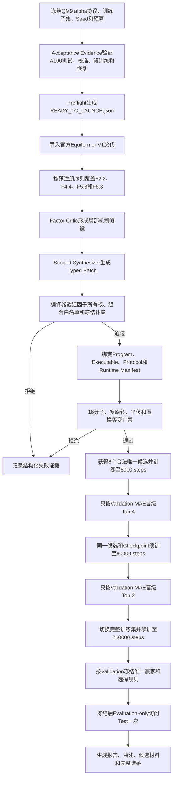

# 正式V1实现状态与运行证据

## 一、当前结论

截至2026年7月26日，等变DSL正式V1已经达到“可以直接启动正式实验”的工程状态。正式Launcher已在A100服务器上通过全新的Preflight-only验收，并生成`READY_TO_LAUNCH.json`，结果为`ready=true`。

这里必须区分两件事：

- 已完成的是正式V1代码、协议、A100准入验证、恢复验证、Supervisor验证、结果归档和一次性Test机制；
- 尚未完成的是耗时较长的正式`8→4→2`搜索本身，因此现在不能声称已经找到优于Equiformer V1父代的最终架构。

本次真实验收材料位于：

- [READY_TO_LAUNCH.json](../reports/正式V1可运行验收_20260726/READY_TO_LAUNCH.json)
- [acceptance_evidence.json](../reports/正式V1可运行验收_20260726/acceptance_evidence.json)
- [STATUS.md](../reports/正式V1可运行验收_20260726/STATUS.md)

## 二、三端版本身份

|位置|仓库或分支|版本说明|
|---|---|---|
|本地仓库|`C:\Users\26517\Documents\中关村\equivariant-nas`|正式功能代码基线为`61c0ef5`，其后只增加本状态文档和可见验收快照|
|GitHub远程仓库|[tju-yxq/openevolve的codex/equivariant-dsl分支](https://github.com/tju-yxq/openevolve/tree/codex/equivariant-dsl)|维护同一分支HEAD|
|A100服务器仓库|`/home/20262202788/equivariant-nas`|通过Git Bundle与同一分支HEAD同步|

正式分支为`codex/equivariant-dsl`。本地、GitHub和服务器使用同一提交，服务器因GitHub直连不稳定，通过本地Git Bundle传输后执行Fast-forward同步，没有新建替代仓库或替代Run。

## 三、正式V1完整工作流



正式V1不允许LLM直接修改任意Python源码。第一周期采用预注册因子覆盖，Critic和Synthesizer只能在当前因子的Scope内提出机制假设和Typed Patch；编译器验证未选因子保持冻结，并要求构造参数完整匹配已认证组合。候选只有通过编译、身份、数值健康和等变性门禁后才消耗训练预算。

搜索阶段最多允许32次生成尝试，目标不是“尝试8次”，而是获得8个合法、唯一、非父代、完成8000 steps且存在可恢复Checkpoint的候选。失败候选保留证据但不占8个合法候选名额。随后按Validation MAE完成`8→4→2`晋级，搜索和晋级期间禁止访问Test。

## 四、正式开放的四个叶子因子

|因子|科学作用|父代选项|正式可搜索替代|执行路径|
|---|---|---|---|---|
|`F2.2`径向编码|控制距离的基展开和径向网络容量|Gaussian、128基、`[64,64]`|Gaussian、96基、`[96,96]`|官方V1构造器|
|`F4.4`多头组织|控制注意力头数和通道组织|4头|2头或8头|官方V1构造器|
|`F5.3`归一化与尺度稳定|控制等变归一化和degree rescaling|Layer norm、关闭rescaling|Layer norm、开启rescaling|官方V1构造器|
|`F6.3`多层readout|改变不变量特征的多层融合和输出构造|终端readout|多层readout|认证的`exact_hybrid`后端|

两个曾经可编译但A100门禁失败的选项已从正式Capability Profile移除，并保留在`rejected_options`中：

- `F2.2`的Bessel、64基、`[64,64]`；
- `F5.3`的Instance norm、关闭rescaling。

这不是把失败隐藏起来，而是把“可编译”和“有资格进入正式排名”分开。正式搜索只能看到经过A100数值准入的选项。

## 五、关键工程闭环

### 5.1组合级白名单

构造参数不能只逐字段判断是否合法。正式编译要求参数整体匹配一个预注册组合，因此Gaussian、96基和`[64,64]`这种“字段分别合法但组合未认证”的交叉拼接会以`E_REGION_011`拒绝。

### 5.2不可混淆的身份链

每个候选分别绑定：

- `Program ID`：规范化DSL程序语义；
- `Executable ID`：程序、Lowering Plan、后端语义和源码身份；
- `Protocol ID`：数据、Seed、batch size、step终点、验证间隔和训练协议；
- `Runtime Manifest`：实际解释器、依赖、GPU、源码Hash、数据Hash和启动参数。

缓存、Checkpoint和恢复必须逐项匹配身份。身份不一致时停止并报告，不允许重新生成另一个候选覆盖原证据。

### 5.3候选恢复

A100人工中断恢复验证使用Seed 206、batch size 32和1000-step终点。Trainer在step 859写入Checkpoint后被终止，随后在同一候选目录恢复并执行剩余141 steps：

```json
{
  "start_global_step": 859,
  "steps_executed_current_job": 141,
  "global_step": 1000,
  "test_evaluated": false
}
```

恢复前后`runtime_manifest.json`、`protocol.json`和`architecture.dsl.json`的SHA-256完全一致；`checkpoint_last.pth`的Hash按预期变化，证明恢复的是同一架构和同一协议，模型参数继续更新。

### 5.4Test硬隔离和最终一次性评估

所有搜索、等变校准、短训练和恢复记录均为`test_evaluated=false`。多保真控制器只按Validation MAE晋级。Finalizer要求状态达到`completed_validation_selection`后先写入不可变`selection_freeze.json`，再使用`--evaluation-only --evaluate-test`执行一次Test；同时要求`steps_executed_current_job=0`，防止最终Test阶段继续训练。

## 六、A100等变门禁证据

父代使用Seed 201至205完成阈值校准，观测上界为：

- 最大相对误差：`0.00453571014907851`；
- 最大绝对误差：`0.007137298583984375`。

冻结协议`formal-v1-symmetry@2`采用：

- 相对硬阈值：`0.01`；
- 绝对硬阈值：`0.015`；
- 相对误差和绝对误差同时超过硬阈值时拒绝。

每次正式审计覆盖16个分子、4次随机旋转、2次平移和2种节点置换。Seed 202至205是用于制定`@2`阈值的历史`formal-v1-symmetry@1`校准记录，变换规模一致；Acceptance Evidence明确保存了这一来源关系，没有把历史记录改写成后来冻结的协议版本。

## 七、父代和四因子A100短训练

短训练协议为QM9极化率、固定训练集1/4、batch size 32、Seed 201、300 optimizer steps、终点强制Validation且禁止Test。

|候选|Validation MAE|训练后最大相对误差|训练后最大绝对误差|Checkpoint|Test参与|
|---|---:|---:|---:|---|---|
|Equiformer V1父代|2.688268|0.001544|0.003951|存在|false|
|`F2.2`正式替代|2.971875|0.002593|0.003948|存在|false|
|`F4.4`正式替代|3.327707|0.001416|0.002998|存在|false|
|`F5.3`正式替代|4.231487|0.003519|0.008767|存在|false|
|`F6.3`正式替代|2.732748|0.001747|0.004883|存在|false|

300 steps只验证真实训练、Validation、等变性和Checkpoint链路，不用于判断最终架构优劣。当前极短预算下没有替代候选优于父代，正式V1不会把该结果描述成架构搜索成功。

## 八、自动化测试与Acceptance Evidence

### 8.1本地测试

- 结果：`150 passed, 6 skipped`；
- 跳过原因：Windows本地环境没有e3nn、timm和官方GPU运行依赖。

### 8.2A100服务器测试

- 结果：`160 passed, 1 skipped`；
- 唯一跳过项：未配置Equiformer V2运行时；正式V1使用Equiformer V1，不受该项影响。

### 8.3Preflight不再过早Ready

Preflight现在必须验证`acceptance_evidence.json`，其中绑定：

- 当前Git Commit；
- 关键Trainer、Compiler、Router、因子、协议和Launcher文件Hash；
- A100全量pytest日志Hash和通过数；
- Seed 201至205校准Summary的Hash；
- 五个父代或因子短训练Summary的Hash；
- 恢复前后身份Hash和训练进度；
- Supervisor空Run日志和Ready文件；
- `test_evaluated=false`。

任一关键代码、协议或证据文件发生变化，旧Acceptance Evidence都会失效，Preflight返回`ready=false`。仓库中的可见验收快照绑定正式功能代码基线`61c0ef5`；服务器在每次三端同步后重新生成现场Acceptance Evidence，使正式Launcher始终绑定服务器当前分支HEAD。真实Launcher输出为：

```text
Ready：true
开放因子：F2.2, F4.4, F5.3, F6.3
Test参与搜索：false
```

## 九、正式实验材料归档

每个合法或失败候选都保存生成、编译和训练证据。正式结束后，Finalizer会在主Run中生成：

```text
candidate_index.json
evolution.jsonl
promotion_history.jsonl
failure_evidence.jsonl
full_fidelity_archive.jsonl
state.json
heartbeat.json
STATUS.md
controller.log
supervisor.log
final_report.md
final_report.html
assets/mae_vs_step.png
assets/factor_comparison.png
```

每个候选的`candidate_materials`目录包含父代和子代DSL、Typed Patch、三阶段LLM记录、Compiler Report、Lowering Plan、Runtime Manifest、等变审计、训练曲线、Checkpoint和Result。Checkpoint优先使用硬链接归档，避免重复占用服务器磁盘。

## 十、启动方式

只验证环境和正式证据，不启动耗时训练：

```bash
cd /home/20262202788/equivariant-nas
bash scripts/launch_dsl_formal_v1.sh \
  /home/20262202788/equivariant-nas/runs/dsl_formal_v1_seed201 \
  --preflight-only
```

启动带同目录自动恢复的正式实验：

```bash
cd /home/20262202788/equivariant-nas
bash scripts/supervise_dsl_formal_v1.sh \
  /home/20262202788/equivariant-nas/runs/dsl_formal_v1_seed201
```

Supervisor通过`flock`保证同一Run只有一个控制器，并且只恢复同一Run和同一候选。若需要人工停止，应在主Run目录创建`STOP`文件；不会新建替代Run。

## 十一、当前尚未完成的研究结果

正式V1代码已经Ready，但以下结论必须等待正式`8→4→2`实验，不能提前宣称：

1. 是否至少出现一个Validation MAE优于Equiformer V1父代的候选；
2. 8k、80k和250k阶段排序是否一致；
3. 哪个因子方向在完整训练下最有效；
4. LLM-in-DSL是否比Random-in-DSL减少无效候选或更早找到改善；
5. 当前有限四因子搜索能否支持论文级性能结论。

正式V1验证的是可信、可恢复、保持等变约束的LLM驱动架构搜索链。V1到V2类新算子发现、双因子交互、语言在线进化、二维任务和多数据集泛化仍属于后续V1.1或论文级实验范围。
