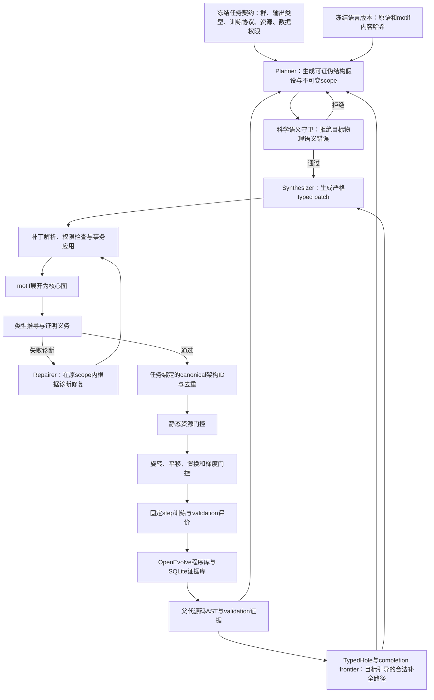

# 等变架构DSL设计与实现状态审计

> 项目：EvoEquiLang等变网络架构DSL与LLM驱动搜索  
> 审计日期：2026年7月25日  
> 代码分支：`codex/equivariant-dsl`  
> 审计原则：只把源码、测试、数据库和真实运行结果能够直接证明的内容标记为已实现

## 一、结论

当前系统已经形成一条可执行的三维等变架构生成主链：任务契约→带群表示类型的架构AST→motif展开→静态类型推导与证明义务→typed patch→Planner、Synthesizer、Repairer→OpenEvolve程序数据库→DSL原生编译评估→SQLite证据库。真实GLM-5.2运行已经从Equiformer V1父代生成不同语义ID的合法子代，并完成零训练步编译评估。系统还具备第一版`TypedHole`与多维completion distance，能够从现有typed values确定性搜索合法原语路径，将路径物化为带声明类型、机器条件、输出重连和失活路径裁剪的typed patch，并把部分编译错误转换成scope受限的Repairer可信补全建议。

这不等于完整研究目标已经完成。当前completion只覆盖由目标类型引导的一元和二元核心原语最短路；虽然已经支持输入端口和程序输出两类sink的确定性物化及SQLite记录，但尚未形成带分支回溯、跨候选状态共享、motif级动作和资源联合剪枝的完整部分程序搜索器。严格语义重写也只有第一批identity消除与残差交换规则及proof trace，尚无e-graph、通用等价证明和最低代价提取。其他主要缺口是二维SO(2)/O(2)数值后端、V1精确节点级后端、完整V2 block表达能力、语言自身双时间尺度进化以及论文级多任务实验。现阶段可以称为“论文级设计下的可运行三维核心原型”，不能称为“一般有效性已经验证”。

## 二、当前端到端工作流



工作流中有三个不可混淆的表示。源码AST保留`block5`、`scalar_readout`等稳定编辑位置；规范AST消除名称差异并生成语义ID；后端IR决定如何调用e3nn、Equiformer V1或Equiformer V2实现。LLM只能编辑源码AST，不能把规范化产生的`n000x`标签当作源码位置。

## 三、已经由代码证明的能力

| 能力 | 主要实现 | 当前证据 | 状态 |
| --- | --- | --- | --- |
| 群契约 | `groups.py` | SO(2)、O(2)、SO(3)、O(3)结构测试 | 已实现抽象层 |
| irrep模型 | `irreps.py` | 解析、维度、宇称、张量积路径测试 | 已实现 |
| 等变值类型 | `types.py` | group、carrier、irreps、frame、axes、dtype、measure、认证等级 | 已实现 |
| 架构AST | `ast.py` | 稳定JSON往返与Schema测试 | 已实现 |
| 核心原语注册表 | `registry.py` | 31个原语均有类型规则和机器可读语义契约 | 已实现三维主干 |
| motif系统 | `motifs.py`、`reference_motifs.py` | V1初始消息、V1残差消息、V2 SO(2)残差路径可展开 | 已实现参考motif |
| 静态类型推导 | `inference.py` | 正例与负例类型测试 | 已实现 |
| 证明义务 | `obligations.py` | 张量积路径、宇称、聚合、frame平衡、输出契约 | 已实现核心集合 |
| typed patch | `patch.py` | 精确线协议、scope、父代ID、事务提交测试 | 已实现7类原子编辑 |
| 可执行patch条件 | `patch.py` | 5类结构前后置条件、事务失败回滚测试 | 已实现结构条件子集 |
| 图liveness | `inference.py` | 输出祖先闭包和死代码负例测试 | 已实现 |
| TypedHole补全 | `completion.py` | 一元/二元可信原语超图搜索、多维距离、输入/输出sink物化和失活路径裁剪测试 | 已实现第一版闭环 |
| 严格语义重写 | `rewrites.py`、`canonicalize.py` | identity消除、残差交换、concat非交换负例、固定点和proof trace测试 | 已实现第一批保守规则 |
| canonical ID | `canonicalize.py` | 重命名、字典顺序和交换输入稳定性测试 | 已实现基础规范化 |
| 任务绑定ID | `task.py`、`compiler.py` | 同一图绑定不同任务契约得到不同ID | 已实现 |
| 语言内容快照 | `language.py` | 原语和motif内容哈希、运行时漂移拒绝测试 | 已实现 |
| LLM三阶段协议 | `llm_protocol.py`、`search.py` | Planner修复、补丁修复、scope锁和失败响应审计 | 已实现主流程 |
| 科学语义守卫 | `semantics.py`、`task.py` | QM9 alpha张量目标误述负例测试 | 已实现QM9 alpha规则 |
| SQLite证据库 | `evidence_store.py` | 候选、任务、语言、prompt、patch、completion、编译和评价记录测试 | 已实现核心表 |
| e3nn图后端 | `backends/e3nn_backend.py` | 参数构建、前向与数值等变测试 | 已实现受支持原语子集 |
| Equiformer V2路径 | `backends/equiformer_v2_backend.py` | 官方SO(2)卷积、S²激活和完整融合图测试 | 已实现封闭融合模式 |
| QM9适配 | `backends/qm9_model.py` | 图输入、节点输出和标量读出接口测试 | 已实现接口层 |
| DSL评估pipeline | `pipeline.py` | 编译、资源、对称性、梯度、训练分发和test拒绝测试 | 已实现 |
| 固定step训练入口 | `training/fixed_step_trainer.py` | 任务契约、DSL程序、checkpoint和一step服务器烟测 | 已实现入口与恢复 |
| OpenEvolve入口 | `scripts/run_dsl_evolution.py` | 真实LLM生成两个程序、可恢复数据库和证据记录 | 已实现单代主流程 |

“已实现”表示该能力在当前支持范围内有执行路径和测试，不表示性能、完备性或跨领域泛化已经得到论文实验验证。

## 四、原语语言当前覆盖范围

当前31个可信核心原语覆盖以下类别：

1. 表示保持与线性变换：`identity`、`irrep_linear`、`change_multiplicity`、`irrep_concat`、`irrep_slice`和`residual_add`。
2. 等变耦合：`tensor_product`、`invariant_compatibility`和`invariant_weight`。
3. 几何构造：`relative_position`、`distance`、`radial_basis`、`cutoff_envelope`和`spherical_harmonics`。
4. 载体变换与聚合：`edge_lift`、`segment_sum`、`segment_mean`、`segment_softmax`和`global_pool`。
5. 合法非线性：`scalar_activation`、`norm_activation`、`gate`、`s2_activation`和`separable_s2_activation`。
6. frame变换：`to_edge_frame`与`from_edge_frame`。
7. 稳定化：`equivariant_norm`、`stochastic_depth`和`invariant_dropout`。
8. 三维高效路径：`so2_convolution`。

每个原语现在不仅有名字和端口，还公开必需属性、可选属性、群范围、认证等级、后端键、语义约束和编辑说明。例如：

- `gate`只能用不变标量缩放完整非标量irrep块，输出仍是value的irreps；
- `irrep_linear`可以改变已有irrep的multiplicity，但不能创造输入中不存在的阶数或宇称；
- `tensor_product`才能通过合法Clebsch–Gordan路径产生新的阶数，包括把隐藏$l>0$信息耦合到$l=0$；
- edge frame中的值必须通过匹配`frame_id`返回global frame后才能聚合到节点。

## 五、真实LLM迭代的修正轨迹

### 5.1 从协议失败到合法子代

| 运行 | 主要失败 | 暴露的设计问题 | 对应修正 |
| --- | --- | --- | --- |
| `smoke_v3` | `E_PATCH_002` | Repairer使用`anchor/mode/new_subgraph`替代方言 | 权威patch Schema和精确payload契约 |
| `smoke_v4` | `E_TYPE_004` | LLM不知道V1残差块要求输入与hidden irreps一致 | motif跨节点语义约束和编辑说明 |
| `smoke_v5` | 科学假设与scope失败 | 把alpha误称rank-2张量；Repairer扩大scope | 任务科学守卫和scope不可变比较 |
| `smoke_v6` | 修复次数被输出包装消耗 | 模型输出解释文字加唯一JSON块 | 唯一JSON代码块确定性归一化 |
| `smoke_v7` | 无生成失败 | 生成合法张量积标量耦合子代 | 首次真实闭环成功 |
| `smoke_v8` | 类型通过但新增末端为死代码 | postcondition只是自然语言且未执行；缺少输出可达性门控 | 图liveness与机器可执行条件 |
| `smoke_v9` | 无生成失败 | 6次Repair后形成真实多尺度输出路径 | 严格闭环再次成功 |

### 5.2 `smoke_v7`子代

父代架构ID为`880b8fd25d9cfc90`，子代架构ID为`5fa6c0eb42048b9a`。Planner提出的假设是：在标量读出之前显式加入`block5×block5→l=0`张量积耦合，使隐藏$l>0$方向信息通过合法耦合进入不变量，而不是被`select_scalars`直接丢弃。

最终patch在不可变scope`[block5,scalar_readout]`内完成四项编辑：

1. 插入`tensor_l0_coupling`，请求`32x0`合法张量积输出；
2. 插入`scalar_concat`，拼接原`block5`和新增标量；
3. 将`scalar_readout.x`重连到`scalar_concat`；
4. 把`scalar_readout`替换为输出`1x0`的`irrep_slice`，保持`graph_pool`契约不变。

编译器消解了新增张量积的`IRREP_PATH_EXISTS`与`PARITY_MATCH`义务，最终输出继续满足一个SO(3)图级标量。零训练步评估记录为：

| 字段 | 父代 | 子代 |
| --- | ---: | ---: |
| `valid` | `true` | `true` |
| 参数估计 | 452704 | 1140832 |
| 展开后节点数 | 31 | 33 |
| `test_evaluated` | `false` | `false` |
| fidelity steps | 0 | 0 |

参数数值来自当前静态/构建估计，仅用于烟测资源门控。由于没有训练step和validation MAE，不能判断该子代是否有效改善极化率预测。

### 5.3 证据库完整性

`smoke_v7/evidence.sqlite`包含：

| 实体 | 数量 |
| --- | ---: |
| `candidate_programs` | 2 |
| `patches` | 1 |
| `prompt_runs` | 4 |
| `compiler_runs` | 2 |
| `evaluations` | 2 |

两条evaluation的split均为`validation`，并且`test_evaluated=false`。原始Planner、Synthesizer和Repairer响应均保留，允许回放为什么前两个patch版本被拒绝以及第三个版本为何通过。

### 5.4 completion frontier与严格闭环复验

`completion.py`把当前可用值视为零代价状态，把可信核心原语视为类型检查后的超边。它同时输出最少原语数和结构搜索代价，后者对张量积、拼接等复杂操作设置更高tie-break代价，避免“同步但明显更复杂”的路径压过简单适配路径。当前测试覆盖：

- node mixed irreps到graph scalar的两步补全；
- edge frame到global node的frame恢复与聚合；
- 两个向量通过张量积产生新标量路径；
- 跨group不可达判定；
- 后端不支持步骤计数；
- 源码节点ID保持的program completion frontier。
- completion路径到输入端口typed patch的确定性物化；
- completion路径到程序输出的显式`rewire_output`；
- 输出改接后旧readout失活路径的确定性裁剪；
- completion请求、结果、物化patch和状态的内容寻址SQLite恢复。
- `E_TYPE_004`、`E_CARRIER_001/002/003`、`E_FRAME_004/005/006`和`E_OUTPUT_001`到局部TypedHole的保守映射；
- Repairer提示中的scope兼容completion建议及prompt证据回放。

`smoke_v8`证明只检查类型仍不够：LLM插入了多尺度读出节点，却没有改变程序输出，因此新增节点虽然各自类型合法，实际不参与预测。新增liveness门控要求所有节点都属于至少一个程序输出的祖先闭包；typed patch的precondition与postcondition也改为机器可执行结构断言，不再接受自然语言条件。当前条件集合进一步加入`node_absent`，用于证明completion物化后旧失活路径确实被删除。

在这些门控下，`smoke_v9`再次成功。子代架构ID为`8a455f8b39135fe4`，通过六次Repair把block2、block4和block5的标量池化结果拼接，经图级`irrep_linear`映射为`1x0`，并保持程序输出仍指向活跃的`graph_pool`节点。19条postcondition、图liveness、类型推导和输出契约全部通过，`program_count=2`且`test_evaluated=false`。该运行的语言registry哈希为`f18682682b782b0fd9dff450f8ac5316ea0ff6f647bc24fa65f5631d88505da5`，已经绑定原语与motif内容，不再只绑定名称。

## 六、验证状态

### 6.1 本地

运行命令：

```powershell
$env:PYTHONPATH=(Get-Location).Path
pytest -q
```

结果：`115 passed,6 skipped`。跳过项来自本地缺少e3nn、timm或官方Equiformer V2运行依赖，不是测试失败。

### 6.2 A100服务器

运行命令：

```bash
EQUIFORMER_V2_ROOT=/home/20262202788/equiformer_v2 \
PYTHONPATH=. \
/home/20262202788/conda-envs/equiformer/bin/python -m pytest -q \
  tests/test_dsl*.py tests/test_semantics.py
```

结果：`83 passed`。覆盖官方V2 SO(2)路径、S²激活、完整DSL融合图、非线性数值等变、completion distance与物化、图liveness、可执行patch条件、诊断驱动Repairer建议、严格重写数值等价、LLM协议、证据库、pipeline和训练入口。测试产生8条旧版NumPy别名弃用警告，没有失败。

## 七、部分实现而非完成的能力

| 能力 | 已有部分 | 尚缺内容 |
| --- | --- | --- |
| 规范化 | 稳定排序、节点重命名、两条严格规则、逐步proof trace、rewrite registry哈希和编译器语义版本 | 更多已证明规则、e-graph等价类和最低代价提取 |
| V1后端 | 未修改参考图可调用官方构造器；一般图可走e3nn表示流后端 | 对V1 attention、radial网络和权重语义的精确节点级往返 |
| V2后端 | 封闭SO(2)+S²路径可融合到官方实现 | 完整Equiformer V2 block、attention、归一化和多分辨率配置 |
| 成本模型 | 静态参数、FLOPs和资源门控接口 | 经实测校准的保守显存上界和逐原语时延模型 |
| 数值认证 | 旋转、平移、置换和梯度测试 | O(3)反射、二维群和更多随机属性覆盖 |
| LLM生成 | 单代真实闭环、编译修复和证据记录 | 多代稳定性、并行候选、失败聚类和生成有效率统计 |
| 部分程序合成 | `TypedHole`、目标引导超图搜索、多维距离、输入/输出sink物化、失活路径裁剪、completion证据表及部分诊断到Repairer建议 | 分支回溯、跨候选状态共享、motif级动作、资源联合剪枝、motif内部诊断映射及建议采用率实证 |
| 语言进化 | motif准入数据结构和测试 | 自动反统一、描述长度收益、回放集和双时间尺度调度 |
| 训练 | 固定step、checkpoint和validation入口 | 对新结构的长训练稳定性与多保真晋级实证 |

## 八、尚未实现的论文关键能力

以下缺口在完成前不能声称“完整一般有效DSL”或“已经支持从V1自动发现V2”：

1. 把当前可物化TypedHole最短路扩展为可分支回溯、跨候选共享状态并支持motif级动作的完整部分程序搜索器。
2. 把当前分量距离提升为对剩余编辑预算严格可证明的下界，并与资源上界联合剪枝。
3. 在现有proof trace与两条严格规则上增加更多已证明重写、e-graph等价类和最低代价提取。
4. 从成功谱系执行anti-unification并提出新motif的完整算法。
5. 语言版本在慢时间尺度上的自动提案、准入、回滚和跨任务回放。
6. 二维SO(2)/O(2)数值后端与至少一个图像或平面物理任务。
7. O(3)反射数值验证和宇称敏感任务。
8. Equiformer V1与V2的精确表达性往返，不仅是表示流近似和封闭路径融合。
9. 与自由代码OpenEvolve、SPARK区域编辑、固定NAS空间在相同模型、prompt信息和计算预算下的正式对照。
10. 多目标、多数据集、多随机种子实验和统计显著性分析。

## 九、当前论文主张边界

当前证据可以支持的方法性陈述是：带群表示类型、机器可读原语契约、不可变scope和编译修复的DSL能够约束真实LLM生成，并且至少有一次真实运行产生了通过静态等变检查的非平凡结构子代。

当前证据不能支持以下结论：

- DSL提高了最终QM9 alpha测试MAE；
- DSL比OpenEvolve或SPARK收敛更快；
- LLM已经发现Equiformer V2级新算子；
- 当前语言对二维和任意群一般有效；
- 一次合法候选证明了生成有效率显著提高；
- 零训练步静态参数估计证明候选具备实际速度优势。

## 十、下一阶段实现顺序

1. 把当前保守诊断映射扩展到motif内部和更多错误类别，并实现跨候选部分状态共享、分支回溯和资源联合剪枝。
2. 扩展严格语义重写为e-graph等价类和代价提取，同时维持“未经证明不合并”的准入门。
3. 扩展V1/V2后端能力矩阵并建立逐节点unsupported诊断。
4. 实现motif反统一、准入证据和语言慢时间尺度进化。
5. 增加SO(2)/O(2)数值后端和二维任务，验证群抽象不是三维硬编码。
6. 在完成上述机制后运行小预算多代实验，测量合法率、修复次数、重复率、completion distance剪枝收益和单位GPU小时最优validation MAE。
7. 机制稳定后再执行完整多保真训练、跨任务实验和最终test审计。

## 十一、审计结论

当前代码已经不再是“四因子配置搜索”的改名版本，也不是让LLM自由修改Python的包装器。它具备显式群表示类型、可展开motif、结构化补丁、确定性编译诊断、真实后端和证据闭环。`smoke_v7`证明这条主链能够在真实LLM上工作。

但一般有效、可投稿论文级系统的核心研究量仍集中在完整部分程序合成、严格重写、语言进化、二维泛化和公平对照实验。后续实现应以这些缺口为主，不能把更多固定motif枚举误当成语言创新。
