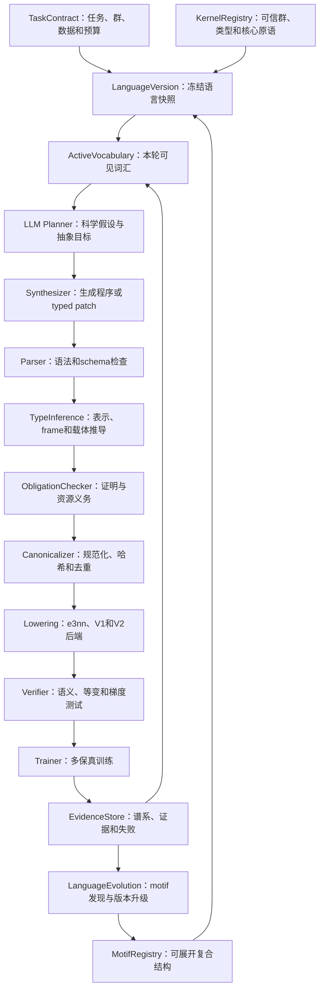

# 论文级通用等变架构DSL第一版设计规范

> 规范版本：EvoEquiLang 1.0-draft  
> 日期：2026年7月24日  
> 文档性质：规范性设计、实现蓝图与论文实验契约  
> 当前状态：本文件定义目标系统；现有四因子`ArchitectureSpec`仅作为迁移来源，不代表本规范已全部实现

## 一、研究目标与边界

### 1.1 研究目标

本项目设计一种面向大语言模型（Large Language Model，LLM）的通用等变神经网络架构领域特定语言（Domain-Specific Language，DSL），使LLM能够在明确的群作用、表示类型、组合规则和计算预算约束下生成、修改、验证和进化二维与三维等变网络架构。

系统需要同时满足四个目标：

1. **数学正确性**：候选在进入训练前具有可追踪的等变类型推导；不能由LLM自行声明正确。
2. **架构表达性**：语言能够表达Equiformer V1、Equiformer V2及其非平凡混合结构，而不只是枚举整模型名称或调整超参数。
3. **生成有效性**：语言表示、错误诊断和active vocabulary应提高LLM产生合法、非重复且有结构意义候选的概率。
4. **研究可证伪性**：必须通过等预算对照、消融、跨任务迁移和语言版本实验，区分收益来自DSL、LLM、搜索算法还是额外计算。

### 1.2 不属于本语言的内容

以下内容属于不可由候选修改的任务契约：

- 数据集划分、训练样本子集和随机种子；
- 训练目标、单位和评价指标；
- batch size、最大optimizer step和验证节奏；
- optimizer、学习率协议及测试集使用时机；
- 单候选资源上限和总搜索预算；
- 编译器、验证器和评分器实现；
- 可信群表示代数和核心类型规则。

LLM可以提出语言扩展建议，但不能在生成候选时修改上述内容。

### 1.3 规范性用语

本文中的“必须”表示实现和实验均不可违反的要求；“应该”表示缺省应遵守、偏离时必须记录理由的要求；“可以”表示可选扩展。

## 二、当前实现与目标语言的差距

当前`equivariant_nas/spec.py`中的`ArchitectureSpec`已经提供以下能力：

- 四类因子：表示、算子、作用方式和宏结构；
- 固定枚举和数值范围检查；
- 稳定JSON序列化和候选哈希；
- 单因子修改边界；
- 从配置构建Equiformer V1的路径。

它仍属于**受约束超参数配置空间**，不是一般架构DSL，原因如下：

| 缺失能力 | 当前表现 | 目标能力 |
| --- | --- | --- |
| 计算图表示 | 固定构造函数参数 | 显式AST、节点、端口和数据依赖 |
| 群参数化 | 隐含E(3)/O(3)语义 | SO(2)、O(2)、SO(3)、O(3)等显式任务群 |
| 表示流 | 字符串形式的V1 irreps | 每条边携带可推导类型 |
| frame语义 | 不可表示 | global、edge和local frame显式转换 |
| 新结构组合 | 只能改字段 | 可组合原语、motif和图重写 |
| 静态证明 | 枚举检查 | 类型推导、证明义务和证书 |
| V2表达性 | 不支持 | 可分解表达SO(3)旋转、SO(2)卷积和S²激活 |
| 语言进化 | 固定词表 | 冻结内核加版本化motif词库 |

迁移策略不是删除当前系统，而是将`ArchitectureSpec`保留为`legacy_v1_config`后端，并增加从新DSL到旧构建器的兼容lowering。

## 三、总体系统架构



系统分为两个时间尺度：

- **内层候选进化**：语言版本冻结，只进化架构程序。
- **外层语言进化**：完成预注册的一批候选后，从证据中提出、验证和准入新motif，再发布新语言版本。

候选结果不能跨语言版本直接比较，除非任务契约、编译器版本和评价协议一致，并显式记录版本差异。

## 四、语言分层

### 4.1 L0：任务契约层

任务契约定义候选必须满足的外部语义：

```yaml
task_id: qm9_alpha_seed201
spatial_dimension: 3
group:
  orthogonal: O3
  translation: relative_coordinates
  permutation: node_set
input_ports:
  - name: atoms
    carrier: node
    type: "categorical_scalar"
  - name: positions
    carrier: node
    type: "cartesian_position"
output:
  carrier: graph
  representation: "1x0e"
  semantics: isotropic_polarizability
training_protocol_hash: "..."
resource_contract:
  max_parameters: 4238058
  max_peak_memory_bytes: 70000000000
  max_step_time_ratio: 1.50
```

任务契约本身不包含候选结构，并由实验管理器签名和冻结。

### 4.2 L1：可信核心原语层

核心原语是最小的可认证计算单位。每个原语必须提供：

- 唯一名称和语义版本；
- 多态输入输出类型签名；
- 前置条件与输出类型函数；
- 等变性来源；
- 参数量和计算量估计器；
- 至少一个可信后端；
- 单元、数值和梯度测试；
- 支持的群族和认证等级。

核心原语只能通过代码审查和完整回归测试升级，不能由候选搜索自动改变。

### 4.3 L2：motif组合层

motif是由核心原语或更低层motif组成的有类型子图。motif必须可展开，不允许把任意Python函数作为不可见黑盒。motif可以携带类型参数和容量参数，例如：

```text
TPMessage[
  hidden_irreps = H,
  edge_irreps = E,
  output_irreps = O,
  coupling_policy = depthwise
]
```

motif可由人工定义，也可从成功候选谱系中提炼后进入语言准入流程。

### 4.4 L3：架构程序层

架构程序由输入、值声明、节点、输出、容量参数和约束组成。它表示完整网络或可编译子图，是候选数据库中的主要genotype。

### 4.5 L4：typed patch层

typed patch是LLM修改架构的事务语言。它声明编辑范围、前置条件、替换子图、预期类型和科学假设。编译器先在副本上应用patch，全部检查通过后再提交。

## 五、统一群与表示模型

### 5.1 对称性契约

统一对称性由以下部分组成：

$$
\mathcal{S}=(d,G,T,P,C),
$$

其中$d$为空间维度，$G$为旋转或正交群，$T$为平移处理，$P$为置换作用，$C$为周期或晶格条件。

首个正式版本的目标支持矩阵如下：

| 空间 | 群 | 表示形式 | 后端优先级 |
| --- | --- | --- | --- |
| 2D | SO(2) | 整数频率$m$ | 第二后端 |
| 2D | O(2) | 频率加反射类型 | 第二后端 |
| 2D | Cn、Dn | 离散群irrep | 扩展后端 |
| 3D | SO(3) | 角动量$l$ | 第一后端 |
| 3D | O(3) | $l$加宇称$p$ | 第一后端 |
| 3D | SE(3)、E(3) | 相对坐标加SO(3)或O(3) | 第一后端 |
| 任意 | 节点置换 | 共享映射加对称聚合 | 第一后端 |

`SE(3)`和`E(3)`不另造一套隐藏表示。分子任务中的平移通过相对坐标和不依赖绝对位置的图构建处理，旋转或反射由纤维表示处理。

### 5.2 值类型

每个值具有以下类型：

```text
EquivariantType(
  group,
  carrier,
  irreps,
  frame,
  axes,
  dtype,
  measure,
  equivariance_level
)
```

字段含义如下：

| 字段 | 含义 |
| --- | --- |
| `group` | 表示对应的群族和参数 |
| `carrier` | `node`、`edge`、`graph`、`grid`或`pair` |
| `irreps` | 不可约表示及重数的规范化直和 |
| `frame` | `global`、`edge(src,dst)`、`local(id)`或`invariant` |
| `axes` | batch、节点、边、采样点等非表示轴 |
| `dtype` | 数值类型 |
| `measure` | 可选物理量纲和单位 |
| `equivariance_level` | 严格、构造性、经验性或未认证 |

三维O(3)不可约表示写作`mul x l parity`，例如`128x0e+64x1o+32x2e`。其中`e`为偶宇称，`o`为奇宇称。二维SO(2)表示使用频率，例如`64xm0+32xm1+16xm2`。

### 5.3 frame类型

frame必须是类型的一部分。不同frame中的同一组通道不能直接相加。允许的转换包括：

```text
ToEdgeFrame(global, edge_geometry) -> edge_frame
FromEdgeFrame(edge_frame, edge_geometry) -> global
ToLocalFrame(global, frame_field) -> local_frame
FromLocalFrame(local_frame, frame_field) -> global
```

frame变换必须成对出现，除非输出明确停留在该frame且任务契约允许。编译器维护frame flow，并在图出口检查未消解的局部frame。

### 5.4 等变认证等级

| 等级 | 名称 | 含义 |
| --- | --- | --- |
| E0 | 未认证 | 没有可用证明，不允许进入严格等变主搜索 |
| E1 | 经验等变 | 仅通过有限数值变换测试 |
| E2 | 构造等变 | 由已认证原语组合，且类型规则闭合 |
| E3 | 核心认证 | 原语具有数学推导、参考实现和完整测试 |

主实验候选必须达到E2；核心原语必须达到E3。E1候选只能进入单独的近似等变研究分支，不能与严格等变候选混合排名。

## 六、抽象语法与序列化

### 6.1 为什么采用规范JSON AST

第一后端采用规范JSON抽象语法树（Abstract Syntax Tree，AST），原因是：

- LLM可以稳定生成结构化输出；
- schema检查和错误定位明确；
- 便于内容寻址、缓存、差异比较和数据库存储；
- 不把解析器表面语法误当成语言创新；
- 后续可增加更简洁的文本前端，但统一lowering到相同AST。

### 6.2 顶层结构

```json
{
  "language_version": "1.0.0",
  "program_id": "optional-user-label",
  "task_contract": "qm9_alpha_seed201",
  "parameters": {},
  "inputs": [],
  "nodes": [],
  "outputs": [],
  "constraints": [],
  "annotations": {}
}
```

### 6.3 节点结构

```json
{
  "id": "block2.tp",
  "op": "core.tensor_product@1",
  "inputs": {
    "left": "block2.node_norm",
    "right": "edge.spherical_harmonics",
    "weights": "block2.radial_weights"
  },
  "attrs": {
    "out_irreps": "128x0e+64x1o+32x2e",
    "connection_mode": "uvu"
  },
  "declared_type": null,
  "annotations": {
    "role": "message_coupling"
  }
}
```

`declared_type`只用于增加检查，不能覆盖推导结果。若声明和推导冲突，编译失败。

### 6.4 参数类型

架构程序支持以下参数种类：

- `type_parameter`：irrep、群和frame；
- `capacity_parameter`：通道重数、层数和头数；
- `structural_parameter`：连接模式、聚合策略和分支选择；
- `backend_parameter`：仅影响等价实现的kernel选项；
- `schedule_parameter`：层间结构调度，不包括optimizer schedule。

训练超参数不得出现在架构参数中。

### 6.5 引用和作用域

节点ID在程序内唯一。motif内部使用局部ID，展开时采用调用节点命名空间。禁止位置依赖引用，所有连接必须通过稳定ID和端口表达。

## 七、核心原语体系

### 7.1 原语设计原则

核心原语必须满足以下原则：

1. 语义闭合：输入输出和群作用明确。
2. 粒度适中：能够重组出新结构，但不把单个乘加暴露给LLM。
3. 后端独立：语言语义不依赖特定类名。
4. 可估成本：训练前可估计参数量、FLOPs和中间激活规模。
5. 可测试：能够生成合法和非法属性测试样例。
6. 可规范化：明确交换性、结合性或等价重写边界。

### 7.2 几何原语

| 原语 | 输入 | 输出 | 核心约束 |
| --- | --- | --- | --- |
| `relative_position` | 源和目标位置 | 边向量 | 消除全局平移 |
| `distance` | 边向量 | 不变量标量 | 范数需满足数值稳定性 |
| `unit_direction` | 边向量 | 方向向量 | 零距离必须有显式策略 |
| `radial_basis` | 距离 | 标量基 | 基函数和cutoff分离 |
| `cutoff_envelope` | 距离 | 标量权重 | 只依赖不变量距离 |
| `spherical_harmonics` | 方向 | 角表示 | 阶数和宇称由群决定 |
| `build_edge_frame` | 方向与可选参考轴 | frame token | 退化方向需要确定策略 |
| `rotate_features` | 特征和frame token | 新frame特征 | 表示矩阵必须匹配irrep |

### 7.3 表示与线性原语

| 原语 | 语义 | 类型规则 |
| --- | --- | --- |
| `irrep_linear` | 同类irrep重数混合 | 不能跨不等价irrep任意混合 |
| `irrep_slice` | 选择irrep或通道 | 输出是输入表示的子直和 |
| `irrep_concat` | 直和拼接 | group、carrier和frame必须一致 |
| `irrep_pad` | 添加零通道 | 不改变语义表示 |
| `change_multiplicity` | 调整通道重数 | lowering为合法线性映射 |
| `degree_route` | 按$l$或$m$分派路径 | 每个分支保持类型标记 |

### 7.4 耦合原语

| 原语 | 作用 | 关键属性 |
| --- | --- | --- |
| `tensor_product` | 两个表示的Clebsch-Gordan耦合 | 输出irrep、路径集合、共享方式 |
| `weighted_tensor_product` | 不变量权重控制耦合 | 权重载体与边或节点对齐 |
| `depthwise_tensor_product` | 限制通道间路径 | 路径映射必须完整定义 |
| `fully_connected_tensor_product` | 允许全部合法路径 | 成本上界必须通过 |
| `so2_convolution` | edge frame中按$m$耦合 | 输入必须在匹配局部frame |
| `frequency_mixing` | 同频率内部通道混合 | 不混合不兼容频率 |
| `contract_to_scalar` | 合法路径收缩到标量 | 输出必须为平凡表示 |

三维O(3)张量积类型规则为：

$$
(l_1,p_1)\otimes(l_2,p_2)=\bigoplus_{l=|l_1-l_2|}^{l_1+l_2}(l,p_1p_2).
$$

程序声明的每条输出路径必须属于该直和。不存在路径的输出通道必须在静态检查阶段拒绝。

### 7.5 消息传递与聚合原语

| 原语 | 输入输出 | 置换语义 |
| --- | --- | --- |
| `edge_lift` | 节点值到边值 | 按源或目标索引共享 |
| `edge_message` | 边上下文到边消息 | 对所有边使用共享程序 |
| `segment_sum` | 边到节点 | 对邻居顺序不变 |
| `segment_mean` | 边到节点 | 处理空邻域和度归一化 |
| `invariant_weighted_sum` | 不变量权重加权消息 | 权重必须为标量不变量 |
| `pair_update` | 节点对或边状态更新 | 载体和索引关系显式 |
| `global_pool` | 节点到图 | sum、mean或合法归一化 |

不得把依赖邻居排列位置的普通拼接作为集合聚合。

### 7.6 注意力原语

注意力被分解为以下原语，而不是单一黑盒：

- `query_projection`；
- `key_projection`；
- `value_projection`；
- `invariant_compatibility`；
- `segment_softmax`；
- `equivariant_value_weighting`；
- `head_merge`。

softmax输入必须是标量不变量。若使用非标量compatibility，必须先通过合法收缩得到平凡表示。

### 7.7 非线性原语

| 原语 | 适用对象 | 约束 |
| --- | --- | --- |
| `scalar_activation` | 平凡标量 | 可使用常规逐元素激活 |
| `norm_activation` | 非标量irrep | 通过不变量范数调制 |
| `gate` | 标量门与非标量通道 | 门的表示和数量必须匹配 |
| `gated_nonlinearity` | 标量、门和被门控通道 | 输出类型静态推导 |
| `s2_activation` | 球面网格表示 | 必须包含合法grid往返变换 |
| `separable_s2_activation` | 标量与高阶分量 | 标量和球面路径分别处理 |

禁止对$l>0$或$m\neq0$的表示分量任意逐元素应用ReLU、SiLU等常规激活。

### 7.8 稳定化与拓扑原语

| 原语 | 约束 |
| --- | --- |
| `equivariant_norm` | 不跨不兼容irrep或frame混合统计量 |
| `residual_add` | 两侧类型完全相同，或存在显式adapter |
| `residual_project` | adapter必须是等变线性映射 |
| `stochastic_depth` | 对整个等变分支使用不变量掩码 |
| `invariant_dropout` | 掩码策略不破坏表示块结构 |
| `compose` | 前后端口类型可统一 |
| `parallel` | 分支共享输入但独立推导 |
| `repeat` | 展开后每层类型闭合 |
| `stage` | 显式声明入口、出口和重复策略 |

`invariant_dropout`必须对同一个irrep副本的全部$2l+1$分量共享随机掩码；`stochastic_depth`必须对整条等变分支共享标量掩码。普通逐元素dropout不能作为这些原语的后端实现，因为它会破坏旋转下的表示块结构。

### 7.9 读出原语

| 原语 | 用途 |
| --- | --- |
| `select_scalar_irreps` | 标量目标读取 |
| `equivariant_readout` | 向量或高阶输出 |
| `invariant_pool` | 图级不变量 |
| `typed_pool` | 图级等变量，需定义载体和聚合方式 |
| `unit_transform` | 只改变物理单位，不改变群表示 |

输出端必须与任务契约的representation、carrier和measure一致。

## 八、motif与一般架构表达

### 8.1 必备参考motif

首版语言必须包含以下可展开motif：

- `V1TensorProductAttentionBlock`；
- `V1FeedForwardBlock`；
- `V2SO2AttentionBlock`；
- `V2S2FeedForwardBlock`；
- `DegreeRoutedHybridBlock`；
- `FrameHybridMessageBlock`；
- `InvariantGraphReadout`；
- `EquivariantNodeReadout`。

这些motif不是搜索空间中的原子模型选择。LLM可以展开并替换内部子图，也可以在合法边界组合V1和V2机制。

### 8.2 motif参数分离

每个motif的参数分为：

- 结构参数：决定计算图关系；
- 表示参数：决定irrep和frame流；
- 容量参数：决定重数、宽度和层数；
- 实现参数：只决定等价kernel。

论文中的架构创新比较应优先报告结构参数和表示参数变化，避免把纯宽度调节包装成新算子。

### 8.3 V1到V2表达性要求

语言通过以下操作链表达V2类路径：

```text
global SO(3) features
-> build edge frame
-> rotate features to edge frame
-> decompose by m
-> SO(2) convolution and gating
-> merge m blocks
-> rotate back to global frame
-> permutation-invariant aggregation
```

若实现只能写`block_type: v2`，则不满足本规范的表达性要求。

### 8.4 混合结构示例

一个合法的新候选可以让低阶表示使用V2局部frame路径，让高阶表示保留稀疏张量积路径，再在global frame中合并：

```text
input H
├─ slice l<=1 -> edge-frame SO(2) message -> global
└─ slice l>=2 -> sparse tensor-product message
-> direct-sum concat
-> equivariant linear adapter
-> residual add
```

这种候选改变的是计算路径和耦合结构，不只是修改一个超参数。

## 九、静态语义与类型推导

### 9.1 推导判断

类型系统采用如下判断形式：

$$
\Gamma;\mathcal{K};\mathcal{T}\vdash n:\tau\;\triangleright\;\Omega,
$$

其中$\Gamma$为已知值类型环境，$\mathcal{K}$为原语注册库，$\mathcal{T}$为任务契约，$n$为节点，$\tau$为推导输出类型，$\Omega$为仍需验证的证明义务集合。

程序合法要求所有节点可拓扑排序、所有端口类型统一、所有输出匹配任务契约，并且最终$\Omega$为空或只包含允许由运行时验证消解的义务。

### 9.2 类型统一

类型统一必须检查：

- 群是否相同或存在显式限制/诱导映射；
- carrier是否相容；
- frame是否相同；
- irrep直和是否精确匹配或存在显式adapter；
- 非表示轴是否广播合法；
- 物理量纲是否允许操作；
- 认证等级是否满足下游要求。

系统不能通过自动截断通道、静默广播或隐式frame转换“修复”类型错误。

### 9.3 关键类型规则

**残差规则**：

$$
\frac{\Gamma\vdash x:\tau\qquad\Gamma\vdash y:\tau}{\Gamma\vdash\operatorname{ResidualAdd}(x,y):\tau}.
$$

**不变量权重规则**：若$w$为平凡表示，$x$为任意表示，则$w\cdot x$保持$x$的表示类型。

**聚合规则**：若边消息对每条边使用共享函数，按目标节点执行交换且结合的sum聚合，则节点置换下保持等变。

**组合闭包规则**：若$f$和$g$在同一群作用下等变且类型可组合，则$g\circ f$等变。

### 9.4 证明义务

证明义务不是布尔标签，而是结构化记录：

```json
{
  "obligation_id": "frame-return:block3",
  "kind": "FRAME_BALANCE",
  "source_node": "block3.to_edge_frame",
  "required_before": "block3.aggregate",
  "status": "open",
  "discharged_by": null
}
```

主要义务包括：

- `IRREP_PATH_EXISTS`；
- `PARITY_MATCH`；
- `FRAME_BALANCE`；
- `INVARIANT_ATTENTION_WEIGHT`；
- `PERMUTATION_SAFE_AGGREGATION`；
- `OUTPUT_CONTRACT_MATCH`；
- `RESOURCE_BOUND`；
- `BACKEND_AVAILABLE`；
- `NUMERICAL_EQUIVARIANCE_CHECK`。

### 9.5 错误诊断

错误必须包含错误码、节点、端口、期望类型、实际类型、推导轨迹和局部修复建议。例如：

```text
E_FRAME_003
node: stage2.aggregate
input: messages
expected: frame=global
actual: frame=edge(src,dst)
trace: stage2.to_edge -> stage2.so2_conv -> stage2.aggregate
repairs:
  - insert from_edge_frame before aggregate
  - move aggregate after existing frame restoration
```

诊断建议只能来自预定义安全规则，不允许编译器自动改变科学结构。

## 十、规范化、等价与内容寻址

### 10.1 规范化目标

规范化用于：

- 去除无意义语法差异；
- 稳定候选ID；
- 复用编译和训练缓存；
- 识别重复候选；
- 比较motif是否真正新颖。

### 10.2 安全规范化规则

首版允许：

- 节点按拓扑与稳定ID重排；
- irrep直和按群规范顺序排序并合并相同项；
- 删除单位映射和无效零dropout；
- 将显式默认属性归一；
- 对声明为交换的输入排序；
- 展开或折叠已认证且版本一致的motif；
- 对纯线性连续adapter进行经验证的融合。

不允许仅凭形状相同交换非线性、归一化、聚合和frame转换。

### 10.3 三类等价

- **语法等价**：规范化AST完全相同。
- **构造等价**：由可信重写规则可证明相同。
- **经验近似等价**：有限输入上相近，只能用于分析，不能共享训练结果。

候选缓存只允许复用语法等价或构造等价结果。

### 10.4 候选ID

候选ID计算内容包括：

```text
canonical_ast
+language_version
+kernel_registry_hash
+compiler_version
+task_contract_hash
+backend_semantics_version
```

包含motif的候选以“motif完全展开、类型检查并规范化后的核心语义图”计算architecture ID。源motif AST作为可读和可编辑表示单独保存；patch、谱系、编译结果和evaluation统一引用展开语义ID，不能分别使用源AST哈希和展开图哈希。

实现kernel的性能版本变化但语义不变时，可另生成execution ID，不改变architecture ID。

## 十一、编译器与后端

### 11.1 编译流水线

```text
JSON AST
-> schema IR
-> typed graph IR
-> obligation-annotated IR
-> canonical IR
-> backend-neutral executable IR
-> e3nn/Equiformer module graph
-> verified PyTorch model
```

每一级IR都必须可序列化并保留源节点映射，使运行时错误能回到DSL位置。

### 11.2 后端接口

```python
class BackendLowering:
    def supports(self, op, types, attrs) -> bool: ...
    def infer_cost(self, op, types, attrs) -> CostEstimate: ...
    def lower(self, node, context) -> LoweredValue: ...
    def semantic_version(self) -> str: ...
```

第一组后端包括：

- `e3nn_core_backend`：线性、张量积、门控和球谐；
- `equiformer_v1_backend`：复用现有V1模块；
- `equiformer_v2_backend`：SO(3)旋转、SO(2)卷积和S²激活；
- `native_graph_backend`：聚合、载体转换和图级读出。

实现必须为每个后端提供逐节点支持报告。未实现的原语在lowering前以结构化错误拒绝，不能用identity、旧模型或形状相同的普通层代替。e3nn节点后端与Equiformer V1构造器兼容后端属于不同语义版本：前者执行展开后的核心图，后者只保证未修改旧配置的精确回建，两者的训练结果不得混为同一架构实现。

QM9训练适配器负责把`f_in`、`pos`和`batch`转换为DSL声明的`node_features`、`positions`、`edge_sh`及图索引上下文。适配器只物化显式支持的输入名，并在宽度或载体不匹配时失败；不得凭名称以外的启发式猜测输入语义。

### 11.3 后端可信边界

adapter必须显式声明语言类型与库对象之间的映射，并通过往返测试。禁止根据Python对象维度猜测irrep语义。

现有Equiformer V1构建器以整份`ArchitectureSpec`调用固定构造函数，不能执行任意节点级AST。兼容导入器必须为导入图保存语义指纹：未修改的导入图可以回建旧模型；一旦AST发生语义变化，构造器后端必须拒绝lowering，直到相关节点具有真正的逐原语后端。不得出现“DSL显示新结构、实际仍训练旧模型”的静默降级。

当前官方V1配置把各阶球谐和隐藏表示统一写为`e`，其可验证保证应按SO(3)旋转加相对坐标平移解释，而不能仅凭字符串后缀宣称O(3)反射等变。V1导入器因此去除parity语义并注册为SO(3)类型；e3nn后端为了兼容库的存储格式可以统一补充占位parity，但该占位不构成O(3)证书。反射测试只对任务和全部原语显式声明O(3)时启用。

### 11.4 成本模型

成本估计至少输出：

- 参数量精确值或有界值；
- 每节点、每边和每图FLOPs估计；
- 中间激活元素数；
- 预期峰值显存范围；
- 关键kernel类型；
- 不确定性和测量校准版本。

成本模型必须标记证据等级。只有经过后端校准并证明保守的`certified_upper_bound`才能消解资源上界义务；按表示维度计算的启发式参数量或FLOPs只能用于排序和预筛，不能冒充上界。最终训练前拒绝依据应为精确构建后的参数量、保守显存检查或已校准上界，实测step time和显存用于持续校准。

## 十二、typed patch与LLM生成协议

### 12.1 patch结构

```json
{
  "patch_version": "1.0",
  "parent_architecture_id": "...",
  "language_version": "1.0.0",
  "hypothesis": {
    "claim": "降低高阶全连接耦合成本，同时保留l=2到标量读出的路径",
    "evidence_refs": ["eval:parent:5000", "failure-cluster:tp-cost"],
    "uncertainty": "短保真排序可能不能外推到完整训练"
  },
  "scope": ["stage3.message"],
  "preconditions": [],
  "edits": [
    {
      "kind": "rewire_port",
      "target": "stage3.message",
      "payload": {
        "port": "x",
        "references": ["stage3.adapter"]
      }
    }
  ],
  "postconditions": [],
  "expected_effects": {
    "structure": [],
    "cost": [],
    "accuracy": "hypothesis_only"
  }
}
```

patch线协议必须满足以下不变量：

- 每个edit对象只能有`kind`、`target`和`payload`三个字段；
- `target`只能使用父程序中的源码节点ID，不能使用canonicalization阶段生成的`n000x`语义标签；
- `scope`由Planner一次授权，Synthesizer与Repairer必须原样保留，不能扩大；
- 新节点ID必须唯一，但新节点本身不需要预先写入scope；插入操作的既有锚点必须在scope内；
- `parent_architecture_id`、`language_version`和任务契约均不可由LLM修改；
- 原始模型响应始终追加写入证据库；解析器可以确定性提取唯一JSON代码块，但不能在多个代码块之间猜测。

### 12.2 编辑操作

第一版可信线协议已经定义并实现以下原子事务操作：

- `replace_node`；
- `change_attrs`；
- `rewire_port`；
- `insert_before`、`insert_after`；
- `delete_if_bypassed`；
- `instantiate_motif`。

完整研究版还应在相同事务与类型检查框架下扩展以下复合操作：

- `replace_subgraph`；
- `change_type_parameter`；
- `change_capacity_parameter`；
- `expand_motif`；
- `crossover_subgraph`；
- `apply_certified_rewrite`。

一次patch可以改变多个节点，只要这些变化构成一个类型闭合的科学假设。系统不再强制“一次只改一个字段”，但仍限制编辑scope和最大结构距离。

### 12.3 三阶段LLM协议

1. **Planner**：读取任务、父代和证据，输出科学假设与抽象结构目标。
2. **Synthesizer**：在active vocabulary中生成typed patch。
3. **Repairer**：只根据结构化编译错误在原scope内修复，不得改变假设以规避约束。

Planner不得读取test结果。Synthesizer不得修改任务契约。Repairer有固定次数上限，避免无效候选消耗无限LLM预算。

三阶段共享同一份机器可读语言契约。每个可见原语至少公开：输入端口、输出端口、必需属性、可选属性、群适用范围、认证等级、后端能力、语义约束和安全编辑说明；每个motif还公开必需属性、展开来源和跨节点不变量。例如`core.gate`必须明确声明“输出irreps等于value irreps，不能把$l>0$直接变成标量”，`motif.v1_residual_message`必须声明“残差两支的irreps完全一致”。LLM不能仅凭算子名称猜测语义。

Planner还必须读取可信任务语义。对于QM9的`alpha`，协议固定声明它是图级各向同性标量极化率，而不是rank-2张量输出；隐藏$l>0$表示可以通过合法耦合贡献到$l=0$读出。与该事实冲突的Planner响应由确定性科学守卫拒绝并进入Planner修复，不得写入候选谱系。

### 12.4 active vocabulary

active vocabulary通过以下过滤生成：

$$
V_a=F_G\cap F_\tau\cap F_s\cap F_b\cap(R_h\cup R_e),
$$

其中$F_G$为群兼容过滤，$F_\tau$为类型兼容过滤，$F_s$为scope过滤，$F_b$为预算过滤，$R_h$为历史高价值词汇，$R_e$为保留探索词汇。

必须保存每次LLM调用实际可见的词汇和过滤理由，以便复现实验。

### 12.5 提示信息边界

LLM上下文包含：

- 当前任务契约的只读摘要；
- 父代可编辑源码AST、只读canonical架构ID和目标scope；
- validation训练曲线和资源测量；
- 祖先、兄弟和archive代表候选；
- 失败类型分布；
- 当前语言版本、active vocabulary和示例；
- active vocabulary中每个原语和motif的机器可读语义契约；
- 明确区分measurement、inference和hypothesis的证据标签。

上下文不得包含测试集指标、未来阶段结果或无法追溯来源的自然语言结论。

## 十三、搜索闭环与信用分配

### 13.1 候选状态机

```text
PROPOSED
-> PARSED
-> TYPED
-> CERTIFIED
-> LOWERED
-> VERIFIED
-> QUEUED
-> TRAINING
-> EVALUATED
-> PROMOTED | ARCHIVED | FAILED
```

每次状态转换原子写入数据库，并保存失败阶段和错误码。训练checkpoint与架构ID、任务契约和fidelity绑定。

### 13.2 多保真晋级

多保真预算是训练协议，不属于DSL。当前batch size为32的实验协议可以使用8,000、80,000和250,000 optimizer steps，但语言设计不绑定这些数字。

晋级只能使用validation和资源指标。test只在预注册的最终阶段对冻结候选使用。不同fidelity的分数不得直接当作同一精度测量，需要使用排序可信度校准。

### 13.3 结构信用

每个patch记录：

- 直接父子差异；
- 结构距离和涉及原语；
- 单独变化收益；
- 与祖先变化的交互；
- 不同fidelity下的收益稳定性；
- 编译合法率和资源变化。

存在多因素交互时，不能把联合收益全部归给最后一次patch。系统应使用配对反事实候选或局部因子实验估计主效应和交互效应。

### 13.4 多样性archive

archive的行为描述符至少包括：

- frame策略；
- coupling path密度；
- 最大表示阶数；
- 高阶通道占比；
- 消息motif家族；
- 深度和参数量区间；
- validation MAE区间；
- 实测step time区间。

仅按MAE排序会过早丢失结构多样性，无法支撑语言学习。

## 十四、语言进化

### 14.1 不可进化与可进化内容

不可自动进化：

- 群公理和irrep定义；
- 张量积选择规则；
- 核心证明系统；
- 任务与评价契约；
- test访问策略。

可进化：

- 可展开motif；
- certified rewrite；
- active vocabulary检索策略；
- patch模板；
- 历史压缩和失败修复规则；
- 经严格审查的新核心原语提案。

### 14.2 motif发现

motif发现流程：

1. 从高质量且多样的候选中提取频繁有类型子图；
2. 使用反统一将具体通道数替换为类型和容量变量；
3. 计算描述长度压缩、新颖度和跨谱系支持；
4. 由LLM生成可解释名称、适用条件和结构假设；
5. 展开到核心原语后重新类型检查；
6. 在保留任务或保留seed上测试生成效用；
7. 通过准入门后发布新语言版本。

### 14.3 motif准入标准

新motif必须同时满足：

- 完全展开为E3核心原语或已准入motif；
- 规范化后不等价于已有词汇；
- 类型变量和适用群明确；
- 所有证明义务可消解；
- 至少来自两个独立谱系，或在独立任务上复用成功；
- 在固定LLM调用预算下提高合法率、候选质量或描述压缩；
- 引入收益超过词汇膨胀和搜索偏置成本。

### 14.4 新核心原语准入

新核心原语的门槛高于motif。必须有数学定义、类型签名、等变性论证、参考实现、至少两个后端或一个后端加独立参考计算、梯度检查、随机属性测试和跨任务消融。自动系统只能生成提案，最终准入需要人工审查。

### 14.5 语言版本

语言版本采用语义化版本：

- major：破坏类型或语义兼容；
- minor：新增原语、motif或可选字段；
- patch：不改变语义的诊断或实现修复。

每个版本保存父版本、registry哈希、迁移器、回归结果和冻结时间。候选必须绑定语言版本。

registry哈希必须覆盖原语和motif的内容哈希，不能只哈希名称列表。原语内容哈希至少绑定类型规则标识、端口、属性契约、群范围、认证等级、后端键和语义约束；motif内容哈希至少绑定展开AST、端口、必需属性、群范围、认证方式、语义约束和编辑说明。运行时registry与冻结快照不一致时必须拒绝搜索，防止同名语言发生静默语义漂移。

## 十五、数据库与可追溯性

### 15.1 核心实体

| 实体 | 关键字段 |
| --- | --- |
| `task_contracts` | 契约内容、哈希、冻结状态 |
| `language_versions` | 版本、父版本、registry哈希 |
| `primitive_records` | 签名、证明、后端和测试 |
| `motif_records` | 展开AST、类型变量和来源 |
| `candidate_programs` | canonical AST、架构ID和版本 |
| `patches` | 父代、scope、假设和编辑 |
| `lineage_edges` | 父子、crossover和生成调用 |
| `compiler_runs` | IR、诊断和耗时 |
| `proof_artifacts` | 义务、推导轨迹和证书 |
| `evaluations` | fidelity、seed、validation和资源 |
| `prompt_runs` | 模型、prompt、词汇、token和响应 |
| `language_proposals` | motif来源、准入与拒绝理由 |

### 15.2 证据不可变性

原始LLM响应、编译结果和训练指标追加写入，不允许覆盖。人工修正以新记录和父记录引用表达。报告中的每个表格或图应能回溯到evaluation ID。

源码ID和语义ID承担不同职责：源码ID是typed patch的稳定编辑位置；canonical节点标签只服务于去命名后的语义哈希。任何提示构建器不得把canonical标签伪装成可编辑源码ID，否则生成的补丁即使语义合理也无法应用到父程序。

### 15.3 防止test泄漏

数据库访问层对角色授权：candidate generator和promoter只能读取validation；test记录只对最终审计器开放。prompt构建器默认拒绝任何`split=test`证据。

## 十六、一般有效性的实验设计

### 16.1 研究问题

论文至少回答：

1. DSL是否提高LLM候选的合法率和结构新颖性？
2. 在相同训练预算下，DSL是否更快发现高质量候选？
3. 收益来自静态类型约束、active vocabulary、typed repair还是语言进化？
4. 语言是否能表达V1、V2和未预置的混合结构？
5. 学到的motif能否跨目标、跨数据集或跨群复用？
6. 严格等变认证是否比仅数值筛选更可靠？

### 16.2 主对照

| 方法 | 表示 | LLM角色 | 搜索外壳 |
| --- | --- | --- | --- |
| 自由代码OpenEvolve | Python代码 | 直接代码修改 | 相同进化外壳 |
| SPARK式区域编辑 | 人工划分代码区 | 反思后区域修改 | 相同进化外壳 |
| 四因子配置搜索 | 固定字段 | 参数patch | 当前基线 |
| 静态DSL | 冻结AST和motif | typed patch | 相同进化外壳 |
| 自进化DSL | 版本化AST和motif | typed patch加外循环 | 相同进化外壳 |
| 非LLM DSL进化 | 同一DSL | 随机或传统变异 | 相同预算 |

prompt不要求逐字一致，但任务信息、父代信息、模型、温度、token、调用次数、候选数和GPU训练预算必须对齐。

### 16.3 数据集与任务

建议实验矩阵：

- QM9极化率：主搜索任务，图级不变量；
- QM9另一个标量目标：同数据集跨目标迁移；
- rMD17能量与力：标量加向量输出；
- 二维旋转或反射任务：SO(2)/O(2)语言泛化；
- 可选材料或点云任务：扩大结构和规模分布。

只在QM9极化率上获得更低MAE，不能证明DSL一般有效。

### 16.4 指标

**生成质量**：语法通过率、类型通过率、E2认证率、去重后新颖率、每个有效候选的LLM token。

**搜索效率**：达到目标MAE的GPU小时、候选数、LLM调用数、area under best-so-far curve。

**架构质量**：完整训练validation/test MAE、参数量、step time、峰值显存和多seed稳定性。

**语言质量**：平均程序长度、motif复用率、词汇利用熵、跨任务迁移收益和版本退化率。

**正确性**：静态义务通过率、随机旋转/反射/平移/置换误差、梯度等变误差和非法程序召回率。

### 16.5 必要消融

- 去掉irrep类型，只保留shape；
- 去掉frame类型；
- 去掉证明义务，只做数值测试；
- 去掉active vocabulary，暴露完整词表；
- 去掉structured repair；
- motif不可展开的黑盒版本；
- 固定motif库与自进化motif库；
- 单节点patch与科学假设scope patch；
- 有无谱系反事实信用；
- 有无跨任务准入门。

### 16.6 统计要求

- 主结论至少使用多个搜索seed；
- 完整训练候选至少使用多个训练seed；
- 报告置信区间和效应量，不只报告最好一次；
- 预注册晋级规则和最终test候选数量；
- 对多保真排序计算Kendall或Spearman相关与置信区间；
- 失败候选计入生成成本，不能只比较成功样本。

## 十七、验证与测试体系

### 17.1 编译器单元测试

- 每个原语的合法和非法类型样例；
- 奇偶性和张量积路径；
- frame进入、退出和不平衡；
- carrier转换和置换安全聚合；
- 残差精确匹配与adapter；
- 输出契约和物理单位；
- 规范化幂等性；
- hash在等价程序上的稳定性。

### 17.2 属性测试

自动生成小型合法程序，验证：

```text
parse(serialize(program)) == program
canonicalize(canonicalize(program)) == canonicalize(program)
typecheck(expand(motif)) == declared_motif_signature
typecheck(apply(valid_patch, parent)) succeeds
apply(invalid_patch, parent) leaves parent unchanged
```

### 17.3 数值验证

对编译模型执行：

- SO(3)随机旋转；
- O(3)反射或反演；
- 全局平移；
- 节点重排；
- 边顺序重排；
- 前向与梯度等变检查；
- float32和float64容差校准。

容差必须按后端版本和dtype预先校准并保存。当前目标环境e3nn 0.4.4的float64张量积旋转测试使用$10^{-7}$相对误差门限；实测基准约为$2.44\times10^{-9}$。后续后端升级应重新标定，不能在看到候选结果后临时放宽阈值。

数值测试是E2组合证书的回归门，不替代核心数学规则。

### 17.4 表达性测试

- V1 DSL到原实现输出和梯度一致；
- V2 DSL到原实现输出和梯度一致；
- V1和V2程序能展开到核心原语；
- 至少一个混合候选不能退化为单个V1/V2选择开关；
- DSL可以产生标量、向量和高阶输出。

### 17.5 负例集

负例必须覆盖：

- 非标量注意力logit直接softmax；
- 对$l>0$逐元素ReLU；
- 不匹配irrep残差；
- edge frame消息直接节点聚合；
- 错误宇称张量积；
- 绝对位置进入平移不变读出；
- 顺序敏感邻居聚合；
- test指标进入prompt；
- patch修改训练协议；
- 后端缺失却被标记为可执行。

## 十八、代码架构与现有系统迁移

### 18.1 目标目录

```text
equivariant_nas/dsl/
├── ast.py
├── schema.py
├── parser.py
├── groups.py
├── irreps.py
├── types.py
├── registry.py
├── primitives/
├── motifs/
├── inference.py
├── obligations.py
├── diagnostics.py
├── canonicalize.py
├── fingerprint.py
├── patch.py
├── language.py
├── compiler.py
├── verification.py
├── cost.py
├── backends/
│   ├── e3nn_backend.py
│   ├── equiformer_v1.py
│   └── equiformer_v2.py
└── serialization.py
```

### 18.2 现有组件映射

| 当前组件 | 迁移后角色 |
| --- | --- |
| `spec.py` | legacy V1配置和兼容导入器 |
| `builder.py` | V1 backend lowering的一部分 |
| `semantics.py` | prompt科学语义守卫，保留但不代替类型系统 |
| `diagnostics.py` | 数值验证后端，升级为DSL节点级报告 |
| `router.py` | active vocabulary与scope router的初始证据来源 |
| `interaction.py` | patch交互信用分配 |
| `candidate.py` | 扩展为绑定language version和canonical AST |
| `trajectory.py` | 谱系和证据存储接口 |

现有fixed-step trainer应提供独立的`--dsl-program`入口，并与旧`--architecture-spec`互斥。两条路径共享数据、optimizer step、验证和checkpoint协议；旧字段级权重继承不得默认用于任意DSL图，只有建立节点与参数语义映射后才能启用。

### 18.3 实现顺序

实现按依赖顺序推进，但最终验收覆盖完整系统：

1. AST、序列化、群、irrep和类型；
2. 原语注册和类型推导；
3. 证明义务、诊断和规范化；
4. motif、展开和typed patch；
5. V1兼容导入、lowering和往返测试；
6. V2原语、lowering和表达性测试；
7. LLM active vocabulary与三阶段生成；
8. 语言注册、motif准入和数据库迁移；
9. 全量验证和论文实验接口。

实现必须保持项目声明的Python 3.8及以上兼容性。公共模块不得使用只有Python 3.10及以上解析器才能识别的类型注解语法；兼容性测试应在最低支持版本和当前开发版本分别运行。

## 十九、论文贡献应如何界定

本工作的论文贡献不能只写成“提出一种DSL”。可检验的贡献应为：

1. 提出一种显式编码群表示、frame、耦合路径和载体语义的通用等变架构语言。
2. 提出面向LLM的typed patch、active vocabulary和结构化修复机制，在不允许LLM修改可信内核的情况下提高候选有效性。
3. 提出候选进化与语言motif进化分离的双时间尺度算法，并提供版本化准入和跨任务回放机制。
4. 在相同LLM、候选数和训练预算下，证明该语言相对自由代码、区域编辑和固定配置空间改善合法率、搜索效率或最终架构质量。
5. 通过V1、V2和混合结构重构以及跨任务实验，证明语言具备结构表达性和一定泛化能力。

## 二十、第一版验收标准

本规范的实现只有同时满足以下条件，才可以称为“第一版完整DSL”，而不是MVP：

- 具备规范AST、稳定序列化和版本绑定；
- 具备O(3)完整irrep、parity、carrier和frame类型；
- 实现第七章核心原语类别中的主干原语；
- 具备类型推导、证明义务、结构化诊断和规范化；
- 具备motif定义、展开、准入记录和typed patch；
- 能重构并编译Equiformer V1；
- 能表达并编译Equiformer V2关键路径；
- 至少支持一个非平凡V1/V2混合候选；
- 具备静态、数值、梯度、负例和表达性测试；
- 与现有候选数据库、谱系、LLM生成和多保真训练接口连接；
- 所有候选绑定任务、语言、编译器和后端版本；
- 论文对照、消融和跨任务协议可由配置复现。

二维SO(2)/O(2)是通用性论文的重要实验后端；如果第一篇论文聚焦三维分子任务，可以在代码架构中完成群参数化并将二维后端作为随后里程碑，但不能在论文中声称已经验证二维通用性。

## 二十一、关键风险与控制

| 风险 | 后果 | 控制措施 |
| --- | --- | --- |
| 原语过细 | 搜索空间爆炸，LLM难以成图 | active vocabulary和motif优先生成 |
| 原语过粗 | 只能模型选择，不能发现新结构 | 所有motif可展开且允许局部替换 |
| 数值测试冒充证明 | 隐蔽等变错误进入训练 | E2构造证书加数值回归双门 |
| 语言随候选即时变化 | 实验不可比较 | 双时间尺度和冻结版本 |
| motif过拟合QM9 | 跨任务失效 | 保留任务、跨谱系准入和回放集 |
| LLM获得更多信息 | baseline不公平 | 对齐语义信息和总预算，记录prompt |
| V2整体封装 | 无法支持V1到V2式发现 | frame和SO(2)路径必须作为可组合语义 |
| 搜索只优化容量 | 论文创新不足 | 单独统计结构与容量编辑，主张基于结构实验 |
| test泄漏 | 结果失效 | 数据库角色授权和prompt审计 |

## 二十二、规范总结

EvoEquiLang不是Equiformer超参数表，也不是让LLM自由生成Python的包装器。它是一套由任务契约、可信等变类型内核、可组合核心原语、可展开motif、架构AST、typed patch、静态证明义务、可信后端和版本化语言进化共同构成的系统。

其核心研究假设是：当等变架构知识被编码为可组合、可检查、可反馈的语言后，LLM不需要在任意代码空间中反复试错，而能够基于表示流和结构证据提出更合法、更有意义的候选；同时，语言本身可以从成功谱系中学习复合词汇，而不改变不可变的数学公理。

后续实现必须以本规范的验收标准为目标，并在代码暴露出语义冲突时同步修订规范。任何尚未实现或未验证的能力都必须明确标注，不能因为设计文件存在就宣称系统已经完成。

## 二十三、真实LLM闭环暴露出的规范修订

2026年7月25日的真实GLM-5.2零训练步迭代不是性能实验，而是协议一致性实验。连续失败与修正形成以下可复现实证：

1. Planner最初输出Markdown，说明仅在自然语言中要求JSON不足以构成协议；需要专用Planner repair和原始响应审计。
2. Synthesizer最初使用`insert_node/rewire`，Repairer又使用`anchor/mode/new_subgraph`，说明必须提供每类edit的精确payload契约，不能只给一个示例对象。
3. 提示词最初暴露canonical节点名`n0002`，补丁执行器却要求源码名`block2`，证明可编辑表示与语义哈希表示必须分离。
4. LLM尝试让相邻V1残差块采用不同irreps，编译器以`E_TYPE_004`拒绝，证明motif必须向LLM公开跨节点类型不变量。
5. LLM把QM9的`alpha`误称为rank-2张量输出，证明任务物理语义必须成为可信契约和确定性守卫，而不能只依赖模型常识。
6. Repairer尝试扩大scope以修复越权编辑，证明scope必须作为能力权限由代码比较，而不是提示词建议。
7. 模型多次返回“解释文字加唯一JSON代码块”，说明可审计系统需要保持严格生成要求，同时允许唯一、无歧义的确定性协议归一化。
8. 一次类型检查通过的多尺度读出patch没有把新增末端连接到程序输出，说明类型合法不等于假设被实现；编译器必须拒绝死代码，patch前后置条件必须是机器可执行断言。

完成这些修订后，服务器运行`dsl_evolution_entry_smoke_v7`首次得到两个OpenEvolve程序。子代架构ID为`5fa6c0eb42048b9a`，通过类型推导和证明义务，零训练步编译评估为`valid=true`，数据库记录两个候选、一个patch、四次prompt、两次compiler run和两次validation evaluation，且两条evaluation均为`test_evaluated=false`。该证据只证明生成、编译、审计和评估入口闭环已经贯通，不证明子代优于父代，也不证明完整DSL已经达到论文验收标准。

随后实现的`TypedHole`与completion distance把可信原语视为超图边，能够给出表示、frame、carrier、不变量、后端和证明缺口距离以及最低复杂度补全路径。`dsl_evolution_entry_smoke_v9`在completion frontier、死代码拒绝和机器可执行条件同时启用后再次得到两个OpenEvolve程序；子代架构ID为`8a455f8b39135fe4`，所有新增节点均位于输出祖先闭包内，19条postcondition通过，且`test_evaluated=false`。当前completion仍是有界核心原语搜索，不应误写为已经完成Syno式大规模部分程序合成。

## 二十四、completion物化引出的规范修订

2026年7月25日把completion路径接入typed patch时，代码实践进一步暴露出三项必须写入语言规范的约束。

第一，程序输出不是普通节点附属属性，而是独立的可编辑能力。改变节点输入需要节点scope；改变任务输出来源必须额外获得`output:<name>`scope，并使用`rewire_output`原子编辑。拥有输出源节点的修改权限不自动等于拥有任务输出重连权限，这可以防止LLM通过修改局部节点scope隐式改变任务语义。

第二，completion物化不是简单追加节点。输出或消费者改接后，旧readout或旧adapter可能失去所有输出可达路径；若保留这些节点，程序会违反liveness，若盲目删除，又可能破坏其他输出。因此物化器必须基于修改后的完整输出祖先闭包计算失活节点，仅按逆拓扑顺序删除新近失活的父代节点，并以`node_absent`后置条件验证删除结果。父代必须先通过完整类型与liveness检查，物化器不能借机清理一个原本非法的父代。

第三，completion必须成为可恢复证据而不是瞬时提示。`completion_id`由父代架构ID、语言registry哈希、TypedHole、sink和允许原语共同决定；SQLite记录请求、可达或不可达结果、物化patch与状态。重复遇到相同部分状态时可以复用确定性结果，同时语言版本变化会自然产生不同ID，避免复用过期类型规则。

当前实现支持`input_port`与`program_output`两类sink，把可信completion action转换为带`declared_types`的节点，自动产生机器可执行precondition与postcondition，并再次经过typed patch事务、图liveness和TypeChecker。诊断适配层还能对`E_TYPE_004`、carrier、frame和输出类型错误恢复失败节点之前的可信类型状态，构造局部TypedHole，并把scope兼容的确定性路径加入Repairer提示；路径属于类型规则证据，不是性能测量，也不授权扩大scope。它仍不等于完整Syno式合成器：尚缺分支回溯、跨候选状态调度、motif级动作、资源联合剪枝、motif内部源位置映射和更多诊断类别。

## 二十五、严格语义重写与身份版本修订

第一版canonicalization曾把`irrep_concat`输入排序作为交换规范化。源码审计表明这一假设过强：虽然当前Irreps类型会把同类项整理成相同multiplicity，实际拼接仍改变通道坐标顺序，只有在显式构造后续参数置换同构时才能证明搜索对象等价。因此严格规则库不再把concat视为交换操作；两个反序concat候选保留不同architecture ID。近似等价或参数重命名等价必须进入单独的启发式层，不能污染严格语义ID。

当前严格规则库只准入两条可直接辩护的规则：无属性、单输入单输出`core.identity@1`消除，以及相同类型二元`core.residual_add@1`的操作数规范化。每个`RewriteStep`记录规则ID、版本、等价等级、证明依据、前后程序指纹、受影响节点和局部替换细节；规则重复执行到固定点，规则描述内容再形成rewrite registry哈希。

Compiler先展开motif，再执行严格重写，随后运行TypeChecker和后端lowering。architecture ID从`evoequilang-2`开始同时绑定canonical AST、任务契约、核心registry、rewrite registry、compiler和backend语义版本。`evoequilang-3`进一步把单输出节点的`node`与`node:out`统一为同一值引用，修复motif展开前后仅因引用拼写不同而产生不同ID的问题。OpenEvolve运行目录保存不可变`compiler_manifest.json`；已有数据库缺少manifest或任一哈希不一致时拒绝恢复，防止把旧谱系静默重解释为新语言。

当前proof trace已经写入独立`rewrite_runs`证据表，并具有identity固定点、残差交换、concat非交换负例和真实e3nn数值回归。它仍不是完整e-graph系统：尚未实现等价类饱和、条件重写、类型化pattern matching、成本提取、证明组合压缩和资源受限饱和调度。

## 二十六、从实现反推的motif语言进化规范

### 26.1 双时间尺度不是一句原则

候选搜索和语言更新必须是两个不可交错的状态机。一个OpenEvolve cycle开始前，系统冻结父语言版本、原语与motif内容哈希、编译器和rewrite registry，并预注册以下内容：

- boundary ID和cycle编号；
- 候选纳入规则；
- support与held-out replay的确定性划分规则；
- 有类型子图发现策略的完整内容哈希；
- 每个boundary最多发布一个motif；
- test始终不可见。

cycle运行期间只产生候选，不能修改词汇。cycle关闭后，预注册规则才物化为确定的候选ID集合，并形成`LanguageEvolutionBoundary`。运行时策略、候选集合、父语言或test可见性有任一不一致，语言更新必须失败。这样可以避免观察validation结果后再改变motif发现范围、held-out划分或准入阈值。

### 26.2 候选证据的最小单位

进入语言学习的每个`CandidateLineageEvidence`必须绑定：

- 已成功编译的`CompilationArtifact`及语义架构ID；
- 独立谱系ID和任务ID；
- 可见数据split；
- 冻结语言registry哈希和rewrite registry哈希；
- `support`或`heldout_replay`分区；
- `test_evaluated=false`。

谱系ID不能简单使用候选ID。OpenEvolve接入优先采用island ID；没有island元数据时回溯到根祖先。来自同一根祖先的多个后代只算一个谱系，不能通过复制相近候选伪造“独立谱系支持”。

### 26.3 有类型连通子图枚举

发现器只处理编译后、严格重写后且位于程序输出祖先闭包中的图。对每个support程序，在预注册的节点数上下界内枚举无向底图连通的节点集合，并计算：

1. 从子图外部进入内部的边界输入；
2. 被外部消费者或程序输出使用的边界输出；
3. 每个边界值的完整`EquivariantType`；
4. 每个内部输出的推导类型；
5. 忽略源码节点名、但保留操作、端口和有序引用关系的规范拓扑；
6. 语言与rewrite registry身份。

节点数上限当前为7，因为第一版规范化通过有界排列获得与源码ID无关的最小表示。实际默认上限为4，避免阶乘规范化和连通子图数量失控。超过预注册的每程序子图预算时必须停止并报错，不能静默截断后继续声称完整发现。

### 26.4 反统一的安全边界

两个子图只有在操作拓扑、内部推导类型和完整边界类型一致时才进入同一cluster。自动反统一不能直接把group、irrep、parity、frame、carrier、measure或证明token替换成变量。第一版只允许原语注册表通过`motif_parameter_attrs`显式声明的非结构属性成为变量，例如：

- 标量或norm activation名称；
- cutoff envelope参数；
- 完整等变路径级dropout概率；
- S²后端网格分辨率。

`out_irreps`、`lmax`、`frame_id`和载体变换不属于普通属性泛化。未来若要支持群多态、表示多态或frame多态motif，必须增加带kind的类型变量、约束求解与单独证明规则，不能借用普通JSON占位符绕过类型系统。

对每个对齐节点，属性集合必须相同；固定属性必须逐值相等；发生差异的属性必须被对应原语明确列为可参数化。反统一后生成的每个变量具有稳定名称和逐occurrence绑定，motif仍必须完全展开为可信原语。

### 26.5 描述长度不是性能替代指标

当前描述长度收益定义为：

$$
G_{\mathrm{MDL}}=L(\text{all repeated expanded nodes})-L(\text{motif definition})-\sum_iL(\text{motif call}_i).
$$

编码采用稳定JSON字符长度，用于比较同一发现策略中的重复结构压缩，不代表Kolmogorov复杂度，也不能替代validation MAE。若$G_{\mathrm{MDL}}\leq0$，motif只有在预注册的matched generation实验中提高有效候选率，且保存实验artifact ID时，才可能通过这一项准入门。

### 26.6 fold-expand语义重放

对每个motif提案，系统先在support occurrence上执行折叠：删除原子子图，插入motif调用，重接所有外部消费者和程序输出。随后重新展开motif、执行严格重写、完成类型检查，并比较折叠前后的semantic architecture ID。

同一流程还必须作用于未参加反统一的`heldout_replay`程序。发现器在held-out程序中寻找相同有类型拓扑，依据模板中的变量位置重新提取属性绑定，而不是复用support绑定。以下任一情况都使重放失败：

- 找不到兼容的held-out occurrence；
- 固定属性不一致；
- 展开后类型或证明义务失败；
- fold-expand前后语义ID不同；
- 使用了test可见程序。

`node`与`node:out`是同一单输出值。编译器语义版本`evoequilang-3`正式规范化这两种写法，否则motif展开器产生的显式端口引用会导致伪语义差异。

### 26.7 准入是证据合取而不是LLM投票

一个新motif必须同时满足：

1. certification为`constructive`或`core-certified`；
2. 至少两个独立support谱系，或有明确held-out任务迁移证据；
3. 具有正描述长度收益，或有带artifact的matched generation有效率提升；
4. 完整语言回归通过且保存回归artifact ID；
5. 与已有motif完成内容哈希新颖性检查；
6. 具有构造证明artifact；
7. 所有support重放通过；
8. 至少一个held-out程序重放通过；
9. test-hidden、父语言、rewrite registry、发现策略和boundary身份完整；
10. proposal、source architecture和所有replay均有内容寻址ID。

LLM可以为提案生成名称、解释和使用建议，但不能决定等价性、证明状态、新颖性或是否发布。一个boundary即使有多个admissible motif，也只按预注册排序发布一个，其他提案保留为`admissible`，避免同一cycle内词汇相互影响而破坏因果归因。

### 26.8 可恢复语言快照与数据库

仅保存motif名称和内容哈希不足以恢复下一代语言。`MotifDefinition`和`MotifRegistry`必须完整序列化，语言快照同时保存展开节点、端口、变量、群范围、认证方式、语义约束、编辑说明和来源。恢复时重新计算registry哈希，缺少任一motif定义或哈希不一致都拒绝运行。

语言进化新增四类追加证据：

| 表 | 作用 |
| --- | --- |
| `motif_occurrences` | 保存候选、谱系、任务、节点集合、边界类型和规范子图 |
| `motif_proposals` | 保存motif定义、来源架构、描述长度、策略哈希和状态 |
| `language_replay_runs` | 保存每个support或held-out程序重放前后语义ID与诊断 |
| `motif_admission_runs` | 保存policy、boundary、全部证据、接受结果和拒绝原因 |

被拒绝的正式proposal同样写入数据库，不能只保存最终发布词汇。无法形成合法反统一提案的cluster保存在discovery report及拒绝原因中。

### 26.9 OpenEvolve接入

`scripts/run_dsl_evolution.py`在cycle开始前写入不可变`language_boundary_preregistration.json`，并把其哈希写入`compiler_manifest.json`。每轮proposal按iteration显式轮转OpenEvolve island，合法子代写入目标island；语言证据优先把island ID作为独立谱系ID，没有island元数据时才回溯根祖先。cycle结束时只选择已编译、`valid=true`且`test_evaluated=false`的Program，重新编译核对architecture ID，按预注册哈希规则划分support和held-out replay，写出`language_cycle_snapshot.json`及逐候选DSL文件。

`scripts/run_dsl_language_evolution.py`提供两个慢时间尺度入口：

- `discover`：只发现、重放和记录proposal，不改变语言；
- `admit`：额外读取回归与matched generation实验artifact，执行准入并最多发布一个minor语言版本。

两个入口都从SQLite恢复完整父语言motif registry，并重新编译snapshot中的所有程序。因此OpenEvolve负责种群与谱系，DSL语言边界负责候选含义和语言更新，二者不会共享一个可被自由代码修改的正确性判定面。

### 26.10 当前实现边界

上述机制已经具有本地单元和入口集成测试，但尚未经过真实多cycle OpenEvolve运行、真实matched generation对照或跨任务motif迁移。当前自动反统一也只允许固定边界类型和显式安全属性，不等于已经实现群多态或表示多态语言学习。论文在完成真实实验前只能声称“语言进化机制可执行且证据可恢复”，不能声称它提高了搜索效率或能够自动发现V2级新算子。
