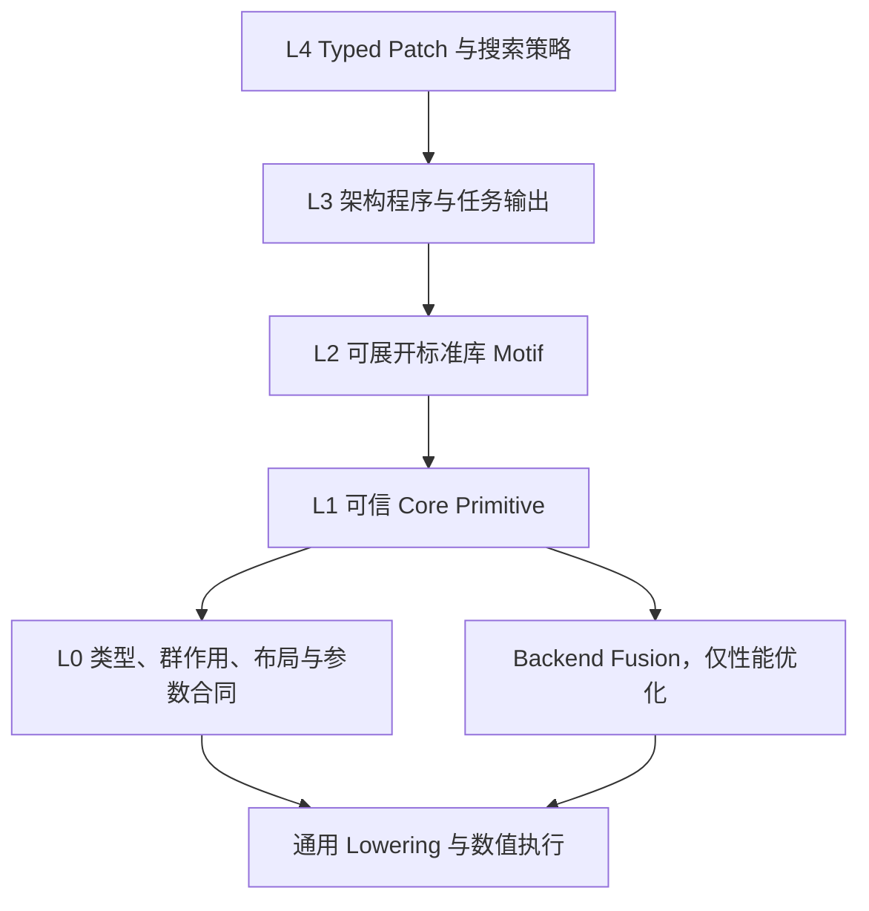

# 通用等变架构 Typed DSL 完整实现与重构主计划

> 计划版本：`0.28.0`  
> 制定日期：2026-07-30  
> 计划状态：实施中；M0、M5 已完成，M1、M2、M3 进行中；M6 已完成整网合同冻结与输入端基础原语子批次，按训练优先级暂缓；M8 V3 精确复刻现为最高优先级  
> 适用仓库：`equivariant-nas`  
> 当前分支：`codex/v3-mapping`  
> 当前分支 HEAD：`69b758b`；当前稳定运行时代码 HEAD：`70c1da03eb50efd655ffaad2cbac50538857229f`  
> 当前工作树：包含既有未提交修改，实施时必须按计划项限定修改范围，不得清理或覆盖无关改动

本文是后续 DSL 实现、重构和验收的主计划。后续代码调整必须对应本文中的计划编号；如果实现过程中发现原计划不成立，应先更新本文的变更记录、依赖关系和验收条件，再继续实现，不能在代码中形成没有计划依据的新语义。

当前稳定实施身份：

```text
分支：codex/v3-mapping
当前分支 HEAD：69b758b（证据工具边界更新）
稳定运行时代码 HEAD：70c1da03eb50efd655ffaad2cbac50538857229f
阶段提交一：9b3fa902ae52e7fdb285624d6642e30edb400295（通用 Typed DSL 基础、V1/V2 基础语义和 V3 逐原语映射）
阶段提交二：4a1383e55069c71877f2a71d2fc44ab1ad807c31（修正 V3 证据导出的阶段范围声明）
阶段提交三：70c1da03eb50efd655ffaad2cbac50538857229f（共享 V3 随机辅助边框架并完成两层 Backbone 官方对齐）
阶段提交四：69b758b（更新 V3 证据工具的后续验收边界）
工作树：稳定代码已提交；仍包含实施前旧版删除、计划文档、证据目录及其他未收敛改动，不得一并清理或误提交
最近一次已完成全量回归：353 passed, 3 skipped, 870 warnings（70c1da0 稳定运行时代码）
本轮 V3/Lowering 定向回归：Force Head、共享 final norm 的 direct model、Grid 运行时、registry、官方输入与单 Attention，并覆盖 V1/V2/QM9 通用 Lowering 回归，共 68 passed
本轮 V3 扩展定向回归：官方规格、输入、SO(2)、Grid、Attention、FFN、TransBlock、Force Head、registry/search surface 以及 V1/V2/QM9 通用 Lowering，共 81 passed
V3 operator 组合 oracle：FFN、确定性 TransBlock、Direct Force Head 共 4 passed；测试顺序共享的 torch_geometric stub 已补齐 segment max，证据已刷新
V3 两层 Backbone oracle：2 passed；87 个参数张量/3,475 参数双射，同 seed 初始化、前向 RNG、前向、位置梯度和全部参数梯度均与官方连续两层执行对齐
当前搜索表面定向回归：canonical surface、补丁执行门禁、LLM 协议和旧词表兼容共 25 passed
Compiler semantics：evoequilang-23
ValueType schema：evoequilang-value-types-v2@1
ParameterContract schema：evoequilang-parameter-contract-v1@1
Backend-neutral semantics：backend-neutral-v21
e3nn backend semantics：e3nn-graph-lowering-registry-v23
当前 registry：102 个版本化 core primitive 注册项，102 条逐注册项 Lowering rule，8 个 reference motif
当前 canonical search surface：47 个规范数学族；其中 26 个规范族可由 LLM 生成、47 个 concrete realization 可生成，28 个 adapter 仅供可信补全，27 个 context-only 条目不能由新补丁引入
```

当前完成边界：已经完成 v1 基线冻结、严格属性/单位合同、通用多输出协议、第一版 RuntimeValueKind，以及 ValueType v2 的轴/布局/结构化类型骨架和 v1-to-v2 类型迁移闭环；已经实现第一版显式 `IndexMapType` / `GraphTopologyType`、`AffinePointType`、`LatticeType`、`LatticeShiftType`、`CategoricalTensorType`、`endpoint_gather`、统一 `segment_reduce`、两类 displacement、ParameterContract、两版 scalar linear、两版 equivariant head 原语、fully-connected external `uvw tensor_product@2`、显式 path-block/instruction 的 weighted external `uvu tensor_product@3`、internal/shared `uvw tensor_product@4`、显式 path-block/instruction 的 internal/shared `uvu tensor_product@5`、官方 V1 `RadialProfile`、`LinearRS`、irrep-wise LayerNorm、gated FFN，以及三类随机正则原语。M5 的 V1 单 Block 已完成：冻结配置的完整 `GraphAttention`、确定性 `TransBlock`、含 alpha/projection dropout 与 GraphDropPath 的随机 `TransBlock`、`rescale_degree=True`、`nonlinear_message=True`、不同输入/输出 irreps 的 `ffn_shortcut`，以及随机边界矩阵均已通过逐原语通用 Lowering 与官方 oracle 验证。M6 已冻结官方两层小型 V1 整网合同，并完成 atom categorical remap/one-hot、flatten、constant scale、distance、可学习 Gaussian RBF、irrep zero-padding 和带显式 initializer scale 的 irrep linear 等输入端基础语义；但 V1 整网 importer、EdgeDegreeEmbedding、最终 norm/head、ScaledScatter、checkpoint 和训练轨迹仍未完成。尚未完成 exactness 四级证据、全部源码仓库身份锁定、其余 ValueType 联合成员、单位代数、旧参数化原语合同迁移、一般 connection mode 的 instruction TP、混合 parity even-first coefficient layout、完整 topology 输入图，以及任何 V1/V2/V3 整网数值精确复刻。

V3 当前新增边界：官方 `EquiformerV3_OC` 构造字段已由严格规格对象全覆盖，真实官方 OC20 YAML 可以无未知 model 字段丢失地导入；DeNS 仍显式拒绝，不能静默落入 base V3。正式 `equiformer_v3_input_program` 已完成 24 个 core 节点的规范化输入流，覆盖原子嵌入、source/target 与 PBC 边几何、固定 Gaussian、包络、source/target atom-edge embedding、三层 RadialFunction、m=0 逆 Wigner lift、target 聚合、avg-degree 缩放和 atom residual；初始化屏障、延迟初始化、前向、位置梯度、全部输入端参数梯度与 RNG 终态均已和官方 oracle 对齐。单个官方 `EquivariantGraphAttention` 已由正式 `equiformer_v3_attention_program` 表达：无 attention-weight dropout 的冻结小配置为 30 个 core 节点，真实 OC20 YAML 因 `attn_weights_drop=0.1` 显式增加一节点，共 31 个节点；真实配置形成 25 个参数张量、8,713,920 个参数，参数映射覆盖率 100%，且不调用官方 Attention、Block 或整网构造器。冻结小配置的同 seed 初始化、前向、node/radial/envelope 输入梯度和全部参数梯度已通过 6 项官方 oracle 测试。随后完成 Grid/S² 类型与 11 个可独立 Lowering 的 Grid 原语，并新增 23 节点显式 V3 FFN、61 节点确定性规范化 TransBlock、12 层 backbone、8 节点 energy head 与 energy-only model。本轮新增 `core.edge_frame_gate_activation@1`，以 31 节点逐原语表达官方 m-primary GateActivation direct force head，并由 `equiformer_v3_direct_model_program` 把 backbone、唯一共享的 final norm、energy MLP 与 force attention 组合为 807 节点双输出程序；102/102 TypeChecker、canonicalization、Lowering 与 runtime composition 均闭合。具备 Torch/e3nn/官方 V3 operator 源码的当前环境中，12 层小宽度完整程序已经由通用 Lowering 构建为 329 个实际模块、486 个参数张量/17,779 参数，并完成 energy/forces 前向、位置梯度和 486/486 参数梯度 smoke；过程中修复了 Grid `[carrier, grid_point, channel]` 与 invariant gate `[carrier, channel]` 的错误广播。当前 FFN、确定性 TransBlock 与 Direct Force Head 已分别完成同 seed 初始化、双射参数映射、官方前向、输入梯度和全部参数梯度 oracle；组合运行 4 项测试全部通过。进一步发现官方 V3 每次前向只随机构造一次辅助 edge frame，并由输入 EdgeDegree、全部 Block 与 direct force head 共享；旧 DSL 为每个子图重复构造 frame，虽然数值近似对齐但 RNG 合同错误。现已用 `frame_cache_id` 表达跨子图共享，同时保留每个 `to/from` 配对唯一 `frame_id` 的类型证明。两层 146 节点 Backbone 已完成 87 个参数张量/3,475 参数双射、同 seed 初始化、前向 RNG、前向、位置梯度和全部参数梯度官方对齐。当前尚未完成 Energy Head、完整 Energy+Force 整网、非零随机路径、checkpoint、stress 与训练轨迹，因此仍不能表述为“完整 V3 数值复刻完成”。输入证据位于 `reports/dsl_m8_v3_official_input_20260731/`，Attention 证据位于 `reports/dsl_m8_v3_official_attention_20260731/`，operator oracle 位于 `reports/dsl_m8_v3_operator_oracles_20260801/`，Backbone 证据位于 `reports/dsl_m8_v3_backbone_oracle_20260801/`，direct model 证据位于 `reports/dsl_m8_v3_direct_model_20260801/`。

原语去冗余当前边界：102 个名称是兼容/执行注册表，不是 102 个独立数学原语。`evoequilang-canonical-search-surface-v1` 已穷举分类全部 102 项并接入正式 OpenEvolve 入口、LLM 提示和补丁执行门禁：LLM 按 canonical family 理解 concrete realization；可信补全器可使用必要 adapter；兼容旧版本、初始化专用版本和融合宏不能由新补丁引入。补丁若试图新插入 context-only 算子，以 `E_PATCH_018` 拒绝。当前 search surface 为 47 个规范数学族，仍需继续统一 canonical core 签名；当前内容哈希为 `2bd0baf13e1172b55d2bc56a90550aabd026ce36e7108e8292a1cf34c7c07160`。

### 当前执行顺序与 V1 冻结点

依据 2026-07-31 的训练优先级调整，当前顺序改为：`M8 V3 -> M7 V2 -> 返回 M6 V1`。此调整只改变实施顺序，不降低 M6、M7、M8 的验收门禁，也不允许用官方 Block 或整网构造器旁路代替逐基础原语 Lowering。

V1 当前冻结点如下：

- 官方源码级单 `GraphAttention` / `TransBlock`：已完成，属于 M5。
- 官方两层小型整网 oracle：已冻结 182 个模块、68 个参数张量、1794 个参数；2 个图、8 条边的官方 forward 与显式 replay 前向、中间量、位置梯度和全部参数梯度误差均为 `0.0`。
- V1 atom 输入支路：原子序数类别映射、one-hot、atom embedding 初始化/前向/参数梯度，以及可学习 Gaussian RBF 的四类参数初始化、前向、输入梯度和参数梯度均已与官方对齐。
- V1 当前证据：`reports/dsl_m6_v1_full_model_contract_20260731/`、`scripts/audit_equiformer_v1_full_model_contract.py`、`tests/test_dsl_v1_full_model_contract.py`、`tests/test_dsl_v1_full_model_primitives.py`。
- V1 暂缓项：正式 radius graph/topology 构图、完整 EdgeDegreeEmbedding、多层 Block 整网 importer、final norm、两层 scalar head、ScaledScatter、checkpoint importer、QM9 协议和短训练轨迹。

因此，V1 的准确表述是“单 Block 已精确逐原语复刻，整网合同与输入端基础语义已冻结并部分实现”，不能表述为“V1 整网已完成 DSL 无损导入”。

V1 后续恢复入口固定为 M6 的正式 topology、EdgeDegreeEmbedding、整网 importer、head、checkpoint 与训练；在 V3/V2 优先阶段不得重新解释或降低上述冻结合同。

## 一、执行结论

当前项目已经拥有第一版 Typed DSL、33 个已注册 core primitive、motif、Typed Patch、类型检查、逐节点 Lowering、LLM 生成协议和实验入口，但尚未达到以下目标：

```text
官方或第三方等变网络源码
    -> 无损导入为规范化 Typed DSL
    -> 不调用原网络 Block 或整网构造器
    -> 仅按基础原语执行通用 Lowering
    -> 装载原模型参数或 checkpoint
    -> 前向、输入梯度、参数梯度和训练行为与原实现一致
```

下一阶段不能继续以“给 V1、V2、V3 各增加一个近似 motif”的方式推进。主路线必须改为：

1. 建立语义版本化的 DSL v2，不原地改变已有 `@1` 原语含义。
2. 先修复类型系统、属性合同、多输出协议和运行时组合闭合。
3. 将粒度不一致的 33 个现有原语逐项保留、重写、合并、迁移或退出公开搜索词表。
4. 补齐多头、径向条件化、外部权重张量积、完整 SO(2) 卷积、Grid/S²、类别、拓扑、仿射坐标、PBC 和任务输出语义。
5. 先以单个官方 Block 为 oracle 完成数值精确复刻，再扩展到完整 V1、V2、V3。
6. 再用 TFN、SE(3)-Transformer、EGNN、PaiNN、NequIP、MACE、DimeNet、GemNet 等代表性网络检验扩展性。
7. 最后证明有界程序空间中的变异可达性，并进行 LLM 变异创新性、等变性和性能实验。

本计划不承诺“DSL 能表示数学上所有可能的等变程序”，也不承诺“有限预算搜索一定发现所有更优网络”。可验证的目标是：

> 在明确给定的群、表示阶数、载体、拓扑阶数、程序规模和资源上限内，目标网络族可以无损表示；每个合法程序可以通过通用 Lowering 执行；预注册的基础变异集对该有界空间具有可验证的可达性或非零采样概率。

## 二、目标、边界与禁止路线

### 2.1 最终目标

最终交付分为五个相互独立的完成条件。

| 完成条件 | 目标 | 不能用什么替代 |
| --- | --- | --- |
| G1：语言可信 | 类型、属性、单位、frame、layout、运行时值形态和多输出合同闭合 | 不能用“每个 op 都注册了 Lowering”替代 |
| G2：官方复刻 | V1、V2、V3 可无损导入、通用 Lowering、参数映射并与官方数值对齐 | 不能用官方构造器旁路替代 |
| G3：网络扩展性 | 至少覆盖一组不同机制的代表性等变网络 | 不能只覆盖 Equiformer 三代 |
| G4：变异可达性 | 有界空间的基础编辑可逆、状态图连通或每个状态非零可达 | 不能用“从一个固定父代可达”替代遍历性 |
| G5：研究实验 | 候选合法、等变、新颖且在固定预算下具有性能证据 | 不能用零训练步或结构差异替代性能结果 |

### 2.2 明确不做

以下路线不属于本计划：

1. 不把整个官方 `GraphAttention`、`TransBlock`、`SO2EquivariantGraphAttention` 或完整模型包装成一个 core primitive。
2. 不在 Lowering 中根据 `EquiformerV1`、`EquiformerV2`、`EquiformerV3` 等网络名称选择执行路径。
3. 不把官方整网构造器旁路标为“逐原语精确复刻”。
4. 不下拆到 CUDA 指令、矩阵乘或逐元素加法层面；core primitive 的粒度是独立数学或数据流语义。
5. 不在同一个 `core.xxx@1` 名称下静默修改输入端口、类型规则或数值参数化。
6. 不允许隐藏的 `graph_context` 任意字典继续承载未类型检查的拓扑、边方向、batch 或 PBC 信息。
7. 不把 S² 有限网格非线性的经验近似等变误写为解析精确等变。
8. 不在完成单 Block 数值对齐之前直接声称整网已精确复刻。
9. 不在语言版本或编译器语义变化后复用旧 architecture ID、旧证据数据库或旧搜索谱系。

## 三、当前基线与问题定位

### 3.1 当前已经完成

截至本计划初版制定时，仓库已经完成：

- 33 个 core primitive 的注册定义；
- 33 个原语对应的第一版逐节点 Lowering 规则；
- 第一版 `EquivariantType`：群、carrier、irreps、frame、axes、dtype、measure 和认证等级；
- motif 展开、规范化、架构 ID、Typed Patch、作用域门控和 liveness；
- TypeChecker、证明义务、completion、LLM Router/Critic/Synthesizer/Repair 工作流；
- 简化 V1、V2 表示流的通用 Lowering；
- V3 组合式表示流、`core.s2_swiglu@1` 和 `core.equivariant_merge_norm@1`；
- F6.3 多层读出新增支路的逐基础原语 Lowering；
- 当前回归结果 `163 passed, 3 skipped`；
- 当前 V3 专项结果 `8 passed`。

这些结果证明第一版语言已经可执行，但不证明官方 V1、V2、V3 已经无损转成 DSL。

### 3.1.1 计划实施后的新增进展

截至计划版本 `0.24.0`，新增完成：

- M0 v1 基线 snapshot：33 个 core primitive、6 个 motif、33 条 Lowering rule；
- M1 严格属性 schema、属性别名规范化、dtype/measure compatibility 和已知单位合同修复；
- M1 通用多输出端口映射与裸引用拒绝；
- M1 `dense_tensor` / `so3_edge_frame` 第一版 RuntimeValueKind 图级传播与组合负例；
- M2 `ValueType`、`AxisSpec`、`FeatureRole`、`RepresentationLayout`、`ResolutionSpec`；
- M2 `EquivariantTensorType`、`InvariantTensorType`、`RecordType`、`TupleType`；
- M2 程序与 TaskContract 的 v1-to-v2 类型迁移、迁移 manifest 和 schema-bound architecture ID；
- M8 官方 V3 全构造字段规格导入、真实 OC20 YAML 严格导入和未知字段/DeNS 拒绝合同；
- M8 `categorical_embedding@1`、官方构造精度 `fixed_gaussian_radial_basis@1`、单/双输出 `so2_linear@1/@2` 的逐原语 Lowering 与官方低层数值/梯度证据；
- 当前 V1 表示流、V2 SO(2) mechanism witness、V3 组合流均可迁移后展开 motif 并重新类型检查；
- 修复 motif 非重叠 occurrence 选择依赖 architecture ID 哈希顺序的问题；
- 新增 `IndexMapType` 与 `GraphTopologyType`，索引方向、carrier domain/codomain、dtype、target size、排序和空 target 合同进入类型；
- 新增 `core.endpoint_gather@1`，从显式 typed index payload gather，不读取隐藏 `edge_src/edge_dst`；
- 新增 `core.segment_reduce@1`，从显式 typed index payload 读取 `indices` 和 `target_size`，不读取隐藏 `edge_dst/batch/num_nodes/num_graphs`；
- RuntimeValueKind 新增 `index_map` 与 `graph_topology`，Support Report 能拒绝 index runtime kind 误接到普通 dense primitive；
- 简化 V1 message flow 已确定性迁移为显式 topology 程序，旧/新前向、输入梯度和参数梯度最大绝对误差均为 `0.0`；
- 新增 `AffinePointType`、`LatticeType` 与 `LatticeShiftType`，位置、平移自由向量、晶格和整数周期映像不再共用普通 dense tensor 静态语义；
- 新增非周期 `core.relative_displacement@2`，固定公式为 `target - source`，显式接收 affine positions 及 source/target index maps；
- 新增周期 `core.periodic_displacement@1`，固定公式为 `target + shift @ lattice - source`，显式接收同一 `lattice_id` 的 lattice 和 lattice shift；
- RuntimeValueKind 新增 `affine_point`、`lattice` 与 `lattice_shift`，并为两类位移原语注册逐节点通用 Lowering；
- 新增 `TRANSLATION_COVARIANCE` 与 `PERIODIC_IMAGE_CONSISTENCY` 证明义务和对应负例；
- 非周期平移、SO(3) 旋转、O(3) 反演以及周期平移、旋转、周期映像重标记误差均不超过 `6.67e-16`；位置与晶格梯度有限，有限差分误差约为 `1.40e-9`；
- 本阶段证据位于 `reports/dsl_m3_affine_geometry_20260731/`，全语义 snapshot ID 为 `8abf835641fd65ec07a9944648695dcee287349fcc4d739942f71e75bddd32a5`；
- 新增 `ParameterAxis` 与 `ParameterContract`，合同覆盖参数轴/shape、internal/external、共享轴、bias 表示、初始化、rescale、checkpoint 名、trainable 和 architecture identity policy；
- `PrimitiveDefinition.parameter_rule` 可根据节点 attrs 与输入/输出 ValueType 推导节点级具体参数合同，`InferenceResult` 保存该合同；
- architecture ID 现在显式绑定 core registry 内容哈希、ParameterContract schema 和所有未排除的节点参数合同，训练后的权重数值默认不进入架构身份；
- 通用 Lowering 在模块构造后核对内部参数名、shape 和 `requires_grad`，external 参数合同必须绑定显式 primitive 输入端口；
- 新增 `core.scalar_linear@1`，沿指定的不变量 feature axis 做线性变换，其他轴进入参数共享合同；weight/bias 的真实模块参数与合同完全对齐；
- `scalar_linear@1` 的前向、输入梯度、weight 梯度和 bias 梯度相对直接 PyTorch 参考实现最大误差均为 `0.0`；
- ParameterContract 阶段证据位于 `reports/dsl_m3_parameter_contract_20260731/`，实际架构 ID 为 `3d4ea5b006f79c6c`，全语义 snapshot ID 为 `e79387cf504b84824ffadf3e67923a523287f7185569621a42d6777f90123751`；
- 新增 invariant-only `core.head_split@1` 与 `core.head_merge@1`，把独立 channel axis 可逆地解释为 head/per-head-channel axis，运行时不改变扁平标量顺序；
- 新增 `core.headwise_scalar_contraction@1`，每个 head 使用独立 `[head, channel]` weight 和可选 `[head]` bias，输出保留 head axis 并标记为 alpha role；
- invariant 多头前向、edge 排列、输入梯度、weight 梯度和 bias 梯度误差均为 `0.0`；非平凡 equivariant value 的 head split 以 `E_HEAD_001` 明确拒绝；
- invariant 多头证据位于 `reports/dsl_m3_invariant_multihead_20260731/`，headwise alpha 架构 ID 为 `42a46b264205ed5f`，全语义 snapshot ID 为 `d443278acae4b5dea5883d859fb9c192e4bdb9bfc8e139522b74e128fb76a28b`；
- 新增 `core.tensor_product@2`，显式接收 dimensionless `radial_weight`/`tp_path` 输入，使用 external ParameterContract 并固定 fully-connected `uvw`、`internal_weights=False`、`shared_weights=False`；
- type rule 根据允许 irrep 三元组计算 $\sum m_{\mathrm{in1}}m_{\mathrm{in2}}m_{\mathrm{out}}$，同时检查 path axis、scalar multiplicity、carrier/frame/dtype 和 measure；
- `tensor_product@2` 的 e3nn 模块内部参数数为 `0`，external weight 路径数为 `3`；直接模块前向误差 `0.0`，旋转相对误差约 `5.37e-9`，edge 排列误差约 `2.22e-16`，left/right/weight 梯度均有限；
- external TP 证据位于 `reports/dsl_m3_tensor_product_v2_20260731/`，架构 ID 为 `4be1d69a93518e31`，全语义 snapshot ID 为 `45e605f99e81f40a3545a4c2d9b85a164cc16b5a49be4973a512a6bca90c7209`；
- 新增 `core.head_split@2` 与 `core.head_merge@2`：仅沿每个 irrep 的 multiplicity 维按 head 拆分/合并，运行时形态从 `[carrier..., total_irrep_dim]` 变为 `[carrier..., head, per_head_irrep_dim]`，绝不拆分 $m$ 坐标；
- RuntimeValueKind 新增 `equivariant_heads`，Support Report 能拒绝把外部普通 dense 输入直接送入 `head_merge@2`，并允许 `irrep_select@2`、`invariant_scale@1` 与显式 `segment_reduce@1` 保持该运行时形态；
- 新增 `core.irrep_select@2`：对每一种 irrep 声明 `start` 与 `multiplicity`，可在同一个合并后的 $l=0$ block 内把 alpha 通道和 value 标量通道分开，同时禁止越界、重复 irrep range 和非规范顺序；
- `head_split@2` / `head_merge@2` / `irrep_select@2` 明确要求 canonical、simplified、irrep-major coefficient storage；`grid`、`m_primary` 或未 simplify 的布局在静态阶段拒绝，避免把仅对 e3nn storage 成立的 narrow/reshape 误用于其他布局；
- 新增 `core.headwise_scalar_contraction@2`：接收 head-packed 的平凡表示，参数合同与官方 V1 `alpha_dot` 一致为 `[1, head, channel]`，初始化合同复刻官方“先 `randn` 分配、再用 Glorot uniform 覆盖”的两阶段随机状态推进，输出 one-scalar-per-head 的 `InvariantTensorType`；
- 新增 `core.invariant_scale@1`：支持一个无量纲不变量或 one-scalar-per-head 不变量对等变 value 的显式轴广播；
- 新增 `core.segment_softmax@2`：显式接收 edge-to-segment `IndexMapType`，支持 head logits，不再读取隐藏 `graph_context.edge_dst`；
- `core.scalar_activation@1` 新增官方 V1 `smooth_leaky_relu`、`negative_slope` 和显式 `normalization=second_moment` 合同；`core.segment_reduce@1` 的运行时合同扩展为保持 `equivariant_heads`，从而复刻官方“先按 head 聚合，再合并 heads”的顺序；
- V1 attention 最小核心已修正为官方真实顺序：`head_split@2 -> irrep_select@2 -> scalar_activation@1(second_moment) -> headwise_scalar_contraction@2 -> segment_softmax@2 -> invariant_scale@1 -> segment_reduce@1 -> head_merge@2`，不调用官方网络、Block 或 GraphAttention 构造器；
- 直接从本地官方 V1 源码 AST 提取 `Vec2AttnHeads` / `AttnHeads2Vec` 类作为只读 oracle；官方源码文件 SHA-256 为 `0f7fb92573cf8731733476f17408bb8f160c66c760cab002dc163f1dd59d99d6`；
- 官方 `Vec2AttnHeads` 前向与输入梯度误差均为 `0.0`；最小 attention 核心前向与 alpha 误差均为 `0.0`，输入梯度最大误差约 `1.11e-16`，alpha-dot 参数梯度最大误差约 `2.50e-16`；
- 最小 attention 核心的 SO(3) 旋转与 O(3) 反演相对误差分别约为 `1.49e-16` 与 `1.13e-16`，edge 排列后的 node 输出误差约为 `2.22e-16`；
- equivariant multihead 证据位于 `reports/dsl_m3_equivariant_multihead_v2_20260731/`，架构 ID 为 `d24d058c49111d44`，全语义 snapshot ID 为 `851946cf58c00d9fb3fb0fcda166bb04b20f7fa21bad13db162c7f0f655f687c`；证据明确标注尚未复刻完整官方 `GraphAttention`、`TransBlock` 或整网；
- 已冻结 M5 第一版非退化官方 `GraphAttention` 开发 oracle：`4x0e+2x1e+1x2e` node irreps、`1x0e+1x1e+1x2e` edge irreps、`2x0e+1x1e+1x2e` per-head irreps、2 heads、无 dropout、`nonlinear_message=False`；
- 官方 `GraphAttention` oracle 包含 39 个模块、14 个参数张量和 528 个参数；显式逐步 Python replay 与官方 forward 最大误差为 `0.0`，node/edge/radial 输入梯度和全部参数梯度存在且有限；
- 官方 Depthwise TP 合同为 15 条 `uvu` instruction、30 个逐 edge external weights，内部 path-block 输出为 15 个允许重复 irrep 的 block、总维度 98；该 path-block storage 随后以等价的 simplified irreps 进入 `LinearRS`；
- GraphAttention 合同证据位于 `reports/dsl_m5_v1_graph_attention_contract_20260731/`；该证据使用进程内数学 stub 补足未安装的 PyG/OCP import，仅作为官方 oracle 审计，不参与 DSL 执行；
- 新增 `core.tensor_product@3`：显式声明 `path_blocks` 与 `instructions`，第一版固定 weighted `uvu`；静态检查 block 字段、规范 irrep 顺序、instruction 索引、Clebsch--Gordan 路径、`uvu` 输出 multiplicity、path block 引用完整性、external `tp_path` 长度、carrier/frame/dtype/measure、canonical simplified irrep-major 输入布局；
- `tensor_product@3` 通过通用 `e3nn.o3.TensorProduct` Lowering 执行，固定 `normalization=None`、`path_normalization='none'`、`internal_weights=False`、`shared_weights=False`；Lowering 逐项核对未 simplify 的 `irreps_out`、instruction path graph、`weight_numel=30` 和内部参数数为 0，不调用官方 `DepthwiseTensorProduct`、`TensorProductRescale`、`GraphAttention` 或 Block 构造器；
- DSL TP 与官方 `GraphAttention.sep.dtp.tp` 的未合并 15-block 输出、15 条 normalized e3nn instruction、前向、left/right/weight 三路梯度完全一致，相关最大绝对误差均为 `0.0`；SO(3) 旋转相对误差约 `1.99e-9`、O(3) 反演相对误差约 `9.09e-17`、edge 排列误差约 `2.74e-16`；
- `tensor_product@3` 负例覆盖非法 block index、非法 Clebsch--Gordan 路径、`uvu` multiplicity 不一致、非 `uvu` mode、external weight 长度错误、未引用 path block、非规范 path order 和错误 coefficient layout；
- 规范化 DSL 程序、Lowering manifest、ParameterContract、实际模型身份、数学变换合同、官方源码身份与负例位于 `reports/dsl_m5_tensor_product_v3_official_20260731/`；该阶段架构 ID 为 `69f61f0c34ec9ef3`，全语义 snapshot ID 为 `4c3509a4b98f2fce0444ca6cf45ad82c2c35cad46fd30a20ddca23a2bcb01604`；
- 新增 `core.scalar_linear@2`、`core.scalar_layer_norm@1`、`core.scalar_offset@1` 与 `motif.v1_radial_profile@1`，精确展开官方 `Linear(bias) -> LayerNorm -> SiLU -> Linear(no bias) -> learned offset`；`slice_sqrt_k` 仅进入最后线性层和 offset 的逐输出初始化缩放，不进入 TP runtime；
- 官方 `RadialProfile + Depthwise TP` 的 6 个参数初始化、前向、radial/left/right 三路输入梯度及全部参数梯度最大误差均为 `0.0`；证据位于 `reports/dsl_m5_v1_radial_profile_20260731/`；
- 新增 `core.irrep_linear@2`，通过低层 `1x0e` shared/internal `uvw TensorProduct`、`normalization=None`、`path_normalization=none`、官方 fan-in 初始化缩放和可选 even-scalar bias 精确表达 V1 `LinearRS`；source、destination、post-TP 与 projection 四个实例的初始化、前向、输入梯度、参数梯度和 O(3) 均通过；
- 完整冻结配置 V1 `GraphAttention` 已作为正式 `equiformer_v1_graph_attention_program` 加入 `reference_programs.py`，顶层 19 个 typed 节点、motif 展开后 22 个 core 节点，实际 DSL 模型不调用任何官方网络、Block 或算子构造器；
- 完整 GraphAttention 的 14 个参数张量名称与 shape 全映射；`merge_src`、`merge_dst`、`message`、`radial`、`tp`、`post_tp`、`heads`、`alpha_channels`、`value`、`alpha_activated`、`logits`、`softmax`、`weighted`、`aggregate`、`merged` 和 `out` 共 16 个导出中间张量最大误差为 `0.0`；
- 完整 GraphAttention 的 node/edge-attribute/radial 输入梯度和全部 14 组参数梯度最大误差为 `4.44e-16`；SO(3) 输出相对误差为 `3.51e-9`，O(3) 反演为 `2.19e-16`，边排列输出误差为 `1.33e-15`；
- 负控制证明 `second_moment` 不是可省略实现细节：移除后官方输出最大偏差为 `0.049886`；非法 normalization 以 `E_BACKEND_020` 静态 Lowering 验证错误拒绝；
- 完整 GraphAttention 的规范化 DSL、Lowering manifest、ParameterContract、实际模型身份、数学合同、全部数值/梯度/对称性证据和负例位于 `reports/dsl_m5_v1_graph_attention_exact_20260731/`；架构 ID 为 `07e518f886d53b16`，全语义 snapshot ID 为 `5174bd6bbf79583312eafc2878e80085746864bbf9e9ff807521f3c64bc4c2b3`；
- 新增 `core.irrep_layer_norm@1`，精确表达官方 `EquivariantLayerNormV2`：平凡标量在 multiplicity 轴中心化，非标量不减坐标均值，支持 `component` / `norm`，affine weight 按 irrep instance，bias 仅作用于 even scalar；官方存在缺陷的 `affine=False` 第一版以 `E_IRREP_LN_006` 明确拒绝；
- 新增 `core.tensor_product@4`，固定 internal/shared fully-connected `uvw` FCTP、`normalization=None`、`path_normalization=none`、官方 per-output accumulated fan-in 初始化缩放和 even-scalar bias；两层 FFN 参数化分别为 33 weight + 7 bias 与 21 weight + 4 bias；
- 新增 `motif.v1_feed_forward@1`，展开为 `tensor_product@4 -> scalar/gate/gated selection -> SiLU(second_moment) / sigmoid(second_moment) -> gate -> irrep_concat -> tensor_product@4`，完整 FFN 的初始化、前向、输入/参数梯度和 O(3) 与官方一致；
- 新增正式 `equiformer_v1_transblock_program`：24 个顶层 typed 节点，motif 展开后 35 个 core 节点，计算流为 `norm_1 -> complete GraphAttention -> residual -> norm_2 -> gated FFN -> residual`，DSL 执行不调用官方 `TransBlock`、`GraphAttention`、`FeedForwardNetwork`、`FullyConnectedTensorProductRescale` 或 LayerNorm 构造器；
- 确定性 TransBlock 的 22 个参数张量、615 个参数在相同 seed 下逐值一致；`norm_1`、`attention`、`attention_residual`、`norm_2`、`ffn` 和 `out` 最大误差均为 `0.0`；4 路输入梯度最大误差为 `8.88e-16`，全部参数梯度最大误差为 `1.78e-15`；
- 确定性 TransBlock 的 SO(3) 最大相对误差为 `4.13e-9`，O(3) 反演最大相对误差为 `1.43e-16`，边排列输出误差为 `1.78e-15`，节点排列输出误差为 `0.0`，无随机算子 train 模式与官方及 eval 模式均为 `0.0`；
- 修复通用 Lowering 的参数初始化顺序合同：模块构造按规范化程序节点顺序，运行时执行仍按依赖拓扑顺序，避免类型检查器重排彼此独立节点后静默改变全局 RNG 参数抽样；
- TransBlock 规范化程序、展开程序、Lowering manifest、ParameterContract、实际模型身份、数学合同、初始化/前向/梯度/对称性/train-mode 证据和负例位于 `reports/dsl_m5_v1_transblock_exact_20260731/`；当前架构 ID 为 `71380c750c339785`，全语义 snapshot ID 为 `e1df816210ff8a1c1ac1216a67cc49738683aad4730e3c1ecdfd2f88a506e9ae`；
- 新增 `core.scalar_dropout@1`：只接受不变量张量，对每个 attention 标量条目独立采样 inverted-dropout mask；
- 新增 `core.equivariant_dropout@1`：要求 axis-free、canonical、simplified、irrep-major 表示；每个 carrier item、每个 irrep instance 共享一个 mask，同一 irrep instance 的全部 $m$ 坐标不得拆开；
- 新增 `core.graph_stochastic_depth@1`：显式接收 node-to-graph `IndexMapType`，每个 graph 为完整 residual branch 共享一个 inverted drop-path mask；旧 `core.stochastic_depth@1` 的逐节点 mask 语义不被冒充为 GraphDropPath；
- `equiformer_v1_graph_attention_program` 与 `equiformer_v1_transblock_program` 已按参数条件插入 alpha dropout、两次 projection equivariant dropout 和两次 GraphDropPath；随机 TransBlock 为 28 个顶层 typed 节点、40 个展开 core 节点；
- 随机 TransBlock 的 22 个参数张量、615 个参数在相同 seed 下逐值一致；DSL 与官方前向后的 RNG state SHA-256 均为 `aee76f14c0f5cd55e741381a50d0e01d633d30860d7548d6411608f2dbaa7380`，暴露的 attention、attention drop-path、FFN dropout 和 FFN drop-path 零掩码逐位一致；
- 随机 TransBlock 最大前向误差为 `2.08e-17`，4 路输入梯度和全部参数梯度最大误差均为 `1.78e-15`，固定随机掩码下 SO(3) 相对误差为 `7.53e-10`，eval 与官方最大误差为 `0.0`；
- 修复 `headwise_scalar_contraction@2` 的运行时布局合同：使用与官方 `einsum("bik,aik->bi")` 同构的 strided 输出，而不是数值等价但 contiguous 的逐元素乘法后求和；原因是 PyTorch dropout 在固定 seed 下的 mask 放置会受真实 storage stride 影响；
- 随机 TransBlock 的规范化 DSL、展开程序、59 条 Lowering manifest、ParameterContract、实际模型身份、数学随机合同、RNG、零掩码、初始化、前向、梯度和 SO(3) 证据位于 `reports/dsl_m5_v1_transblock_stochastic_20260731/`；架构 ID 为 `acb3c1f966e36ad0`，语义 snapshot ID 为 `bcd628ac64740dfa098e237d46199b7591e6774bb4cc81d39719f48cfd20fd45`；
- 扩展 `core.segment_reduce@1` 的 `normalization=target_cardinality`：先显式按 index map 求和，再将每个 target 的和乘以该 target 的 source-item 数；该操作保持 equivariant heads 的每个表示分量只乘不变量，并且与 head merge 交换；
- `target_cardinality` 仅允许与 `reduce=sum` 组合；与 mean 组合以 `E_ATTR_008` 静态拒绝，其他未知 normalization 继续以 `E_ATTR_007` 拒绝；
- `equiformer_v1_graph_attention_program` 与 `equiformer_v1_transblock_program` 新增 `rescale_degree` 参数；`True` 时不新增不透明算子，而是在显式 `segment_reduce@1` 上选择 target-cardinality 合同；
- `rescale_degree=True` 的完整 TransBlock 仍为 35 个展开节点、22 个参数张量和 615 个参数；同 seed 初始化、6 个主中间量和最终前向最大误差为 `0.0`，4 路输入梯度最大误差为 `8.88e-16`，全部参数梯度最大误差为 `3.55e-15`；SO(3) / O(3) 相对误差分别为 `4.45e-9` / `1.44e-16`，边排列误差为 `1.78e-15`，节点排列误差为 `0.0`；
- degree-rescale 规范化 DSL、展开程序、Lowering manifest、ParameterContract、模型身份、数学合同、前向/梯度/对称性和负例证据位于 `reports/dsl_m5_v1_transblock_degree_rescale_20260731/`；刷新后的架构 ID 为 `b6129a4a56ac124b`，语义 snapshot ID 为 `a75e9eb2a6244fcf28694296b68108e2e2c3070a0a3c697fc5326e6769ff43da`；
- 新增 `core.tensor_product@5`：它以显式 `path_blocks` / `instructions` 表示 internal/shared `uvu` TensorProduct，冻结 V1 instruction fan-in 初始化、`tp.weight` 参数身份和 `bias=False` 合同；原语专项测试完成同 seed 初始化、15 条 instruction、前向、左右输入/权重梯度、O(3) 与 bias 静态负例；
- `equiformer_v1_graph_attention_program` 与 `equiformer_v1_transblock_program` 新增 `nonlinear_message` 参数；`True` 时逐节点表达 `sep_act` 外部权重 TP、LinearRS、second-moment SiLU/sigmoid Gate、独立 alpha LinearRS、`sep_value` 内部共享权重 TP 和 value LinearRS，不调用官方 `SeparableFCTP`、`DepthwiseTensorProduct`、`GraphAttention` 或 `TransBlock` 构造器；
- nonlinear GraphAttention 完成 19 个参数张量、649 个参数的同 seed 初始化逐值一致，全部导出中间量、最终前向、3 路输入梯度和全部参数梯度对齐，并通过 SO(3)、O(3)、边排列和节点排列测试；
- nonlinear TransBlock 展开为 44 个 core 节点，完成 27 个参数张量、736 个参数的同 seed 初始化；最大前向误差为 `2.22e-16`，4 路输入梯度最大误差为 `4.44e-16`，全部参数梯度最大误差为 `8.88e-16`，SO(3) / O(3) 相对误差分别为 `3.65e-9` / `1.83e-16`，边排列误差为 `6.66e-16`，节点排列误差为 `0.0`；
- nonlinear 规范化 DSL、展开程序、59 条 Lowering manifest、ParameterContract、模型身份、数学合同、初始化/前向/梯度/对称性和负例证据位于 `reports/dsl_m5_v1_transblock_nonlinear_20260731/`；架构 ID 为 `4d6198ca7bbc7cf7`，语义 snapshot ID 为 `eed017c7f530fc6555930948117b4b2f602fa7506259cda6a3b5b85dd0a3c88c`；
- `equiformer_v1_transblock_program` 新增 `node_output_irreps` 参数；当输出表示不同于输入表示时，在第二条残差支路显式插入 `ffn_shortcut = tensor_product@4(attention_residual, node_attr)`，并令 FFN 的输出类型、projection dropout、GraphDropPath 和最终 residual add 全部切换到输出表示；
- 确定性 shortcut 配置 `4x0e+2x1e+1x2e -> 3x0e+1x1e+1x2e` 为 24 个参数张量、626 个参数；与 nonlinear message 组合时为 45 个展开节点、29 个参数张量、747 个参数。两种配置均完成同 seed 初始化、前向、4 路输入梯度、全部参数梯度、SO(3)/O(3) 和节点/边排列；
- nonlinear + shortcut 的规范化 DSL、展开程序、59 条 Lowering manifest、ParameterContract、模型身份、数学合同和数值证据位于 `reports/dsl_m5_v1_transblock_shortcut_20260731/`；架构 ID 为 `13dbcd30acf84e8c`，语义 snapshot ID 为 `77a0c9272198d533c6d75d3175dbe651fbef8241db304e8591a2eef179bd8d9a`；
- 完成随机边界矩阵：单图 `alpha/proj/drop_path=1e-6` 与三图 `alpha=0.95`、`proj=0.9`、`drop_path=0.95` 两种完整 TransBlock 均保持同 seed 参数初始化、RNG 终态、随机掩码、train 前向/梯度、固定掩码 SO(3) 和 eval 前向与官方一致；两种边界程序架构 ID 分别为 `3e16f6971c2f95f4` 与 `aa513446d505dadf`；
- 边界矩阵规范化/展开 DSL、Lowering manifest、ParameterContract、模型身份、数值/RNG/掩码证据和静态负例索引位于 `reports/dsl_m5_v1_transblock_boundary_matrix_20260731/`；跨案例最大前向误差为 `4.44e-16`，最大输入梯度误差为 `8.88e-16`，最大参数梯度误差为 `7.11e-15`，最大 SO(3) 相对误差为 `2.28e-9`，语义 snapshot ID 为 `7272cb67610dfa68b6872a269c457ea0fdefc56a473e139bc8ebec8e1bb56cb9`；
- `p=1`、非正 graph_count 与空 graph target 分别由静态属性合同、参考程序参数检查和运行时 `IndexMapType` 合同拒绝；M5 的结构分支、随机行为、参数映射、数值/梯度和边界矩阵退出门禁全部满足；
- 刷新后的确定性、随机、degree-rescale、nonlinear 架构 ID 分别为 `71380c750c339785`、`acb3c1f966e36ad0`、`b6129a4a56ac124b`、`4d6198ca7bbc7cf7`，对应语义 snapshot ID 分别为 `e1df816210ff8a1c1ac1216a67cc49738683aad4730e3c1ecdfd2f88a506e9ae`、`bcd628ac64740dfa098e237d46199b7591e6774bb4cc81d39719f48cfd20fd45`、`a75e9eb2a6244fcf28694296b68108e2e2c3070a0a3c697fc5326e6769ff43da`、`eed017c7f530fc6555930948117b4b2f602fa7506259cda6a3b5b85dd0a3c88c`；
- Compiler semantics 升至 `evoequilang-18`，Backend-neutral semantics 升至 `backend-neutral-v16`，e3nn registry 升至 `e3nn-graph-lowering-registry-v18`；
- 当前 registry 为 59 个 core primitive、59 条 Lowering rule 和 8 个 reference motif；
- 当前全量回归为 `289 passed, 3 skipped, 794 warnings`。

这些新增结果完成了 M5“V1 单 Block 精确复刻”：冻结配置的确定性、随机正则、degree-rescaled、nonlinear-message、不同输出 irreps shortcut 与预注册边界矩阵均已通过。该完成声明不等于 V1 整网或 V2/V3 官方整网数值复刻，也不替代 M1 至 M4 的其余语言基础工作。

### 3.2 当前三个支持层级

| 层级 | V1 | V2 | V3 |
| --- | --- | --- | --- |
| 表示流级 | 已有 | 已有局部 motif | 已有组合式程序 |
| 简化参考程序通用 Lowering | 可执行 | 单次 SO(2) 残差路径可执行 | 可执行 |
| 官方完整数值复刻 | V1 单 Block 的确定性、随机正则、degree rescale、nonlinear message、不同输出 irreps shortcut 和边界矩阵已完成；整网未完成 | 未完成 | 未完成 |

### 3.3 根本问题

当前缺口不是单一的“还差几个原语”，而是五层同时不完整：

1. 类型系统已能表达第一版索引、拓扑、仿射/PBC 几何、参数合同、invariant heads 和按 irrep multiplicity block 的 equivariant heads，但仍不能完整表达多 resolution、一般系数重排、截断状态、类别、batch、Grid、Cartesian、全部参数化原语和全部多输出结构语义。
2. 部分 core primitive 的输入端口和参数合同过粗，无法表示官方算子参数化。
3. 静态类型与运行时后端值形态脱节，逐节点支持不能推出组合闭合。
4. 当前 importer 生成的是人工摘要图，不是官方完整计算图。
5. 当前变异系统只证明从固定 V1 父代覆盖 72 个预注册状态，没有证明从任意状态到任意状态的遍历性。

## 四、目标语言分层

DSL v2 统一采用以下五层。网络相关结构只能存在于可展开 motif 或 importer 中，不能进入 core primitive 或通用 Lowering 的分支条件。



### 4.1 Compiler/Internal

只用于解析、迁移、规范化和优化，不进入 LLM 主动搜索词表：

- identity 消除；
- 引用规范化；
- 安全 reshape、axis reorder 和 layout materialization；
- constant folding；
- dead-code elimination；
- motif 展开和 backend fusion；
- 旧 DSL v1 到 v2 的迁移节点。

### 4.2 Core Primitive

每个 core primitive 必须满足：

1. 只有一个独立数学或数据流效果。
2. 输入、输出、属性、单位、轴、布局、frame 和运行时值形态可完整类型检查。
3. 不隐藏可被单独修改的 MLP 层数、激活、分支或共享策略。
4. 对所有类型合法的相邻组合，Support Report 与真实执行一致。
5. 有合法样例、负例、数值变换测试和成本模型。

### 4.3 Standard-library Motif

motif 必须完全展开为 core primitive，用于表示：

- scalar/radial MLP；
- norm activation；
- Gate、S² activation、Separable S² activation、S²-SwiGLU；
- V1/V2/V3 attention、FFN 和 Block；
- TFN、PaiNN、NequIP、MACE 等网络机制模板；
- energy、force、stress 等任务 head。

### 4.4 Architecture Program

程序层负责：

- 输入和输出任务合同；
- Block 重复、stage、skip connection 和跨深度读出；
- 参数绑定和 checkpoint 映射；
- 资源上限、可编辑区域和输出派生规则。

### 4.5 Backend Fusion

融合只改变执行效率，不改变 DSL 可观察语义。任何融合实现都必须与未融合逐原语执行完成前向和梯度一致性测试。

## 五、DSL v2 类型系统重构

### 5.1 总体动作

当前单一 `EquivariantType` 改为可组合的 `ValueType` 层次。旧类型保留只读迁移器，不再继续增加字符串字段。

| 计划编号 | 动作 | 目标类型 | 作用 |
| --- | --- | --- | --- |
| T1.1 | 新增 | `EquivariantTensorType` | 表示线性群作用下的张量值 |
| T1.2 | 新增 | `InvariantTensorType` | 表示带 feature role 和轴语义的不变量张量 |
| T1.3 | 新增 | `CategoricalType` | 原子种类、节点类别和离散标签 |
| T1.4 | 新增 | `AffinePointType` | 区分位置与普通一阶向量，证明平移协变性 |
| T1.5 | 新增 | `IndexMapType` | source、target、segment、batch 等有方向索引映射 |
| T1.6 | 新增 | `GraphTopologyType` | 节点、边、方向、邻接、排序和周期映射合同 |
| T1.7 | 新增 | `LatticeType` 与 `LatticeShiftType` | PBC 晶格、cell 和边平移 |
| T1.8 | 新增 | `FrameTokenType` | edge/local frame 的构造、身份和逆变换证明 |
| T1.9 | 新增 | `GridTensorType` | S²/Grid 的采样域、分辨率、通道和求积合同 |
| T1.10 | 新增 | `TupleType` 与 `RecordType` | 多输出和结构化中间值 |
| T1.11 | 新增 | `CartesianTensorType` | 力、应力和笛卡尔张量输出 |
| T1.12 | 重写 | `TypeChecker` | 支持联合类型、结构化端口、单位代数和运行时值形态 |

### 5.2 显式轴语义

新增：

```text
AxisSpec(
    name,
    size,
    role,
    sharing,
    order,
    broadcastable
)
```

至少支持以下 `role`：

- `channel`；
- `head`；
- `degree`；
- `order_m`；
- `resolution`；
- `endpoint`；
- `species`；
- `basis`；
- `tp_path`；
- `grid_latitude` 与 `grid_longitude`；
- `cartesian`；
- `alpha`、`value`、`gate`、`extra_m0` 和 `radial_weight` 等 channel role。

轴类型必须参与 compatibility、广播、dropout sharing、head split/merge、参数共享和 architecture ID。

### 5.3 表示布局

新增：

```text
RepresentationLayout(
    storage,
    coefficient_order,
    resolution_specs,
    lmax_list,
    mmax_list,
    truncation_state,
    parity_convention,
    channel_order
)
```

必须表达：

- e3nn irrep-major 布局；
- V2/V3 的 l-primary 与 m-primary 布局；
- 单 resolution 和多 resolution；
- 当前值是否只保留 $|m|\leq m_{\max}$；
- `extra_m0` 是否存在以及属于哪个输出端口；
- frame 旋转前后 runtime representation 的变化。

### 5.4 单位与量纲

把当前自由字符串 `measure` 升级为可组合单位表达式。至少修复：

- `relative_position` 输出长度；
- `distance` 输出长度；
- `radial_basis` 输出无量纲基函数；
- `cutoff_envelope` 输出无量纲权重；
- `tensor_product` 输出单位为输入单位乘积；
- softmax logits 必须无量纲；
- attention weight 必须无量纲；
- invariant inner product 的单位为两个输入单位乘积；
- force 为能量除以长度；
- stress 为能量除以体积。

### 5.5 参数合同

参数化 primitive 必须声明 `ParameterContract`，至少包括：

- 参数形状和每一轴语义；
- internal/external weights；
- shared/unshared 规则；
- bias 允许的表示；
- 初始化与 rescale；
- checkpoint 名称映射；
- trainable/frozen；
- 参数是否参与 architecture ID。

第一版实现决策：

1. `ArchitectureProgram.parameters` 继续只表示构造器/搜索超参数，不承载训练权重或权重形状合同，避免把“架构因子”和“模型参数”混为一层。
2. `PrimitiveDefinition` 新增节点级 `parameter_rule`。规则根据规范化 attrs、输入 ValueType 和输出 ValueType 推导具体 `ParameterContract`；参数合同不是自由 annotations。
3. `ParameterContract` 至少包含逻辑参数名、具体/符号轴及轴语义、internal/external 来源、共享轴、bias 表示限制、初始化、rescale、checkpoint 键、trainable/frozen 和 architecture identity policy。
4. `InferenceResult` 保存每个节点的参数合同；通用 Lowering 构造模块后，必须核对内部参数名、形状和 `requires_grad`，external 参数则必须绑定显式输入端口。
5. architecture ID 绑定 core registry 内容哈希与所有 `contract_only`/`value` 参数合同；训练后权重数值默认不进入 architecture ID，只有合同和影响结构的初始化/共享/shape 语义进入。
6. 第一条完整消费路径为 `core.scalar_linear@1`。它沿一个显式不变量 feature axis 做线性映射，并生成可验证的 weight/bias 合同；旧 `irrep_linear@1`、`tensor_product@1` 和 norm 的合同迁移在后续子批次逐项完成，不能因第一条路径通过而宣告 M2 ParameterContract 全部完成。

### 5.6 运行时值形态

静态类型中增加 `RuntimeValueKind` 或等价的后端抽象状态：

- dense tensor；
- edge-frame SO(3) coefficients；
- grid tensor；
- tuple/record；
- topology/index；
- affine point；
- derived autodiff output。

Support Report 必须沿图传播该状态，不能只检查原语名称是否有注册规则。

## 六、33 个现有原语的逐项处置

本节覆盖当前注册表中的全部 33 个原语。任何原语不得在未登记计划动作的情况下原地修改。

### 6.1 基础数据流、表示和载体

| 当前原语 | 动作 | DSL v2 目标 | 主要原因 |
| --- | --- | --- | --- |
| `core.identity@1` | 从公开词表删除，保留迁移兼容 | compiler internal identity | 不增加架构表达力，只用于重写和补丁物化 |
| `core.change_multiplicity@1` | 合并并废弃独立 core 身份 | `core.irrep_linear@2` 的意图别名或 stdlib adapter | 与 `irrep_linear` 没有独立数值语义 |
| `core.irrep_concat@1` | 重写 | `core.irrep_concat@2` | 显式区分 direct sum、channel concat、axis concat，保留顺序并检查 layout |
| `core.irrep_slice@1` | 修改并升版 | `core.irrep_select@2` | 选择 degree、parity、resolution、channel role 和 multiplicity，修复 edge-frame dispatch |
| `core.residual_add@1` | 重写并升版 | `core.residual_add@2` | 强制 dtype、单位、layout、axis、frame 和 runtime kind 完全相同 |
| `core.edge_lift@1` | 替换并废弃 | `core.endpoint_gather@1` | source/target、topology 和方向必须是显式端口，不再读取隐藏 context |
| `core.segment_sum@1` | 合并 | `core.segment_reduce@1` | sum 是 reduce 模式，不应单独占一个 core 语义 |
| `core.segment_mean@1` | 合并 | `core.segment_reduce@1` | mean、空邻域和 normalization 进入统一合同 |
| `core.global_pool@1` | 合并 | `core.segment_reduce@1` | node-to-graph 是同一 reduce family，目标 carrier 由 index map 决定 |
| `core.select_scalars@1` | 保留并升版 | `core.select_invariants@2` | 明确只选择平凡表示，不与通用 slice 共用错误执行器 |

### 6.2 几何与不变量

| 当前原语 | 动作 | DSL v2 目标 | 主要原因 |
| --- | --- | --- | --- |
| `core.relative_position@1` | 重写 | `core.relative_displacement@2`；周期情形使用 `core.periodic_displacement@1` | 输入改为 affine points 和显式 source/target index；非周期与周期合同分离，避免 nullable lattice 端口，并固定 target-source 方向 |
| `core.distance@1` | 修改并升版 | `core.distance@2` | 增加 epsilon、零距离策略、单位和 dtype 合同 |
| `core.radial_basis@1` | 重写 | `core.radial_basis@2` | 支持 Gaussian、Bessel 等 family、可学习参数、cutoff 解耦和单位 |
| `core.cutoff_envelope@1` | 改变签名并升版 | `core.cutoff_envelope@2` | 输入必须是 distance，输出无量纲权重，不再把任意 feature 当距离 |
| `core.spherical_harmonics@1` | 重写并升版 | `core.spherical_harmonics@2` | 显式 direction convention、O(3) parity、normalization、layout 和 $l_{\max}$ 列表 |
| `core.invariant_compatibility@1` | 改名并升版 | `core.invariant_inner_product@1` | 当前真实语义是等类型内积，不能冒充所有 attention contraction |

### 6.3 线性、耦合、缩放和非线性

| 当前原语 | 动作 | DSL v2 目标 | 主要原因 |
| --- | --- | --- | --- |
| `core.irrep_linear@1` | 重大重写 | `core.irrep_linear@2` | 加入 bias、degree sharing、rescale、初始化、layout 和 checkpoint 参数合同 |
| `core.tensor_product@1` | 重大重写 | `core.tensor_product@2` | 加入外部 weight 端口、instructions、connection mode、共享、path normalization 和 rescale |
| `core.scalar_activation@1` | 修改并升版 | `core.scalar_activation@2` | 统一 `activation` 属性，拒绝未知属性，要求输入为无量纲平凡标量 |
| `core.gate@1` | 修改并升版 | `core.invariant_gate@2` | 加入 axis 广播、channel role 和共享规则，仍只执行不变量门乘法 |
| `core.norm_activation@1` | 从 core 移出 | `motif.norm_activation@2` | 内含 norm、标量激活和 rescale 多个可独立编辑步骤 |
| `core.equivariant_norm@1` | 重大重写 | `core.equivariant_norm@2` | 参数化 layer、instance、graph、RMS、SH、merge 等 norm family |
| `core.equivariant_merge_norm@1` | 合并并保留兼容别名 | `core.equivariant_norm@2(kind=merge_layer)` | V3 merged norm 是 norm family，不应永久成为网络专属 core |
| `core.invariant_weight@1` | 改名并扩展 | `core.invariant_scale@1` | 支持 head/channel/degree 广播和任意无量纲不变量 scale，不限制为单标量 |

### 6.4 注意力、正则、frame、SO(2) 与 S²

| 当前原语 | 动作 | DSL v2 目标 | 主要原因 |
| --- | --- | --- | --- |
| `core.segment_softmax@1` | 重写并升版 | `core.segment_softmax@2` | 显式 index map、head axis、mask、稳定化和无量纲 logits |
| `core.stochastic_depth@1` | 替换并废弃 | `core.graph_drop_path@1` | 官方语义按图共享 mask，当前按节点采样不精确 |
| `core.invariant_dropout@1` | 重写并改名 | `core.equivariant_dropout@1` | 显式 sharing axes，保证同一 irrep 的 $2l+1$ 分量共享 mask |
| `core.to_edge_frame@1` | 重写并升版 | `core.rotate_to_frame@2` | 显式 `FrameTokenType`、layout effect、resolution 和截断状态 |
| `core.from_edge_frame@1` | 重写并升版 | `core.rotate_from_frame@2` | 与 frame token、layout 和逆变换证明严格配对 |
| `core.so2_convolution@1` | 完整重写 | `core.so2_convolution@2` | 支持 edge conditioning、multi-resolution、internal/external weights 和 `extra_m0` 多输出 |
| `core.s2_activation@1` | 移到 stdlib motif | `motif.s2_activation@2` | 展开为 grid project、pointwise activation 和 grid unproject |
| `core.separable_s2_activation@1` | 移到 stdlib motif | `motif.separable_s2_activation@2` | 标量支路和球面支路必须可独立编辑 |
| `core.s2_swiglu@1` | 退出公开 core 搜索词表，保留兼容与融合 | `motif.s2_swiglu@2` | 展开 grid split、SiLU、pointwise product 和回投影；保留经验等变等级 |

### 6.5 原语处置原则

1. 所有 `@1` 原语在兼容期保持原语义，不原地更换端口。
2. 语义改变使用 `@2` 或新名称。
3. 被合并或移出 core 的原语保留 v1-to-v2 migration rule。
4. 被废弃原语从 active vocabulary 移除，但在旧程序加载器中保留确定性迁移。
5. 完成迁移和证据冻结前，不物理删除旧注册和测试。

## 七、必须新增的核心能力

### 7.1 P0：完成 V1/V2/V3 共同语义

| 计划编号 | 新增能力 | 类型与作用 | 主要覆盖 |
| --- | --- | --- | --- |
| P0.1 | `categorical_embedding` | `CategoricalType -> InvariantTensorType` | 原子种类、节点类别 |
| P0.2 | `endpoint_gather` | 显式 topology 和 source/target endpoint | 所有消息传递网络 |
| P0.3 | `feature_concat` | 按显式 feature/channel axis 拼接不变量特征 | 原子、距离、alpha、gate 支路 |
| P0.4 | `scalar_linear` | 标量特征轴上的线性层及参数合同 | radial network、attention alpha、readout |
| P0.5 | `head_split` | channel 轴变换为 head 与 per-head channel | V1/V2/V3 多头注意力 |
| P0.6 | `head_merge` | head 轴合并回 channel 轴 | 多头 value 输出 |
| P0.7 | `headwise_scalar_contraction` | 每头标量线性收缩 | 官方 attention alpha |
| P0.8 | `segment_reduce` | 显式 index map、reduce、normalization 和 target carrier | edge-to-node、node-to-graph |
| P0.9 | `invariant_scale` | 不变量按 axis 广播缩放等变量 | attention、radial scaling、cutoff |
| P0.10 | `graph_drop_path` | batch map 上按图共享随机路径 mask | V1/V2/V3 Block |
| P0.11 | `build_edge_frame` | direction 到可追踪 frame token | V2/V3 SO(2) 路径 |
| P0.12 | `invariant_constant` | 生成有类型的常量 one/zero | V3 edge-degree embedding 等 |
| P0.13 | 通用多输出 | 节点返回 `RecordType` 并按 `node:port` 存储 | V2/V3 `extra_m0` |
| P0.14 | `cartesian_basis_transform` | irreps 与笛卡尔向量/对称张量互转 | force、stress |

`scalar_mlp` 不作为单个 core primitive，而作为 `scalar_linear -> scalar_activation -> ...` 的 stdlib motif。这样层数、宽度、激活和残差仍可被局部变异。

### 7.2 P1：Grid/S² 下拆

| 计划编号 | 新增原语 | 作用 |
| --- | --- | --- |
| G1.1 | `grid_project` | 球谐系数投影到声明的 GridTensorType |
| G1.2 | `grid_unproject` | 网格值按求积和输出带宽回投影 |
| G1.3 | `grid_split` | 沿 channel role 或成对通道轴拆分 |
| G1.4 | `grid_concat` | 保序拼接网格通道 |
| G1.5 | `grid_pointwise_activation` | 对网格标量通道应用逐点激活 |
| G1.6 | `grid_pointwise_product` | 网格函数逐点乘法，记录带宽截断和经验误差 |
| G1.7 | `grid_channel_linear` | 网格点共享的通道线性层 |
| G1.8 | `grid_dropout` | 对有限网格样本应用显式随机 dropout；概率、训练模式与 RNG 顺序进入执行合同 |

`grid_mlp`、`s2_activation`、`separable_s2_activation` 和 `s2_swiglu` 全部由这些 core primitive 组成 motif。网格分辨率、dtype、normalization 和经验等变误差曲线必须进入证据。

### 7.3 P2：扩展到其他代表性等变网络

| 计划编号 | 新增能力 | 主要网络 |
| --- | --- | --- |
| X2.1 | `affine_add` 或 `point_update` | EGNN 坐标更新 |
| X2.2 | `unit_direction` | TFN、NequIP、Allegro 的方向合同 |
| X2.3 | `symmetric_contraction` | MACE 高阶对称收缩 |
| X2.4 | `build_triplets` 与 `angle` | DimeNet、GemNet 三元组角度路径 |
| X2.5 | `build_quadruplets` 与 `dihedral` | GemNet 四元组和二面角路径 |
| X2.6 | `periodic_displacement` | PBC 最小镜像和 lattice shift |
| X2.7 | `degree_route` 与 `degree_scale` | 按 $l$ 或 $m$ 的显式分支和共享 |
| X2.8 | `pair_state_update` | pair/edge latent 网络 |

合同决策：`core.relative_displacement@2` 只表示非周期
`target - source`；`core.periodic_displacement@1` 显式接收
`LatticeType` 和 `LatticeShiftType`，表示
`target + shift @ lattice - source`。不使用缺省 lattice、全零隐藏常量或 nullable 输入模拟两种语义。

这些能力不是 V1 精确复刻的前置条件，但属于“基本覆盖主流等变网络”的扩展性验收。

## 八、完整 Tensor Product 与 SO(2) 合同

### 8.1 Tensor Product v2

目标接口：

```text
tensor_product(
    left,
    right,
    weight=None,
    instructions,
    connection_mode,
    internal_weights,
    shared_weights,
    path_normalization,
    output_rescale,
    scalar_bias,
    output_layout
) -> out
```

静态检查必须验证：

1. 每条 instruction 的输入和输出 irrep 路径合法。
2. O(3) parity 乘法合法。
3. weight 最后一轴等于所选 paths 的 `weight_numel`。
4. weight carrier、head、resolution 和 edge 轴共享规则合法。
5. internal/external weights 与 shared/unshared 组合合法。
6. scalar bias 只作用于平凡表示。
7. 输出单位、layout 和轴顺序确定。

Depthwise TP、Fully Connected TP、weighted TP 不再各自作为不透明大原语；它们是同一个明确合同的预设配置或 stdlib intent alias。

### 8.2 SO(2) Convolution v2

目标接口：

```text
so2_convolution(
    x,
    edge_features=None,
    frame,
    lmax_list,
    mmax_list,
    internal_weights,
    shared_weights,
    edge_channels,
    extra_m0_output_channels,
    input_layout,
    output_layout
) -> {
    out,
    extra_m0?
}
```

必须支持：

- 单 resolution 和多 resolution；
- l-primary 与 m-primary layout；
- external radial/atom-conditioned edge features；
- internal weights；
- extra $m=0$ 独立输出；
- coefficient truncation 状态；
- edge-frame runtime value 的组合闭合；
- 官方参数到每个 degree/order block 的映射。

### 8.3 组合闭合门禁

Tensor Product、SO(2)、frame、concat、select、residual、scale 和 reduce 之间必须建立生成式组合测试。只有满足以下条件才能把一个原语标为“后端支持”：

```text
静态类型合法
and RuntimeValueKind 可连接
and 依赖可用
and 最小真实前向成功
and 最小反向成功
```

## 九、Motif 的保留、替换与新增计划

### 9.1 当前六个 reference motif

| 当前 motif | 动作 | 后续定位 |
| --- | --- | --- |
| `motif.v1_initial_message@1` | 保留为 legacy approximate，退出正式 active vocabulary | 只用于复现早期简化表示流，不再称为官方 V1 message |
| `motif.v1_residual_message@1` | 保留为 legacy approximate，退出正式 active vocabulary | 同上 |
| `motif.v1_multilevel_readout@1` | 重写为网络无关的 typed multilevel readout v2 | 移除 `exact_hybrid` 后端依赖，完全展开为 v2 core |
| `motif.v2_so2_residual_message@1` | 保留为 legacy mechanism witness | 不再作为官方 V2 Block 的代表 |
| `motif.v3_edge_degree_embedding@1` | 保留为 compositional approximate | 由官方精确 edge-degree embedding motif v2 替换 |
| `motif.v3_transformer_block@1` | 保留为 compositional approximate | 由 attention、FFN 和 Block 三个官方精确 motif v2 替换 |

旧 motif 的名称、版本和展开语义不得修改。新 motif 使用 `@2` 或更具体的新名称。旧 motif 的 annotations 必须明确标注：

```text
representation_scope = approximate/compositional
official_parameter_identity = false
formal_exact_reproduction = false
```

### 9.2 基础标准库 motif

优先新增以下网络无关 motif：

1. `motif.scalar_mlp@1`；
2. `motif.radial_mlp@1`；
3. `motif.norm_activation@2`；
4. `motif.gated_nonlinearity@2`；
5. `motif.s2_activation@2`；
6. `motif.separable_s2_activation@2`；
7. `motif.s2_swiglu@2`；
8. `motif.multihead_invariant_attention_core@1`；
9. `motif.multilevel_readout@2`；
10. `motif.energy_mlp_readout@1`；
11. `motif.direct_vector_readout@1`；
12. `motif.symmetric_stress_readout@1`。

### 9.3 Equiformer V1 精确 motif

按官方模块边界建立，但每个 motif 都必须完全展开为 core primitive：

1. `motif.v1_edge_degree_embedding_exact@1`；
2. `motif.v1_depthwise_tensor_product_exact@1`；
3. `motif.v1_separable_fctp_exact@1`；
4. `motif.v1_graph_attention_exact@1`；
5. `motif.v1_feed_forward_exact@1`；
6. `motif.v1_trans_block_exact@1`；
7. `motif.v1_final_feature_block_exact@1`；
8. `motif.v1_scalar_head_exact@1`；
9. `motif.v1_scaled_scatter_exact@1`。

### 9.4 Equiformer V2 精确 motif

1. `motif.v2_atom_edge_embedding_exact@1`；
2. `motif.v2_so2_attention_exact@1`；
3. `motif.v2_feed_forward_exact@1`；
4. `motif.v2_transformer_block_exact@1`；
5. `motif.v2_energy_head_exact@1`；
6. `motif.v2_force_head_exact@1`。

第一阶段只支持单 resolution，第二阶段再扩展多 resolution。单 resolution 的 motif 与多 resolution motif 必须共享同一 core 合同，不得另写网络专属 Lowering。

### 9.5 Equiformer V3 精确 motif

1. `motif.v3_atom_edge_embedding_exact@1`；
2. `motif.v3_edge_degree_embedding_exact@1`；
3. `motif.v3_attention_exact@1`；
4. `motif.v3_feed_forward_exact@1`；
5. `motif.v3_transformer_block_exact@1`；
6. `motif.v3_direct_force_attention_head_exact@1`；
7. `motif.v3_stress_head_exact@1`；
8. `motif.v3_energy_head_exact@1`。

`sep-merge_gates2_swiglu` 必须拆出：

```text
scalar SwiGLU
-> scalar gate
-> S² pointwise product
-> equivariant gate
-> scalar/non-scalar merge
```

不能仅用当前 `core.s2_swiglu@1` 替代完整官方路径。

## 十、Compiler、Lowering 与后端重构

### 10.1 属性 schema

计划编号 `C0.1`：每个 primitive 和 motif 使用可执行的属性 schema。

必须实现：

- required attrs 缺失时拒绝；
- optional attrs 具有确定默认值；
- 未知 attrs 一律拒绝；
- enum、范围、轴、单位和形状约束在 TypeChecker 阶段执行；
- `activation` 等属性只保留一个规范名称；
- 属性 schema 内容进入 primitive hash 和语言版本。

### 10.2 多输出协议

计划编号 `C0.2`：统一节点执行结果为端口映射。

```text
executor(...) -> Mapping[output_port, RuntimeValue]
```

运行时必须保存：

```text
node:out
node:extra_m0
node:<other_port>
```

单输出节点的 `node` 与 `node:out` 保持语义等价；多输出节点禁止使用无端口引用。

### 10.3 显式上下文输入

计划编号 `C0.3`：逐步删除任意 `graph_context` side channel。

以下值改为程序输入或 TaskContext 中具有固定 schema 的受信任输入：

- `edge_src`；
- `edge_dst`；
- `batch`；
- `edge_vectors`；
- `cell`；
- `pbc`；
- `cell_offsets`；
- neighbor mask；
- graph size 和平均 degree normalization。

过渡期允许 Lowering 从显式 typed input 组装后端 context，但原语自身不能读取未声明键。

### 10.4 Support Report 抽象解释

计划编号 `C0.4`：Support Report 从“名称集合检查”升级为图级抽象解释器。

每个节点记录：

- primitive contract version；
- input/output ValueType；
- RuntimeValueKind；
- backend dependency；
- primitive-contract exactness；
- parameterization exactness；
- composition exactness；
- empirical error budget；
- 是否可融合；
- 失败时的最小反例路径。

### 10.5 Exactness 四级拆分

当前单字符串 exactness 改为：

| 字段 | 含义 |
| --- | --- |
| `implementation_exact_to_primitive_contract` | 后端是否精确实现当前 primitive 数学合同 |
| `parameterization_exact_to_official_operator` | 参数化是否与指定官方算子一致 |
| `composition_exact_to_official_block` | motif 组合是否与指定官方 Block 一致 |
| `end_to_end_exact_to_official_model` | 完整模型和任务行为是否一致 |

每个字段必须绑定证据 artifact，不得通过字符串继承自动升级。

### 10.6 参数映射

计划编号 `C0.5`：增加 `ParameterMappingManifest`。

每一项记录：

- 官方参数路径；
- DSL 节点与参数名；
- reshape、transpose、split、concat 或基变换；
- dtype；
- 是否共享；
- 参数哈希；
- 映射后数值校验。

参数映射失败必须阻止“官方精确复刻”验收，但不影响近似程序作为独立新架构训练。

### 10.7 源码身份锁定

计划编号 `C0.6`：所有 oracle 和低层依赖保存：

- repository URL；
- Git commit；
- tracked dirty 状态；
- 关键文件 SHA-256；
- Python、PyTorch、e3nn 和 CUDA 版本；
- 后端加载路径；
- 是否产生未跟踪缓存。

V1、V2、V3 的源码身份不得只依赖写死常量或目录存在检查。

### 10.8 通用 Lowering 原则

通用 Lowering 只允许按以下条件分派：

- primitive qualified name；
- ValueType；
- RuntimeValueKind；
- attrs 和 ParameterContract；
- backend capability。

禁止按 program annotation 中的网络名称、reference backend 或 motif 名称分派。motif 必须先展开；backend fusion 只能在展开后按有类型子图模式匹配。

### 10.9 后端文件拆分

当前 `e3nn_backend.py` 不再继续无限增长。目标拆分：

```text
dsl/backends/e3nn/
├── registry.py
├── runtime_values.py
├── dataflow.py
├── geometry.py
├── representation.py
├── tensor_product.py
├── attention.py
├── frame_so2.py
├── grid_s2.py
├── normalization.py
├── regularization.py
├── readout.py
└── fusion.py
```

V2/V3 官方低层库适配放在 backend adapter 中，不进入 DSL 类型或 motif 名称。

## 十一、分阶段实施路线与退出门禁

阶段必须按依赖顺序推进。未通过当前阶段退出门禁，不进入下一阶段的“精确复刻”主张；可以并行开发代码，但不能提前升级完成状态。

### Phase 0：冻结基线与建立计划治理

计划项：`M0.1` 至 `M0.5`。

实施内容：

1. 为当前 DSL 相关文件生成稳定 manifest：分支、HEAD、逐文件哈希、测试结果。
2. 将当前 33 个原语、6 个 motif 和所有 Lowering 规则导出为 v1 snapshot。
3. 保存当前 `163 passed, 3 skipped` 和 V3 `8 passed` 的回归证据。
4. 增加本计划 ID 到后续提交、测试和报告的元数据。
5. 确定 DSL v2 schema version、compiler semantic version 和 migration policy。

退出门禁：

- v1 snapshot 可独立读取；
- 当前程序 architecture ID 可复现；
- 工作树身份可审计；
- 不修改或清理无关用户文件。

### Phase 1：先修复 DSL v1 的可信性漏洞

计划项：`M1.1` 至 `M1.8`。

实施内容：

1. 强制 attrs schema，修复 `activation` 与 `function` 不一致。
2. `compatible()` 纳入 dtype，修复单位明显错误。
3. 完成通用多输出执行协议。
4. Support Report 增加 RuntimeValueKind 追踪。
5. 为 edge-frame residual、concat、slice、scale 建立组合负例。
6. exactness 拆分为四级证据字段。
7. 锁定 V1/V2/V3 源码身份。
8. 修复支持报告与真实前向不一致的所有已知最小反例。

退出门禁：

- 已登记 primitive 的合法组合不再出现“support=true 但最小前向失败”的已知反例；
- 未知属性全部被拒绝；
- 多输出节点可被下游引用和序列化；
- v1 回归无退化。

### Phase 2：实现 DSL v2 类型系统与迁移器

计划项：`M2.1` 至 `M2.12`。

实施内容：

1. 实现 ValueType 联合层次。
2. 实现 AxisSpec、FeatureRole 和 RepresentationLayout。
3. 实现 categorical、affine point、topology、index、batch、lattice、frame、grid、tuple、record 和 Cartesian 类型。
4. 实现单位代数。
5. 实现 ParameterContract。
6. 重写 TypeChecker 和端口统一。
7. 实现 v1-to-v2 migration。
8. 新 architecture ID 绑定 v2 schema、registry、rewrite、compiler 和 backend semantic version。

退出门禁：

- 所有 v1 reference program 可确定性迁移或明确拒绝；
- 迁移前后旧程序的已定义数值语义保持一致；
- head、resolution、extra_m0、topology 和 affine point 均有正负类型测试；
- 类型序列化 round-trip 和 canonicalization 幂等。

### Phase 3：完成共同 P0 原语和通用 Lowering v2

计划项：`M3.1` 至 `M3.20`。

实施内容：

- 实现第六节所有保留、重写、合并和替换动作；
- 实现第七节 P0 新增能力；
- 实现 Tensor Product v2；
- 实现单 resolution SO(2) Convolution v2；
- 实现参数化 norm、dropout、segment reduce 和 multihead attention 基础原语；
- 完成 backend 文件拆分；
- 建立基于 RuntimeValueKind 的组合生成测试。

退出门禁：

- 每个 v2 primitive 均有 type rule、attr schema、Lowering、成本模型、合法测试和负例；
- 所有公开 v2 core primitive 对已支持 ValueType 组合闭合；
- 不依赖网络名称 Lowering；
- TP external weights、multihead attention 和 SO(2) extra_m0 最小程序前向与反向成功。

### Phase 4：完成 Grid/S² 可编辑原语

计划项：`M4.1` 至 `M4.10`。

实施内容：

1. 实现 GridTensorType 和 GridSpec。
2. 实现 project、unproject、split、concat、activation、product、channel linear 和显式 grid dropout。
3. 将 S² activation、Separable S² activation 和 S²-SwiGLU 改为可展开 motif。
4. 添加 finite-grid aliasing 误差模型。
5. 建立不同 resolution、dtype、$l_{\max}$ 和 $m_{\max}$ 的等变误差曲线。
6. 保留 fused backend，并验证其与展开图一致。

退出门禁：

- 展开与融合的前向和梯度一致；
- S²-SwiGLU 不再被标为解析精确；
- 候选准入能够根据网格误差预算拒绝低精度配置；
- LLM 可以只修改 grid MLP 的局部步骤而不破坏表示边界。

### Phase 5：官方 Equiformer V1 单 Block 精确复刻

计划项：`M5.1` 至 `M5.12`。

实施顺序：

1. 固定官方 V1 源码和单个 `TransBlock` 配置。
2. 导出官方 Block 的完整模块树、参数形状和中间张量合同。
3. 实现 source/target 独立线性与 endpoint gather。
4. 实现 radial MLP 到 TP external weights。
5. 实现 Depthwise TP instructions、rescale、bias 和 nonlinear message。
6. 实现 alpha/value split、head split、headwise contraction、softmax、dropout、weighting 和 merge。
7. 实现 projection、degree rescale、norm、GraphDropPath 和 FFN。
8. 建立官方参数映射。
9. 逐节点对齐中间输出。
10. 对齐输入梯度和每个参数梯度。

完成状态：第 3 至第 10 项及预注册边界矩阵已经完成，并覆盖五类结构分支：`nonlinear_message=False` 的全零确定性分支，`alpha_drop=0.2`、`proj_drop=0.15`、`drop_path=0.25` 的随机分支，`rescale_degree=True` 分支，`nonlinear_message=True` 分支，以及不同输入/输出 irreps 的 `ffn_shortcut` 分支。现已实现官方 irrep-wise LayerNorm、internal/shared `uvw` FCTP、external/unshared 与 internal/shared 两类显式 instruction `uvu` TP、second-moment scalar/gate 激活、gated FFN、两次 residual、alpha dropout、equivariant projection dropout、显式 batch-to-graph `IndexMapType` 驱动的 GraphDropPath，以及显式 segment index 驱动的 target-cardinality degree rescale。确定性和 degree-rescaled 程序均为 23 个顶层 typed 节点、35 个展开 core 节点；随机程序为 28 个顶层 typed 节点、40 个展开 core 节点；nonlinear 程序为 32 个顶层 typed 节点、44 个展开 core 节点；nonlinear + shortcut 程序为 33 个顶层 typed 节点、45 个展开 core 节点。前三类分支为 22 个参数张量、615 个参数，nonlinear 分支为 27 个参数张量、736 个参数，组合 shortcut 分支为 29 个参数张量、747 个参数；各分支的初始化、前向、输入梯度和参数梯度完成对齐，随机分支额外冻结 RNG/零掩码，degree、nonlinear 与 shortcut 分支通过 O(3) 与节点/边排列。单图近零概率、三图近一概率、非法概率、非正 graph_count 和空 graph target 均已验证。M5 已完成，下一主路径是 M6 V1 整网 importer；该声明不是“V1 整网已复刻”。

退出门禁：

- DSL motif 完全展开后不含官方 Block 调用；
- 同一低层库和 dtype 下达到预设机器精度或接近机器精度；
- train/eval、dropout 和 drop path 在固定 seed 下行为一致；
- 所有参数均有映射，无未解释参数；
- O(3) parity 和边方向约定未丢失。

### Phase 6：官方 Equiformer V1 整网精确复刻

计划项：`M6.1` 至 `M6.10`。

实施内容：

- categorical atom embedding；
- radius graph 和显式 topology/task context；
- Gaussian/Bessel radial basis；
- EdgeDegreeEmbedding；
- 六层 Block 和最后 feature Block；
- 两层 scalar head；
- ScaledScatter；
- 官方 checkpoint 导入；
- QM9 输入、输出和训练协议对齐。

退出门禁：

- 删除 `reference_backend` 旁路标记后模型仍可构造和训练；
- 官方完整模型与 DSL 模型逐层前向、输入梯度、参数梯度一致；
- 旋转、反演、平移、节点和边置换响应一致；
- 短训练轨迹和 checkpoint 恢复一致；
- F6.3 可在官方精确 V1 骨干上逐原语插入和训练。

### Phase 7：官方 Equiformer V2 精确复刻

计划项：`M7.1` 至 `M7.14`。

阶段 A：单 resolution Block。

- atom-conditioned edge embedding；
- 两端 SO(3) edge expansion 与 concat；
- m-share radial scaling；
- 第一层条件 SO(2) conv 和 extra_m0；
- Gate/S²/Separable S²；
- 第二层 SO(2) conv；
- multihead alpha、softmax、dropout 和 value weighting；
- rotate back、reduce、projection、norm、drop path 和 FFN。

阶段 B：多 resolution 整网。

- `lmax_list/mmax_list`；
- resolution identity；
- l-primary/m-primary layout；
- PBC、cell shift 和图构建；
- energy/force head；
- checkpoint 参数映射。

退出门禁与 V1 相同，并增加多 resolution layout 与 PBC 数值一致性。

### Phase 8：官方 Equiformer V3 精确复刻

计划项：`M8.1` 至 `M8.14`。

当前实施检查点（0.24.0）：

- 已完成：官方源码身份、完整构造字段规格、真实 YAML 严格导入、V3 类别嵌入、固定 GaussianSmearing、SO2Linear 单/双输出基础原语；
- 已完成：24 节点正式规范化输入/EdgeDegreeEmbedding 程序，覆盖非周期与 PBC 几何、包络、atom-edge embedding、三层 RadialFunction、m=0 逆 Wigner lift、target 聚合、avg-degree 缩放和 atom residual；
- 已完成：初始化屏障与延迟初始化合同，以及同 seed 参数、前向、位置梯度、全部输入端参数梯度和 RNG 终态的官方对齐；真实官方训练 YAML 的规范化 DSL、Lowering manifest、100% 输入端参数映射和模型身份已经导出；
- 已完成：单个官方 `EquivariantGraphAttention` 的正式逐注册项表示与通用 Lowering；无 attention-weight dropout 的冻结配置为 30 个节点，真实 OC20 YAML 因 `attn_weights_drop=0.1` 为 31 个节点；真实配置 25 个参数张量/8,713,920 参数完成双射映射，冻结小配置完成同 seed 初始化、前向和全部输入/参数梯度对齐；
- 已完成：Attention 规范 DSL、90 条 Lowering manifest、ParameterContract、真实配置模型身份、官方源码哈希和数值 oracle 索引导出到 `reports/dsl_m8_v3_official_attention_20260731/`；
- 尚未完成：M4 要求的 `s2_gated_swiglu_merge@1` Grid/S² 下拆、FFN、TransBlock、整网 energy/force/stress 头、checkpoint、DeNS 和训练轨迹；
- 当前 90/90 只表示“所有已注册执行项都有 Lowering”，不表示“官方 V3 整网所需原语已经全部注册”，也不表示 90 项都是独立搜索原语。

实施内容：

- atom-conditioned radial weights；
- 按 $l$ 参数化权重；
- 独立 alpha、value、head 和 extra_m0 轴；
- 完整 `sep-merge_gates2_swiglu`；
- attention renormalization、softcap、neighbor mask、envelope 和 dropout 次序；
- 官方 edge-degree embedding；
- direct force attention head；
- stress 的 $l=0\oplus l=2$ 到笛卡尔九分量映射；
- 能量梯度 force/stress 路径；
- fairchem、PBC 和 DeNS 合同；
- checkpoint 参数映射。

退出门禁：

- 当前 133 节点组合程序不再作为官方精确证据；
- 新 importer 覆盖官方所有可学习和可独立修改步骤；
- force、stress、energy 均达到任务级对齐；
- 不调用官方 V3 Block 或完整模型类。

### Phase 9：代表性网络扩展性套件

计划项：`M9.1` 至 `M9.12`。

按依赖顺序实现：

1. TFN；
2. SE(3)-Transformer；
3. EGNN；
4. PaiNN；
5. NequIP；
6. Allegro；
7. MACE；
8. DimeNet；
9. GemNet；
10. SEGNN。

每个网络必须区分三类证据：

- 机制词汇存在；
- 可执行机制 witness；
- 官方或参考实现完整数值复刻。

只有第三类计入“网络已被 DSL 完整支持”。

### Phase 10：变异完备性和 LLM 搜索

计划项：`M10.1` 至 `M10.15`。

实施内容见第十三节。只有在核心语言和至少一个官方精确骨干完成后，才重新进行“变异体创新性和等变性”主实验。

### Phase 11：训练与论文实验

计划项：`M11.1` 至 `M11.10`。

包括：

- 固定预算候选生成；
- 编译合法率；
- 等变门禁通过率；
- 规范唯一率；
- 机制和行为新颖率；
- 短训练有效候选比例；
- 多保真晋级；
- 父代、随机、字段 NAS、无类型 DSL 和 LLM-free 对照；
- 训练时间、编译时间和搜索成本；
- test-hidden 最终评估。

## 十二、官方网络导入与数值对齐工作流

每个官方网络统一执行以下流程，不能为 V1、V2、V3 分别发明不同验收口径。


### 12.1 Importer 要求

Importer 必须：

1. 读取官方配置和模块参数，不手写近似默认值。
2. 为每个有参数或可独立修改步骤生成 DSL 节点。
3. 保存官方模块路径到 DSL 节点的 source map。
4. 保存边方向、parity、layout、normalization 和初始化约定。
5. 导入后完全展开，不留下官方 Block 黑盒。
6. 对不支持的官方选项显式失败，不能静默回退到近似路径。

### 12.2 Oracle 对齐

每个里程碑保存：

- 输入样本和随机种子；
- 官方中间输出；
- DSL 中间输出；
- 最大绝对误差；
- 相对误差；
- 输入梯度误差；
- 参数梯度误差；
- train/eval 状态；
- dtype 和设备；
- 参数映射 manifest；
- 源码身份 manifest。

### 12.3 数值门限

门限在实验前冻结：

- 相同低层库、相同 dtype、相同计算顺序：优先要求逐元素或接近机器精度一致；
- 不同但数学等价的实现：单独预注册绝对、相对和梯度容差；
- finite-grid S² 非线性：使用 resolution-dependent 经验门限，不与解析精确算子共用标签；
- float32 与 float64 分别校准，不允许看到结果后临时放宽。

## 十三、变异策略与可达性重构

### 13.1 必须分开的两个命题

1. 表达性：目标网络是否存在某个合法 DSL 程序。
2. 可达性：给定父代和变异集合，是否能以有限步到达该程序。

即使 DSL 能表示目标网络，也不代表当前 Router、region 和 patch 能生成它；即使状态图可达，也不代表有限预算 LLM 会发现性能更好的路径。

### 13.2 有界程序空间

每个可达性实验必须预先声明：

- 群族；
- 最大 $l$、$m$ 和 resolution 数；
- carrier 集；
- 最大节点数、分支数、深度和重复次数；
- 可用 core primitive 和 motif 版本；
- 允许的轴大小和通道上限；
- 参数量、FLOPs、显存和训练预算；
- 任务输出合同。

不能对无限程序空间声称完备。

### 13.3 基础 Typed Patch 集

| 变异 | 正向动作 | 必须存在的逆动作 |
| --- | --- | --- |
| 算子替换 | 同签名 primitive/motif 替换 | 替换回原操作 |
| 属性修改 | 修改宽度、激活、head、resolution 等 | 恢复原属性 |
| 节点插入 | 在一条边上插入类型闭合子图 | 删除该子图并恢复原边 |
| 节点删除 | 删除可旁路节点或分支 | 重新插入保存的节点 |
| 分支增加 | 新增并行分支和合法 merge | 删除该分支 |
| 分支删除 | 删除不再需要的分支 | 恢复完整分支 |
| 重连 | 改变兼容输入源 | 重连回原源 |
| 表示迁移 | 插入 adapter 改变中间 irreps | 逆 adapter 或恢复边界 |
| Block 增加 | 增加 repeat/stage 实例 | 删除对应实例 |
| Block 删除 | 删除可移除 stage | 恢复 stage |
| Motif 展开 | motif 到 core 子图 | 通过语义重放折叠 |
| Motif 折叠 | core 子图到已认证 motif | 展开回原子图 |
| 输出重连 | 修改 output source | 恢复原 output source |

所有 patch 必须具有机器可执行 precondition、postcondition、liveness、scope 和资源断言。

### 13.4 Region 能力偏序

当前单字符串 capability 改为能力集合或偏序。例如：

```text
primitive_graph
subset exact_parameter_mapping
subset exact_official_block
subset exact_official_model
```

一个已经具有更多能力的候选不应因为字符串不等而失去合法后续变异。F6.3 后无法继续修改构造器的单向门控必须消除。

### 13.5 可达性验收

对小型有界空间：

- 枚举全部状态；
- 自动构造有向状态图；
- 要求一个强连通分量；
- 报告直径、平均最短路径、无出边状态和拒绝原因。

对大型空间：

- 分层抽样子空间强连通检查；
- 多起点随机游走覆盖；
- 对每个合法程序保留小概率全局重启或枚举 proposal；
- 证明每个程序具有非零采样概率；
- 分开报告理论可达与有限预算命中率。

### 13.6 创新性评价

候选新颖性至少分四层：

1. 文本新颖性：prompt 或 JSON 不同，不作为有效指标。
2. 规范结构新颖性：canonical architecture ID 不同。
3. 机制新颖性：typed motif、路径、交互阶数或信息流不同。
4. 行为新颖性：固定探针输入上的 Jacobian、频谱、等变响应或表示统计不同。

最终报告还必须加入性能新颖性：在固定训练预算下相对父代和档案是否形成新的 Pareto 点。

## 十四、测试与验收体系

### 14.1 每个原语的最低测试包

每个 core primitive 必须有：

1. 合法最小类型样例；
2. 每个合同字段至少一个负例；
3. 序列化和 canonicalization；
4. CPU float64 前向和反向；
5. 适用的旋转、反演、平移或置换测试；
6. dtype、device 和 batch 边界；
7. 参数形状和 checkpoint round-trip；
8. 成本估计与真实参数量核对；
9. 与相邻 RuntimeValueKind 的组合测试；
10. support report 与真实执行一致性。

### 14.2 类型系统负例

必须覆盖：

- dtype 不同的 residual；
- layout 不同的 residual；
- head size 不匹配；
- resolution identity 丢失；
- extra_m0 未消费或端口错误；
- affine point 被当普通向量；
- topology endpoint 方向错误；
- edge-frame 值未旋回即聚合；
- softmax logits 有单位；
- TP external weight 长度错误；
- dropout 拆散 $2l+1$ 分量；
- O(3) parity 路径错误；
- stress 输出基变换不完整。

### 14.3 组合生成测试

为每对可相邻 primitive 自动生成小型程序，至少覆盖：

- dense tensor 路径；
- edge-frame 路径；
- grid 路径；
- tuple/record 多输出路径；
- multihead 路径；
- topology/reduce 路径。

测试目标不是所有笛卡尔积都合法，而是所有静态合法组合都能执行，所有运行时不支持组合都在静态或 support 阶段被拒绝。

### 14.4 官方复刻测试

每个官方模块依次通过：

```text
参数形状
-> 参数映射
-> 单层前向
-> 中间节点前向
-> 输入梯度
-> 参数梯度
-> train/eval
-> 随机正则
-> 短训练轨迹
-> checkpoint 恢复
```

### 14.5 表达性测试套件

建立 `tests/reference_architectures/`，每个网络保存：

- 来源与 commit；
- importer fixture；
- normalized DSL；
- Lowering manifest；
- parameter mapping manifest；
- oracle outputs；
- equivariance report；
- 证据等级。

### 14.6 变异测试

必须同时报告：

- proposal 数；
- JSON/patch 协议合法率；
- 类型合法率；
- Lowering 成功率；
- 等变门禁通过率；
- liveness；
- 规范唯一率；
- 机制唯一率；
- 行为唯一率；
- inverse mutation 成功率；
- 状态图覆盖；
- 训练有效率；
- 增益与成本。

## 十五、目标代码目录与逐文件迁移

### 15.1 目标目录

```text
equivariant_nas/dsl/
├── ast.py
├── schema.py
├── serialization.py
├── versioning.py
├── migrations/
│   ├── v1_to_v2.py
│   └── manifests.py
├── types/
│   ├── base.py
│   ├── axes.py
│   ├── equivariant.py
│   ├── invariant.py
│   ├── geometry.py
│   ├── topology.py
│   ├── grid.py
│   ├── records.py
│   └── units.py
├── contracts/
│   ├── attributes.py
│   ├── parameters.py
│   ├── exactness.py
│   └── runtime_values.py
├── primitives/
│   ├── dataflow.py
│   ├── geometry.py
│   ├── representation.py
│   ├── coupling.py
│   ├── attention.py
│   ├── frame_so2.py
│   ├── grid_s2.py
│   ├── normalization.py
│   ├── regularization.py
│   └── readout.py
├── stdlib/
│   ├── common.py
│   ├── equiformer_v1.py
│   ├── equiformer_v2.py
│   ├── equiformer_v3.py
│   └── reference_families.py
├── importers/
│   ├── equiformer_v1.py
│   ├── equiformer_v2.py
│   ├── equiformer_v3.py
│   └── reference_families.py
├── lowering/
│   ├── registry.py
│   ├── support.py
│   ├── compiler.py
│   └── parameter_mapping.py
├── backends/e3nn/
├── verification/
│   ├── contracts.py
│   ├── equivariance.py
│   ├── oracle_alignment.py
│   ├── composition.py
│   └── reachability.py
├── motifs.py
├── patch.py
├── completion.py
├── regions.py
├── canonicalize.py
├── rewrites.py
├── language.py
└── evidence_store.py
```

### 15.2 当前文件迁移地图

| 当前文件 | 计划动作 |
| --- | --- |
| `types.py` | 冻结为 v1 compatibility，逐步拆分到 `types/` |
| `registry.py` | 冻结 v1 registry；v2 原语拆到 `primitives/` 并由聚合 registry 注册 |
| `reference_motifs.py` | 拆分为 `stdlib/common.py` 和各网络 stdlib 文件 |
| `reference_programs.py` | 拆分为版本化 importer；旧函数明确标注 approximate |
| `inference.py` | 重写为 ValueType/RecordType/units/layout checker |
| `backends/lowering.py` | 迁移到 `lowering/registry.py`、`support.py` 和 runtime contracts |
| `backends/e3nn_backend.py` | 按数学域拆分，保留一个兼容聚合入口 |
| `backends/v2_runtime.py` | 变为 SO(2)/frame 低层 adapter，移除网络名称语义 |
| `backends/v3_runtime.py` | 变为 merged norm 和 Grid/S² 低层 adapter，支持展开/融合对齐 |
| `equiformer_v1_constructor.py` | 仅保留 oracle 和兼容运行，不参与最终通用 Lowering |
| `equiformer_v1_builder.py` | 拆分为 importer、parameter mapper 和 oracle harness |
| `equiformer_v2_backend.py` | 在精确 importer 完成后移除 motif 名称特化 |
| `hybrid_v1.py` | F6.3 完全通用 Lowering 后退出主链路，保留历史复现实验 |
| `compiler.py` | 移除网络名称分派，接入 v2 migration、support abstract interpretation 和 parameter mapping |
| `task.py` | 增加 topology、PBC、derived output、unit 和数据字段合同 |
| `patch.py` | 增加可逆编辑、RecordType 端口和资源后置条件 |
| `regions.py` | 字符串 capability 改为能力集合或偏序 |
| `completion.py` | 支持 v2 类型超图、多输出、axis 和资源约束 |
| `canonicalize.py` | 绑定 v2 类型、layout、参数合同和迁移版本 |
| `rewrites.py` | 保持严格语义，不把 concat 顺序或近似相同误判为等价 |
| `runtime_manifest.py` | 扩展源码、参数映射、exactness 和依赖身份 |

### 15.3 测试目录迁移

新增：

```text
tests/dsl_v2/
├── types/
├── primitives/
├── composition/
├── migrations/
├── importers/
├── oracle_alignment/
├── reachability/
└── negative_cases/
```

旧测试在兼容期继续保留；只有 v2 功能覆盖同等或更强证据后，才迁移或删除旧测试。

## 十六、删除与归档计划

删除必须在替代能力通过门禁后执行，不能先删后补。

### 16.1 第一批退出公开词表

- `core.identity@1`；
- `core.change_multiplicity@1`；
- `core.segment_sum@1`；
- `core.segment_mean@1`；
- `core.global_pool@1`；
- `core.norm_activation@1`；
- `core.s2_activation@1`；
- `core.separable_s2_activation@1`；
- `core.s2_swiglu@1`；
- `core.stochastic_depth@1`。

它们先从 v2 active vocabulary 移除，不立即从 v1 registry 删除。

### 16.2 第二批退出正式主链路

在官方精确 V1/V2/V3 importer 完成后：

- `exact_reference` 不再作为 DSL 完整重建路径，只作为 oracle；
- `exact_constructor` 不再作为正式候选 Lowering；
- `exact_hybrid` 不再混合官方骨干和 DSL 支路证据；
- `hybrid_v1.py` 归档到 legacy/oracle；
- 简化 V1/V2/V3 reference motif 从正式实验配置移除；
- 编译器删除按网络或 reference backend 分派的正式路径。

### 16.3 最终物理删除条件

只有同时满足以下条件才物理删除兼容代码：

1. 所有历史正式 artifact 已保存语言 manifest。
2. v1 程序可通过独立迁移工具导出为 v2 或明确标为不可迁移。
3. 旧实验复现环境有 tag、commit 或归档包。
4. 新主链路全量回归通过。
5. 删除清单经过单独审计，确认不包含用户无关修改。

## 十七、风险、依赖与应对

| 风险 | 影响 | 应对 |
| --- | --- | --- |
| 类型系统一次改动过大 | 大量旧测试和程序失效 | v1/v2 并存，使用 migration，不原地改语义 |
| 原语数量继续膨胀 | LLM 词表过大、搜索困难 | core 保持单语义；复杂操作放 stdlib motif；active vocabulary 按任务裁剪 |
| 原语过细导致搜索空间爆炸 | 候选低质量、训练成本增加 | typed region、completion、cost gate、motif 折叠和分层搜索 |
| 原语过粗隐藏创新空间 | 只能切换官方模块 | Grid、head、radial、TP、SO(2) 拆到可独立修改边界 |
| 官方低层库版本变化 | 数值对齐失效 | commit、文件哈希、后端版本和 oracle artifact 全部锁定 |
| S² 数值等变误差 | 误判候选不等变或错误认证 | resolution-dependent error budget 和 float64 校准 |
| 多 resolution layout 复杂 | 静态合法但运行时错位 | layout 进入类型与 RuntimeValueKind，增加逐系数对齐测试 |
| checkpoint 参数映射复杂 | 结构对了但不能验证官方数值 | 单 Block 优先，参数映射作为独立 manifest 和门禁 |
| 变异状态图不连通 | 无法进化到合法目标 | 每个 edit 提供 inverse，自动状态图审计，保留全局重启 |
| 当前工作树很脏 | 误覆盖用户修改，代码身份不稳定 | 每阶段限定文件清单、逐文件哈希、只提交计划范围 |
| 训练成本过高 | 无法及时验证候选质量 | 先完成零训练语义门禁，再小批短训练，最后多保真 |

## 十八、里程碑状态表

状态只允许使用：`未开始`、`进行中`、`已完成`、`阻塞`、`已取消`。`已完成` 必须填写证据路径和代码身份。

| 里程碑 | 当前状态 | 完成证据 |
| --- | --- | --- |
| M0：基线冻结与 v2 版本策略 | 已完成 | `reports/dsl_v1_baseline_snapshot_20260730/dsl_v1_baseline_snapshot.json`；HEAD `5b4e77b9...`；semantic snapshot `5bce07f2...` |
| M1：v1 可信性修复 | 进行中 | `reports/dsl_m1_contract_hardening_20260730/dsl_m1_contract_hardening_snapshot.json`；已完成 M1.1–M1.5 与部分 M1.8；M1.6、M1.7 未完成 |
| M2：ValueType 与 migration | 进行中 | `reports/dsl_m2_type_migration_20260730/summary.json`、`reports/dsl_m3_affine_geometry_20260731/summary.json`、`reports/dsl_m3_parameter_contract_20260731/summary.json`、`reports/dsl_m3_invariant_multihead_20260731/summary.json`、`reports/dsl_m3_equivariant_multihead_v2_20260731/summary.json`；已完成第一版骨架、三类参考流迁移、index/topology、affine/lattice/shift、ParameterContract、invariant head axes、equivariant head runtime kind 和按 irrep multiplicity block 的 head layout；完整联合类型、单位代数、多 resolution/一般 coefficient layout、旧参数化原语合同迁移与迁移退出门禁未完成 |
| M3：共同 P0 原语与 Lowering v2 | 进行中 | 已有 explicit topology、affine geometry、ParameterContract、invariant/equivariant multihead、五类 TP 参数化、V1 随机正则和 V3 Attention 证据；新增 V3 所需 typed concat/product/degree scale、V3 frame rotation、SO2Linear、GraphSoftmax、head contraction、SO3Linear 与 edge-frame degree gate，当前执行注册表与 Lowering 为 102/102；已建立 47 规范族的 canonical search surface，并把生成、可信补全和兼容上下文分层；其余 P0、统一 canonical core 签名、一般 instruction connection mode、完整 SO(2) v2、旧参数合同与 backend 文件拆分未完成 |
| M4：Grid/S² 下拆 | 进行中 | `tests/test_dsl_v3_grid_primitives.py`、`tests/test_dsl_v3_transblock_static.py`；GridTensorType、GridSpec、project/unproject/split/concat/product/activation/channel-linear/dropout 已加入通用 registry；12 层 direct model 前向/反向 smoke 已覆盖 Grid 路径并修复 invariant gate 广播，有限网格仍仅具经验等变认证，和官方 FFN 的逐参数/数值 oracle 未完成 |
| M5：V1 单 Block 精确复刻 | 已完成 | `reports/dsl_m5_v1_graph_attention_exact_20260731/summary.json`、`reports/dsl_m5_v1_transblock_exact_20260731/summary.json`、`reports/dsl_m5_v1_transblock_stochastic_20260731/summary.json`、`reports/dsl_m5_v1_transblock_degree_rescale_20260731/summary.json`、`reports/dsl_m5_v1_transblock_nonlinear_20260731/summary.json`、`reports/dsl_m5_v1_transblock_shortcut_20260731/summary.json`、`reports/dsl_m5_v1_transblock_boundary_matrix_20260731/summary.json` 及各目录 `semantic_snapshot.json`；确定性/degree 35 节点与随机 40 节点均为 22 参数张量/615 参数，nonlinear 为 44 节点、27 参数张量/736 参数，nonlinear + shortcut 为 45 节点、29 参数张量/747 参数；全部结构分支完成同 seed 初始化、前向、4 路输入梯度、全部参数梯度和相应 SO(3)/O(3)、节点/边排列，随机分支完成 RNG/零掩码；边界矩阵覆盖单图近零概率、三图近一概率、非法概率、非正 graph_count 和空 graph target；全局语义身份 `evoequilang-18` / `backend-neutral-v16` / e3nn registry v18，59/59 Lowering；全量回归 `289 passed, 3 skipped` |
| M6：V1 整网精确复刻 | 进行中，稳定子批次完成后暂缓 | 已冻结 182 模块、68 参数张量/1794 参数的小型官方整网 oracle；新增 categorical/one-hot、flatten、constant scale、distance、Gaussian RBF、irrep pad 和 initializer-scale linear；单 Block 与输入基础语义保持冻结，整网 importer、head、checkpoint 与训练仍缺 |
| M7：V2 精确复刻 | 未开始，排在 V3 之后 | 待生成 |
| M8：V3 精确复刻 | 进行中，当前最高优先级 | 官方源码固定为 `atomicarchitects/equiformer_v3@a7300c58df683dc99cb48027d5bfd4c887486c48`；已完成完整构造规格、真实 YAML 严格导入、24 节点正式输入/EdgeDegreeEmbedding及其官方数值 oracle，单 Attention 基础配置 30 节点、真实 dropout 配置 31 节点且冻结小配置完成参数/前向/全部梯度官方对齐；当前 102/102 registry/Lowering 覆盖 23 节点 FFN、62 节点 TransBlock、12 层 768 节点 backbone、8 节点 energy head、31 节点 direct force head，以及共享唯一 final norm 的 807 节点 energy+force 程序。`reports/dsl_m8_v3_direct_model_20260801/` 已导出规范化 DSL、Lowering manifest、support report、模型身份与数学合同；12 层小宽度实际 Lowering 为 329 模块、486 参数张量/17,779 参数，energy/forces 前向、位置梯度和 486/486 参数梯度通过。尚缺官方整网逐参数/前向/梯度/RNG 数值 oracle、checkpoint、stress head 与训练轨迹；旧 133 节点组合式程序仍不计为官方完整映射 |
| M9：代表性网络扩展性 | 未开始 | 待生成 |
| M10：有界变异完备性 | 未开始；词表分层前置项已完成 | 当前 102 个执行注册项被折叠为 47 个规范数学族，并建立生成/补全/context 门禁；可逆编辑、状态图强连通、非零可达概率和行为/性能新颖性仍未开始验收 |
| M11：训练与论文实验 | 未开始 | 待生成 |

当前已经存在的 V1/V2 简化 Lowering、V3 组合式支持和 F6.3 读出支路证据属于 v1 基线，不将其误标为 M6 至 M8 完成。M8 的完成标准仍是官方配置无损导入、规范化 DSL、逐基础原语 Lowering、参数/checkpoint 映射以及前向、梯度和训练级对齐。

## 十九、第一轮实施批次

以下记录第一轮 Batch A 至 D 的实施决策、完成边界和遗留门禁。Batch D 第一版完成后，当前编码入口已经转入 M5 的官方 V1 单 `GraphAttention` / 单 Block 精确复刻；仍不得直接跳到 V1/V2/V3 整网 motif。

### Batch A：基线与合同修复

状态：第一批已完成并通过全量回归；M1 的 exactness 四级拆分和完整源码身份锁定仍按独立计划项继续。

1. 生成 v1 language snapshot 和代码身份 manifest。
2. 为 33 个原语生成机器可读 action manifest。
3. 实现 attrs 严格校验。
4. 修复 dtype compatibility 和已知单位错误。
5. 完成多输出执行协议。
6. 增加 RuntimeValueKind 的第一版抽象传播。
7. 把已知 edge-frame 组合失败变成静态拒绝或可运行组合。

### Batch B：v2 类型骨架

状态：第一版最小闭环及 index/topology/affine/lattice/shift 子集已完成。下一轮继续补齐 categorical、batch、frame、grid、Cartesian、单位代数和 ParameterContract，不能将当前骨架标为完整 M2。

1. `ValueType` 基类与序列化。
2. `AxisSpec`、`RepresentationLayout` 和 `FeatureRole`。
3. `EquivariantTensorType`、`InvariantTensorType`、`RecordType`。
4. v1-to-v2 migration 最小闭环。
5. 新 architecture ID 和 manifest。

### Batch C：显式 topology 与统一 reduce

状态：显式索引/reduce 与 affine/PBC geometry 两段已完成。`IndexMapType`、`GraphTopologyType`、`AffinePointType`、`LatticeType`、`LatticeShiftType`、`endpoint_gather`、`segment_reduce`、`relative_displacement@2`、`periodic_displacement@1` 和简化 V1 message flow 均已有类型、Lowering、正负测试与数值证据；显式 batch、完整 topology value 的运行时消费和完整 V1 输入图迁移仍未完成。

1. `IndexMapType` 和 `GraphTopologyType`。
2. `endpoint_gather`。
3. `segment_reduce`。
4. 非周期 `relative_displacement@2`，以及独立的 `periodic_displacement@1` 和 batch/PBC 显式端口。
5. 把简化 V1 message 流迁移到 v2 core，验证行为不变。

### Batch D：多头、外部权重 TP 与参数合同

状态：Batch D 第一版最小闭环与 M5 V1 单 Block 已完成。ParameterContract、两版 scalar/irrep linear、irrep-wise LayerNorm、两版 head 原语、fully-connected external `tensor_product@2`、weighted external `uvu tensor_product@3`、internal/shared `uvw tensor_product@4`、internal/shared instruction `uvu tensor_product@5`、RadialProfile、LinearRS、完整 GraphAttention、gated FFN、三类随机正则原语、target-cardinality segment rescale、五类结构分支和随机边界矩阵均已有逐原语证据；一般 instruction connection mode、旧参数化原语合同和完整整网仍未实现。

第二段编码前决策：

1. `head_split@1`、`head_merge@1` 和 `headwise_scalar_contraction@1` 的第一版只接受 `InvariantTensorType`，用于 attention alpha/logit 支路。
2. invariant `head_split`/`head_merge` 是显式 axis contract 的可逆 view，运行时保持扁平标量顺序不变；类型规则必须证明 axis size 可整除、轴名不冲突和 split/merge 前后乘积一致。
3. `headwise_scalar_contraction@1` 第一版要求且只保留一个 head axis、收缩一个 per-head channel axis；每个 head 使用独立 weight 和可选 bias，ParameterContract 形状分别为 `[head, channel]` 与 `[head]`。
4. 非平凡 equivariant value 的 head split/merge 不得复用“整条最后维度 reshape”。它必须在后续 RepresentationLayout 完善后按每个 irrep block 的 multiplicity 轴处理，并验证 $m$ 坐标不被拆分；在该工作完成前，不宣称完整 V1/V2/V3 多头 value 路径已表示。

第三段编码前决策：

1. `tensor_product@2` 第一版使用显式 `weight` 输入端口，后端采用 fully-connected `uvw`、`internal_weights=False`、`shared_weights=False`；`tensor_product@1` 的 internal/shared 行为保持不变。
2. 外部 weight 使用同 carrier/frame 的 `InvariantTensorType`，feature role 为 `radial_weight`，包含一个 `tp_path` 轴；轴长度必须等于所有允许 irrep 三元组的 $\sum m_{\mathrm{in1}}m_{\mathrm{in2}}m_{\mathrm{out}}$。
3. weight 必须无量纲；输出 measure 仍为两个等变输入 measure 的乘积。external `ParameterContract` 绑定 `weight` 端口并参与 architecture ID，但不要求 backend 内部创建 Parameter。
4. 第一版不支持自定义 instructions、connection mode、path normalization、bias、rescale 或 shared external weights；这些属于 `tensor_product@2` 后续升版/扩展门禁，不能把 fully-connected witness 标为官方 V1 Depthwise TP 精确复刻。

第四段实现后决策：

1. equivariant value 路径使用 `head_split@2` / `head_merge@2`，每个 irrep block 的 multiplicity 必须能被 head 数整除；Lowering 逐 block narrow、reshape 和 concat，禁止对整个 coefficient 维直接 reshape。
2. `RuntimeValueKind.EQUIVARIANT_HEADS` 表示 `[carrier..., head, per_head_irrep_dim]`；`irrep_select@2`、`invariant_scale@1` 和 `segment_reduce@1` 可保持该 kind，`headwise_scalar_contraction@2` 将其收缩为 dense invariant logits，`head_merge@2` 恢复 dense irrep-major storage。
3. 由于 `Irreps.simplify()` 会合并 alpha 与 value 的同类 $l=0$ block，必须使用带 `start`/`multiplicity` 的 `irrep_select@2`，不能用旧 `irrep_slice@1` 冒充 alpha/value 分区。
4. `headwise_scalar_contraction@2` 的内部 weight 形状冻结为 `[1, head, channel]`，对应官方 V1 `alpha_dot` 的 carrier-broadcast、head 和 per-head scalar-channel 三个参数轴；bias 默认关闭。
5. `segment_softmax@2` 与 attention 聚合均使用显式 `IndexMapType`；最小核心固定为“softmax 后 scale、按 head segment sum、再 merge heads”的官方顺序，不读取隐藏 `edge_dst`。
6. 本段的官方 oracle 仅用于验证两个 head conversion 类与 attention 数学路径，DSL 实际执行未调用官方网络、Block 或 GraphAttention 构造器；证据不能升级为完整 V1 Block 复刻。

第五段编码前决策：

1. 官方 `DepthwiseTensorProduct` 不能由当前 fully-connected `tensor_product@2` 精确表达：官方使用显式 `uvu` instructions、`path_normalization='none'`、`internal_weights=False`、`shared_weights=False`，并为每个 instruction 保留独立输出 path block。
2. 新增 `core.tensor_product@3`，显式 attrs 至少包括 `path_blocks` 与 `instructions`；第一版只支持官方所需的 `uvu` external-weight 路径，不原地扩展 `tensor_product@2` 的 fixed `uvw` 语义。
3. `path_blocks` 允许多个相同 irrep 的独立 block，因为 `uvu` 要求每个 output block multiplicity 与对应 left input block multiplicity一致；静态输出 ValueType 使用这些 block 的 transformation direct sum，而后续可在不改变 coefficient 顺序时视为 simplified irreps。
4. `instructions` 必须逐条声明 left block、right block、output path block、connection mode、是否有权重和输入 path weight；类型规则检查 Clebsch–Gordan 合法性、block 索引、`uvu` multiplicity 约束、规范 path-block 顺序和 external weight 长度。
5. `tensor_product@3` Lowering 使用通用 e3nn `TensorProduct`，不得调用官方 `DepthwiseTensorProduct` 构造器；构建参数固定为 `normalization=None`、`path_normalization='none'`、external/unshared weights，并与官方模块逐节点对齐。
6. 官方 TensorProductRescale 的 runtime 不额外缩放 external-weight 输出；`slices_sqrt_k` 实际用于修改 radial profile 最后一层 weight/offset 的初始化。因此 TP exactness 与 radial initializer/rescale contract 分开验收，不能把二者混成一个不透明原语。
7. 第一版 M5 oracle 使用官方仓库已注册风格的全 even head 配置，避免 parity 不可达导致的退化路径；混合 parity 版本所需的 Equiformer V1 even-first coefficient order 另列为 RepresentationLayout 后续门禁。

第五段实现后决策：

1. `tensor_product@3` 已完成第一版 weighted `uvu` 静态合同和 49/49 通用 Lowering 闭环；未 simplify 的 15 个 path block 是 instruction index 的组成部分，不能在 backend 构造前用 public simplified output type 替代。
2. 官方 `GraphAttention.sep.dtp.tp` 只作为只读 oracle 构造；DSL 数值执行仅调用低层 `e3nn.o3.TensorProduct`，因此本阶段属于逐基础原语验证，不属于官方算子构造器旁路。
3. official 与 DSL 的 normalized instruction `path_weight` 会由 e3nn 根据 irrep normalization 转换；DSL attrs 中的 `path_weight=1.0` 表示传入 e3nn 的原始 instruction multiplier，验证时同时比较最终 normalized instruction 和前向/梯度。
4. 第一版 `tensor_product@3` 仍要求 canonical、simplified、irrep-major 输入，并只接受 canonical path-block irrep 顺序；官方混合 parity `sort_irreps_even_first` 不能由当前 `RepresentationLayout` 完整表达，继续保留为独立门禁。
5. 官方 `RadialProfile` 已完成精确 motif 和初始化合同：`Linear -> LayerNorm -> SiLU -> Linear(no bias) + offset`；`slice_sqrt_k` 只作用于最后一层 weight/offset 初始化，不进入 TP runtime。
6. `core.irrep_linear@2` 已完成官方 `LinearRS` 参数化；source/target merge、endpoint gather/add、radial profile、`tensor_product@3`、post-TP LinearRS、官方顺序 attention core 与 projection LinearRS 已拼接为正式参考程序，并完成 14 参数、16 中间张量、前向和全部梯度对齐。
7. 完整 GraphAttention 对齐发现 `e3nn.nn.Activation` 会调用 `normalize2mom`；因此 `scalar_activation@1` 的 `normalization=second_moment` 必须作为显式语义进入架构身份和 Lowering，不能把裸 SmoothLeakyReLU 冒充官方 attention 激活。
8. 已完成冻结配置的确定性 V1 `TransBlock`：`irrep_layer_norm@1`、`tensor_product@4`、`motif.v1_feed_forward@1` 与完整 attention/residual 已逐原语拼接；22 个参数张量、初始化、前向、梯度与对称性证据齐全。
9. 已完成随机正则 V1 `TransBlock`：`scalar_dropout@1`、`equivariant_dropout@1` 与显式 node-to-graph `graph_stochastic_depth@1` 按官方顺序插入；固定 seed 下不仅比较数值，还冻结 RNG 终态、真实 tensor stride 和随机零掩码。该结果不替代 degree rescale、nonlinear message 和不同 irreps shortcut 的独立验收。
10. 已完成 `rescale_degree=True`：扩展 `segment_reduce@1` 的 `target_cardinality` 合同，不新增 degree 专用黑盒；显式 index map 同时提供目标大小和计数数据，空目标保持零 attention，后续 projection bias 行为与官方一致。
11. 已完成 `nonlinear_message=True`：新增 internal/shared instruction `uvu tensor_product@5`，将外部权重 TP、LinearRS/Gate、内部共享权重 TP、独立 alpha/value 投影逐节点接入 GraphAttention 与 TransBlock。
12. 已完成不同输入/输出 irreps shortcut：复用 internal/shared `uvw tensor_product@4` 表达官方 `ffn_shortcut`，并验证其与 nonlinear message 的组合闭合。
13. 已完成 graph_count/drop rate/空 graph 边界矩阵：单图近零概率与三图近一概率完成官方 RNG/数值/梯度验证，非法概率、非正 graph_count 和空 graph target 均按合同拒绝；M5 收口，下一实现项固定为 M6 V1 整网 importer。

1. `ParameterContract`。
2. `scalar_linear` 和 `scalar_mlp` motif。
3. `head_split`、`head_merge`、`headwise_scalar_contraction`。
4. `tensor_product@2` external weight 路径。
5. 构建 V1 attention 最小子图，不立即实现整 Block。

Batch A 至 D 的第一版最小闭环与 M5 已完成。GraphDropPath 使用显式 node-to-graph 类型，alpha dropout 与 equivariant projection dropout 的 mask 粒度、广播、缩放、真实 stride、RNG 消耗和固定 seed 行为已冻结，degree rescale 使用显式 edge-to-node target cardinality，nonlinear message 使用外部权重 `uvu` TP、LinearRS/Gate、内部共享权重 `uvu` TP 和独立 alpha/value 投影逐节点表达，shortcut 复用 internal/shared `uvw tensor_product@4`，随机边界矩阵覆盖单图近零概率、三图近一概率和非法/空目标拒绝。下一实现批次进入 M6 V1 整网 importer。

## 二十、计划变更机制

### 20.1 变更原则

实现过程中允许调整，但必须满足：

1. 先说明触发原因和新证据。
2. 明确影响哪些计划编号、依赖和退出门禁。
3. 若改变 primitive 语义，必须升版本，不能修改已有版本含义。
4. 若新增 core primitive，必须说明为什么不能由现有 core 组合为 motif。
5. 若删除或合并 primitive，必须提供迁移规则和历史程序处理方式。
6. 若调整阶段顺序，必须证明不会绕过前置正确性门禁。
7. 变更后更新本文版本号和变更日志。

### 20.2 每次实施汇报格式

每个阶段汇报必须包含：

```text
计划版本：
本次对应计划项：
代码分支与 HEAD：
工作树状态：
修改文件：
新增/修改/重写/合并/删除：
测试结果：
生成证据：
仍未完成：
是否需要修改计划：
```

### 20.3 变更日志

| 计划版本 | 日期 | 变更 | 原因 | 影响阶段 |
| --- | --- | --- | --- | --- |
| `0.1.0` | 2026-07-30 | 建立完整主计划 | 汇总 V1/V2/V3、原语粒度、通用 Lowering、覆盖性和可达性审计 | 全部 |
| `0.2.0` | 2026-07-30 | 记录 M0 完成、M1 第一批合同修复和 M2 ValueType 最小闭环；Compiler 升至 `evoequilang-5`，新增 `evoequilang-value-types-v2@1`；补充 motif 哈希顺序缺陷修复 | 实施已开始，必须让新 architecture ID、迁移 manifest 和证据路径与实际代码一致 | M0、M1、M2、M10 |
| `0.3.0` | 2026-07-30 | 新增显式 index/topology 类型、`endpoint_gather`、统一 `segment_reduce`、index runtime kind 和简化 V1 message flow 的前向/输入梯度/参数梯度等价迁移；Backend semantics 升至 `backend-neutral-v3`，e3nn registry 升至 v5 | 开始从隐藏 `graph_context` 迁移到可类型检查的显式数据流，同时保持旧 `@1` 兼容路径不变 | M2、M3、M6 |
| `0.4.0` | 2026-07-31 | 新增 affine/lattice/shift 类型、非周期与周期位移 v2 原语、三类 runtime kind、平移与周期映像证明义务及 37/37 通用 Lowering；Compiler 升至 `evoequilang-6`，Backend semantics 升至 `backend-neutral-v4`，e3nn registry 升至 v6 | 将位置和平移自由向量分型，消除隐藏 PBC context，并用对称性、周期映像和梯度证据冻结几何方向合同 | M2、M3、M5、M7、M8 |
| `0.4.1` | 2026-07-31 | 在编码前冻结 ParameterContract 第一版分层、推断、Lowering 核对和 architecture identity 决策，并确定 `scalar_linear@1` 为首条完整消费路径 | 现有 `program.parameters` 是构造器/搜索超参数，不能与训练权重合同混用；必须让合同既可静态推断又能由真实模块参数验证 | M2、M3、M5 |
| `0.5.0` | 2026-07-31 | 实现 ParameterContract schema、primitive 节点级合同推断、InferenceResult 合同传播、core registry/合同绑定 architecture ID、Lowering 参数核对和 `scalar_linear@1`；Compiler 升至 `evoequilang-7`，Backend semantics 升至 `backend-neutral-v5`，e3nn registry 升至 v7，注册表为 38/38 | 建立“静态参数语义—编译身份—真实 PyTorch 参数”的首条可审计闭环，为多头 attention 和 external-weight TP 提供统一合同基础 | M2、M3、M5 |
| `0.5.1` | 2026-07-31 | 在编码前冻结多头第二段边界：第一版只实现 invariant alpha/logit 轴变换和每头标量收缩，禁止把非平凡 irrep 的整条 dense 维度直接 reshape 为 heads | 当前 RepresentationLayout 尚不能证明非平凡 value 路径中 multiplicity 与 $m$ 坐标的安全拆分，必须先完成标量闭环并把 equivariant value 路径列为独立后续项 | M2、M3、M5 |
| `0.6.0` | 2026-07-31 | 实现 invariant-only `head_split@1`、`head_merge@1` 和 `headwise_scalar_contraction@1`，含 ParameterContract、逐原语 Lowering、可逆 view、排列/梯度证据和 equivariant value 负例；Compiler 升至 `evoequilang-8`，Backend semantics 升至 `backend-neutral-v6`，e3nn registry 升至 v8，注册表为 41/41 | 完成 V1 attention alpha/logit 支路所需的显式多头标量语义，同时用静态拒绝阻止不安全的非平凡 irrep reshape | M2、M3、M5 |
| `0.6.1` | 2026-07-31 | 在编码前冻结 `tensor_product@2` external-weight 第一版为 fully-connected `uvw`、逐 carrier item 非共享权重，并明确暂不覆盖 Depthwise instructions/bias/rescale | 先建立显式 external weight 端口、path 轴合同与 e3nn 无内部权重 Lowering 的最小闭环，再逐项逼近官方 TP 参数化 | M2、M3、M5、M7、M8 |
| `0.7.0` | 2026-07-31 | 实现 fully-connected external `tensor_product@2`、tp_path 维度推导、external ParameterContract、无内部权重 e3nn Lowering、等变/排列/三路梯度证据；Compiler 升至 `evoequilang-9`，Backend semantics 升至 `backend-neutral-v7`，e3nn registry 升至 v9，注册表为 42/42 | 打通 radial/external weight 到等变张量积的显式数据流，同时保留 Depthwise instructions、bias 和 rescale 为未完成的官方参数化缺口 | M2、M3、M5、M7、M8 |
| `0.8.0` | 2026-07-31 | 实现按 irrep multiplicity block 的 `head_split@2` / `head_merge@2`、`EQUIVARIANT_HEADS` runtime kind、带 range 的 `irrep_select@2`、`headwise_scalar_contraction@2`、`invariant_scale@1`、显式 `segment_softmax@2` 和官方 SmoothLeakyReLU；完成显式 softmax/segment-sum 的 V1 attention alpha/value 最小核心，直接对齐官方 head-conversion 源码 oracle；Compiler 升至 `evoequilang-10`，Backend semantics 升至 `backend-neutral-v8`，e3nn registry 升至 v10，注册表为 48/48 | 旧 invariant head view 无法安全处理非平凡 irrep，且 `Irreps.simplify()` 会合并 alpha/value 的同类标量 block；必须显式区分 multiplicity 与 $m$ 坐标、增加 head runtime kind 和 range selection，才能在不走构造器旁路的情况下复刻官方多头数据流 | M2、M3、M5 |
| `0.8.1` | 2026-07-31 | 冻结第一版非退化官方 V1 GraphAttention 开发 oracle 的 39 个模块、14 个参数 shape、完整中间张量 trace 和 15 条 `uvu` Depthwise TP instructions；确定下一原语为显式 path-block/instruction 的 `tensor_product@3`，并把 radial rescale 初始化与 TP runtime 分开验收 | 官方 Depthwise TP 的重复 output path blocks、`uvu` multiplicity 约束和 30 维 external weights 无法由 fixed fully-connected `uvw` 的 `tensor_product@2` 表达；必须先冻结真实参数化再编码，避免继续用近似 TP 冒充官方复刻 | M3、M5 |
| `0.9.0` | 2026-07-31 | 实现 weighted `uvu tensor_product@3` 的 path-block/instruction 类型合同、external ParameterContract、通用 e3nn TensorProduct Lowering、未 simplify 输出布局核对和 8 类负例；与官方 `GraphAttention.sep.dtp.tp` 的 15 条路径、前向及 left/right/weight 梯度精确对齐；Compiler 升至 `evoequilang-11`，Backend semantics 升至 `backend-neutral-v9`，e3nn registry 升至 v11，注册表为 49/49 | fixed `uvw tensor_product@2` 无法表达官方 Depthwise TP；同时必须区分 TP runtime 与 radial initializer rescale，才能在不调用官方算子构造器的前提下建立逐原语数值证据 | M2、M3、M5 |
| `0.10.0` | 2026-07-31 | 新增 `scalar_linear@2`、`scalar_layer_norm@1`、`scalar_offset@1` 与 `motif.v1_radial_profile@1`，精确复刻官方 RadialProfile 的 6 参数初始化、前向和全部梯度；Compiler 升至 `evoequilang-12`，Backend semantics 升至 `backend-neutral-v10`，e3nn registry 升至 v12，注册表为 52/52 | 官方 `slice_sqrt_k` 属于 radial 最后一层和 offset 的初始化合同，而不是 TP runtime 缩放；必须用显式 scalar primitive 链表达并验证 | M2、M3、M5 |
| `0.11.0` | 2026-07-31 | 新增 `core.irrep_linear@2`，用低层 shared/internal `uvw TensorProduct`、官方 fan-in rescale 和 even-scalar bias 精确表达 V1 `LinearRS`；四个 GraphAttention LinearRS 实例的初始化、前向、输入/参数梯度与 O(3) 均通过；Compiler 升至 `evoequilang-13`，Backend semantics 升至 `backend-neutral-v11`，e3nn registry 升至 v13，注册表为 53/53 | 旧 `irrep_linear@1` 不能同时冻结官方参数名、初始化缩放、bias 分块和 TensorProduct 归一化合同 | M2、M3、M5 |
| `0.12.0` | 2026-07-31 | 新增正式 `equiformer_v1_graph_attention_program`，拼接 19 个顶层 typed 节点并完成 14 参数、16 中间张量、最终前向、3 路输入梯度、全部参数梯度、SO(3)/O(3) 和边排列对齐；修正最小 attention 为官方 `SmoothLeakyReLU -> alpha_dot` 顺序，并为 `scalar_activation@1` 增加显式 `second_moment` 归一化合同和负例；Compiler 升至 `evoequilang-14`，Backend semantics 升至 `backend-neutral-v12`，e3nn registry 升至 v14；全量回归 253 passed、3 skipped | 裸 SmoothLeakyReLU 会导致完整官方输出最大偏差约 0.0499；只有把 e3nn `normalize2mom` 作为可审计语义，并从测试夹具提升为正式参考程序，才能声明冻结配置完整 GraphAttention 逐原语复刻 | M2、M3、M5 |
| `0.13.0` | 2026-07-31 | 新增 `core.irrep_layer_norm@1`、internal/shared `core.tensor_product@4`、`motif.v1_feed_forward@1` 与正式 `equiformer_v1_transblock_program`；确定性 TransBlock 展开为 35 个 core 节点，22 个参数张量/615 参数同 seed 初始化、6 个主中间量、前向、4 路输入梯度、全部参数梯度、SO(3)/O(3)、节点/边排列和无随机算子 train/eval 均与官方对齐；模块构造顺序与运行拓扑顺序分离，`alpha_dot` 复刻官方 randn 后 Glorot 的 RNG 合同；Compiler 升至 `evoequilang-15`，Backend semantics 升至 `backend-neutral-v13`，e3nn registry 升至 v15，注册表为 55/55、motif 为 8；全量回归 267 passed、3 skipped | 独立节点的拓扑重排不能改变参数初始化语义；复合 Block 必须同时冻结参数树、初始化 RNG、主中间量、梯度和群/排列作用，且确定性分支完成不能替代随机正则与其他参数分支 | M2、M3、M5 |
| `0.14.0` | 2026-07-31 | 新增 `core.scalar_dropout@1`、`core.equivariant_dropout@1`、`core.graph_stochastic_depth@1`，并将 alpha dropout、两次 projection dropout 和两次 GraphDropPath 条件接入正式 GraphAttention/TransBlock 程序；随机 TransBlock 展开为 40 个 core 节点，同 seed 参数初始化、RNG 终态、随机零掩码、前向、输入/参数梯度、固定掩码 SO(3) 和 eval 均与官方对齐；修复 headwise contraction 的 stride/RNG 运行时合同；Compiler 升至 `evoequilang-16`，Backend semantics 升至 `backend-neutral-v14`，e3nn registry 升至 v16，注册表为 58/58、motif 为 8；全量回归 277 passed、3 skipped | 随机算子的语义不仅包括概率与缩放，还包括 mask sharing、完整 residual-path 边界、运行时 tensor stride 和全局 RNG 消耗顺序；数值等价但 storage layout 不同的实现不能视为固定 seed 随机合同等价 | M2、M3、M5 |
| `0.15.0` | 2026-07-31 | 扩展 `core.segment_reduce@1` 的 `normalization=target_cardinality`，并将 `rescale_degree=True` 接入正式 GraphAttention/TransBlock 程序；不新增 degree 专用黑盒，完全由显式 edge-to-node `IndexMapType` 的 indices/target_size 执行；完成 GraphAttention 与 TransBlock 的同 seed 参数、前向、输入/参数梯度、SO(3)/O(3)、节点/边排列及静态负例；Compiler 升至 `evoequilang-17`，Backend semantics 升至 `backend-neutral-v15`，e3nn registry 升至 v17，注册表保持 58/58、motif 为 8；全量回归 280 passed、3 skipped | 官方 degree rescale 是拓扑计数语义而非新的等变算子；把 target cardinality 纳入显式 segment reduction 可保持类型可见、排列安全和通用 Lowering，同时避免隐藏读取 `edge_dst` / `num_nodes` | M2、M3、M5 |
| `0.16.0` | 2026-07-31 | 新增 `core.tensor_product@5`，以显式 path-block/instruction 合同实现 internal/shared `uvu` TensorProduct，并将 `nonlinear_message=True` 接入正式 GraphAttention/TransBlock 程序；nonlinear GraphAttention 完成 19 参数张量/649 参数的初始化、全中间量、前向、3 路输入梯度、全部参数梯度、SO(3)/O(3) 和节点/边排列；nonlinear TransBlock 展开为 44 个 core 节点，完成 27 参数张量/736 参数的同 seed 初始化、前向、4 路输入梯度、全部参数梯度、SO(3)/O(3)、节点/边排列和 train/eval；Compiler 升至 `evoequilang-18`，Backend semantics 升至 `backend-neutral-v16`，e3nn registry 升至 v18，注册表为 59/59、motif 为 8；刷新四条 TransBlock 证据与语义快照；全量回归 284 passed、3 skipped | V1 nonlinear message 的关键差异不是一个新的封闭 Block，而是同一组显式 `uvu` path 在 external/unshared 和 internal/shared 两种权重合同下的组合；只有冻结 parameter tree、构造 RNG、Gate second-moment、path-block storage、梯度与群/排列作用，才能把该分支计为逐原语复刻 | M2、M3、M5 |
| `0.17.0` | 2026-07-31 | 为 `equiformer_v1_transblock_program` 增加 `node_output_irreps`，当输出表示不同时使用现有 internal/shared `uvw tensor_product@4` 显式表达官方 `ffn_shortcut`，没有新增网络专用原语；确定性 shortcut 为 24 参数张量/626 参数，nonlinear + shortcut 为 45 个展开节点、29 参数张量/747 参数，均完成同 seed 初始化、前向、4 路输入梯度、全部参数梯度、SO(3)/O(3) 和节点/边排列；新增 shortcut 规范化/展开 DSL、模型身份、参数映射、59 条 Lowering 和语义快照证据；语义版本保持 `evoequilang-18` / `backend-neutral-v16` / e3nn registry v18，注册表保持 59/59、motif 为 8；全量回归 286 passed、3 skipped | 不同输入/输出表示的残差不能直接相加；将 shortcut 显式建模为带 node-attribute 的内部共享 `uvw` FCTP，既保持类型闭合和参数身份，也证明已有基础原语可以组合覆盖新的官方结构分支 | M2、M3、M5 |
| `0.18.0` | 2026-07-31 | 将随机 TransBlock 审计器参数化为 graph_count、alpha/projection dropout 与 drop-path 概率；新增单图近零概率和三图近一概率两组完整边界案例，验证同 seed 参数、RNG、随机掩码、train 前向/梯度、固定掩码 SO(3) 与 eval；补齐 `p=1`、非正 graph_count 和空 graph target 的拒绝合同；生成 `reports/dsl_m5_v1_transblock_boundary_matrix_20260731/` 证据和语义快照；语义版本与注册表保持 `evoequilang-18` / `backend-neutral-v16` / e3nn registry v18、59/59、motif 8；全量回归 289 passed、3 skipped；M5 状态改为已完成 | 随机 Block 的可信性不能只由一个中间概率和固定 graph_count 推出；接近 0/1 的概率、不同合法 graph_count 与非法/空目标必须共同进入边界合同，才能关闭 RNG、广播、缩放和 batch-index 语义漏洞 | M3、M5 |
| `0.19.0` | 2026-07-31 | 冻结官方两层小型 V1 整网的 182 模块、68 参数张量/1794 参数合同与零误差显式 replay；新增 `CategoricalTensorType`、`categorical_remap@1`、`categorical_one_hot@1`、`flatten_invariant_axes@1`、`constant_scale@1`、`distance@2`、`gaussian_radial_basis@1`、`irrep_pad@1`，并为 `irrep_linear@2` 增加显式 `initializer_scale`；语义升至 `evoequilang-19` / `backend-neutral-v17` / e3nn registry v19，注册表为 66/66；按训练优先级把执行顺序调整为 M8 V3、M7 V2、返回 M6 V1 | V1 整网输入端已经形成稳定可复用基础语义，但用户当前需要先训练 V3；先记录并冻结 V1 进度，再以同一严格门禁完成官方 V3 无损 DSL 映射，避免继续扩展近似组合流 | M2、M3、M6、M7、M8 |
| `0.20.0` | 2026-07-31 | 将官方 `EquiformerV3_OC` 全部构造字段纳入严格 `EquiformerV3Spec`，支持真实 OC20 YAML 无字段丢失导入并显式拒绝 DeNS；新增 `so2_linear@1/@2`，逐参数复刻官方 `fc_m0` 与各非零 m 的复线性权重树，完成初始化、前向、输入/参数梯度、prefix rescale、zero bias 和负例合同；语义升至 `evoequilang-20` / `backend-neutral-v18` / e3nn registry v20，注册表为 68/68 | V3 的完整导入必须先锁定官方配置表面和最低层 SO(2) 参数化，不能继续让旧 133 节点近似组合流冒充官方模型 | M2、M3、M8 |
| `0.21.0` | 2026-07-31 | 新增 `categorical_embedding@1` 与 `fixed_gaussian_radial_basis@1`；类别表支持官方 PyTorch normal 初始化及 V3 normal-then-uniform RNG 合同，Gaussian 显式冻结 `construction_dtype`、buffer 与 host scalar coefficient，复刻官方 `.double()` 精度行为；语义升至 `evoequilang-21` / `backend-neutral-v19` / e3nn registry v21，注册表为 70/70；V3 输入、SO2Linear、官方规格和 Lowering 定向回归为 31 passed | V3 正式输入流需要同时表达原子类别表和固定径向基；构造 dtype 属于可观察数值/ checkpoint 语义，不能用误差容忍度掩盖 | M2、M3、M8 |
| `0.22.0` | 2026-07-31 | 新增 `invariant_concat@1`、`categorical_embedding@2`、`scalar_linear@3`、`endpoint_gather@2`、`residual_add@2`、`cutoff_envelope@2`、`axisymmetric_spherical_lift@1`、`relative_displacement@3` 和 `periodic_displacement@2`，并加入 `post_build_initializer`、模块构造顺序与初始化调度合同；完成 24 节点官方 V3 输入/EdgeDegreeEmbedding 规范化程序，覆盖真实 OC20 YAML、非周期/PBC 几何、atom-edge embedding、RadialFunction、m=0 逆 Wigner lift、target 聚合和 atom residual；语义升至 `evoequilang-22` / `backend-neutral-v20` / e3nn registry v22，注册表为 79/79；V3/V1 联合定向回归 49 passed，真实官方 YAML 输入端参数映射 100%，同 seed 参数、前向、位置梯度、全部输入端参数梯度与 RNG 终态对齐 | V3 的输入端不是近似预处理，而是训练模型参数树和初始化轨迹的一部分；只有把 PBC 方向、单位、球表示 lift、构造顺序和延迟初始化显式化，才能从该边界继续逐节点构造官方 Attention，并保证 canonicalization 后仍可复现官方模型身份 | M2、M3、M8 |
| `0.23.0` | 2026-07-31 | 新增 `invariant_slice@1`、`invariant_product@1`、`equivariant_channel_concat@1`、`degreewise_invariant_scale@1`、`headwise_scalar_contraction@3`、`invariant_scale@2`、`to_edge_frame@2`、`from_edge_frame@2`、`segment_softmax@3`、`s2_gated_swiglu_merge@1` 和 `so3_linear@1`；完成正式 `equiformer_v3_attention_program`，基础配置 30 节点，真实 OC20 YAML 因 attention-weight dropout 为 31 节点；真实配置 25 参数张量/8,713,920 参数双射映射，冻结小配置同 seed 初始化、前向、三路输入梯度与全部参数梯度对齐；语义升至 `evoequilang-23` / `backend-neutral-v21` / e3nn registry v23，注册表为 90/90；证据导出到 `reports/dsl_m8_v3_official_attention_20260731/` | V3 Attention 的 frame、SO(2)、S² gate、GraphSoftmax、envelope/value 次序和 SO3Linear 参数化必须显式进入 DSL；真实训练配置中的非零 dropout 也必须成为独立节点，不能被 30 节点小配置掩盖 | M2、M3、M8 |
| `0.24.0` | 2026-07-31 | 新增 `evoequilang-canonical-search-surface-v1`，穷举分类 90 个注册项和 8 个 motif：43 个规范数学族，其中 24 个规范族/43 个 concrete realization 可由 LLM 生成，23 个 adapter 仅供可信补全，24 个兼容/融合项仅供上下文；LLM 提示按 canonical family 分组，正式 OpenEvolve 入口默认使用该表面，补丁执行以 `E_PATCH_018` 拒绝新插入 context-only 算子，并保留显式 legacy full-registry 开关；修复 V3 Attention oracle stub 的测试顺序污染；search-surface 工作流 25 passed，V3/V1 联合回归 61 passed，全量回归 333 passed、3 skipped；证据位于 `reports/dsl_canonical_search_surface_20260731/` | 90 个版本化执行项混合了数学语义、layout adapter、初始化 profile、旧合同和融合宏，若直接暴露会产生重复候选和虚假创新；必须保持兼容注册表不变，同时把生成、可信补全和导入上下文分层 | M1、M3、M4、M10 |
| `0.25.0` | 2026-08-01 | 创建 `codex/v3-mapping` 工作分支；新增 11 个 Grid/S² 原语的 typed contracts 与通用 Lowering；新增 23 节点显式 `equiformer_v3_feed_forward_program`，再将 Attention、FFN、merge norm、GraphDropPath、projection dropout 和两次 residual 组合为 62 节点显式 `equiformer_v3_transblock_program`；保留子程序模块构造顺序与延迟初始化调度；进一步将正式输入流与官方 12 个 Block 展开为 768 节点 `equiformer_v3_backbone_program`，并增加 8 节点 final norm/energy head 与 776 节点 energy-only model；新增 `tests/test_dsl_v3_transblock_static.py` 和 `reports/dsl_m8_v3_transblock_backbone_static_20260801/`，静态验证 TypeChecker、canonicalization、101/101 rule coverage 与 runtime composition 通过，依赖可用性因本机缺 Torch/e3nn/官方 runtime 仍为 false；Grid 非线性保持有限网格经验等变标记 | V3 已从单 Attention 推进到 block/backbone/energy-head typed composition，但静态可 Lowering 不等于官方数值对齐；下一步必须在具备 Torch/e3nn 的环境中完成 FFN/TransBlock/energy 参数、前向、输入/参数梯度、RNG 和 checkpoint oracle，再实现 direct force/stress heads | M4、M8 |
| `0.26.0` | 2026-08-01 | 新增第 102 个执行原语 `core.edge_frame_gate_activation@1` 及其 typed contract、官方 V3 GateActivation Lowering、`canonical.invariant_gate` 搜索族归并和 gate-count 负例；实现 31 节点 `equiformer_v3_force_head_program`，再实现共享唯一 final norm 的 `equiformer_v3_direct_model_program`，真实 dropout 结构下 12 层程序为 807 节点；修复 Grid `[carrier, grid_point, channel]` 与 invariant `[carrier, channel]` 的广播错误；当前环境中通用 Lowering 已实际构建 329 模块、486 参数张量/17,779 参数并完成 energy/forces 前向、位置梯度和 486/486 参数梯度；导出规范化 DSL、Lowering manifest、support report、模型身份与数学合同到 `reports/dsl_m8_v3_direct_model_20260801/`；相关定向回归 68 passed | “静态有 rule”不能证明整网可执行；必须通过完整双输出图的实际构建、前向和反向暴露跨原语布局错误。同时 final norm 的共享身份属于官方模块树合同，不能通过复制两个 head 子图近似。当前证据仍不替代官方整网逐参数、前向、梯度、RNG、checkpoint 和训练对齐 | M3、M4、M8 |
| `0.27.0` | 2026-08-01 | 修复 FFN 测试先注册的 `torch_geometric.scatter` stub 缺少 `reduce=max` 所造成的组合测试污染；FFN、确定性 TransBlock 与 Direct Force Head 组合 oracle 现为 4 passed，分别完成同 seed 初始化、参数双射、官方前向、输入梯度和全部参数梯度对齐；V3 规格、输入、SO(2)、Grid、Attention、FFN、TransBlock、Force Head、registry/search surface 与 V1/V2/QM9 通用 Lowering 定向回归为 81 passed，全量回归为 351 passed、3 skipped；形成稳定代码提交 `9b3fa90` 与证据范围修正提交 `4a1383e`，并以 `4a1383e55069c71877f2a71d2fc44ab1ad807c31` 重新生成 V3 输入、Attention、operator oracle 和完整 direct model 证据 | 单算子和单 Block 的数值闭环已经建立，但不能外推为多层 backbone 或官方整网闭环；下一步固定为多层 backbone、Energy Head、完整 Energy+Force、随机路径、checkpoint、stress 与短训练轨迹 oracle | M3、M4、M8 |
| `0.28.0` | 2026-08-01 | 新增 `frame_cache_id` 运行时合同，将“一个随机辅助 edge frame 跨输入、多个 Block 和任务头共享”与“每个 `to/from` frame entry 必须拥有唯一 `frame_id`”两类语义分离；通用 Lowering 每次模型前向只为一个 cache token 调用一次官方 `init_edge_rot_mat`，并拒绝空 cache id 或同 token 绑定不同 direction storage；新增两层 146 节点 Backbone 官方 oracle，87 个参数张量/3,475 参数完成参数双射、同 seed 初始化、前向 RNG、前向、位置梯度和全部参数梯度对齐；全量回归 353 passed、3 skipped；稳定运行时代码提交为 `70c1da03eb50efd655ffaad2cbac50538857229f` | 单 Block 数值对齐不能发现跨层共享状态和 RNG 消耗错误。官方 V3 的 edge frame 是整网级随机状态，不是每个 Attention 的局部临时量；必须把共享身份加入 DSL/Lowering 合同，才能从局部 oracle 推进到整网复刻 | M2、M3、M4、M8 |

## 二十一、最终完成定义

只有同时满足以下条件，才能宣布本计划完成：

1. DSL v2 类型、属性、单位、布局、参数和运行时值合同完整。
2. 所有公开 core primitive 对声明支持的类型组合闭合。
3. 33 个 v1 原语均有明确保留、迁移、合并、替换或归档结果。
4. V1、V2、V3 均可由源码无损导入为 DSL，并通过通用 Lowering 独立构造。
5. 官方 checkpoint 可映射，逐层前向、输入梯度和参数梯度通过。
6. 力、应力、PBC、随机正则、train/eval 和短训练轨迹通过任务级对齐。
7. 至少一组非 Equiformer 代表性网络达到完整数值复刻证据。
8. 有界变异空间具有可验证可达性，基础编辑具有逆操作。
9. LLM 变异实验同时报告合法性、等变性、结构新颖性、行为新颖性、性能和成本。
10. 旧旁路、近似 motif 和兼容代码已按归档规则退出正式主链路。
11. 每个里程碑都有稳定代码身份、测试结果和不可变证据 artifact。

在这些条件完成前，项目的准确表述应保持为：

> 当前项目正在建设一个面向等变神经网络结构生成与局部变异的 Typed DSL。第一版已经具备表示类型、基本等变原语、motif、Typed Patch 和通用 Lowering 原型，并能执行若干 V1/V2/V3 风格子图；完整类型语义、原语组合闭合、官方 V1/V2/V3 无损复刻、跨网络扩展性和有界变异完备性仍按本计划推进。
