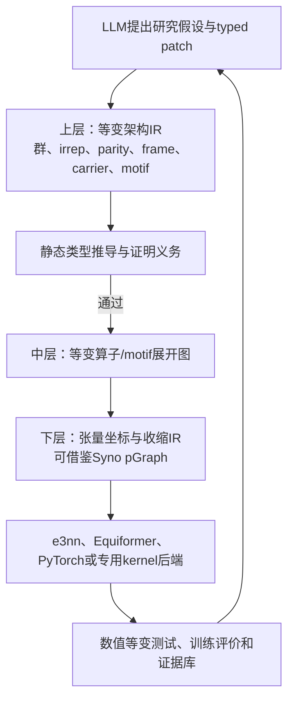

# 等变架构DSL可参考代码与Syno源码审计

> 调研对象：[tsinghua-ideal/Syno](https://github.com/tsinghua-ideal/Syno)及等变学习、编译器和LLM驱动搜索相关代码库  
> Syno审计版本：`d6e7820779a6231abedd5116cf7e980c0b3db748`  
> 检索日期：2026-07-24；源码状态复核日期：2026-07-25  
> 本地源码：`C:\Users\26517\Documents\中关村\literature_tmp\Syno`  
> 证据范围：Syno论文全文、官方仓库源码、仓库测试与设计文档；其他项目以官方仓库和当前项目实际依赖为主

## 先说结论

**Syno可以参考，而且是目前最值得参考的代码之一，但只能参考它的“结构化合成与编译骨架”，不能把Syno直接改名为等变DSL。**

Syno解决的是：如何用一组细粒度张量维度原语合成新的线性神经算子，并通过规范化、形状距离、树搜索和代码生成高效筛选候选。我们解决的是：如何让LLM生成新的二维或三维等变神经网络架构，同时由编译器静态保证群作用、表示类型、坐标系、载体和输出任务都合法。两者的共同部分是“程序化架构表示、受约束合成、冗余消除和多后端执行”；两者的根本差异是Syno没有群表示语义，也没有等变证明义务。

因此，正确的借鉴方式不是把Syno的`Split`、`Merge`、`Unfold`等八类原语直接加入当前等变DSL，而是建立两层中间表示：

Syno最适合作为下层张量程序IR和合成器的参考；`e3nn`与`escnn`才应构成上层等变类型系统的数学依据；Equiformer V1/V2应作为真实架构后端和表达性测试；OpenEvolve与SPARK负责外层候选进化，而不能决定候选是否等变。

## 1. Syno与我们的研究问题到底哪里相同

### 1.1 相同点

1. **架构不是一个超参数向量，而是一个程序。**Syno用primitive graph表示算子内部张量访问与收缩；我们的DSL用带类型的AST表示等变数据流、消息传递、张量积、注意力和读出结构。
2. **候选生成必须受语法和语义约束。**随机Python代码很难得到合法候选；结构化原语能显著提高有效候选率。
3. **必须消除语义重复。**不同文本、节点名称或局部重写可能表示同一架构；如果不规范化，LLM或进化算法会重复训练等价候选。
4. **需要面向目标的可完成性引导。**Syno用shape distance判断部分程序能否在剩余深度内匹配输入输出形状；我们的系统也需要判断部分架构能否在剩余编辑预算内满足输出表示、任务不变性和后端支持。
5. **表示、搜索与执行后端必须分离。**同一候选应能先做静态分析，再选择e3nn、Equiformer V1/V2或其他后端执行。

### 1.2 根本差异

| 维度 | Syno | 我们的等变架构DSL |
|---|---|---|
| 搜索对象 | 单个线性神经算子的张量坐标表达式 | 模块、消息传递块、注意力路径、表示流和可能的新等变算子 |
| 正确性条件 | 形状合法、可微、资源约束和可训练性启发式 | 群作用一致、输入输出表示匹配、frame与carrier合法、证明义务可解除 |
| 对称性 | 不显式建模 | SO(2)、O(2)、SO(3)、O(3)及平移、置换等任务契约 |
| 非线性 | 当前主要合成线性算子 | 必须区分标量激活、范数激活、gate和S²激活等合法非线性 |
| 候选提出者 | MCTS、随机搜索等算法 | LLM提出假设和typed patch，搜索器与编译器负责约束与筛选 |
| 目标 | 精度与硬件性能折中 | 极化率MAE、等变正确性、训练成本、参数量和推理性能等多目标 |

这意味着Syno证明了“把神经算子表示成语言并进行结构化合成”是可行方向，但它没有证明“任意合成出的张量程序是等变的”。

## 2. Syno源码中最值得参考的部分

### 2.1 pGraph与IR分层

重点文件：

- `include/KAS/Core/PrimitiveOp.hpp`
- `include/KAS/Core/Dimension.hpp`
- `include/KAS/Core/Graph.hpp`
- `include/KAS/Core/IR.hpp`
- `src/Core/Lower.cpp`

Syno把搜索态的维度变换图、lowering后的张量IR和最终代码生成分开。`PrimitiveOp`不仅记录操作名称，还定义操作能否作用于当前接口、如何改变接口、如何传播维度取值和如何计算稳定哈希。`IRBuilder`再把搜索图切分成张量子图，并执行归约因子化和布局优化。

对我们的直接启发是：当前`ArchitectureProgram`不应同时承担“LLM可编辑格式、证明格式和后端执行格式”三个职责。至少应区分：

1. **表面程序**：适合LLM生成和人阅读的motif与typed patch。
2. **规范等变IR**：motif完全展开、类型完全推导、节点和端口稳定编号。
3. **后端IR**：针对e3nn、Equiformer V2 SO(2)路径或张量kernel进行lowering。

### 2.2 在线canonicalization

重点文件：

- `src/Transforms/Canonicalization.cpp`
- `tests/Transforms/Canonicalization.cpp`
- 各原语实现中的`canApplyToInterface`与规范化检查

Syno不是等候完整候选生成后才去重，而是在每次扩展部分图时拒绝非规范路径。这样既减少完整候选重复，也减少无效搜索分支。其规则同时包含严格语义等价规则和较激进的近似规则。

我们的当前canonicalization主要解决节点重命名、稳定序列化和motif展开后的语义ID，还需要增加**类型保持的等变重写规则**，例如：

- 连续同类型`irrep_linear`在无非线性与共享约束时的组合；
- `identity`消除；
- 交换律允许的direct sum、标量乘和聚合节点的稳定排序；
- 同一frame中的互逆`to_edge_frame`与`from_edge_frame`在满足条件时消除；
- 等价张量积路径及其Clebsch–Gordan耦合顺序的规范表示；
- residual分支和motif展开后的alpha-renaming无关ID。

这里不能直接照搬Syno的近似canonicalization。任何近似删除都必须单独标记为搜索启发式，不能改变“静态证明等价”的语义ID，否则可能把训练行为不同的等变候选错误合并。

### 2.3 shape distance与“等变可完成距离”

重点文件：

- `include/KAS/Search/ShapeComplexity.hpp`
- `src/Search/ShapeComplexity.cpp`
- `src/Search/NormalStage.cpp`
- `src/Search/Finalize.cpp`

Shape distance是Syno最有价值的算法思想之一。它不是预测精度，而是估计当前部分程序至少还需要多少变换才能匹配目标形状，并在剩余深度不够时提前剪枝。

我们的对应物不应只叫shape distance，而应拆成以下可计算的下界：

| 距离 | 含义 | 用途 |
|---|---|---|
| 表示距离 | 当前输出irreps到任务所需irreps至少需要几次合法变换 | 防止生成无法读出的表示流 |
| frame距离 | 当前局部坐标系到目标全局/边坐标系还需几次合法转换 | 防止frame悬空或错误混合 |
| carrier距离 | node、edge、graph等载体之间还需几次lift、aggregate或pool | 保证图数据流可闭合 |
| 不变量距离 | 目标为标量时，当前非标量表示还需几步合法收缩或选择 | 保证QM9极化率输出不变 |
| 后端距离 | 当前节点到受支持后端子图至少还需哪些适配 | 提前拒绝无法执行的候选 |
| 证明缺口 | 尚未解除的证明义务数量及最小修复代价 | 引导LLM进行局部修复 |

这些距离可以形成词典序或带权向量，但不能与预测MAE混成一个不可解释的分数。它们首先用于合法性剪枝，其次才作为LLM修复反馈。

### 2.4 搜索树、状态共享与checkpoint

重点文件：

- `include/KAS/Search/Sample.hpp`
- `include/KAS/Search/Node.hpp`
- `src/Search/`
- `experiments/search/mcts/algorithm.py`
- `experiments/search/session.py`

Syno的搜索状态是部分程序，动作是增加一个原语，完整程序才交给训练器评价。搜索树支持状态哈希、节点共享、MCTS、随机搜索、分布式评价和`state.json`恢复。

我们应借鉴的是**部分程序搜索和确定性状态ID**，而不是照搬MCTS本身。LLM可以生成较大粒度typed patch，确定性搜索器则负责：

1. 展开LLM提出的抽象意图；
2. 枚举少量满足类型的具体实现；
3. 用可完成距离和成本上界剪枝；
4. 对规范语义ID去重；
5. 把编译失败诊断返回repairer；
6. 将完整候选交给多保真训练。

这样，LLM负责科学假设和结构创新，程序搜索负责组合完整性，二者职责清楚。

### 2.5 后端代码生成

重点文件：

- `src/CodeGen/PyTorchGen.cpp`
- `src/CodeGen/TVMCodeGen.cpp`
- `src/CodeGen/HalideGen.cpp`
- `src/Core/Lower.cpp`

Syno能从同一IR生成PyTorch、TVM和Halide实现，这证明“搜索语义”和“执行实现”应分离。我们应借鉴后端接口与能力报告，但不能直接使用Syno的codegen生成等变网络，因为它只按张量坐标生成普通线性计算，不理解irrep基、宇称和群作用。

## 3. Syno代码不能直接照搬的部分

### 3.1 八类张量原语不是等变原语

`Split`、`Merge`、`Shift`、`Expand`、`Unfold`、`Stride`、`Reduce`和`Share`只描述索引与收缩。一个操作保持tensor shape或可微，并不意味着它与群表示$
ho(g)$可交换。等变线性映射至少需要满足：

$$
L\rho_{\mathrm{in}}(g)=\rho_{\mathrm{out}}(g)L,\quad\forall g\in G.
$$

例如，对irrep分量任意`Split`或独立dropout可能破坏表示块结构；对空间坐标任意`Shift`或`Unfold`也未必与旋转群作用相容。因此这些原语只能作为可信等变算子lowering后的实现细节，或者在新增证明规则后有条件开放。

### 3.2 Shape合法不等于表示合法

两个张量都可能是`[N,C,3]`，但最后一维可能分别表示三个无关标量或一个$l=1$向量。Syno的shape系统无法区分它们。我们的类型必须保留group、irrep、parity、frame、carrier和measure，不能退化成普通shape类型。

### 3.3 Syno不是LLM驱动系统

官方实现主要使用MCTS、随机搜索和手工搜索策略。Syno证明了结构化语言能让搜索更有效，但没有提供LLM如何理解该语言、提出可检验假设、利用编译诊断修复以及随证据更新语言词汇的机制。LLM协议仍需由我们设计。

### 3.4 Syno当前接口比我们的目标窄

其设计文档和论文都说明当前重点是线性算子，且对多输入、多输出、attention、非线性和复杂中间分支支持有限。我们的目标至少要覆盖图消息传递、注意力、残差、门控、SO(2)卷积和S²激活，因此不能把Syno的pGraph直接当成完整架构AST。

## 4. 其他应参考的代码库

| 优先级 | 代码库 | 应参考的内容 | 不应照搬的内容 |
|---|---|---|---|
| P0 | [e3nn/e3nn](https://github.com/e3nn/e3nn) | SO(3)/O(3)irreps、张量积路径、球谐、等变线性层、gate和norm activation | 不把e3nn模块调用列表直接当作语言规范；e3nn主要覆盖欧氏三维表示 |
| P0 | [QUVA-Lab/escnn](https://github.com/QUVA-Lab/escnn) | 群、表示、G-space、FieldType、GeometricTensor和二维/三维群上的核空间约束 | 其CNN场类型不能直接替代分子图上的node/edge/graph carrier |
| P0 | [tsinghua-ideal/Syno](https://github.com/tsinghua-ideal/Syno) | 细粒度IR、部分程序合成、在线规范化、shape distance、状态共享和多后端lowering | 不直接复用普通张量原语作为等变原语，不把MCTS当作等变正确性机制 |
| P0 | [atomicarchitects/equiformer](https://github.com/atomicarchitects/equiformer) | Equiformer V1的张量积注意力、图构建、QM9训练接口和基线精确回建 | 不只抽取四类超参数；需要表达其真实计算图 |
| P0 | [FAIR-Chem/fairchem中的EquiformerV2](https://github.com/FAIR-Chem/fairchem) | edge-frame变换、SO(2)卷积、S²激活、分辨率旋转和高效实现 | 不把V2整块当成一个不可编辑黑盒 |
| P1 | [algorithmicsuperintelligence/openevolve](https://github.com/algorithmicsuperintelligence/openevolve) | LLM候选生成、archive、岛模型、评价反馈和checkpoint外壳 | 自由Python编辑不能作为我们的核心候选表示 |
| P1 | [AIM-ResearchLab/SPARK](https://github.com/AIM-ResearchLab/SPARK) | 结构化代码区域编辑、反思与候选迭代工作流 | 代码region不是等变类型；不能由LLM自报合法 |
| P1 | [egraphs-good/egg](https://github.com/egraphs-good/egg)或[egglog](https://github.com/egraphs-good/egglog) | 等价类、重写规则、代价提取和饱和式规范化 | 不能未经证明加入近似等价规则；全量饱和可能造成状态爆炸 |
| P2 | [xdslproject/xdsl](https://github.com/xdslproject/xdsl)或[LLVM/MLIR](https://github.com/llvm/llvm-project/tree/main/mlir) | dialect、operation verifier、rewrite pass、lowering和backend capability的工程分层 | 当前阶段不宜直接引入MLIR工具链增加实现负担 |

### 4.1 为什么e3nn与escnn都需要

`e3nn`最贴近当前三维分子任务，适合做SO(3)/O(3)irreps和张量积的可信执行内核；`escnn`的价值是它把群、表示、空间作用和field type分得更一般，能帮助语言从三维分子图扩展到二维旋转/反射图像，而不是把所有类型规则写死为$l=0,1,2$。

因此，语言规范应借鉴`escnn`的抽象边界，当前QM9后端则优先依赖`e3nn`实现与验证。

### 4.2 为什么Equiformer源码必须作为表达性测试

如果DSL只能调用`EquiformerV1(config)`或枚举V1四类因子，它不是架构语言。必须能够把V1关键路径展开成核心图，并能表达V2的`global frame→edge frame→SO(2)卷积→S²激活→global frame`路径。V1/V2源码因此既是后端参考，也是语言表达性单元测试的ground truth。

## 5. 对当前实现的具体映射

当前`equivariant_nas/dsl`已经具备AST、群契约、irreps、类型推导、motif、typed patch、canonical ID、编译门面、e3nn后端、V1/V2适配器、LLM协议和证据库。这说明现在不需要重写成Syno，而应补齐下面几层。

| Syno机制 | 当前对应组件 | 当前差距 | 建议新增 |
|---|---|---|---|
| pGraph/IR | `ast.py`、`compiler.py` | 表面AST与规范IR边界还不够强 | `ir/normalized.py`与显式lowering pass |
| Primitive interface | `registry.py` | 已有类型规则，但缺少结构化代价、逆操作和完成距离元数据 | 为原语增加effect、cost、repair和lowering contract |
| Canonicalization | `canonicalize.py` | 主要是稳定命名与序列化 | 类型保持重写系统和等价证明记录 |
| Shape distance | `completion.py`中的`TypedHole`、`CompletionDistance`、`program_completion_frontier`和`materialize_completion_patch` | 已能计算表示、frame、carrier、不变量、后端和证明缺口，返回合法原语路径，并物化到输入端口或程序输出；结果写入completion证据表 | 增加分支回溯、跨候选状态共享、motif级动作和资源联合剪枝 |
| Partial-program tree | `patch.py`、`search.py` | 当前以一次LLM patch事务为主 | 部分程序状态、合法动作枚举和状态共享 |
| MCTS/session | 外部OpenEvolve流程 | DSL生成器尚未完整接入主循环 | 搜索适配层、archive checkpoint和恢复协议 |
| Multi-backend codegen | `backends/` | V2关键路径仍是独立adapter，节点覆盖不完整 | 规范IR到各后端的逐节点support matrix和lowering pass |

### 5.1 建议直接阅读的Syno源码顺序

若目的是指导当前等变DSL实现，建议按下面的顺序阅读，而不是从实验脚本或MCTS代码开始：

| 阅读顺序 | Syno源码 | 要回答的问题 | 对应到当前DSL |
|---|---|---|---|
| 1 | `include/KAS/Core/PrimitiveOp.hpp`、`src/Core/PrimitiveOp.cpp` | 一个原语如何声明适用条件、状态变换和稳定身份 | `registry.py`中的原语规格、类型规则和后端能力 |
| 2 | `include/KAS/Core/Graph.hpp`、`include/KAS/Core/IR.hpp` | 搜索态图与可执行IR为什么需要分层 | `ast.py`与未来的规范IR、后端IR |
| 3 | `src/Core/Lower.cpp` | 如何把高层候选确定性lowering为执行表示 | `compiler.py`和各后端adapter |
| 4 | `src/Transforms/Canonicalization.cpp`及对应测试 | 如何在搜索期间去除等价或冗余候选 | `canonicalize.py`及未来的严格等变重写系统 |
| 5 | `include/KAS/Search/ShapeComplexity.hpp`、`src/Search/ShapeComplexity.cpp` | 如何估计部分程序距离合法终态还有多远 | `completion.py`中的多维completion distance |
| 6 | `include/KAS/Search/Node.hpp`、`src/Search/Node.cpp`、`include/KAS/Search/Sample.hpp` | 如何表示、共享、扩展和恢复部分程序状态 | typed hole、部分程序checkpoint和证据库 |
| 7 | `src/CodeGen/PyTorchGen.cpp`、`src/CodeGen/TVMCodeGen.cpp`、`src/CodeGen/HalideGen.cpp` | 如何让同一IR进入不同执行后端 | e3nn、Equiformer V1/V2和未来kernel后端 |

这里最应该先移植的是设计模式和接口契约，不是C++实现本身。当前DSL以Python、JSON Schema和LLM typed patch为核心，直接把Syno的C++对象模型嵌入上层会增加绑定成本，并让群表示类型沦为外挂字段。

## 6. 推荐的实现顺序

### 第一阶段：先补“可证明的合成内核”

1. 冻结上层类型字段：group、irrep、parity、frame、carrier、measure和task output。
2. 把motif展开后的程序转换为独立规范IR，不允许后端读取未经展开的LLM文本。
3. 为每个核心原语声明输入输出类型关系、证明义务、资源估计和后端能力。
4. 实现严格等价重写与proof trace，语义ID只使用已证明规则。
5. 实现表示、frame、carrier、不变量、后端和证明缺口六类completion distance。

### 第二阶段：让LLM与确定性合成器协同

1. Planner只提出结构假设与允许修改的作用域。
2. Synthesizer生成typed patch或带hole的部分程序，而不是自由Python。
3. 确定性合成器依据类型与completion distance填充hole。
4. Repairer只使用编译诊断修复，不接触测试集结果。
5. canonical ID去重后再进入多保真训练，避免重复消耗A100预算。

### 第三阶段：引入Syno式下层算子发现

只有在上层架构DSL稳定后，才把特定可信等变算子lowering为张量坐标IR，并允许在保持群交换约束的前提下搜索内部收缩结构。此时可以探索真正接近“从V1发现V2式新算子”的路径：搜索对象不再只是选择V1/V2模块，而是等变算子内部的合法耦合与收缩程序。

这一阶段必须增加以下闸门：

- 符号层证明候选与群作用可交换，或由可信构造定理保证；
- float64随机群元素数值测试；
- 旋转、反射、平移和置换测试按任务契约分别启用；
- 后端实现与规范IR的语义指纹绑定；
- 未通过证明和数值测试的候选不能进入长训练。

## 7. 对“能否从V1产生V2”的精确回答

仅参考Syno的primitive graph仍然不够。要从V1产生V2式结构，语言必须允许改变以下内容：

1. 表示所处坐标系，包括global frame与edge-aligned frame；
2. 计算所依据的子群，包括SO(3)表示向SO(2)表示的限制与恢复；
3. 卷积/注意力内部耦合路径，而不是只改通道数和层数；
4. 合法的非线性位置与形式，包括separable S² activation；
5. 模块级数据流与残差路径。

Syno提供“如何搜索新的内部程序”的方法论；e3nn、escnn和Equiformer V2提供“哪些群表示变换在数学上合法”的依据。只有两者结合，才有机会支持V1到V2级别的结构创新。

## 8. 最终建议

1. **把Syno列为核心参考实现，优先级P0。**重点吸收IR分层、在线canonicalization、completion distance、部分程序搜索和后端分离。
2. **不要把Syno作为当前DSL的代码基座。**其主体为C++20和Python绑定，数据模型围绕普通张量维度；直接派生会让等变类型成为外挂，后续很难保证正确性。
3. **当前Python实现继续作为上层可信DSL。**它更适合与LLM、JSON Schema、typed patch和证据库集成。
4. **未来新增一个Syno式下层tensor IR。**只接受已经通过等变类型检查的算子lowering，并由后端生成PyTorch/e3nn或专用kernel。
5. **近期最有价值的新增不是更多原语，而是严格语义重写与完整部分程序搜索。**第一版completion distance和路径物化已经实现；下一步应验证其剪枝收益，并补齐分支回溯、跨候选状态共享和资源联合约束。

## 9. 证据来源

- [Syno正式论文DOI](https://doi.org/10.1145/3676642.3736118)
- [Syno官方代码仓库](https://github.com/tsinghua-ideal/Syno)
- [e3nn官方代码仓库](https://github.com/e3nn/e3nn)
- [escnn官方代码仓库](https://github.com/QUVA-Lab/escnn)
- [Equiformer官方代码仓库](https://github.com/atomicarchitects/equiformer)
- [FAIR-Chem官方代码仓库](https://github.com/FAIR-Chem/fairchem)
- [OpenEvolve官方代码仓库](https://github.com/algorithmicsuperintelligence/openevolve)
- [SPARK官方代码仓库](https://github.com/AIM-ResearchLab/SPARK)

## 10. 证据强度说明

- 关于Syno的IR、规范化、shape distance、搜索和codegen判断来自固定提交源码与论文全文，属于源码级证据。
- 关于当前DSL状态来自本地`codex/equivariant-dsl`分支源码，属于实现审计。
- 关于两层IR和LLM协同方式属于基于上述证据的设计推断；第一版completion distance与typed patch物化已有实现和单元测试，但其搜索效率收益仍需消融实验验证。
- 本文不主张Syno已经实现等变网络合成，也不主张当前DSL已经具备从V1自动发现V2的能力。
