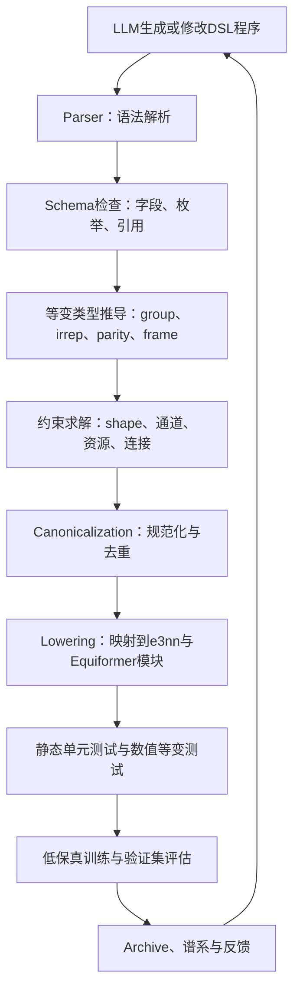

# 等变架构DSL可参考代码与复用边界

> 调研日期：2026年7月24日  
> 目标：确定三维等变网络架构DSL应参考哪些开源代码，并明确Syno的适用范围、可复用组件和不可照搬部分。

## 一、结论

[Syno](https://github.com/tsinghua-ideal/Syno)值得重点参考，但不能直接作为等变架构DSL的完整实现。

Syno最有价值的部分是它把神经网络算子表示为由细粒度原语组成的程序，并提供中间表示（Intermediate Representation，IR）、图结构、解析、规范化、基于形状约束的程序合成和多后端代码生成。这正好回答了本项目的一个核心工程问题：怎样把架构从自由文本或整段Python代码，变成LLM可以稳定生成、编译器可以静态检查、搜索系统可以局部修改的结构化程序。

但是，Syno处理的核心语义是张量维度、索引和循环变换。它没有表示三维旋转群或正交群，没有不可约表示（irreducible representation，irrep）、奇偶性（parity）、参考系（frame）、Clebsch-Gordan耦合路径，也没有证明整个计算图满足等变性的类型规则。因此，直接扩展Syno的几个原语并不足以得到可靠的等变DSL。

本项目不应选择一个仓库作为唯一底座，而应采用以下组合：

```text
Syno式原语、IR和规范化
+e3nn的群表示与张量积规则
+Equiformer V1/V2的可信模块和编译映射
+αNAS与NNSmith的抽象属性、约束检查和合法图生成
+SPARK与OpenEvolve的LLM搜索、谱系和评估闭环
```

初版建议在当前Python工程内实现，不建议直接fork Syno并在其C++代码上硬改。这样可以直接调用e3nn和Equiformer模块，也能与现有训练、候选评估和LLM进化管线衔接。Syno的C++、TVM和Halide后端可以在后续研究算子级性能优化时再引入。

## 二、为什么Syno可以参考

### 2.1 Syno解决的问题

Syno将高层张量算子分解为更细粒度的程序原语，然后在这些原语构成的空间中合成新算子。其核心思想不是让模型直接输出一段任意代码，而是让搜索发生在一个有语法、有形状语义、有规范形式且可以生成后端代码的语言中。

这与本课题的目标有明显共性：

1. LLM不直接修改任意Python源码，而是生成受约束的架构程序。
2. 编译器在训练前排除语法错误、类型错误和明显不合法的架构。
3. 同一个架构程序可以规范化、比较、去重并保存父子谱系。
4. 合法程序能够lowering到真实的PyTorch和Equiformer实现。

### 2.2 值得参考的代码

本次核验基于Syno提交`d6e7820779a6231abedd5116cf7e980c0b3db748`。

| 设计问题 | Syno代码 | 对本项目的启发 |
| --- | --- | --- |
| 怎样表示一个程序 | [`include/KAS/Core/IR.hpp`](https://github.com/tsinghua-ideal/Syno/blob/d6e7820779a6231abedd5116cf7e980c0b3db748/include/KAS/Core/IR.hpp) | 设计等变DSL的节点、输入、输出和操作数引用 |
| 怎样表示计算图 | [`include/KAS/Core/Graph.hpp`](https://github.com/tsinghua-ideal/Syno/blob/d6e7820779a6231abedd5116cf7e980c0b3db748/include/KAS/Core/Graph.hpp) | 保存节点依赖、拓扑关系和子图边界 |
| 怎样表示张量 | [`include/KAS/Core/Tensor.hpp`](https://github.com/tsinghua-ideal/Syno/blob/d6e7820779a6231abedd5116cf7e980c0b3db748/include/KAS/Core/Tensor.hpp) | 建立张量静态信息，但需增加irrep、parity、frame等字段 |
| 怎样解析语言 | [`include/KAS/Core/Parser.hpp`](https://github.com/tsinghua-ideal/Syno/blob/d6e7820779a6231abedd5116cf7e980c0b3db748/include/KAS/Core/Parser.hpp)、[`src/Core/Parser.cpp`](https://github.com/tsinghua-ideal/Syno/blob/d6e7820779a6231abedd5116cf7e980c0b3db748/src/Core/Parser.cpp) | 将文本候选转为AST或IR，并给出定位明确的错误 |
| 怎样消除等价写法 | [`src/Transforms/Canonicalization.cpp`](https://github.com/tsinghua-ideal/Syno/blob/d6e7820779a6231abedd5116cf7e980c0b3db748/src/Transforms/Canonicalization.cpp) | 为架构哈希、缓存和重复候选判定建立规范形式 |
| 怎样用抽象信息裁剪搜索 | [`include/KAS/Search/AbstractStage.hpp`](https://github.com/tsinghua-ideal/Syno/blob/d6e7820779a6231abedd5116cf7e980c0b3db748/include/KAS/Search/AbstractStage.hpp)、[`include/KAS/Search/Finalize.hpp`](https://github.com/tsinghua-ideal/Syno/blob/d6e7820779a6231abedd5116cf7e980c0b3db748/include/KAS/Search/Finalize.hpp) | 在调用训练前用类型和属性约束剪掉不可能合法的候选 |
| 怎样生成不同后端 | [`src/CodeGen/PyTorchGen.cpp`](https://github.com/tsinghua-ideal/Syno/blob/d6e7820779a6231abedd5116cf7e980c0b3db748/src/CodeGen/PyTorchGen.cpp) | 建立DSL到PyTorch/Equiformer模块的lowering层 |
| 怎样验证原语语义 | [`tests/Semantics/test_semantics_conv2d.py`](https://github.com/tsinghua-ideal/Syno/blob/d6e7820779a6231abedd5116cf7e980c0b3db748/tests/Semantics/test_semantics_conv2d.py) | 为每个DSL原语建立参考实现与数值一致性测试 |

Syno中的`Share`、`Stride`、`Unfold`、`Merge`、`Split`、`Reduce`、`Shift`和`Reverse`说明了“原语应足够细，组合应有明确语义”的设计原则。这些原语不应原样复制为本项目的主要搜索词表，因为它们描述的是索引变换，而不是等变表示之间的合法映射。

### 2.3 Syno不能解决的部分

Syno不能直接判断以下程序是否合法：

```text
输入：32x0e + 16x1o
操作：TensorProduct(输入, spherical_harmonics_l=2)
输出：候选声明为48x0e
```

这个判断需要知道输入不可约表示、球谐函数的阶数与奇偶性、张量积允许产生的输出表示，以及是否存在匹配的耦合路径。普通shape系统只能看到通道维度，无法证明该声明满足群作用下的等变关系。

因此，本项目需要比Syno的Tensor类型更强的`EquivariantTensorType`，至少包含：

```text
domain         节点、边、全局图或规则网格
group          SO(2)、O(2)、SO(3)、O(3)、SE(3)等
irreps         不可约表示及其重数
parity         奇偶性
frame          global、edge-aligned、local等参考系
shape          批量、节点、边和通道形状
dtype/device   数值类型和设备
```

## 三、各代码库应承担的职责

### 3.1 e3nn：数学类型内核

仓库：[e3nn/e3nn](https://github.com/e3nn/e3nn)，本次核验提交`2aa7f58440a06b15352a2cbce01fa4c26f824969`，MIT许可证。

| 能力 | 重点代码 | 本项目用途 |
| --- | --- | --- |
| irrep与Irreps表示 | [`e3nn/o3/_irreps.py`](https://github.com/e3nn/e3nn/blob/2aa7f58440a06b15352a2cbce01fa4c26f824969/e3nn/o3/_irreps.py) | 解析和规范化等变类型 |
| 张量积指令 | [`e3nn/o3/_tensor_product/_instruction.py`](https://github.com/e3nn/e3nn/blob/2aa7f58440a06b15352a2cbce01fa4c26f824969/e3nn/o3/_tensor_product/_instruction.py) | 表示输入、输出和耦合路径 |
| 张量积执行 | [`e3nn/o3/_tensor_product/_tensor_product.py`](https://github.com/e3nn/e3nn/blob/2aa7f58440a06b15352a2cbce01fa4c26f824969/e3nn/o3/_tensor_product/_tensor_product.py) | 作为DSL原语的可信实现 |
| 门控激活 | [`e3nn/nn/_gate.py`](https://github.com/e3nn/e3nn/blob/2aa7f58440a06b15352a2cbce01fa4c26f824969/e3nn/nn/_gate.py) | 定义标量门控非线性的输入输出约束 |
| 数值等变检查 | [`e3nn/util/test.py`](https://github.com/e3nn/e3nn/blob/2aa7f58440a06b15352a2cbce01fa4c26f824969/e3nn/util/test.py) | 对编译后的候选运行旋转、反射和置换测试 |

关键原则是：群表示代数必须属于可信内核。LLM可以选择合法原语、参数和组合方式，但不能自行定义张量积选择规则或通过自然语言宣布某个不受支持的操作“是等变的”。

### 3.2 Equiformer V1/V2：可信后端与表达性基准

Equiformer V1仓库：[atomicarchitects/equiformer](https://github.com/atomicarchitects/equiformer)。可重点参考：

- [`nets/tensor_product_rescale.py`](https://github.com/atomicarchitects/equiformer/blob/main/nets/tensor_product_rescale.py)：`TensorProductRescale`、`FullyConnectedTensorProductRescale`和`DepthwiseTensorProduct`。
- [`nets/graph_attention_transformer.py`](https://github.com/atomicarchitects/equiformer/blob/main/nets/graph_attention_transformer.py)：`GraphAttention`和`TransBlock`。

Equiformer V2仓库：[atomicarchitects/equiformer_v2](https://github.com/atomicarchitects/equiformer_v2)，本次核验提交`d5ad4be729b56f74012ebb7f097f77c5b00a1004`。可重点参考：

- [`nets/equiformer_v2/so3.py`](https://github.com/atomicarchitects/equiformer_v2/blob/d5ad4be729b56f74012ebb7f097f77c5b00a1004/nets/equiformer_v2/so3.py)：`SO3_Embedding`、`SO3_Rotation`、`SO3_Grid`和`SO3_Linear`。
- [`nets/equiformer_v2/so2_ops.py`](https://github.com/atomicarchitects/equiformer_v2/blob/d5ad4be729b56f74012ebb7f097f77c5b00a1004/nets/equiformer_v2/so2_ops.py)：`SO2_m_Convolution`、`SO2_Convolution`和`SO2_Linear`。
- [`nets/equiformer_v2/activation.py`](https://github.com/atomicarchitects/equiformer_v2/blob/d5ad4be729b56f74012ebb7f097f77c5b00a1004/nets/equiformer_v2/activation.py)：`GateActivation`和`SeparableS2Activation`。
- [`nets/equiformer_v2/transformer_block.py`](https://github.com/atomicarchitects/equiformer_v2/blob/d5ad4be729b56f74012ebb7f097f77c5b00a1004/nets/equiformer_v2/transformer_block.py)：`SO2EquivariantGraphAttention`、`FeedForwardNetwork`和`TransBlockV2`。

这两个仓库有两种用途：第一，为DSL原语提供经过论文和实现验证的PyTorch后端；第二，作为表达性测试，检验语言是否能够表示从V1张量积注意力到V2局部参考系和SO(2)卷积路径的结构变化。

需要强调：能够“调用V2模块”不等于语言具备“从V1空间组合出V2机制”的能力。后者要求DSL显式表示参考系变换、按$m$分块的SO(2)操作、球面激活、聚合和残差连接，使搜索能够修改这些结构关系，而不是把整个V2封装为一个不可拆分的黑盒选项。

### 3.3 αNAS：抽象属性引导的程序合成

代码位于[google-research/abstract_nas](https://github.com/google-research/google-research/tree/master/abstract_nas)。值得参考的部分包括：

- `abstract/base.py`、`shape.py`、`depth.py`、`linear.py`和`fingerprint.py`：计算候选图的抽象属性。
- `synthesis/graph.py`、`prog_sequential.py`和`enum_sequential.py`：根据目标属性合成子图。
- `evolution/mutator`：对图执行可追踪的变异。
- `model/concrete.py`和`model/subgraph.py`：区分具体图与待替换子图。

本项目可将其shape、depth和linearity属性扩展为：

```text
irrep_flow             每条边上传播的不可约表示
frame_flow             参考系建立、变换和恢复的位置
coupling_paths         允许的Clebsch-Gordan耦合路径
equivariance_obligation 每个节点尚需满足的等变证明义务
cost_upper_bound       参数量、FLOPs和显存上界
```

这会使LLM不只是随机填参数，而是根据“希望改变哪些抽象属性”提出结构程序。

### 3.4 NNSmith与NeuRI：约束生成和规则归纳

[NNSmith](https://github.com/ise-uiuc/nnsmith)本次核验提交为`bc0af42c7d5fc4fd201efb76e5313f6298c2d573`。重点代码包括：

- [`nnsmith/abstract/tensor.py`](https://github.com/ise-uiuc/nnsmith/blob/bc0af42c7d5fc4fd201efb76e5313f6298c2d573/nnsmith/abstract/tensor.py)：抽象张量。
- [`nnsmith/abstract/op.py`](https://github.com/ise-uiuc/nnsmith/blob/bc0af42c7d5fc4fd201efb76e5313f6298c2d573/nnsmith/abstract/op.py)：算子前置条件与类型传递。
- [`nnsmith/gir.py`](https://github.com/ise-uiuc/nnsmith/blob/bc0af42c7d5fc4fd201efb76e5313f6298c2d573/nnsmith/gir.py)：图中间表示。
- [`nnsmith/graph_gen.py`](https://github.com/ise-uiuc/nnsmith/blob/bc0af42c7d5fc4fd201efb76e5313f6298c2d573/nnsmith/graph_gen.py)：由约束驱动的合法图生成。

NNSmith可用于借鉴`requires`约束、Z3求解、向前和向后插入算子、失败诊断以及PyTorch materialization，但它的现有类型系统仍需加入群表示语义。

[NeuRI](https://github.com/ise-uiuc/neuri-artifact)本次核验提交为`fd46c7ea1b80f67a0e93bdb0fc2ed35830e1f831`。它可参考的重点是从执行记录归纳算子的shape和输入约束。此方法适合补充实现相关的派生规则，例如资源上界、某后端对输入排列的限制或未文档化的shape条件。

群表示公理不能只依赖trace归纳。有限次运行没有报错，不能证明一个操作对所有旋转都等变。因此，irrep、parity和耦合选择规则应固定在可信类型内核中，NeuRI式归纳只能处理派生约束。

### 3.5 SPARK与OpenEvolve：搜索编排层

[SPARK](https://github.com/AIM-ResearchLab/SPARK)适合参考：

- 把复杂程序拆成可独立修改的因子或区域；
- 根据历史结果选择本轮应激活的知识和编辑范围；
- 限制LLM修改边界，减少整段代码编辑带来的无效候选。

[OpenEvolve](https://github.com/algorithmicsuperintelligence/openevolve)适合参考：

- 候选archive；
- 父候选选择和子候选谱系；
- LLM生成、评估、反馈和再生成闭环；
- 多目标分数、岛屿或种群管理、checkpoint与恢复。

二者都属于搜索编排层，不应负责证明等变性。正确的数据流是LLM先产生DSL程序，再由解析器、类型检查器和等变验证器判断是否合法，最后才进入训练评估。

## 四、直接复用、借鉴和禁止照搬的边界

| 级别 | 内容 | 原因 |
| --- | --- | --- |
| 可直接依赖 | e3nn的`Irrep`、`Irreps`、TensorProduct和等变测试工具 | 这些是成熟的群表示实现，可作为数学可信内核 |
| 可直接调用 | Equiformer V1/V2中与目标模块一致的实现 | 避免初版重复实现复杂算子，但需编写稳定adapter |
| 可移植设计 | Syno的IR分层、规范化、shape引导搜索和代码生成接口 | 设计成熟，但应在Python中按等变语义重建 |
| 可移植设计 | αNAS的抽象解释和目标属性合成 | 属性集合需要替换为等变属性 |
| 可移植机制 | NNSmith的约束求解和合法图生成 | 可使用相似框架，但需新的等变类型与约束 |
| 可移植流程 | SPARK的范围选择与OpenEvolve的进化archive | 与当前LLM驱动搜索目标一致 |
| 不应照搬 | Syno全部C++20、CMake、TVM和Halide工程栈 | 初版会增加集成成本，且不能自动补足等变语义 |
| 不应照搬 | 把V1/V2整块封装成枚举项 | 只能做模型选择，无法发现算子内部的新组合 |
| 不应允许 | LLM增加任意Python算子并自行声称等变 | 绕过类型系统后无法保证核心前提 |
| 不应依赖 | 仅用随机旋转数值测试代替静态规则 | 数值测试只能发现反例，不能构成完整证明 |

许可证方面，Syno和e3nn均为MIT。Equiformer、αNAS、NNSmith、NeuRI、SPARK和OpenEvolve在实际复制源码前仍应逐一核对目标提交中的`LICENSE`、文件头和第三方依赖条款。借鉴设计思想通常不要求复制代码，但任何源码移植都应保留版权与许可证声明。

## 五、建议的语言与编译器分层



这套分层中，LLM只负责提出候选，不负责裁定候选。编译器给出的错误需要结构化，例如：

```text
E_IRREP_004
node: block_3.tensor_product
expected_output: 32x0e + 16x1o
inferred_output: 32x0e + 16x1e + 8x2e
repair_options:
  - change declared output irreps
  - remove unsupported coupling paths
```

这种错误比“程序运行失败”更适合反馈给LLM，也更有利于积累可复用的修复知识。

## 六、建议的项目目录

```text
equivariant_dsl/
├── syntax/
│   ├── schema.py
│   ├── parser.py
│   └── ast.py
├── types/
│   ├── groups.py
│   ├── irreps.py
│   ├── frames.py
│   └── tensor_type.py
├── primitives/
│   ├── linear.py
│   ├── tensor_product.py
│   ├── rotation.py
│   ├── activation.py
│   ├── aggregation.py
│   └── attention.py
├── analysis/
│   ├── type_inference.py
│   ├── obligations.py
│   ├── cost_model.py
│   └── diagnostics.py
├── transforms/
│   ├── canonicalize.py
│   ├── simplify.py
│   └── fingerprint.py
├── lowering/
│   ├── e3nn_backend.py
│   ├── equiformer_v1_backend.py
│   └── equiformer_v2_backend.py
├── verification/
│   ├── equivariance.py
│   ├── semantic_tests.py
│   └── resource_checks.py
├── search/
│   ├── mutations.py
│   ├── factor_router.py
│   ├── archive.py
│   └── llm_protocol.py
└── tests/
    ├── test_type_rules.py
    ├── test_canonicalization.py
    ├── test_v1_roundtrip.py
    ├── test_v2_expressivity.py
    └── test_invalid_programs.py
```

## 七、推荐实施顺序

### 阶段A：最小可信语言

先定义`EquivariantTensorType`、不可约表示声明、线性映射、张量积、门控、聚合、残差和读出原语。类型规则直接调用或交叉核对e3nn。此阶段的验收标准不是训练精度，而是所有合法样例可编译，所有已知非法样例能在训练前被拒绝。

### 阶段B：V1往返编译

将当前Equiformer V1配置翻译成DSL，再lowering回等价模型。固定权重和输入后，检查原实现与编译结果的输出和梯度一致性，并进行旋转、反射和节点置换测试。这一步证明DSL不是只存在于文档中的描述语言。

### 阶段C：规范化、哈希与局部变异

实现Syno式canonicalization和稳定fingerprint，使语义等价程序能够去重。变异操作以AST或IR节点为单位，不允许LLM编辑编译器和验证器。archive保存源码、规范形式、父候选、变异说明、编译结果、验证结果和训练指标。

### 阶段D：表达V2关键机制

逐步加入参考系变换、SO(2)分块卷积、球面激活和对应的frame flow。验收标准是能够用通用原语组合表达V2关键数据流，而不只是增加一个`use_v2=true`开关。这是检验语言能否支持跨代架构创新的关键阶段。

### 阶段E：接入LLM进化闭环

接入SPARK式编辑范围选择和OpenEvolve式archive。对比至少包括自由代码编辑、固定因子枚举和DSL程序生成。三组使用相同模型、基本任务描述、训练预算和候选数量；但不能机械要求prompt逐字相同，因为不同表示需要不同格式说明。公平性应通过相同信息预算、调用预算、评估预算和可用先验来控制。

### 阶段F：扩展到二维和其他三维任务

语言核心需要将`group`参数化，而不是把所有规则写死为O(3)。二维任务可扩展SO(2)/O(2)表示，三维任务可覆盖SO(3)/O(3)，涉及平移时由图构建或相对坐标机制处理SE(3)/E(3)。跨任务实验用于验证语言和搜索策略的泛化性，而不是仅在QM9极化率上调优。

## 八、对当前课题的直接建议

当前最合理的原型不是复刻Syno，而是实现一个“Syno式外壳、e3nn式内核、Equiformer式后端”的Python编译器。

第一版应控制语言规模。优先覆盖当前四类架构因子及其底层组合原语，同时保留扩展接口。若一开始同时支持二维、三维、所有群和任意自定义算子，类型系统、后端和验证成本会迅速失控，也无法判断性能提升来自语言设计还是实现漏洞。

研究贡献不应表述为“使用了DSL”。更可检验的主张是：显式编码群表示、参考系和耦合规则的架构语言，能否在相同LLM和训练预算下，提高合法候选率、结构新颖性、搜索样本效率和最终模型质量；以及这种语言能否表达并组合出超出初始模板的等变机制。

因此，Syno是关键参考之一，但本项目真正需要实现的是一套新的等变类型系统、验证义务和可信lowering。没有这三部分，所谓DSL只会是另一种配置文件，无法支撑“LLM在受约束语言中发现新等变架构”的论文主张。

## 九、参考仓库索引

| 仓库 | 角色 | 本次核验版本 |
| --- | --- | --- |
| [tsinghua-ideal/Syno](https://github.com/tsinghua-ideal/Syno) | 原语、IR、规范化、合成、代码生成 | `d6e7820779a6231abedd5116cf7e980c0b3db748` |
| [e3nn/e3nn](https://github.com/e3nn/e3nn) | 群表示、张量积、等变测试 | `2aa7f58440a06b15352a2cbce01fa4c26f824969` |
| [atomicarchitects/equiformer](https://github.com/atomicarchitects/equiformer) | V1可信模块与目标训练后端 | 本地当前版本，实施前固定提交 |
| [atomicarchitects/equiformer_v2](https://github.com/atomicarchitects/equiformer_v2) | frame、SO(2)路径和V2表达性基准 | `d5ad4be729b56f74012ebb7f097f77c5b00a1004` |
| [google-research/abstract_nas](https://github.com/google-research/google-research/tree/master/abstract_nas) | 抽象属性与属性引导合成 | 实施前固定提交 |
| [ise-uiuc/nnsmith](https://github.com/ise-uiuc/nnsmith) | 约束求解和合法图生成 | `bc0af42c7d5fc4fd201efb76e5313f6298c2d573` |
| [ise-uiuc/neuri-artifact](https://github.com/ise-uiuc/neuri-artifact) | 派生shape与输入约束归纳 | `fd46c7ea1b80f67a0e93bdb0fc2ed35830e1f831` |
| [AIM-ResearchLab/SPARK](https://github.com/AIM-ResearchLab/SPARK) | 编辑范围、因子路由和知识激活 | 实施前固定提交 |
| [algorithmicsuperintelligence/openevolve](https://github.com/algorithmicsuperintelligence/openevolve) | LLM进化、archive、谱系和checkpoint | 实施前固定提交 |

