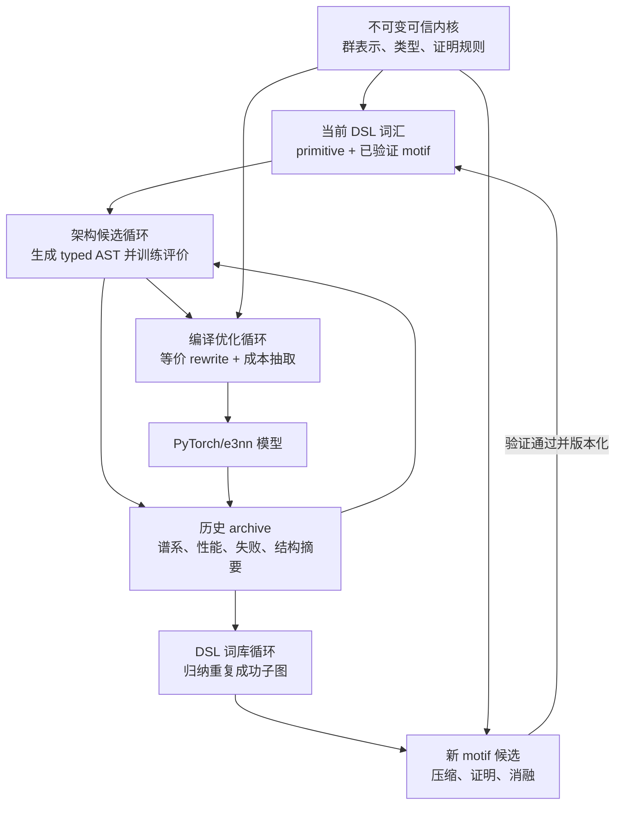
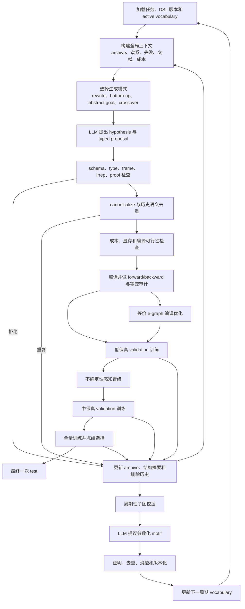

# 等变架构 DSL 系统性会议论文调研与候选生成设计修订

> 调研日期：2026-07-24  
> 研究目标：系统梳理能够直接支撑“LLM 驱动的等变网络架构自进化”的会议论文，并据此修订 DSL 设计。  
> 核心任务：不是把论文名称堆在一起，而是回答怎样让 LLM 基于数学规则、论文知识、历史实验和当前搜索状态，生成更好的结构候选。
> 论文原文归档：本轮实际使用的 36 篇 PDF 已保存到[本地论文库](论文原文/)，逐篇页数、版本、阅读状态和 SHA-256 见[论文下载与阅读清单](论文原文/论文下载与阅读清单.md)。

---

## 1. 对上一版调研的纠正

上一版《面向 LLM 候选生成的等变网络架构 DSL 深度调研与设计依据》完成了若干种子论文的机制审计，但不应被表述为系统性会议论文覆盖。其主要缺口有四个：

1. 对神经架构搜索会议论文的覆盖集中在少数 LLM-NAS 与程序合成论文，没有系统纳入搜索空间演化、宏结构搜索、图 NAS 和 NAS benchmark；
2. 对程序合成的讨论缺少 DreamCoder、CrossBeam、equality saturation 等“语言自身学习”和“底向上合成”机制；
3. 对等变相关工作主要关注 Equiformer 系列，没有充分纳入自动选择、放松或逐层学习等变约束的会议论文；
4. 最终 DSL 仍然被描述成一套较静态的原语库，没有回答 DSL 的高层词汇能否随着实验积累自动成长。

因此，本报告不是给上一版增加几个引用，而是重新建立论文版图，并据此修改系统设计。

---

## 2. 本轮调研问题

本轮围绕以下问题检索和阅读：

1. 现有 NAS 如何定义、压缩、扩展和自动演化搜索空间？
2. 图神经网络 NAS 如何把 message passing 拆成可搜索的组成部分？
3. 程序合成如何在 DSL 中发现组合程序、学习新抽象并控制组合爆炸？
4. 编译器图重写与神经架构结构变化的边界在哪里？
5. 等变网络中的群、表示和层级等变约束能否自动产生或自动选择？
6. LLM-NAS 为什么容易退化成调参数，怎样让它产生真正的结构变化？
7. 上述机制如何落实到 QM9 alpha、Equiformer 和当前工程代码？

---

## 3. 检索和筛选方法

### 3.1 时间与范围

- 主体时间：2019–2026；
- 补充范围：对 DSL、NAS 和等变构造有直接奠基作用的更早论文；
- 重点 venue：NeurIPS、ICML、ICLR、AAAI、IJCAI、CVPR、ICCV、ACL、KDD、WWW、ICDE、ASPLOS、SOSP、OOPSLA、FSE、PLDI、GECCO；
- 同时保留少量尚未正式发表但与本项目高度直接相关的预印本，并明确标注。

### 3.2 检索主题

检索不是只使用“equivariant NAS”一个关键词，而是分六组进行：

```text
equivariant neural architecture search
equivariance-aware architecture optimization
learning partial or layer-wise equivariance
graph neural architecture search and message passing search
neural architecture search as program transformation or synthesis
DSL, tensor graph rewriting, equality saturation and operator synthesis
LLM neural architecture search and evolutionary coding agents
search-space evolution, progressive pruning and macro NAS benchmark
```

### 3.3 来源

- 正式身份：会议论文首页、官方 proceedings、DOI、DBLP、Crossref；
- 预印本身份与全文：arXiv；
- 引文扩展：论文参考文献、图 NAS survey、NAS benchmark 论文；
- 快速发现：papers.cool，只作为发现入口；
- 方法结论：PDF 全文，而不是搜索摘要。

### 3.4 阅读层级

本轮沿用三层状态：

- `全文机制阅读`：已获得全文，并核读方法、实验、讨论或局限；
- `定向方法阅读`：读取论文方法和关键实验，但没有对全部附录做逐页审计；
- `身份/相关性记录`：只用于版图完整性，不据其摘要作详细技术断言。

当前本地共有 36 篇 PDF 及全文文本，包含上一轮 20 篇和本轮新增 16 篇。本报告的核心设计结论只依赖前两种阅读层级。

### 3.5 实用饱和而非“绝无遗漏”

本报告不能声称覆盖了所有论文。合理目标是：连续扩展后，新增论文不再带来新的核心机制类别，而主要是同类算法或新应用。当前已经覆盖以下机制类别：

- 静态离散搜索空间；
- 搜索空间自动裁剪与扩展；
- 宏结构与非均匀层级搜索；
- 图 message passing 因子化；
- 程序变换式 NAS；
- 属性引导程序合成；
- 底向上神经引导合成；
- DSL 抽象库学习；
- equality saturation；
- LLM mutation/crossover；
- 等变类型构造；
- 严格、部分和逐层等变；
- 多保真和质量多样性搜索。

---

## 4. 会议论文版图

### 4.1 等变构造、等变约束选择与等变 NAS

| 工作 | Venue/年份 | 阅读状态 | 与 DSL 的关系 |
|---|---|---|---|
| General E(2)-Equivariant Steerable CNNs | NeurIPS 2019 | 定向方法阅读 | 说明表示类型和核空间可系统构造 |
| LieConv | NeurIPS 2020 | 身份/相关性记录 | 用 Lie 群构造一般等变卷积 |
| EMLP | ICML 2021 | 全文机制阅读 | 从离散与无穷小生成元求全部等变线性映射 |
| Group Equivariant NAS via Group Decomposition and RL | 2021 预印本 | 全文机制阅读 | 直接研究群等变搜索，但空间仍是人工模块组合 |
| Learning Partial Equivariances from Data | NeurIPS 2022 | 全文机制阅读 | 学习各层使用的群子集，区分严格和部分等变 |
| Relaxing Equivariance Constraints with Non-Stationary Continuous Filters | NeurIPS 2022 | 定向方法阅读 | 将严格等变连续放松，提供可微等变程度 |
| Enabling Equivariance for Arbitrary Lie Groups | CVPR 2022 | 身份/相关性记录 | 任意 Lie 群的通用构造路径 |
| Equivariance-aware Architectural Optimization | 2022 预印本 | 全文机制阅读 | 在结构优化中显式考虑等变性 |
| Equiformer | ICLR 2023 | 全文机制阅读 | 当前 V1 基线和 SO(3) attention motif |
| eSCN | ICML 2023 | 全文机制阅读 | edge-aligned frame 与 SO(2) mixing |
| Learning Layer-wise Equivariances Automatically using Gradients | NeurIPS 2023 | 全文机制阅读 | 对逐层等变程度做贝叶斯模型选择 |
| Using and Abusing Equivariance | ICCV Workshops 2023 | 定向方法阅读 | 讨论错误或过度使用等变先验的风险 |
| EquiformerV2 | ICLR 2024 | 全文机制阅读 | V1→V2 结构表达力最低验收案例 |
| A Probabilistic Approach to Learning the Degree of Equivariance in Steerable CNNs | 2024 预印本 | 身份/相关性记录 | 概率化学习等变程度 |
| Variational Partial Group Convolutions | 2024 预印本 | 身份/相关性记录 | 输入相关的部分等变性 |
| Autoequivariant Network Search | 2021 预印本 | 全文机制阅读 | 自动选择等变网络构造，但正式 venue 尚未确认 |

### 这一组论文的共同结论

等变架构自动设计并不是空白，但现有工作大多搜索以下对象：

- 选择哪个群或群分解；
- 选择是否、在哪一层放松等变约束；
- 选择现成等变层的数量、宽度或组合；
- 在一个预定义模块集合中优化结构。

检索范围内，没有看到一项成熟的正式会议工作同时满足：

1. 用细粒度 SO(3)/E(3) typed DSL 表示算子内部计算图；
2. 用 LLM 或程序合成产生新的等变 motif；
3. 用构造性证明保证每个生成候选严格等变；
4. 在三维分子任务上做多保真进化评价。

这不是“绝对没有人做”，而是本轮检索范围内的明确研究空白。

### 4.2 图神经网络和分子图 NAS

| 工作 | Venue/年份 | 阅读状态 | 关键贡献 |
|---|---|---|---|
| GraphNAS | IJCAI 2020 | 全文机制阅读 | 将 GNN 层拆为采样、注意力、聚合、残差等动作 |
| Auto-GNN | 2019 预印本，后有期刊版本 | 全文机制阅读 | 按动作类别做保守局部修改和信用分配 |
| Neural Architecture Search in GNNs | BRACIS 2020 | 身份/相关性记录 | 进化式 GNN 搜索 |
| AutoGraph | ICONIP 2020 | 身份/相关性记录 | 自动生成图网络结构 |
| Graph NAS for Molecular Property Prediction | IEEE BigData 2020 | 定向方法阅读 | 直接面向分子性质，但非三维等变结构搜索 |
| Design Space for Graph Neural Networks | NeurIPS 2020 | 全文机制阅读 | 系统定义 315,000 个设计和任务相似性 |
| Simplifying Architecture Search for GNN | 2020 预印本 | 身份/相关性记录 | 用领域知识压缩 micro space |
| Propagation Model Search | 2020 预印本 | 身份/相关性记录 | 搜索异构图传播模型 |
| Rethinking GNN Search from Message-Passing | CVPR 2021 | 定向方法阅读 | 从 message passing 机制重新定义搜索空间 |
| AutoSTG | WWW 2021 | 身份/相关性记录 | 时空图宏结构搜索 |
| One-Shot GNN NAS with Dynamic Search Space | AAAI 2021 | 定向方法阅读 | 搜索过程中动态更新操作空间 |
| Search to Aggregate Neighborhood | ICDE 2021 | 身份/相关性记录 | 搜索邻域聚合机制 |
| AutoAttend | ICML 2021 | 身份/相关性记录 | 搜索跨层注意力表示 |
| Automated Machine Learning on Graphs: A Survey | IJCAI 2021 | 全文机制阅读 | 系统划分 micro、macro、pooling 与 HPO |
| NAS-Bench-Graph | NeurIPS 2022 | 全文机制阅读 | 26,206 个 GNN、统一协议、结构等价去重 |
| Graph Neural Architecture Search with GPT-4 | 2023 预印本 | 身份/相关性记录 | LLM 直接生成 GNN 候选的早期尝试 |
| Graph NAS with Large Language Models | 2025 期刊 | 定向方法阅读 | LLM 知识用于 GNN 架构搜索 |

### 对等变 DSL 最有价值的内容

GraphNAS 和 Auto-GNN 的价值不是它们的 RL 控制器，而是它们把 message passing 拆成：

```text
feature transform
neighbor sampling
correlation or attention
aggregation
combine or residual
activation
```

这证明“先分解一个领域中的计算语义，再搜索其组合”是可行的。然而这些工作主要从完整候选函数列表中选择，例如 SUM、MEAN、GAT、MLP，并没有从更低层语义产生新的聚合或耦合算子。

因此，我们应学习其**语义因子化方法**，但不能停在其**现成操作枚举粒度**。

### 4.3 搜索空间设计、演化和宏结构 NAS

| 工作 | Venue/年份 | 阅读状态 | 对本项目的贡献 |
|---|---|---|---|
| Regularized Evolution | AAAI 2019 | 定向方法阅读 | 老化机制保持探索性 |
| DARTS | ICLR 2019 | 定向方法阅读 | 连续松弛的 one-shot 搜索基线 |
| NSGA-Net | GECCO 2019 | 身份/相关性记录 | 多目标进化和 Pareto 搜索 |
| NAS-Bench-101 | ICLR 2020 | 定向方法阅读 | 规范化有限搜索空间和可复现实验 |
| NAS-Bench-201 | ICLR 2020 | 定向方法阅读 | 完整枚举与跨数据集比较 |
| Once-for-All | ICLR 2020 | 定向方法阅读 | 渐进收缩和一次训练多子网 |
| Designing Network Design Spaces / RegNet | CVPR 2020 | 定向方法阅读 | 从单架构搜索转向设计空间参数化 |
| Evolving Search Space for NAS | ICCV 2021 | 全文机制阅读 | 搜索空间子集继承、补充和持续演化 |
| NAS as Program Transformation Exploration | ASPLOS 2021 | 全文机制阅读 | 用基础程序变换生成预定义列表之外的新卷积 |
| Progressive Automatic Design of Search Space | WACV 2022 | 全文机制阅读 | 按层统计 Pareto 操作并渐进裁剪 |
| BLOX | NeurIPS 2022 | 全文机制阅读 | 非均匀宏结构优于重复同一 block 的证据 |
| NAS-Bench-360 | NeurIPS 2022 | 定向方法阅读 | 多任务评价及跨任务排名问题 |

### 新的重要结论：搜索空间本身应当进化

`Evolving Search Space` 发现，简单扩大静态搜索空间可能使 DARTS、ProxylessNAS 和 SPOS 等方法变差。其解决方案是只维护一个较小的活跃子空间：

1. 在当前子空间训练和搜索；
2. 保留 Pareto 候选涉及的操作；
3. 从未探索的总空间补充新操作；
4. 使用 Lock and Rehearse 防止已继承操作被新权重共享环境错误淘汰；
5. 重复上述过程。

这说明我们的 DSL 不能一开始开放所有 primitive、path、motif 和 macro 组合。更合理的是：

- 完整 DSL 定义合法宇宙；
- 每一周期只激活一个小型 `active vocabulary`；
- 保留成功词汇；
- 从未探索词汇和新归纳 motif 中补充；
- 定期重新评价旧词汇，避免权重共享或低保真噪声造成永久误删。

PAD-NAS 使用渐进裁剪缓解 supernet 权重耦合，但单向裁剪容易过早排除迟熟结构。因此本项目应采用“可逆裁剪 + 补充 + rehearsal”，而不是一次删除后永不恢复。

### 宏结构不能只用统一 Repeat

BLOX 的核心观察是：允许不同 stage 使用不同 block 的宏搜索空间，其 Pareto 前沿可以优于所有 stage 重复同一 block 的空间。

因此，DSL 中的：

```text
Repeat(block, n_layers)
```

只能作为一个简写，不能成为唯一宏结构。至少还要表达：

```text
StageSequence[
  stage_1 = motif_A,
  stage_2 = motif_B,
  stage_3 = motif_C
]

PerDegreeSchedule[
  l0_update = every_layer,
  l1_update = every_layer,
  l2_update = every_2_layers
]
```

这会允许 LLM 发现“不同深度使用不同等变计算”的非均匀架构。

### 4.4 程序合成、DSL 学习和图重写

| 工作 | Venue/年份 | 阅读状态 | 对 DSL 的贡献 |
|---|---|---|---|
| TASO | SOSP 2019 | 定向方法阅读 | 自动生成并搜索语义等价 tensor graph substitutions |
| AutoML-Zero | ICML 2020 | 全文机制阅读 | 用低级指令程序搜索完整学习算法 |
| DreamCoder | 2020 预印本/后续发表版本 | 全文机制阅读 | 从成功程序中学习新的 DSL 抽象和搜索先验 |
| Just-in-Time Learning for Bottom-Up Synthesis | OOPSLA 2020 | 身份/相关性记录 | 在枚举过程中学习搜索策略 |
| TENSAT | MLSys 2021 | 全文机制阅读 | equality saturation、多模式重写和成本抽取 |
| BUSTLE | ICLR 2021 | 定向方法阅读 | 用执行属性指导底向上合成 |
| Primer | NeurIPS 2021 | 全文机制阅读 | 从低级 primitive 发现 squared ReLU 等新结构 |
| CrossBeam | ICLR 2022 | 全文机制阅读 | 使用全局搜索上下文选择已有子程序作为参数 |
| αNAS | OOPSLA 2022 | 全文机制阅读 | 抽象属性修改与属性引导子图合成 |
| AutoBERT-Zero | AAAI 2022 | 全文机制阅读 | 低级 Transformer primitive 和双分支搜索 |
| NNSmith | ASPLOS 2023 | 全文机制阅读 | operator 约束、类型转移和 SMT 合法构图 |
| NeuRI | FSE 2023 | 全文机制阅读 | 从执行 trace 归纳 shape 规则并用 SMT 去重 |
| Syno | ASPLOS 2025 | 全文机制阅读 | 从 loop/index primitive 合成预定义列表之外的新算子 |

### DreamCoder：DSL 不只是人工定义，它可以积累新词汇

DreamCoder 的核心不是普通程序生成，而是交替完成三件事：

1. `wake`：用当前 DSL 搜索任务程序；
2. `abstraction sleep`：从多个成功程序的可重构片段中发现反复出现的语义模式，将其压缩成新的库函数；
3. `dreaming sleep`：从当前库生成想象任务和 replay，训练神经搜索策略。

它给本项目的直接启示是：

> 可信基础 primitive 应由人固定，但高层 motif 库可以从已验证的优良等变子图中自动生长。

例如多个独立优秀候选都出现：

```text
RotateToEdgeFrame
-> SO2Linear for l >= 2
-> SeparableNorm
-> RotateBack
```

系统可以对这些子图做 anti-unification，抽象出参数化 motif：

```text
HybridHighDegreeSO2(
  degree_threshold,
  m_block_policy,
  normalization
)
```

但它不能因为出现一次就进入可信库。必须满足：

- 出现在多个非重复谱系；
- 能显著压缩成功候选描述；
- 输入输出类型可泛化；
- 等变证明可以由已有 primitive 组合得到；
- 独立消融验证 motif 整体而非某个伴随超参数产生收益；
- 新 motif 有版本和来源记录。

### CrossBeam：LLM 不必一次生成整张网络

CrossBeam 维护所有已经探索的子程序及其执行结果。模型每次选择：

1. 当前使用哪个 DSL operation；
2. 从已有值中选择哪些作为 operation 的参数；
3. 执行生成新值；
4. 如果新值与已有值语义等价则去重；
5. 将新值放回全局搜索上下文。

对应到等变 NAS：

```text
已有值 = 已验证的 typed subgraph
operation = TensorProduct、SO2Linear、Gate、Merge 等
执行结果 = 类型摘要、等变证明、成本和低成本 probe
目标 = 满足指定输入输出接口与抽象属性的候选 motif
```

这比让 LLM 一次输出一个几百行模型更可靠。LLM 可以作为 hands-on policy，反复选择“下一步组合什么”，而 parser、type checker 和 compiler 始终控制合法性。

CrossBeam 还强调两点：

- 搜索策略要看到全局已探索集合，而不是只看当前冠军；
- 搜索策略应基于自己实际造成的搜索状态进行 on-policy 学习，避免训练提示和真实搜索状态分布不同。

本项目初期不必训练专门的神经策略，但 context builder 必须向 LLM 提供全局搜索摘要和已探索 motif，而不能只给 parent 与 top-3。

### TENSAT：等价图优化与架构搜索必须分开

TENSAT 使用 e-graph 同时表示大量等价 tensor graph，并把 rewrite rule 全部应用到饱和或预算上限，再根据成本模型抽取最优图。

其重要机制包括：

- S-expression 图表示；
- primitive 类型签名；
- 单模式和多模式 rewrite；
- shape precondition；
- canonicalization；
- e-class 表示等价关系；
- ILP 抽取共享子图和避免局部贪心；
- cycle 过滤；
- 时间、节点数和迭代次数预算。

但它也发现多模式 rewrite 可以使 e-graph 双指数增长。这说明 DSL 中的多节点重写必须有严格配额、局部作用域和优先级。

更重要的是，TENSAT 的 rewrite 保证**模型语义等价**，而 NAS mutation 有意改变预测函数族。两者必须是不同系统：

```text
Architecture rewrite
  目的：改变归纳偏置，可能改变精度
  判定：类型和等变合法，但不要求函数等价

Compiler rewrite
  目的：降低运行成本
  判定：必须函数语义等价
```

如果编译器把同一架构优化得更快，这属于 system gain，不是 architectural gain。

### NAS as Program Transformation Exploration：新算子可由基础变换组合得到

ASPLOS 2021 的 NATS 把 bottleneck、grouping、depthwise 等架构变化表述成对 loop domain 的程序变换。通过组合 interchange 和 bottleneck 等基础变换，可以生成原搜索操作列表中没有显式列出的 spatial bottleneck。

这一结果支持用户的核心想法：DSL 的 primitive 与规则可以让搜索系统推导出组合结构，而不只是枚举完整算子。

但论文使用 Fisher Potential 作为无需训练的“legality”代理。该合法性含义是候选可能保持任务表现，不是数学语义或等变性证明。等变 DSL 必须把两个概念分开：

```text
mathematical legality:
  shape、irrep、parity、frame、equivariance proof

empirical viability:
  gradient、Jacobian、zero-cost proxy、短训表现
```

经验 proxy 可以拒绝明显不可训练的候选，但不能证明它等变。

### 4.5 LLM-NAS 与进化式代码搜索

| 工作 | Venue/年份 | 阅读状态 | 核心机制 |
|---|---|---|---|
| EvoPrompting | NeurIPS 2023 | 全文机制阅读 | LLM 根据父代代码和分数生成 mutation/crossover |
| NAS for Parameter-Efficient Fine-Tuning | ACL Findings 2023 | 全文机制阅读 | 对结构化和非结构化 PEFT 组件做架构搜索 |
| LLMatic | GECCO 2024 | 全文机制阅读 | LLM 与质量多样性 archive 结合 |
| PromptBreeder | ICML 2024 | 定向方法阅读 | 进化 prompt 和 mutation prompt |
| Eureka | ICLR 2024 | 定向方法阅读 | LLM 代码生成、执行反馈和迭代改进 |
| Design Principle Transfer / LAPT | AAAI 2025 | 全文机制阅读 | 从优秀架构归纳原则并迁移到搜索空间 |
| AlphaEvolve | 2025 预印本 | 全文机制阅读 | 程序数据库、LLM ensemble、evaluator 与 islands |
| SPARK | 2026 预印本，仓库声明 ICML 2026 接收 | 全文机制阅读 | where-then-how 因子路由和区域约束 |
| Structuring Open-Ended NAS / FairNAD | 2026 预印本 | 全文机制阅读 | 论文知识树、公平 idea sampling 和迭代 mutation |
| What Do Evolutionary Coding Agents Evolve? | 2026 预印本 | 全文机制阅读 | 大规模轨迹审计，发现调参偏置和搜索循环 |
| From Memorization to Creativity | 2026 预印本 | 身份/相关性记录 | 研究 LLM 能否设计新架构 |
| Delta-Based NAS | 2026 预印本 | 身份/相关性记录 | 用代码差分表达 LLM 架构搜索 |

### 这一组论文的共同局限

LLM 能够产生开放代码变化，但高可执行率不等于高结构创新率。已有轨迹审计表明，代码进化系统最常执行的是超参数调整，而结构变化虽然频率较低，却更可能带来实质收益。

因此本项目不能用以下指标证明成功：

- 生成代码数量；
- Python 可执行率；
- 验证 MAE 有微小提升；
- LLM reasoning 中声称发现了新算子。

必须同时检查：

- typed AST 的结构编辑类别；
- 与父代和历史候选的规范化差异；
- 是否只是通道、dropout 或训练参数变化；
- 是否属于已有 motif 的参数实例；
- 是否出现新的 irrep flow、path 或 topology；
- 是否经过消融证明结构本身有贡献。

---

## 5. 跨论文综合：真正适合本项目的 DSL 不是静态语言

综合上述论文，完整系统应当包含三个不同的演化循环。



### 5.1 循环一：架构候选进化

输入：

- 当前 active vocabulary；
- 父代与多样性 archive；
- 文献 motif；
- 失败和删除历史；
- 当前任务状态与成本预算。

输出：

- 新 typed AST；
- 科学假设；
- 类型和证明记录；
- 多保真 validation 结果。

### 5.2 循环二：DSL 词库进化

输入：多条成功或有代表性的谱系。

过程：

1. 找到频繁出现或多次独立重现的 typed subgraph；
2. 用 anti-unification 找到公共结构和可变参数；
3. 计算引入新 motif 后的描述长度压缩；
4. 推导 motif 的输入输出类型和等变证明；
5. 与已有 motif 做 canonical equivalence 检查；
6. 在历史候选上回放并执行消融；
7. 通过后加入下一版 DSL vocabulary。

这一步把用户所说的“LLM 可以基于当前情况推导更好的规则”落实为可执行机制。

LLM 可以参与：

- 给公共子图命名和解释；
- 提出参数化边界；
- 提出适用前提；
- 生成消融计划；
- 预测新 motif 应应用于哪些层或表示阶数。

但 motif 的合法性和进入词库的决定不能只由 LLM 自评。

### 5.3 循环三：编译等价优化

输入：已选定架构 AST。

过程：

- 应用函数等价 rewrite；
- 融合相邻线性操作；
- 消除恒等和冗余 frame round-trip；
- 选择共享子图；
- 根据 A100 实测成本抽取实现。

输出：更快但架构语义等价的 PyTorch/e3nn 实现。

该循环的收益必须单独报告为 compiler/system gain。

---

## 6. DSL 的三层结构

上一版提出两层结构，本轮文献表明需要改为三层。

### 6.1 第一层：不可变可信数学内核

包含：

- E(3)/O(3)/SO(3) 群作用；
- irrep 与 parity；
- carrier 和 frame；
- CG 三角规则；
- 球谐；
- permutation 和 translation 规则；
- 基础 primitive 的等变证明。

LLM 和进化算法不能修改这一层。

### 6.2 第二层：可组合 primitive 层

包含：

- `RelativePosition`；
- `Distance`；
- `RadialBasis`；
- `SphericalHarmonic`；
- `IrrepLinear`；
- `TensorProduct`；
- `RotateToEdgeFrame`；
- `SO2Linear`；
- `RotateBack`；
- `ScaleByInvariant`；
- `Gate`；
- `SeparableS2Activation`；
- `SumNeighbors`；
- `ResidualAdd`；
- `ReadoutScalar`。

这一层变化缓慢。新增 primitive 必须有人工或机器可核验的数学语义。

### 6.3 第三层：可学习 motif 词库

包含：

- 官方 V1 message motif；
- eSCN edge-frame motif；
- V2 separable activation motif；
- 搜索中归纳出的混合 SO(3)/SO(2) motif；
- 分阶更新 motif；
- 不同 stage 的异构 block motif。

这一层可以随实验成长，但必须版本化：

```text
DSL core version: 1.0
primitive library version: 1.1
learned motif library version: cycle_07
```

任何候选都必须记录生成时使用的词库版本，否则无法复现。

---

## 7. 严格等变、部分等变和近似等变如何处理

部分等变和逐层等变论文不能被简单忽略，但也不能直接成为 QM9 alpha 主搜索空间。

### 7.1 为什么主搜索默认严格等变

QM9 分子的三维旋转不是数据偶然出现的统计模式，而是物理坐标选择不应改变标量极化率预测的基本要求。对图级 alpha 标量，模型应满足：

$$
f(RX+t)=f(X).
$$

因此主搜索空间应要求所有候选具有构造性严格等变证明。

### 7.2 为什么仍要在 DSL 中记录等变等级

建议使用：

```text
EquivarianceStatus =
  ExactByConstruction
  ExactAfterCompilation
  CertifiedApproximate(tolerance)
  EmpiricallyAuditedOnly
  RelaxedOrPartial
  Invalid
```

用途：

- 主搜索只允许前两类；
- 编译器数值实现可能有浮点容差；
- 部分或 relaxed equivariance 只进入独立研究分支和消融；
- 绝不能把随机旋转测试通过误写成构造性证明。

### 7.3 EMLP 给出的扩展路径

EMLP 证明，对任意矩阵群，可以从有限离散生成元和 Lie algebra 无穷小生成元构造全部等变线性映射的约束空间。

这为未来扩展 DSL 提供了一个 `generator-to-linear-map` 工具：

```text
GroupSpec
  -> representation generators
  -> linear equivariance constraints
  -> nullspace basis
  -> verified IrrepLinear primitive
```

在 SO(3) 主任务上，e3nn 的 irrep/CG 专门实现更高效；但 EMLP 式求解器可以作为新表示或新群 primitive 的验证器和原型生成器。

---

## 8. LLM 应如何生成候选

不能只有一种“LLM 修改 JSON”的方式。建议四种生成模式并存。

### 8.1 模式 A：假设驱动 motif rewrite

LLM 读取父代瓶颈，提出一个有类型的多节点重写。

适用：V1→V2、SO(3)→混合 SO(2)、归一化配套变化。

### 8.2 模式 B：底向上子图合成

借鉴 CrossBeam：

1. 保存已合法的 typed subgraphs；
2. 选择一个 primitive；
3. 从已有 subgraphs 中选择类型兼容的参数；
4. 立即计算类型、证明和成本；
5. 满足目标接口后形成 motif 候选。

适用：发现预定义 motif 之外的新内部计算路径。

### 8.3 模式 C：抽象属性目标合成

借鉴 αNAS：LLM 先提出抽象目标，例如：

```text
preserve output irreps
increase l=2 -> l=0 readout paths
reduce full SO3 high-degree paths by at least 30%
add at most one frame transition pair
```

合成器再寻找满足目标的 typed subgraph。

适用：把自然语言 insight 转换为可搜索结构目标。

### 8.4 模式 D：谱系 crossover

从两个性能和结构互补的父代中选择接口兼容 motif 交换。

必须满足：

- 子图接口类型一致；
- 不是简单拼接两个完整网络；
- 保留父代来源；
- 进行 parent A、parent B、child 的反事实对照。

---

## 9. LLM 的“当前情况”应包含什么

用户强调 LLM 必须基于当前情况生成更好的候选。当前情况不能只是排行榜。

### 9.1 任务状态

- QM9 alpha；
- batch size、step budget、数据子集；
- 当前 fidelity；
- validation 间隔；
- test 是否仍隔离；
- A100 时间与显存预算。

### 9.2 父代结构状态

- typed AST；
- irrep flow；
- CG path coverage；
- frame transition；
- 每阶通道和非线性深度；
- 参数量、FLOP、step time、显存。

### 9.3 训练动力学

- validation MAE 曲线；
- 最佳 step 与最后 step；
- 收敛斜率；
- 梯度异常；
- 是否出现过拟合；
- 不同 fidelity 排名一致性。

### 9.4 谱系与删除历史

- 最近祖先；
- sibling 反事实；
- 已尝试且失败的 edit；
- 删除后又被重新加入的 motif；
- 重复语义指纹。

### 9.5 多样性 archive

LLM 应同时看到：

- MAE 最优；
- 成本/精度 Pareto；
- 结构新颖；
- 不同 frame 和 coupling 家族；
- 代表性失败。

### 9.6 文献与 DSL 词库

每个 motif 包含：

- 来源论文；
- 正式发表状态；
- 类型接口；
- 适用前提；
- 论文证据范围；
- 本项目实验状态；
- 已知失败模式。

---

## 10. 搜索空间很大时怎样快速收敛

用户此前提出“单次候选成本很大，快速收敛本身就是好 idea”。会议论文支持这一目标，但必须区分四种效率。

### 10.1 生成效率

指标：生成候选中通过 parser、type 和 proof 的比例。

手段：typed grammar、底向上合成、作用域路由。

### 10.2 结构探索效率

指标：每训练一个候选产生多少新的语义结构，而不是多少不同文本。

手段：canonical fingerprint、active vocabulary、replenishment、质量多样性 archive。

### 10.3 训练评价效率

指标：低 fidelity 对全量排序的预测能力和单位 GPU 小时的新最佳概率。

手段：多保真、学习曲线外推、少量探索性晋级、记录排名相关性。

### 10.4 最终优化效率

指标：达到目标 validation MAE 所需总 GPU 时间。

手段：结构搜索与超参数调优分离、编译器等价优化、缓存和 checkpoint。

仅仅让 8000 step 候选更快下降，不足以证明全量更快收敛。必须测量：

$$
\tau_{r}=
\operatorname{KendallTau}
(\operatorname{rank}_{r\text{ steps}},
\operatorname{rank}_{\text{full}}).
$$

如果低保真排名相关性低，就应保留 uncertainty-aware 晋级和随机探索名额。

---

## 11. 对当前四因子方案的修订

四因子仍可保留，但其含义需要修改。

| 因子 | 当前含义 | 修订后含义 |
|---|---|---|
| REPRESENTATION | 通道和 lmax 参数 | irrep schema、带宽、通道和跨层表示调度 |
| OPERATOR | 五个构造参数 | typed equivariant operator graph |
| ACTION | norm/dropout 等 | 非线性、归一化、注意力权重、聚合和状态更新机制 |
| MACRO | 层数和 radius | 非均匀 stage、分支、重复、分阶更新和 readout topology |

### 11.1 单因子仍有用，但不能是单字段

Auto-GNN 已经展示了“修改一个动作类别，但同时修改多层对应动作”的机制。它说明单因子可以是一次多位置协同修改。

本项目应把：

```text
assert exactly one dataclass differs
```

替换为：

```text
validate one declared semantic transaction
```

### 11.2 需要动态 active vocabulary

每个周期为四个因子分别维护：

- active primitive；
- active motif；
- locked inherited motif；
- exploration additions；
- temporarily pruned motif；
- permanently invalid motif。

### 11.3 需要 learned motif registry

建议记录：

```yaml
motif_id: hybrid_high_degree_so2_v3
introduced_in_cycle: 7
source_lineages: [c104, c188, c205]
abstracted_from: [subgraph_hash_1, subgraph_hash_2]
input_type: GeoTensor[node, irreps=L0+L1+L2, global]
output_type: GeoTensor[node, same_irreps, global]
proof_status: ExactByConstruction
description_length_gain: 0.34
ablation_status: passed
validation_effect:
  mean_delta_mae: -0.0018
  seeds: 3
```

---

## 12. 必须新增的工程组件

### 12.1 DSL 及证明

```text
dsl/types.py
dsl/primitives.py
dsl/ast.py
dsl/type_checker.py
dsl/equivariance_proof.py
dsl/canonicalize.py
dsl/compiler.py
```

### 12.2 搜索空间进化

```text
search/vocabulary.py
search/active_space.py
search/replenishment.py
search/rehearsal.py
search/space_version.py
```

### 12.3 motif 学习

```text
library/subgraph_mining.py
library/anti_unification.py
library/abstraction_score.py
library/motif_validator.py
library/motif_registry.py
```

### 12.4 LLM 合成

```text
generation/context_builder.py
generation/hypothesis_rewrite.py
generation/bottom_up_synthesis.py
generation/crossover.py
generation/proposal_schema.py
```

### 12.5 等价编译优化

```text
compiler/egraph.py
compiler/equivalent_rewrites.py
compiler/cost_model.py
compiler/extractor.py
```

架构 rewrite 和等价 compiler rewrite 必须放在不同目录、使用不同 schema 和不同日志字段。

---

## 13. 建议的端到端工作流



---

## 14. 需要通过实验回答的问题

### 14.1 DSL 是否真的提高好候选概率

比较：

1. 当前四因子 JSON；
2. 自由 Python diff；
3. 固定 typed motif DSL；
4. primitive DSL + 底向上合成；
5. primitive DSL + learned motif library。

指标：

- parser/type/proof 通过率；
- 唯一语义候选比例；
- 结构编辑比例；
- 每 GPU 小时的晋级候选数；
- 最终 validation MAE；
- 全量排名相关性。

### 14.2 learned motif 是否有贡献

比较：

- 不学习 motif；
- 只做频率抽取；
- 频率 + 描述长度压缩；
- 再加证明和消融；
- 再加 LLM 参数化与适用条件。

### 14.3 搜索空间演化是否优于一次全开放

比较：

- 全 primitive 全开放；
- 固定小型 active vocabulary；
- 只裁剪；
- 裁剪 + replenishment；
- 裁剪 + replenishment + rehearsal。

### 14.4 严格等变是否必要

主实验保持严格等变。独立消融可比较：

- exact by construction；
- 只在特定隐藏层 relaxed；
- 普通非等变 GNN；

但 relaxed 候选不能混入主 archive 竞争，否则会改变研究问题。

### 14.5 宏结构异构性是否有效

比较：

- 所有层重复同一 motif；
- stage-wise motif；
- degree-wise update schedule；
- LLM 生成非均匀结构。

---

## 15. 这项工作的真正研究创新可能在哪里

如果只把 LLM 接到 Equiformer 的参数表上，它属于 LLM 辅助超参数/NAS 工程，创新有限。

更值得研究的组合是：

> 构造一个带等变类型和证明的可执行 DSL；用 LLM 在该语言中进行多粒度程序合成；再从已验证成功谱系中自动学习新的高层 motif，使搜索语言随任务经验增长。

该方向同时融合：

- e3nn/EMLP 的构造性等变类型；
- αNAS/NATS/Syno 的细粒度程序变换与合成；
- DreamCoder 的语言抽象学习；
- CrossBeam 的全局上下文底向上搜索；
- TENSAT 的等价类和规范化；
- SPARK 的 where-then-how 路由；
- OpenEvolve/LLMatic 的数据库和质量多样性；
- 搜索空间演化论文的 active vocabulary 与 rehearsal。

这个组合不是对某一篇论文工作流的简单复刻。

---

## 16. 当前可下的结论与仍不能下的结论

### 可以下的结论

1. 用户所说“DSL 是为了让 LLM 基于当前情况生成更好候选”是准确的；
2. 当前四因子只是第一层安全路由，不是最终 DSL；
3. 细粒度原语、静态语义和 learned motif library 可以同时保留合法性与开放性；
4. 搜索空间必须分阶段激活和演化，不能一次完全展开；
5. 架构搜索、DSL 词库学习和编译等价优化必须分开；
6. QM9 alpha 主搜索应保持严格 E(3)/O(3) 约束；
7. 一次科学修改可以是多节点事务，不应限制为单字段。

### 仍不能下的结论

1. 尚未证明 learned motif 一定比固定 motif 搜索更省 GPU；
2. 尚未证明 LLM 比程序合成器、随机搜索或 BO 更擅长发现等变结构；
3. 尚未证明 8000/80000 step 的排序能可靠预测全量训练；
4. 尚未发现并验证一个真正新的等变算子；
5. 尚未证明 V2 风格 motif 对 QM9 alpha 必然优于 V1。

这些必须由后续实现和消融回答。

---

## 17. 推荐实施顺序

### 第一优先级：让 DSL 可表达 V1、V2 和混合结构

- typed AST；
- irrep/parity/frame checker；
- V1/V2 motif；
- trusted compiler；
- 严格等变审计。

### 第二优先级：实现多种候选生成模式

- hypothesis rewrite；
- bottom-up synthesis；
- archive-aware context；
- semantic dedup。

### 第三优先级：实现 active vocabulary

- 小空间起步；
- Pareto 保留；
- replenishment；
- rehearsal；
- search-space versioning。

### 第四优先级：实现 learned motif library

- 子图挖掘；
- anti-unification；
- 描述长度；
- 证明；
- 消融；
- motif 注册与版本升级。

### 第五优先级：再训练专用生成策略

只有积累足够真实搜索轨迹后，才考虑 CrossBeam 式 on-policy policy 或对 LLM 做任务适配。当前阶段直接训练专用策略数据不足。

---

## 18. 代表性参考文献

### 等变网络和自动等变约束

1. EMLP: A Practical Method for Constructing Equivariant Multilayer Perceptrons for Arbitrary Matrix Groups, ICML 2021. [arXiv:2104.09459](https://arxiv.org/abs/2104.09459)
2. Learning Partial Equivariances from Data, NeurIPS 2022. [arXiv:2110.10211](https://arxiv.org/abs/2110.10211)
3. Relaxing Equivariance Constraints with Non-Stationary Continuous Filters, NeurIPS 2022. [arXiv:2204.07178](https://arxiv.org/abs/2204.07178)
4. Learning Layer-wise Equivariances Automatically using Gradients, NeurIPS 2023. [arXiv:2310.06131](https://arxiv.org/abs/2310.06131)
5. Equiformer, ICLR 2023. [arXiv:2206.11990](https://arxiv.org/abs/2206.11990)
6. eSCN, ICML 2023. [arXiv:2302.03655](https://arxiv.org/abs/2302.03655)
7. EquiformerV2, ICLR 2024. [arXiv:2306.12059](https://arxiv.org/abs/2306.12059)
8. Equivariance-aware Architectural Optimization, preprint. [arXiv:2210.05484](https://arxiv.org/abs/2210.05484)
9. Group Equivariant Neural Architecture Search, preprint. [arXiv:2104.04848](https://arxiv.org/abs/2104.04848)

### 图 NAS 和搜索空间

10. GraphNAS, IJCAI 2020. [arXiv:1904.09981](https://arxiv.org/abs/1904.09981)
11. Auto-GNN, 2019 preprint. [arXiv:1909.03184](https://arxiv.org/abs/1909.03184)
12. Design Space for Graph Neural Networks, NeurIPS 2020. [arXiv:2011.08843](https://arxiv.org/abs/2011.08843)
13. Evolving Search Space for Neural Architecture Search, ICCV 2021. [arXiv:2011.10904](https://arxiv.org/abs/2011.10904)
14. Progressive Automatic Design of Search Space for One-Shot NAS, WACV 2022. [arXiv:2005.07564](https://arxiv.org/abs/2005.07564)
15. NAS-Bench-Graph, NeurIPS 2022. [arXiv:2206.09166](https://arxiv.org/abs/2206.09166)
16. BLOX, NeurIPS 2022. [arXiv:2210.07271](https://arxiv.org/abs/2210.07271)
17. Automated Machine Learning on Graphs: A Survey, IJCAI 2021. [arXiv:2103.00742](https://arxiv.org/abs/2103.00742)

### 程序合成和 DSL

18. Neural Architecture Search as Program Transformation Exploration, ASPLOS 2021. [arXiv:2102.06599](https://arxiv.org/abs/2102.06599)
19. Neural Architecture Search using Property Guided Synthesis, OOPSLA 2022. [DOI:10.1145/3563329](https://doi.org/10.1145/3563329)
20. Equality Saturation for Tensor Graph Superoptimization, MLSys 2021. [arXiv:2101.01332](https://arxiv.org/abs/2101.01332)
21. CrossBeam, ICLR 2022. [arXiv:2203.10452](https://arxiv.org/abs/2203.10452)
22. DreamCoder. [arXiv:2006.08381](https://arxiv.org/abs/2006.08381)
23. NNSmith, ASPLOS 2023. [arXiv:2207.13066](https://arxiv.org/abs/2207.13066)
24. NeuRI, FSE 2023. [arXiv:2302.02261](https://arxiv.org/abs/2302.02261)
25. Syno, ASPLOS 2025. [DOI:10.1145/3676642.3736118](https://doi.org/10.1145/3676642.3736118)

### LLM 和开放式架构搜索

26. EvoPrompting, NeurIPS 2023. [arXiv:2302.14838](https://arxiv.org/abs/2302.14838)
27. LLMatic, GECCO 2024. [DOI:10.1145/3638529.3654017](https://doi.org/10.1145/3638529.3654017)
28. Design Principle Transfer in NAS via LLMs, AAAI 2025. [arXiv:2408.11330](https://arxiv.org/abs/2408.11330)
29. Neural Architecture Search for Parameter-Efficient Fine-Tuning, ACL Findings 2023. [arXiv:2305.16597](https://arxiv.org/abs/2305.16597)
30. AlphaEvolve, preprint. [arXiv:2506.13131](https://arxiv.org/abs/2506.13131)
31. SPARK, 2026 preprint. [arXiv:2605.04057](https://arxiv.org/abs/2605.04057)
32. Structuring Open-Ended Neural Architecture Discovery, 2026 preprint. [arXiv:2605.19247](https://arxiv.org/abs/2605.19247)
33. What Do Evolutionary Coding Agents Evolve?, 2026 preprint. [arXiv:2605.20086](https://arxiv.org/abs/2605.20086)

---

## 19. 一句话总结

真正适合本项目的 DSL，不是一个人工写死的 Equiformer 参数表，而是一个由不可变等变数学内核、可组合细粒度原语和可从成功谱系中持续学习的高层 motif 词库组成的可执行语言；LLM 的作用是利用全局搜索历史和论文知识提出 typed program，而验证器、程序合成器和实验闭环共同决定哪些候选和新规则值得保留。
