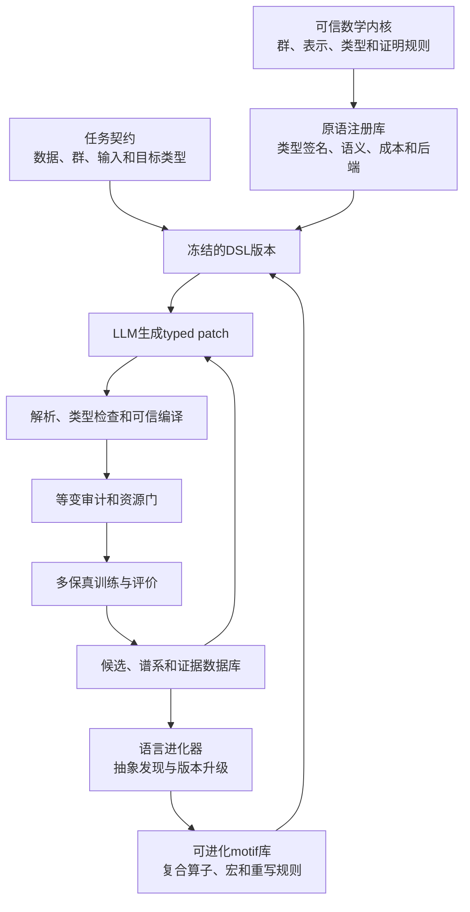
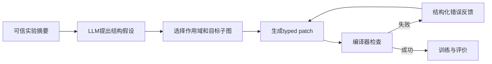
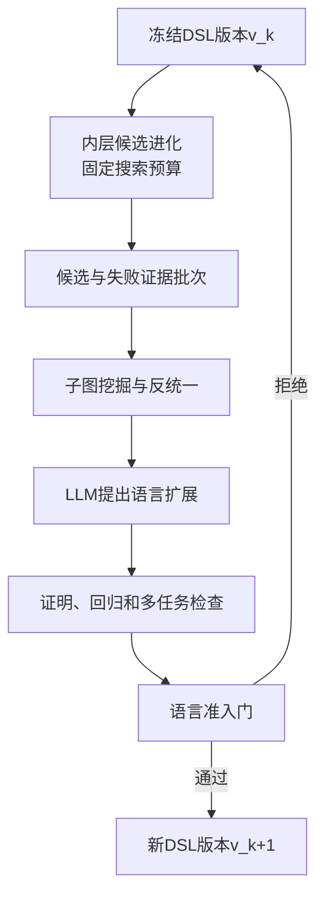

# 自进化等变神经网络架构DSL完整设计方案

> 文档性质：课题总体方法设计与实施规划  
> 核心目标：让LLM在统一、可编译、可认证并可受控进化的等变架构语言中生成高质量候选  
> 设计范围：二维与三维等变网络、候选数据库、OpenEvolve/SPARK对照、语言进化和跨任务泛化

## 1. 核心结论

本课题不应把DSL设计成一个固定的Equiformer参数表，也不应让LLM直接修改任意Python。合理方案是构建一个双层系统：

1. **不可变的可信等变内核**：定义群、表示类型、群作用、合法耦合、类型规则和等变组合规则。它决定什么结构在数学上合法，不能随候选任意变化。
2. **可进化的架构语言层**：由可信原语组成，可以增加经过验证的复合算子、motif、宏和重写规则。它决定LLM能够用哪些高层词汇高效生成候选，可以在外层进化循环中升级。

候选架构和DSL不能以相同频率变化。建议采用双时间尺度：

```text
内层循环：在冻结的DSL版本中进化候选架构
外层循环：汇总一批候选证据后，升级motif库或语言版本
```

这种设计同时解决四个问题：

- 用统一类型系统覆盖二维和三维等变情况；
- 让LLM生成结构化程序，而不是反复调节数值超参数；
- 保留OpenEvolve的种群、谱系和数据库能力；
- 允许搜索语言从成功谱系中学习，但不破坏等变正确性和实验公平性。

## 2. 研究问题

整个课题需要回答以下问题：

1. 一套语言能否统一表示二维和三维中的连续群、离散群、反射、平移和节点置换？
2. 哪一种原语粒度既能让LLM发现新结构，又不会使合法率和搜索成本失控？
3. DSL编译器能否在训练前验证类型、表示流、等变语义和资源约束？
4. LLM使用DSL后，是否比自由代码编辑、区域代码编辑和非LLM搜索产生更好的候选？
5. 从成功候选中学习的新motif能否成为下一版DSL词汇，并迁移到不同数据集、任务和群？
6. DSL进化带来的收益究竟来自更好的语言，还是来自更大的搜索空间和更多计算？

## 3. 总体架构



其中，LLM只能修改架构程序和提出语言扩展建议，不能直接修改训练器、评价器、数据划分或可信数学内核。

## 4. 统一覆盖二维和三维的群系统

### 4.1 不为每个维度单独设计语言

二维与三维应共享同一套抽象语法树和编译接口。维度差异通过`GroupSpec`、`RepresentationSpec`和后端实现体现，而不是复制两套语法。

一个任务首先声明群作用：

```text
GroupSpec:
  dimension: 2 | 3
  rotation_group: SO(2) | O(2) | C_n | D_n | SO(3) | O(3) | finite_subgroup
  translation: none | relative_coordinates | explicit
  permutation: none | node_set
  periodicity: none | lattice
```

这里需要区分：

- `SO(d)`只包含保持方向的旋转；
- `O(d)`还包含反射或空间反演；
- `SE(d)`包含旋转和平移；
- `E(d)`包含旋转、反射和平移；
- `C_n`和`D_n`是二维常见离散旋转及旋转-反射群；
- 节点置换通常由集合聚合和共享消息函数保证；
- 分子图中的平移通常通过相对坐标消除，不需要把绝对平移作为普通特征表示学习。

### 4.2 首批支持范围

| 维度 | 群或对称性 | 典型任务 | 第一版支持方式 |
|---|---|---|---|
| 2D | `SO(2)` | 旋转等变图像或平面动力学 | 频率表示与旋转等变卷积 |
| 2D | `O(2)` | 旋转和反射对称图像 | 频率与反射宇称 |
| 2D | `C_n`、`D_n` | 离散方向图像 | 离散群表示后端 |
| 2D | `SE(2)`、`E(2)` | 平面位置与方向任务 | 相对坐标加旋转或反射表示 |
| 3D | `SO(3)` | 只要求旋转等变的点云 | 角动量不可约表示 |
| 3D | `O(3)` | 包含空间反演的分子任务 | 角动量加宇称 |
| 3D | `SE(3)`、`E(3)` | 分子、材料和三维动力学 | 相对位置加`SO(3)`或`O(3)`类型 |
| 任意 | 节点置换 | 图、集合和粒子系统 | 共享消息函数与对称聚合 |

周期晶格和一般空间群可以作为后续扩展，不应在第一版同时实现，以免语言内核失控。

### 4.3 输入、隐藏状态和输出都必须带类型

统一值类型可以表示为：

```text
GeoTensor[
  group,
  carrier = node | edge | graph | grid,
  representation,
  parity,
  frame = global | edge_aligned | local,
  multiplicity,
  dtype
]
```

三维表示使用角动量阶数$l$和宇称$p$；二维连续旋转可以使用频率$m$及反射类型。任务目标也必须声明变换规律：

- 能量、极化率各向同性标量等属于不变量输出；
- 力、速度和位移属于向量等变量输出；
- 应力、极化率张量等属于高阶张量输出；
- 赝标量和赝向量必须保留反演宇称，不能与普通标量或向量混淆。

## 5. DSL的六层组成

### 5.1 第一层：任务契约

任务契约固定数据语义和评价协议，包括：

- 输入载体与输入表示；
- 目标表示及单位；
- 要求满足的群；
- 邻域与周期边界；
- batch size、优化器、step预算和数据划分；
- 可使用的参数量、显存和FLOP范围；
- validation与test使用规则。

任务契约不是候选架构的一部分，LLM无权修改。

### 5.2 第二层：可信表示类型

类型系统负责：

- 表示所属群和维度；
- 不可约表示或频率；
- 反演宇称；
- 节点、边、图或网格载体；
- 当前坐标frame；
- shape、multiplicity和通道约束；
- 输入输出目标是否匹配。

类型系统必须先于模型执行，非法程序不能进入GPU训练。

### 5.3 第三层：可信核心原语

建议将原语分为八类：

| 类别 | 代表原语 | 主要类型义务 |
|---|---|---|
| 几何构造 | 相对位置、距离、方向、角度、球谐 | 不使用破坏平移或旋转语义的绝对量 |
| 线性交织 | 等变线性层、通道混合 | 输入输出属于兼容表示 |
| 耦合 | 张量积、Clebsch-Gordan路径、频率卷积 | 满足表示耦合和宇称规则 |
| 消息传递 | 边消息、邻居聚合、图卷积 | 节点置换等变且载体一致 |
| 注意力 | 标量权重注意力、等变值聚合 | 注意力权重必须为不变量或具有合法作用 |
| 非线性 | 标量激活、门控、范数激活、S²激活 | 不对高阶分量逐元素任意激活 |
| 稳定化 | 等变归一化、残差、重标定 | 不混合不兼容表示和frame |
| 读出 | invariant pooling、equivariant readout | 输出类型与任务目标一致 |

原语不是只有名字。每个原语必须在注册库中携带：

```text
PrimitiveRecord:
  primitive_id
  semantic_version
  group_family
  type_signature
  preconditions
  output_type_rule
  equivariance_certificate
  cost_model
  backend_implementations
  numerical_tests
```

### 5.4 第四层：组合子和架构拓扑

组合子决定如何从原语形成网络：

- `Compose`：顺序组合；
- `Residual`：同类型残差；
- `Parallel`：并行分支；
- `Aggregate`：合法聚合；
- `Repeat`：重复block；
- `Stage`：分阶段改变表示带宽或motif；
- `RouteByDegree`：按表示阶数选择不同更新路径；
- `FrameTransform`：进入和离开局部坐标frame；
- `Readout`：将隐藏表示映射到目标类型。

Equiformer V1、eSCN和EquiformerV2应首先被编码为由核心原语组成的参考motif。一个重要验收标准是：同一DSL至少能够重构V1、V2及二者之间的混合结构。

### 5.5 第五层：可进化motif与宏

motif是已经通过类型检查和等变证明的复合子图。例如：

- 完整`SO(3)`张量积消息motif；
- 边对齐frame中的`SO(2)`消息motif；
- 可分离S²激活motif；
- degree-wise残差更新motif；
- 参数受限的注意力重归一化motif。

LLM优先使用motif生成候选，可以显著减少token长度和无效组合。motif仍然可以展开为核心原语，因此不是不可解释的黑盒算子。

### 5.6 第六层：typed patch与重写语言

LLM不应每次输出完整架构，而应输出带类型的事务式补丁：

```text
Patch:
  hypothesis
  scope
  target_node_or_motif
  precondition
  replacement_subgraph
  expected_effect
  risk
```

一次补丁可以同时改变多个AST节点，但必须对应一个完整科学假设。例如，把完整`SO(3)`消息路径替换为边对齐`SO(2)`路径，需要同时插入frame旋转、替换消息算子并旋回全局frame，不能被错误地拆成多个相互不完整的单字段修改。

## 6. 如何让LLM高效生成更好的候选

### 6.1 LLM不直接面对全部原语

全量原语库会造成过长prompt和巨大组合空间。系统应先根据任务群、父代类型、当前编辑位置、资源预算和历史证据检索一个active vocabulary，即本轮可用词汇集合。

检索顺序建议为：

1. 根据群和输入输出类型过滤不兼容原语；
2. 根据编辑scope筛选相关motif；
3. 根据资源预算排除明显超限结构；
4. 根据历史收益和新颖度选择少量参考motif；
5. 保留少量探索词汇，避免语言过早收缩。

### 6.2 采用先假设、后合成、再修复

推荐生成流程：



编译错误必须结构化，例如“输出需要`1o`，当前子图产生`0e`”“缺少`edge_aligned→global`旋回”“预计参数量超限18%”。LLM只允许在原声明scope内修复。

### 6.3 用抽象目标代替纯参数猜测

LLM应先生成可检查的结构目标，例如：

- 增加$l=2$到标量读出的有效路径；
- 减少高阶完整张量积的成本；
- 在不增加参数量的情况下增加跨层路径；
- 消除连续多层标量瓶颈；
- 提高向量通道的非线性深度。

合成器再从原语和motif中构造满足目标的候选。这比直接猜测通道数更有希望产生结构创新。

### 6.4 提供压缩而可信的历史

LLM上下文只应包含：

- 父代规范和目标子图；
- 最近若干祖先的真实validation结果；
- 同scope成功与失败的代表候选；
- 编译失败和等变失败原因；
- 资源成本与训练曲线摘要；
- 当前DSL版本和active vocabulary。

不能把原始长日志全部塞入prompt，也不能让LLM把不同fidelity或test指标混用。

## 7. DSL是否应具有数据库性质

DSL本身不是数据库，但它必须由版本化注册库和实验数据库支撑。建议区分四类存储。

### 7.1 语言注册库

保存群、类型、原语、motif、证明和后端实现。它回答“当前语言允许写什么”。

### 7.2 候选程序库

保存规范化AST、内容哈希、父子关系、补丁和DSL版本。它回答“搜索生成过什么”。OpenEvolve的ProgramDatabase可以作为这一层的基础，但genotype必须换成DSL AST而不是任意Python。

### 7.3 评价证据库

保存编译结果、等变审计、参数量、显存、训练曲线、validation指标、checkpoint和失败原因。它回答“每个结构发生了什么”。

### 7.4 语言进化库

保存新motif提案、抽象来源、证明义务、回归测试、准入结果、废弃原因和语言版本迁移。它回答“语言为什么变化”。

推荐的核心实体包括：

| 实体 | 关键字段 |
|---|---|
| `group_registry` | 群、维度、作用和后端 |
| `primitive_registry` | 类型签名、证明、成本和实现 |
| `motif_registry` | 展开AST、适用群、来源和复用次数 |
| `language_versions` | 父版本、变更集、兼容性和状态 |
| `candidate_programs` | 规范化AST、哈希、DSL版本和任务 |
| `lineage_edges` | 父代、子代、补丁和生成器 |
| `evaluations` | fidelity、seed、指标、成本和状态 |
| `proof_artifacts` | 静态推导、动态审计和证书版本 |
| `prompt_runs` | prompt哈希、模型、token和输出 |
| `failure_cases` | 失败阶段、错误码和最小反例 |

候选唯一标识必须包含规范化AST、DSL版本、编译器版本和任务协议哈希，避免相同文本在不同语言版本下被错误视为同一候选。

## 8. Prompt是否必须完全一致

### 8.1 不能要求逐字节一致

自由代码、区域代码编辑和DSL程序生成的输出契约不同，因此prompt不可能逐字节相同。强行使用同一个prompt反而会偏向某一种表示。

公平原则应是**语义信息一致、资源预算一致、输出契约按方法变化**。

所有LLM方法共享：

- 相同任务描述；
- 相同父代和参考候选选择；
- 相同实验历史与指标；
- 相同LLM、温度、最大token和调用次数；
- 相同GPU预算、候选训练预算和晋级名额；
- 相同禁止修改的数据与训练协议。

只允许以下部分不同：

- 可编辑对象是完整代码、代码区域还是DSL AST；
- 允许使用的操作集合；
- 输出格式和编译错误格式。

每次调用必须保存完整prompt、上下文哈希和token统计，以便审计。

### 8.2 OpenEvolve和SPARK不是完全同层的两个baseline

OpenEvolve主要是种群、谱系、采样和评价编排框架；SPARK主要提供先反思再选择编辑区域的工作流。二者可以组合，因此不应简单写成两个互斥算法。

建议主对照为：

| 方法 | 搜索表示 | 候选生成 | 搜索外壳 |
|---|---|---|---|
| OpenEvolve自由代码 | 任意Python区域 | LLM代码变异 | OpenEvolve |
| SPARK式区域编辑 | 人工代码区域 | 反思后区域编辑 | OpenEvolve |
| 静态DSL方法 | 固定DSL AST | 反思后typed patch | OpenEvolve |
| 自进化DSL方法 | 版本化DSL AST | typed patch加语言外循环 | OpenEvolve |

仅比较这四项仍不足以证明LLM的作用，还需要非LLM对照：

- 随机DSL搜索；
- 传统进化DSL搜索；
- 不使用反思的LLM DSL搜索。

## 9. DSL是否也应该进化

答案是应该，但进化对象和安全边界必须明确。

### 9.1 三类可进化内容

1. **motif抽象**：从反复出现的优良子图中提取可复用复合算子，风险最低。
2. **重写与生成策略**：学习哪些结构目标、补丁和词汇在特定上下文有效。
3. **新原语提案**：提出不能简单视为已有motif的底层操作，风险最高。

不可自动改变的内容包括群公理、表示定义、合法耦合规则、任务协议和测试集策略。

### 9.2 双层进化算法



内层运行期间不得修改DSL。只有完成预定候选批次后，外层才能提出新版本。所有基线在同一内层批次中必须使用同一个冻结语言版本。

### 9.3 motif准入条件

新motif至少满足：

- 能完全展开为可信核心原语；
- 静态类型和等变证明通过；
- 在参考任务上通过旋转、反射、平移和置换审计；
- 不是已有motif的规范化等价形式；
- 能压缩多个高质量候选或重复搜索模式；
- 在独立候选或独立任务中具有复用价值；
- 引入后的收益超过语言复杂度和搜索空间膨胀成本。

可以使用描述长度原则衡量：新增motif增加了语言长度，但如果它显著缩短多个优良程序并提高生成成功率，则值得保留。

### 9.4 新底层原语不能直接自动入库

LLM可以提出新原语及其预期群作用，但新原语必须经过更严格流程：

1. 给出数学定义和类型签名；
2. 给出等变性推导或由已有原语的等价展开；
3. 生成最小实现；
4. 通过属性测试、数值审计和梯度测试；
5. 在多个任务上进行独立消融；
6. 人工或形式化审核后才能进入可信内核。

因此，第一阶段应优先进化motif库，而不是让LLM任意修改数学内核。

## 10. 如何获得对等变架构更好的泛化

### 10.1 群参数化，而不是任务硬编码

原语和motif应声明适用的`group_family`和类型变量。例如“标量门控高阶表示”可以写成对多种群表示都适用的多态规则，而不是硬编码为QM9的`l=2`通道。

### 10.2 分离结构语义与容量参数

motif描述计算关系；通道数、层数和径向基数量属于容量实例化。相同motif应该能够在不同任务预算下重新实例化，避免把QM9最优宽度误当成通用架构规律。

### 10.3 语言准入使用跨任务证据

候选架构可以针对单任务优化，但一个新motif若要进入长期语言库，至少应满足以下条件之一：

- 在两个以上任务中被独立发现或复用；
- 在一个任务发现后，迁移到另一个任务仍减少搜索成本；
- 具有任务无关的数学或计算优势，例如更低复杂度但相同表示能力。

### 10.4 保留探索词汇与回放集

语言进化不能只保留当前任务上最优motif。需要维护：

- 按群、维度和输出类型分层的motif档案；
- 多样性槽位；
- 历史参考任务回放集；
- 旧版本兼容和退化检测；
- 新旧语言在固定候选预算下的配对比较。

这可以减少DSL在QM9极化率上的过拟合。

## 11. 跨数据集和跨对称性实验

只做QM9极化率不足以证明DSL和语言进化具有泛化性。建议按三层实验组织。

### 11.1 第一层：同数据集跨目标

在QM9上选择具有不同物理语义的多个目标：

- 极化率等旋转不变标量；
- 能量相关标量；
- 偶极矩相关目标；
- 其他对高阶表示敏感程度不同的性质。

目的不是追求所有目标的SOTA，而是判断从极化率学习的motif是否能迁移。

### 11.2 第二层：三维跨输出类型

使用MD17或rMD17的能量和力预测。能量是标量，力是三维向量，这能验证DSL是否真正处理输出表示，而不是只适配标量readout。

如果算力允许，再加入三维点云或更大规模原子任务。大型任务应作为扩展验证，不能替代严格的等预算对照。

### 11.3 第三层：二维到三维的语言泛化

选择二维旋转或旋转-反射任务，例如旋转图像分类、二维粒子动力学或二维几何图任务。比较：

- 只使用可信核心原语；
- 使用三维任务学习到但经过群参数化的motif；
- 在二维任务重新进化的motif。

重点指标不是直接把三维权重迁移到二维，而是高层语言结构能否复用，例如frame变换、degree-wise更新、门控和成本受限消息路径。

### 11.4 四种泛化协议

| 协议 | 语言状态 | 候选是否重新搜索 | 回答的问题 |
|---|---|---:|---|
| 同任务重跑 | 固定DSL | 是 | 搜索稳定性 |
| 跨目标迁移 | 冻结已学motif | 是 | 语言是否减少新任务搜索成本 |
| 零样本候选迁移 | 冻结候选结构 | 否，只重训权重 | 架构本身是否泛化 |
| 继续语言进化 | 从旧DSL版本开始 | 是 | 新任务是否能扩展而非破坏旧语言 |

## 12. 评价指标

### 12.1 架构质量

- validation和test任务指标；
- 完整训练后的均值与标准差；
- 参数量、FLOP、峰值显存和吞吐；
- Pareto前沿和超体积。

### 12.2 搜索效率

- 固定GPU小时内的best-so-far曲线；
- 达到目标指标所需GPU小时；
- 有效候选数和完整训练名额利用率；
- LLM调用数、token和费用；
- 编译前拒绝节省的训练预算。

### 12.3 语言质量

- 语法合法率、类型合法率和编译成功率；
- 语义去重率；
- motif复用次数和跨任务复用率；
- 程序描述长度变化；
- 新语言版本相对旧版本的候选质量AUC；
- 语言扩张后搜索空间增长与有效候选率变化。

### 12.4 等变正确性

- 编译期证明状态；
- 旋转、反射、平移和置换误差；
- 标量、向量和高阶输出分别报告误差；
- 新原语的属性测试覆盖率；
- false accept与false reject审计。

## 13. 主实验与消融

### 13.1 主实验

1. OpenEvolve自由代码；
2. SPARK式区域代码编辑；
3. 静态DSL加LLM；
4. 自进化DSL加LLM；
5. 随机DSL搜索；
6. 传统进化DSL搜索。

所有方法执行等候选数和等GPU小时两种比较，避免单一预算口径偏向某种方法。

### 13.2 必要消融

- 去掉LLM反思；
- 去掉历史证据检索；
- 去掉结构化编译错误修复；
- 固定motif库，不进行语言进化；
- 只进化motif，不进化重写策略；
- 不使用active vocabulary，向LLM展示全部语言；
- 去掉语义规范化与去重；
- 去掉跨任务准入门；
- 只搜索容量参数，不允许结构变化；
- 单任务语言进化与跨任务语言进化对比。

不建议把“关闭所有等变约束后训练大量非法候选”作为主要消融，因为它会浪费大量计算。可以用编译合法率、少量受控非等变候选和free-code对照验证约束价值。

## 14. 分阶段实现计划

### 阶段A：冻结任务协议与中间表示

完成：

- `GroupSpec`、`GeoTensorType`、目标类型和任务契约；
- 统一AST、规范化和内容哈希；
- DSL版本和编译器版本规则；
- 语言、候选和评价数据库schema。

验收：同一程序书写顺序不同但规范化哈希一致；不同群、DSL版本或任务协议不会发生错误缓存命中。

### 阶段B：三维可信核心

完成：

- `SO(3)`、`O(3)`、相对坐标平移处理和节点置换；
- e3nn类型、宇称、frame和耦合规则；
- Equiformer V1、eSCN和EquiformerV2参考motif；
- PyTorch/e3nn后端与等变属性测试。

验收：同一DSL可以重构V1和V2风格block；非法耦合、宇称和frame路径在模型构建前被拒绝。

### 阶段C：LLM静态DSL搜索

完成：

- active vocabulary检索；
- 假设、typed patch和同scope修复；
- OpenEvolve ProgramDatabase适配；
- SPARK式反思和作用域选择；
- 随机与传统进化DSL基线。

验收：在不训练的候选批次中比较合法率、唯一率和生成成本；在固定小预算训练中完成公平闭环。

### 阶段D：数据库和语言外循环

完成：

- 成功子图挖掘；
- anti-unification或结构反统一；
- motif描述长度与复用评分；
- 语言扩展提案、证明和回归门；
- `v_k→v_k+1`版本升级及回滚。

验收：至少一个新motif从多个候选中自动抽象，并在冻结新版本的独立搜索批次中提高效率或质量。

### 阶段E：二维后端与群泛化

完成：

- `SO(2)`、`O(2)`、`C_n`和`D_n`表示后端；
- 二维旋转/反射任务；
- 群多态motif及二维-三维迁移实验。

验收：核心语法和数据库不复制；同一高层motif可通过不同群后端实例化，并保持各自等变审计通过。

### 阶段F：完整论文实验

完成：

- QM9多目标；
- MD17或rMD17能量与力；
- 二维任务；
- 多search seed和多training seed；
- 等GPU、等候选、等LLM预算对照；
- 完整消融、失败分析和开源复现材料。

验收：能够分别证明DSL约束、LLM推理、语言进化和跨任务迁移的贡献，而不是只展示单个最佳候选。

## 15. 当前四因子系统如何迁移

当前`REPRESENTATION`、`OPERATOR`、`ACTION`和`MACRO`不需要删除，但应从“最终语言”降级为顶层路由与兼容层：

- `REPRESENTATION`路由到表示类型和irrep流子树；
- `OPERATOR`路由到消息、耦合、注意力和frame子图；
- `ACTION`路由到非线性、归一化、门控和残差子图；
- `MACRO`路由到stage、深度、拓扑和readout子图。

旧`ArchitectureSpec v1`可以通过迁移器编译成新AST，作为基线和历史候选继续使用。这样既保留已有实验，又让新语言能够表达多节点结构事务。

## 16. 最重要的风险

### 16.1 搜索空间爆炸

解决办法是类型引导合成、active vocabulary、motif、分阶段激活和资源门，而不是一次向LLM开放所有原语。

### 16.2 语言与候选同时变化导致不可比较

解决办法是冻结内层DSL版本，语言只在批次边界升级，并对新旧版本做配对搜索。

### 16.3 DSL过拟合QM9极化率

解决办法是群参数化、结构与容量分离、跨任务准入、历史回放和二维/三维迁移实验。

### 16.4 LLM优势无法隔离

解决办法是加入随机DSL、传统进化DSL、无反思LLM和静态DSL对照，并严格匹配LLM及GPU预算。

### 16.5 新motif只是人工预置结构换名

解决办法是保存motif的来源候选、抽象过程、展开AST、首次出现时间和人工先验，区分人工seed motif与搜索后自动学习motif。

### 16.6 数值等变测试被误当成形式化证明

解决办法是将“构造性证明”“由已证明原语展开”“仅数值审计”分为不同证书等级。只有前两类可以进入长期可信motif库。

## 17. 推荐的最小可行研究路线

不建议一开始同时实现所有二维、三维和空间群。最小可行路线为：

1. 先完成`O(3)/E(3)`统一AST和三维可信编译器；
2. 证明DSL能表达Equiformer V1、eSCN和V2风格结构；
3. 在QM9多目标上完成静态DSL的公平基线；
4. 实现motif外层进化，并与静态DSL配对比较；
5. 加入MD17或rMD17验证向量输出；
6. 最后实现`O(2)/E(2)`后端，验证语言而非权重的跨维度泛化。

这条路线先验证最核心科学问题，再扩展二维覆盖，能够控制实现风险和GPU成本。

## 18. 一句话定义课题

> 本课题要构建的不是一个固定等变NAS搜索空间，而是一套由不可变等变数学内核、可组合程序原语、可学习motif词库、可信编译器和双层进化机制组成的架构语言，使LLM能够利用实验历史生成合法、新颖且可迁移的二维与三维等变网络候选。

