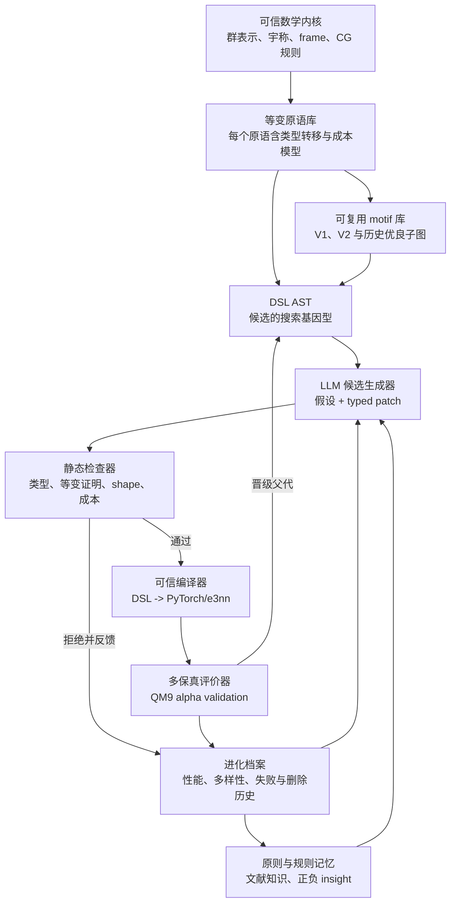
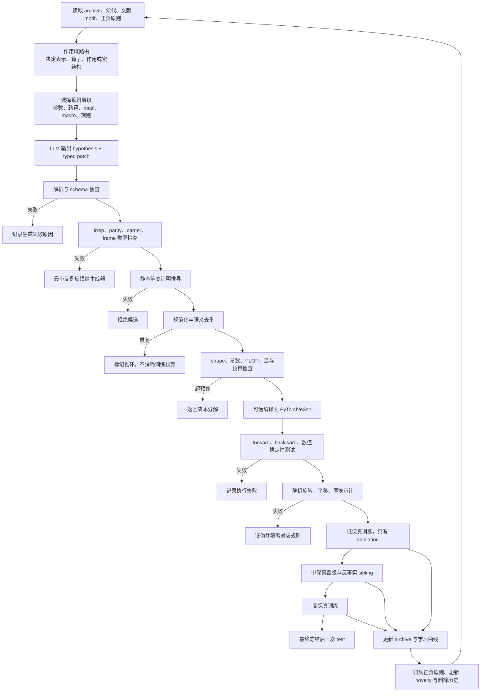

# 面向 LLM 候选生成的等变网络架构 DSL 深度调研与设计依据

> 文档目的：为 QM9 极化率任务上的等变网络自进化系统设计一套真正能帮助大语言模型产生更好候选的领域特定语言（Domain-Specific Language，DSL）。  
> 研究对象：Equiformer、EquiformerV2、e3nn、eSCN、神经架构搜索、程序合成、LLM 驱动的进化式代码搜索。  
> 核心判断：DSL 不应只是限制非法修改的配置表，而应成为连接数学先验、结构生成、静态证明、实验反馈与进化记忆的中间表示。

---

## 1. 先说结论

用户提出的方向是正确的，而且需要比当前实现更进一步：

> 我们设计 DSL 的主要目的，不是让 LLM 少犯语法错误，而是把“什么样的等变网络可以被构造、怎样构造、怎样证明、怎样评价、哪些设计已经失败”表达成 LLM 可读取和可操作的结构化知识，从而提高它生成高质量结构候选的概率。

当前系统中的四类因子 `REPRESENTATION`、`OPERATOR`、`ACTION`、`MACRO` 有价值，但它们目前主要承担**搜索作用域划分**和**安全配置编辑**，还不能承担结构发明。当前 `OperatorSpec` 只包含径向基函数类型、基函数数量、径向 MLP 宽度、是否使用非线性消息和注意力头数。这样的空间可以寻找更好的 Equiformer V1 配置，但无法表达 EquiformerV2 的核心变化，也无法由 V1 组合出新的等变算子。

真正面向结构发明的 DSL 应采用两层设计：

1. **可信数学内核**：固定表示类型、不可约表示、宇称、坐标框架、Clebsch–Gordan 耦合条件以及旋转、平移和置换的合法性规则。LLM 不能修改这些规则。
2. **可进化程序层**：允许 LLM 在可信原语之上组合等变计算图，增加或删除耦合路径，替换多节点 motif，改变分支、残差和归一化结构，并提出可复用的派生重写规则。

因此，后续不应让 LLM 直接修改任意 Python，也不应只让它返回一个超参数 JSON。更合理的搜索基因型是**带类型的 DSL 抽象语法树（AST）及其事务式补丁**；Python/PyTorch 代码是通过可信编译器生成的表型。

---

## 2. 本调研要回答的问题

本调研围绕六个直接服务于实现的问题展开：

1. DSL 如何超越“参数选择表”，成为能够表达新算子的语言？
2. LLM 应在什么抽象层上生成候选，才能兼顾创新性、合法率和可解释性？
3. 如何从数学上保证候选仍满足三维旋转、平移和节点置换的对称性？
4. 如何让 DSL 至少能够同时表达 Equiformer V1 和 EquiformerV2，并允许出现二者之间及二者之外的结构？
5. 如何利用历史实验、失败候选、文献知识和结构新颖度指导 LLM，而不是重复调超参数或循环修改？
6. 当前四因子系统应保留什么、替换什么、新增什么？

---

## 3. 证据边界与资料核验

### 3.1 文献范围

本轮不是按关键词罗列论文，而是按 DSL 所需能力组织文献：

| 能力 | 重点工作 | 用于回答的问题 |
|---|---|---|
| 抽象属性与子图合成 | αNAS | 如何从高层意图合成多节点结构 |
| 细粒度算子 DSL | Syno、Primer、AutoML-Zero、AutoBERT-Zero | 怎样发现人类未预定义的新算子 |
| LLM 生成与进化编排 | SPARK、EvoPrompting、LLMatic、LAPT、AlphaEvolve/OpenEvolve | LLM 在搜索闭环中扮演什么角色 |
| 等变类型与原语 | e3nn、Equiformer、eSCN、EquiformerV2 | 什么是可信的等变构造单元 |
| 静态合法性和约束归纳 | NNSmith、NeuRI | 如何在执行前拒绝非法图 |
| 搜索行为审计 | What Do Evolutionary Coding Agents Evolve? | 为什么代码进化容易退化为调参和循环 |

### 3.2 证据等级

- 已正式发表的论文优先使用会议论文、出版社页面和 DOI 信息。
- arXiv 预印本只用于机制观察，不把仓库声明当成已正式发表的唯一证据。
- SPARK 的仓库声明其被 ICML 2026 接收，但当前公开书目信息仍需以后续 proceedings 为准，因此本文把它标为“仓库声明已接收、正式出版信息待核验”。
- 2026 年的 FairNAD 与进化式代码代理审计工作用于提出设计风险，不把其结论表述成已经被大量独立研究确认的定律。

---

## 4. 用户关于 DSL 的理解是否正确

### 4.1 正确之处

用户把 DSL 类比为“基本操作、基本变量、基本规则，再让大模型利用规则推导更优结构”，这个方向与程序合成、类型系统和形式化方法高度一致。

这里需要把三个层次区分开：

1. **语言层**：定义哪些结构可以写出来，例如张量积、旋转到边坐标框架、SO(2) 通道混合、门控、邻居聚合和残差。
2. **证明层**：规定每个原语的输入输出类型和证明规则，确保组合后仍等变。
3. **搜索层**：LLM、进化算法或树搜索根据目标与历史，在合法程序空间中提出下一批候选。

形式化方法并不负责自动保证候选一定有更低的 MAE，但可以保证搜索集中在语义明确、对称性合法、可编译和可比较的区域。LLM 则负责提出更有希望的假设和组合。

### 4.2 需要修正之处

不能把“推导出最优规则”理解为逻辑演绎能够证明一个神经架构在 QM9 上全局最优。训练损失与泛化性能仍然是经验性质，必须通过实验评价。

更准确的表述是：

> DSL 和形式化约束负责定义并验证候选的结构语义；LLM 利用文献知识、结构先验和实验历史生成有依据的候选；多保真训练负责提供经验反馈；进化数据库负责保留多样性并更新生成策略。

---

## 5. 当前系统审计：它是什么，又不是什么

### 5.1 当前四因子

当前 `ArchitectureSpec` 把架构划分为：

- `REPRESENTATION`：最大角动量、各阶通道数、注意力头内部表示、MLP 倍率等；
- `OPERATOR`：径向基函数、径向网络宽度、非线性消息开关、注意力头数；
- `ACTION`：归一化、dropout、degree rescale；
- `MACRO`：层数和邻域半径。

这个设计具备四个实际优点：

1. 每个字段都能映射到已知的 Equiformer V1 构造参数；
2. 候选是字面量，不执行 LLM 生成代码；
3. 可以检查一次修改是否只发生在路由器选择的因子中；
4. 候选哈希、父子差异和实验结果容易回溯。

### 5.2 当前系统的真实定位

它应被称为：

> **类型化的 Equiformer V1 架构配置空间，附带因子局部编辑协议。**

它还不能被称为完整的“等变算子发明 DSL”，原因如下：

- `OPERATOR` 没有显式计算图；
- 不能表达中间张量的 irreps、宇称和 frame；
- 不能增加或删除 Clebsch–Gordan 耦合路径；
- 不能用一个多节点子图替换另一个子图；
- 不能表达旋转到边坐标系再旋回的计算；
- 不能表达 SO(2) 的按磁量子数分块混合；
- 不能区分普通 S² 激活和可分离 S² 激活；
- 不能产生新的派生算子或重写规则。

### 5.3 为什么“每次只修改一个因子”不能简单等同于“每次只改一个字段”

SPARK 的 where-then-how 思想值得保留：先选择语义作用域，再在该作用域中生成修改。但“作用域局部”不应该被实现为“只改一个数值字段”。

例如，把一个完整 SO(3) 张量积消息子图改成边对齐 SO(2) 消息子图，会同时发生：

- 插入 `RotateToEdgeFrame`；
- 替换 `TensorProduct`；
- 插入多个 `SO2Linear` 或按 (m) 分块的混合；
- 调整激活和归一化；
- 插入 `RotateBack`。

这是一个科学假设一致的 **OPERATOR 事务**，虽然修改多个 AST 节点，但仍然属于一个作用域。若强制只改一个字段，这类结构永远无法出现。

---

## 6. 文献机制：哪些东西能真正转化为 DSL 设计

## 6.1 αNAS：抽象属性不是标签，而是合成目标

αNAS 把神经网络视为程序，用抽象属性描述子图，并在抽象层上进行大步修改。其重要性不在于某个具体搜索结果，而在于以下机制：

1. 用 `shape`、`depth`、`mixing` 等属性描述程序片段；
2. 搜索先修改抽象属性，再合成满足属性的具体子图；
3. 一次抽象修改可以对应多个底层节点的协同变化；
4. 使用抽象距离和 covering 关系指导合成逐步接近目标；
5. 通过抽象等价类压缩大量功能相近的 primitive。

对本项目的直接启示是：等变 DSL 不能只有具体节点，还应为每个子图计算一组静态摘要，例如：

- 不可约表示流；
- 被覆盖的耦合路径；
- 最高角频率；
- 交互阶数；
- 标量瓶颈深度；
- 坐标框架转换次数；
- 各阶非线性深度；
- 估算参数量、显存和 FLOP；
- 等变证明状态。

LLM 可以先提出“增加 (l=2) 到标量读出的有效路径，同时不显著增加高阶张量积成本”这样的抽象目标，再由合成器寻找具体子图。这比让 LLM 猜一个 `tensor_channels=48` 更接近结构设计。

## 6.2 Syno：细粒度 DSL 可以发现真正的新算子

Syno 的关键贡献是把算子搜索下沉到张量坐标和循环级 primitive，而不是只组合卷积、矩阵乘等已有大算子。其 primitive graph 使用 `Merge`、`Split`、`Unfold`、`Shift`、`Expand`、`Stride`、`Reduce`、`Share` 等原语表达张量索引变换，并为原语定义自底向上和自顶向下的符号语义。

Syno 对本项目最重要的证明是：

> 只要原语粒度足够细、语义足够严格、合成和去重机制足够强，搜索空间可以产生不在预定义完整算子列表中的新算子。

但我们不能照搬 Syno 的张量坐标原语，因为本项目的核心约束是群表示和等变性。等变 DSL 的底层原语应是不可约表示线性变换、球谐、合法张量积路径、坐标框架旋转、按 (m) 分块混合、不变量控制的缩放等。

还应借鉴 Syno 的三项工程机制：

- symbolic shape 与静态语义传播；
- canonicalization 与 term rewriting；
- 语义指纹去除等价或近等价结构。

## 6.3 Primer：低级原语空间为什么可能产生意外结构

Primer 没有把完整 self-attention 当作不可拆的 primitive，而是允许搜索 TensorFlow 低级操作构成的程序。其结果出现了 squared ReLU 和 Q/K/V projection 后的 depthwise convolution。这说明如果搜索空间只包含“选择哪一种现成 Transformer block”，就不会发现这些内部结构变化。

但 Primer 也暴露了代价：自由程序中大量候选不可训练或很快失败。因此，本项目不能简单开放任意 PyTorch。合理折中是：

- 粒度低于完整 Equiformer block；
- 粒度高于任意标量算术和任意张量索引；
- 每个原语都携带等变类型和合法性规则；
- 从可工作的 V1/V2 motif 进行概念初始化；
- 允许 LLM 对 motif 做结构重组，而非从完全随机程序开始。

## 6.4 e3nn：等变 DSL 的可信数学内核

e3nn 提供了最自然的类型基础：特征不是普通的“通道数”，而是 O(3)/SO(3) 不可约表示的直和。

可以把一个中间值抽象为：

```text
GeoTensor[
  carrier = node | edge | graph,
  irreps = multiplicity × (l, parity),
  frame = global | edge_aligned,
  channels,
  dtype
]
```

其中：

- (l=0) 是旋转不变量标量；
- (l=1) 表示向量型特征；
- 更高 (l) 表示更高角频率的不可约表示；
- parity 表示反演下的奇偶性；
- frame 表示特征当前在全局坐标系还是边对齐坐标系中表达。

张量积路径 (l_1,p_1\rightarrow l_2,p_2\rightarrow l_3,p_3) 必须满足：

$$
|l_1-l_2|\le l_3\le l_1+l_2,
$$

$$
p_1p_2=p_3.
$$

这些规则不应由 LLM 猜测，而应内置在类型检查器和路径枚举器中。只要每个 primitive 的等变性质已证明，且组合遵守类型，组合图的等变性就可以由结构归纳得到。

## 6.5 eSCN 与 EquiformerV2：检验 DSL 表达力的最低标准

eSCN 的核心技巧是把一条边的方向旋转到固定轴，使球谐表示在该 frame 中具有更简单的结构，再用 SO(2) 分块计算替代昂贵的完整 SO(3) 张量积，最后旋回全局坐标系。

EquiformerV2 在这个基础上替换了原 Equiformer 的关键卷积路径，并加入：

- attention re-normalization；
- separable S² activation；
- separable layer normalization。

这不是简单地把层数或头数调大，而是对中间表示、frame、消息计算和稳定化机制的联合重构。因此我们提出一个硬性验收标准：

> 如果 DSL 不能编译出 Equiformer V1，也不能通过一组有类型的子图重写得到 EquiformerV2 风格的计算图，那么它不具备本项目所需的表达力。

同时必须保持科学谨慎：EquiformerV2 在大规模原子任务上显示出显著优势，但论文中 QM9 小数据任务的收益并非所有属性都显著。不能预设 V2 motif 对 QM9 alpha 必然更优。DSL 的意义正是允许搜索 V1、V2 及二者之间的混合结构，并通过验证集判断。

## 6.6 SPARK：保留 where-then-how，替换代码区域路由

SPARK 将生成过程拆为：

1. 选择架构因子或代码区域；
2. 生成与因子相关的修改指令；
3. 根据指令生成代码；
4. 用区域标签和 diff 检查限制修改边界。

这种分解能提高候选的可执行率并改善信用分配。但其原始因子依赖人工划分，且本质上仍对源代码区域操作。

本项目应保留以下思想：

- 先决定修改哪里，再决定怎样修改；
- 给不同作用域提供不同的知识和历史；
- 检查修改是否超出声明的科学假设。

但路由对象应升级为：

- DSL AST 节点；
- 有类型的子图；
- 可复用 motif；
- 抽象属性目标；
- 联合编辑事务。

换句话说，`OPERATOR` 仍可作为顶层作用域，但其内部不再只是五个数值字段，而是一张可编辑的等变程序图。

## 6.7 EvoPrompting、LLMatic、LAPT：LLM 的不同角色

EvoPrompting 证明 LLM 可以扮演自适应 mutation/crossover：它从已有父代及其分数中生成新代码。优点是词表式代码空间比人工枚举的离散空间更开放，缺点是合法性依赖执行筛选。

LLMatic 将 LLM 与质量多样性搜索结合，说明 LLM 不应只围绕单一最优点反复微调，而应维护性能与行为描述符上的多样性。

LAPT 从高性能架构归纳自然语言设计原则，再用这些原则裁剪搜索空间。对我们而言，自然语言原则适合作为“假设记忆”，例如：

> 在计算预算固定时，优先减少高阶完整张量积路径，将容量转移到低成本的 edge-frame mixing。

但自然语言原则不可执行、不可静态证明，因此不能替代 DSL。正确关系是：

```text
文献和实验 -> 设计原则记忆 -> LLM 提出 DSL 补丁 -> 类型与证明系统验证
```

## 6.8 AlphaEvolve/OpenEvolve：搜索编排不等于架构语言

AlphaEvolve/OpenEvolve 类型的框架提供：

- 程序数据库；
- 父代采样；
- LLM ensemble；
- evaluator；
- island 或 MAP-Elites 式多样性维护；
- diff 或完整重写；
- 多阶段评价。

这些机制适合做搜索外壳，但不会自动决定“程序”应是什么。抽象层选择直接决定搜索到底是在调常数、改 Python 实现，还是发明结构。

本项目应把：

- **DSL AST/typed patch** 作为 genotype；
- **编译后的 PyTorch 模型**作为 phenotype；
- **OpenEvolve 风格数据库与采样器**作为搜索编排；
- **Equiformer/QM9 训练器**作为 evaluator。

## 6.9 进化式代码代理审计：为什么必须分离结构搜索与超参数调优

近期对大量进化式代码搜索轨迹的审计显示，搜索最常发生的变化是超参数调优，而更可能产生实质收益的类别包括架构变化、效率改造和外部算法机制。轨迹中还存在删除后又重新加入相同代码、在浅层谱系外浪费大量预算等循环现象。

这对本项目非常重要：如果把任意数值和结构放在同一自由代码空间，LLM 很容易选择风险最低的改法，例如改 dropout、宽度和学习率，并把这些收益误当成架构发现。

因此 DSL 和评价协议必须显式区分：

- `STRUCTURAL`：拓扑、路径、motif、frame、非线性或归一化机制变化；
- `CAPACITY`：通道数、层数和表示带宽；
- `TRAINING_HPARAM`：学习率、权重衰减、调度器等；
- `SYSTEM`：kernel、精度、编译和数据吞吐优化。

搜索阶段先给结构修改保留明确配额；结构稳定后再使用贝叶斯优化或局部搜索调数值。报告中应分别给出 structural gain 和 tuning gain。

## 6.10 NNSmith 与 NeuRI：静态约束、符号执行和自动归纳

NNSmith 为算子声明输入约束、类型转移和输出类型，在增量构图时使用约束求解避免产生非法图。NeuRI 从 API 执行 trace 中归纳 shape propagation 和输入约束，并通过表达式指纹及 SMT 去除重复规则。

可借鉴的部分包括：

- 每个 primitive 声明前置条件和类型转移；
- 在 AST 构造期间增量检查，而非训练前才发现错误；
- 对 shape、通道和索引约束使用符号求解；
- 对派生规则做具体执行与符号约束的联合验证。

但等变性不能只从有限测试 trace 统计归纳。随机旋转测试只能发现错误，不能替代数学证明。新的 primitive 若进入可信内核，必须给出群作用下的等式证明或由已证明原语组合导出。

---

## 7. 跨论文得到的共同结论

### 7.1 DSL 粒度决定可发现的创新层级

| DSL 中最小可编辑对象 | 主要能发现什么 | 主要缺陷 |
|---|---|---|
| 完整模型名称 | 模型选择 | 无法产生新结构 |
| block/算子枚举 | 新 block 组合 | 无法改变算子内部机制 |
| 配置字段 | 宽度、深度、头数 | 容易退化为超参数搜索 |
| 有类型 motif | 多节点协同结构变化 | 需要编译与证明系统 |
| 可信细粒度 primitive | 新算子、新计算路径 | 搜索空间大，需要强约束和抽象引导 |
| 任意 Python | 理论上开放 | 合法率低、难证明、难去重、难归因 |

本项目适合的层级是“可信细粒度 primitive + 有类型 motif”，而不是两个极端。

### 7.2 约束与创新不是对立关系

强类型会排除违反对称性的候选，但不会排除在合法等变原语上形成的新组合。相反，它减少了 LLM 在无效语法、shape 错误和非等变路径上的预算，使更多实验用于真正的结构差异。

### 7.3 语言必须同时服务生成、验证、记忆和归因

只用 DSL 生成代码仍然不够。一个候选的表示还必须支持：

- 计算其结构摘要；
- 与历史候选比较语义新颖度；
- 识别等价结构；
- 记录父子补丁；
- 关联假设、证明、成本和训练结果；
- 对联合编辑生成反事实消融。

---

## 8. DSL v2 总体设计



### 8.1 两层语言

#### 第一层：可信数学内核

这一层由研究者和实现者维护，LLM 不能直接修改。它包含：

- 群与群作用；
- irreps 与 parity；
- carrier 和 frame；
- Clebsch–Gordan 合法路径；
- 旋转、平移和置换的证明规则；
- 基础原语的类型与语义；
- 编译模板及单元测试。

#### 第二层：可进化程序层

LLM 可以：

- 组合可信原语；
- 修改合法 tensor product paths；
- 替换 motif；
- 增删支路和残差；
- 调整各阶的信息流；
- 提议新的派生 motif 或重写规则；
- 在受控流程中提议新 primitive，但不能未经证明进入可信库。

---

## 9. 类型系统

### 9.1 核心值类型

```text
GeoTensor[
  carrier: Node | Edge | Graph,
  irreps: IrrepSum,
  frame: Global | EdgeAligned(edge_id),
  parity: encoded_in_irreps,
  channels: ChannelMap,
  dtype: fp32 | bf16
]

InvariantScalar[carrier, channels]
RadialScalar[edge, basis_dim]
AttentionWeight[edge, heads]
NeighborIndex[src, dst]
GraphScalar[target = alpha]
```

### 9.2 为什么 frame 必须进入类型

如果 frame 只作为注释，LLM 可能把 edge-aligned 特征直接与 global-frame 特征相加，数值 shape 虽一致但几何语义错误。类型检查应拒绝：

```text
ResidualAdd(GlobalFeature, EdgeAlignedFeature)
```

只有经过 `RotateBack` 或显式 frame 对齐后才能合并。

### 9.3 carrier 与置换语义

- Node 值按节点置换共同变换；
- Edge 值按边索引置换；
- Graph 值应对节点排列保持不变；
- `SumNeighbors` 从 Edge 聚合到 Node；
- `ReadoutScalar` 从 Node 标量聚合到 Graph 标量。

carrier 类型可以提前阻止把图级标量错误广播成不受控的边方向量。

---

## 10. 可信 primitive 家族

### 10.1 几何源

| 原语 | 输入 | 输出 | 作用 |
|---|---|---|---|
| `RelativePosition` | node positions, edge index | edge vector | 构造平移不变的相对位移 |
| `Distance` | edge vector | radial scalar | 距离不变量 |
| `RadialBasis` | distance | radial features | Gaussian/Bessel 等径向展开 |
| `SphericalHarmonic` | edge direction, l range | edge irreps | 方向的角向基 |

### 10.2 frame 变换

| 原语 | 约束 | 输出 |
|---|---|---|
| `RotateToEdgeFrame` | 需要边方向与 global feature | edge-aligned feature |
| `RotateBack` | frame 必须是对应 edge-aligned | global feature |

二者应携带同一边标识，避免把一条边的局部 frame 用于另一条边。

### 10.3 等变线性与耦合

- `IrrepLinear`：只在相同 irrep 类型允许的 multiplicity 空间中混合；
- `TensorProduct(paths=...)`：显式列出合法 CG paths；
- `SO2Linear(m_blocks=...)`：在 edge-aligned frame 中按 (m) 分块混合；
- `ChannelMix`：在不改变表示类型的前提下混合 multiplicity；
- `ScaleByInvariant`：用标量控制任意 irrep 特征的幅值。

### 10.4 注意力与权重

- `InvariantScore`：从标量或合法不变量计算注意力分数；
- `NeighborSoftmax`：对同一目标节点邻居边归一化；
- `AttentionRenorm`：表达 V2 的重新归一化机制；
- `ApplyAttention`：只能用不变量权重缩放等变值。

### 10.5 非线性

- `ScalarMLP`：只作用于不变量标量；
- `Gate`：标量门控制非标量 irreps；
- `S2Activation`：在球面采样/变换域作用；
- `SeparableS2Activation`：分离标量与非标量路径；
- `NormNonlinearity`：通过不变量范数控制非标量；
- `Identity`：用于显式消融和可选路径。

任意逐元素 ReLU 不能直接用于 (l>0) 的 global-frame 分量，因为一般会破坏旋转等变性。

### 10.6 聚合、状态更新与宏结构

- `SumNeighbors`、`MeanNeighbors`、`DegreeRescale`；
- `ResidualAdd`：要求 carrier、frame 和 irreps 完全兼容；
- `ConcatSameIrrep`：允许 multiplicity 维拼接；
- `PerDegreeNorm`、`SeparableNorm`；
- `Branch`、`Merge`、`Repeat`、`Skip`；
- `ReadoutScalar`：只从合法标量通路产生 QM9 alpha 图级输出。

---

## 11. 抽象属性：让 LLM 不只看源代码和 MAE

每个 DSL 子图应自动计算以下摘要。

### 11.1 表示与路径属性

- `IrrepFlowSignature`：输入到输出经过的 (l,p) 类型序列；
- `CouplingCoverage`：包含哪些 (l_1\otimes l_2\rightarrow l_3) 路径；
- `AngularBandwidth`：最大 (l) 及各层带宽；
- `InteractionOrder`：信息经过多少次邻域/张量耦合；
- `InvariantBottleneckDepth`：非标量信息多少次被压缩成标量后再展开；
- `FrameTransitionSignature`：global 与 edge-aligned frame 的转换位置。

### 11.2 非线性与聚合属性

- `NonlinearDepthByDegree`：不同 (l) 上的有效非线性深度；
- `AggregationSignature`：sum/mean/softmax/degree rescale 的组合；
- `AttentionValuePath`：score、value、renormalization 的依赖关系；
- `ResidualTopology`：残差连接和分支图的规范表示。

### 11.3 成本与证明属性

- 参数量；
- 理论 FLOP；
- 估算激活显存；
- 按 (l) 和 tensor product path 分解的成本；
- `EquivarianceProofStatus`；
- `CanonicalSemanticFingerprint`。

这些摘要有四种用途：

1. 作为 MAP-Elites 的行为描述符，维护不同结构族；
2. 作为 LLM prompt 的紧凑历史，而非塞入全部代码；
3. 作为抽象距离，指导结构合成；
4. 识别结构等价、搜索循环和伪创新。

---

## 12. 编辑语言：从字段修改升级为事务式结构重写

### 12.1 五级编辑

| 层级 | 编辑对象 | 示例 |
|---|---|---|
| 1. parameter edit | primitive 的局部参数 | 修改 radial basis 数量 |
| 2. path edit | CG/SO(2) 路径集合 | 增加 (1\otimes1\rightarrow2) 路径 |
| 3. motif rewrite | 多节点子图 | Gate 子图换为 SeparableS2 子图 |
| 4. macro rewrite | 分支、重复、残差 | 高阶支路每两层更新一次 |
| 5. rule invention | 可复用派生规则 | 自动提出低成本高阶更新 motif |

### 12.2 typed transaction

一次修改可以改变多个节点，但必须满足：

- 属于一个声明的科学假设；
- 补丁应用是原子的，不能只应用一半；
- 修改前后接口类型兼容，或同时包含合法适配器；
- 所有 proof obligations 被满足；
- 能生成结构指纹和父子差异；
- 失败时整项回滚。

### 12.3 联合因子编辑

大多数轮次可维持单作用域编辑以利归因，但应定期开放：

- `REPRESENTATION × OPERATOR`：表示带宽和耦合路径需要协同；
- `OPERATOR × ACTION`：新算子可能需要配套的稳定化或归一化；
- `OPERATOR × MACRO`：低成本算子可能允许更深网络。

联合编辑应自动生成 sibling counterfactual：

1. 只改 A；
2. 只改 B；
3. 同时改 A+B。

由此判断收益来自单项还是协同作用。

---

## 13. V1 到 V2 的可表达性演示

### 13.1 V1 风格 motif

```yaml
motif: EquiformerV1Message
inputs: [node_irreps, edge_radial, edge_spherical_harmonics]
body:
  - TensorProduct:
      paths: legal_cg_paths
      weights: RadialMLP(edge_radial)
  - Gate:
      gates_from: scalar_channels
  - PerDegreeNorm: {}
  - InvariantScore: {}
  - NeighborSoftmax: {}
  - ApplyAttention: {}
  - SumNeighbors: {}
outputs: [node_irreps]
```

### 13.2 V2 风格事务式 rewrite

```yaml
edit_kind: motif_rewrite
replace: EquiformerV1Message
with:
  - RotateToEdgeFrame: {}
  - SO2Linear:
      m_blocks: inferred_from_irreps
  - SplitScalar: {}
  - SeparableS2Activation: {}
  - SeparableNorm: {}
  - AttentionRenorm: {}
  - RotateBack: {}
  - SumNeighbors: {}
proof_obligations:
  - frame_round_trip
  - so2_block_type_preservation
  - invariant_attention_weights
  - output_interface_equal_to_parent
```

这说明“从 V1 产生 V2 样式结构”不是一次单字段 mutation，而是一个可验证的多节点事务。如果 DSL 只允许 `basis_type` 或 `num_heads` 修改，LLM 无论多强也不可能生成这种候选。

### 13.3 DSL 还应允许 V1/V2 之外的中间设计

例如：

- 仅对 (l\ge2) 使用 edge-frame SO(2) 路径，对 (l\le1) 保留完整 tensor product；
- 高阶表示隔层更新，标量和向量每层更新；
- attention score 仍使用 V1，但 value 路径使用 V2；
- 根据边的径向区间动态选择耦合路径，但控制信号必须是不变量；
- 让昂贵 path 只在少数层出现，其他层使用低成本 ChannelMix。

这些才是 DSL 帮助 LLM形成新候选的实际空间。

---

## 14. LLM 候选生成接口

LLM 不应返回自由 Python，而应返回严格的候选提案：

```yaml
parent_id: candidate_0042
edit_scope: OPERATOR
edit_kind: motif_rewrite
hypothesis: >
  当前父代在 l=2 路径上成本较高且验证收益有限；保留低阶完整耦合，
  将高阶路径改为 edge-frame SO(2) mixing，可能改善成本/精度比。
evidence:
  literature:
    - eSCN edge-aligned SO2 convolution
    - EquiformerV2 separable stabilization
  archive:
    - candidate_0031 high_l_cost_ablation
preconditions:
  - lmax >= 2
  - edge_frame_rotation_available
typed_patch:
  transaction_id: hybrid_high_l_so2_v1
  operations:
    - match: TensorProduct[path.output_l >= 2]
    - replace_with: HybridSO2HighDegreeMotif
expected_irrep_flow:
  preserve_input_output_irreps: true
expected_cost_change:
  flops: decrease
  memory: decrease_or_equal
novelty_signature:
  family: hybrid_so3_so2
proof_obligations:
  - all_output_paths_typed
  - frame_round_trip
counterfactual_plan:
  - parent
  - high_l_so2_without_separable_norm
  - high_l_so2_with_separable_norm
```

这个接口迫使 LLM 同时提供：

- 修改的科学假设；
- 使用的文献与实验依据；
- 精确的 AST 操作；
- 预期信息流和成本变化；
- 新颖度类别；
- 需要由系统验证的证明义务；
- 必要的反事实实验。

LLM 的 reasoning 不作为真实性证明，但可以用于归档、错误诊断和后续原则归纳。

---

## 15. 怎样让 LLM 基于“当前情况”生成更好的候选

用户提出的核心不是让 LLM 在真空里生成，而是“基于当前情况”。这里的当前情况必须被结构化为六类上下文。

### 15.1 当前父代状态

- DSL AST；
- 抽象属性；
- 参数量与成本分解；
- 各阶段 validation MAE；
- 学习曲线斜率和稳定性；
- 等变证明与数值审计结果。

### 15.2 局部谱系历史

- 父代、祖先和 sibling；
- 每次 typed patch；
- 改动后的性能增减；
- 哪些改动被删除后又重新加入；
- 哪些结构族出现搜索循环。

### 15.3 全局 archive

不能只给 LLM top-k 分数，否则容易坍缩到同一结构。应按以下维度采样代表：

- 最佳 validation MAE；
- 最佳成本/精度 Pareto；
- 不同 irrep flow；
- 不同 frame transition；
- 不同 nonlinear motif；
- 有代表性的失败候选。

### 15.4 文献 motif 库

文献知识不只保存论文摘要，而应转化为：

- 可执行 motif；
- 适用前提；
- 预期收益；
- 已知风险；
- 原论文证据范围；
- 在本项目上的验证状态。

例如 EquiformerV2 motif 必须标注“在大规模原子任务显著，在 QM9 alpha 上不能预设收益”。

### 15.5 正负设计原则

原则由多次可复现结果归纳，而不是一次实验立即写成事实。

正原则示例：

> 在固定表示宽度下，减少高阶完整 CG path 并保留低阶完整耦合，多次改善短程验证 MAE/耗时比。

负原则示例：

> 在 batch size、数据子集和训练 step 固定时，直接将所有非标量激活替换为普通逐元素激活会破坏等变测试，禁止再次生成。

### 15.6 未探索边界

prompt 中还应告诉 LLM 哪些结构属性组合尚未探索，鼓励它填补 archive 空白，而非只对冠军做微调。

---

## 16. 完整候选生成与评价闭环



### 16.1 等变性验证的层次

1. **构造性证明**：最重要。由已证明 primitive 和类型规则导出整体等变。
2. **符号约束**：检查路径、frame 和 shape 的一致性。
3. **数值审计**：随机旋转、平移和置换，用于发现实现错误。
4. **回归测试**：编译器或 kernel 修改后检查历史 motif。

数值等变误差可定义为：

$$
\epsilon_{\mathrm{eq}}=
\frac{\lVert f(g\cdot x)-\rho_{\mathrm{out}}(g)f(x)\rVert}
{\lVert f(x)\rVert+\varepsilon}.
$$

对于 QM9 alpha 的图级标量输出，输出表示为不变量，因此旋转后预测应保持不变。但隐藏层仍可包含非标量 irreps，它们对构造标量目标非常重要。

### 16.2 测试集隔离

- 搜索、晋级、规则归纳只使用训练集和验证集；
- test 不能进入 LLM prompt 和 archive fitness；
- 最终架构、训练协议和 checkpoint 选择全部冻结后，才执行一次 test；
- `test_evaluated=false` 应作为搜索阶段的硬状态约束。

---

## 17. 多样性、去重和防循环

### 17.1 三种重复

1. 文本不同、AST 相同；
2. AST 不同、规范化后语义相同；
3. 结构不同但抽象属性和实际行为高度近似。

对应需要：

- canonical AST hash；
- term rewriting；
- semantic fingerprint；
- 抽象属性距离；
- 必要时使用小规模 probe 输入比较中间表示。

### 17.2 deletion history

每条谱系应保存删除过的 motif 和被替换的子图。如果 LLM 再次加入相同结构，系统应提示：

- 它何时被删除；
- 当时造成的性能和成本变化；
- 本次是否有新的上下文足以证明值得重试。

### 17.3 质量多样性描述符

建议初期使用三到四个低维描述符建立 archive，例如：

- 高阶 CG path 比例；
- edge-frame 计算比例；
- 非线性 motif 类别；
- 参数量或单 step 时间区间。

描述符过多会使 archive 稀疏，需通过实验逐步调整。

---

## 18. 当前代码需要新增或修改的组件

### 18.1 保留

- 四因子顶层路由；
- 候选 ID 和规范序列化；
- 父子谱系；
- 严格 schema；
- evaluator 与多保真训练接口；
- checkpoint 和 test 隔离机制。

### 18.2 替换

| 当前组件 | 问题 | 目标组件 |
|---|---|---|
| `OperatorSpec` 五字段 | 无内部结构 | `OperatorGraphSpec` |
| 完整因子字典 replacement | 只能配置替换 | typed AST patch |
| `assert_factor_local_change` | 只能判断顶层对象不同 | transaction scope validator |
| 候选 Python 字面量 | 结构表达弱 | YAML/JSON DSL AST |
| 只按架构 JSON 哈希 | 无语义去重 | canonical semantic fingerprint |

### 18.3 新增

建议新增模块：

```text
equivariant_nas/dsl/
  types.py              # irreps、parity、carrier、frame
  primitives.py         # primitive schema 和类型转移
  ast.py                # DSL AST
  parser.py             # 严格解析
  type_checker.py       # 增量类型检查
  proof.py              # 等变证明义务与推导记录
  canonicalize.py       # 重写和语义指纹
  abstract_properties.py# irrep flow、cost、motif 摘要
  patch.py              # typed transaction
  compiler.py           # DSL 到可信 PyTorch/e3nn
  motifs/
    equiformer_v1.yaml
    escn_so2.yaml
    equiformer_v2.yaml

equivariant_nas/search/
  context_builder.py    # 生成 LLM 当前情况
  structural_router.py  # 选择作用域和编辑层级
  proposal_schema.py    # LLM 输出契约
  novelty.py            # 多样性与循环检测
  principle_memory.py   # 正负规则
  counterfactuals.py    # 联合编辑消融
```

---

## 19. 推荐实施路线

### 阶段 A：可表达性骨架

完成内容：

1. 定义 `GeoTensor` 类型；
2. 实现最小 primitive 集；
3. 实现 AST、解析器和类型检查；
4. 手工编码 V1 motif；
5. 编译结果与当前官方 V1 在固定权重/输入下对齐；
6. 加入旋转、平移和置换审计。

验收标准：V1 可由 DSL 编译，输出 shape、参数和数值行为可回归。

### 阶段 B：V2 表达力

完成内容：

1. 加入 frame 类型；
2. 加入 edge-frame rotation、SO2 mixing；
3. 加入 separable S² activation/norm 和 attention renorm；
4. 编码 V2 motif；
5. 构造 V1→V2 typed transaction；
6. 验证所有中间层等变误差。

验收标准：同一 DSL 可以表达 V1、V2 和至少一个混合结构。

### 阶段 C：结构搜索闭环

完成内容：

1. LLM 输出 typed patch；
2. schema、类型、证明、成本、编译和数值审计；
3. 与 OpenEvolve 风格 archive 对接；
4. 引入抽象属性和结构新颖度；
5. 将结构搜索与训练超参数搜索分开。

验收标准：不执行自由 LLM Python，也能端到端产生、编译、训练和归档结构候选。

### 阶段 D：知识驱动与规则发明

完成内容：

1. 文献 motif 库；
2. 正负原则记忆；
3. deletion history 与循环检测；
4. 联合编辑及 sibling counterfactual；
5. 派生 rewrite rule 的提议和验证流程。

验收标准：LLM 的每个候选能说明使用了哪些当前证据，并能区分结构创新与数值调参。

---

## 20. 必须做的消融和科学验证

为了证明 DSL 确实帮助 LLM 生成更好的候选，而不只是增加工程复杂度，需要至少比较：

### 20.1 表示层消融

1. 当前四因子配置 JSON；
2. 自由 Python diff；
3. typed motif DSL；
4. typed primitive DSL + 抽象属性。

评价：合法率、等变通过率、唯一结构比例、结构修改比例、短训排名相关性、最终 validation MAE、单位有效候选 GPU 时间。

### 20.2 上下文消融

- 只给父代；
- 父代 + top candidates；
- 父代 + 多样性 archive；
- 再加入失败与删除历史；
- 再加入文献 motif 和正负原则。

评价 LLM 是否减少重复、是否增加结构性编辑、是否提高候选晋级率。

### 20.3 路由消融

- 永远单字段；
- 单因子多节点事务；
- 定期联合因子事务；
- 联合事务 + sibling counterfactual。

### 20.4 结构与调参分离

在相同训练预算下比较：

- 只做超参数搜索；
- 只做结构搜索；
- 结构搜索后再调参；
- 混在一个空间中自由进化。

如果 DSL 方案最终收益主要来自通道数和 dropout，而不是 motif/path/topology，则不能声称实现了等变架构自进化。

---

## 21. 风险与不能提前声称的结论

### 21.1 搜索空间过大

细粒度 primitive 会指数扩大组合空间。需要 motif 初始化、类型驱动生成、抽象距离、多保真评价和 archive 多样性共同控制。

### 21.2 类型合法不等于可训练

一个结构可以严格等变但优化困难。EquiformerV2 对 S² activation 的稳定化就是例子。因此需要 forward/backward、梯度尺度和短训稳定性检查。

### 21.3 低保真排序可能失真

低 step 下学习快的候选不一定全量最好。应记录不同 fidelity 的排名相关性，并允许少量探索性晋级而非只取 top-k。

### 21.4 QM9 alpha 的任务特异性

alpha 是图级旋转不变量标量，但隐藏层的非标量表示仍然可能帮助捕获几何关系。不能把“输出是标量”误写为“高阶表示无用”。

### 21.5 不应提前声称发现新算子

只有当候选：

- 不是已有 motif 的参数化实例；
- 不是规范化后的等价重写；
- 在重复实验中有稳定收益；
- 通过等变证明和数值审计；
- 有清晰的结构机制和消融；

才可以谨慎讨论“新等变算子或新结构 motif”。

---

## 22. 对当前项目最关键的设计决策

1. 保留四因子，但把它们定义为**路由作用域**，而不是最终搜索语法。
2. 优先把 `OPERATOR` 升级为显式、有类型的等变子图 DSL。
3. 不允许 LLM 修改数学内核；允许它组合原语和提出待验证的派生规则。
4. LLM 输出 typed patch，不直接输出任意 Python。
5. 一次编辑允许改变多个 AST 节点，只要它们属于一个原子科学假设。
6. 把 V1 和 V2 同时可表达设为 DSL v2 的最低验收标准。
7. archive 不只存 MAE，还存抽象属性、失败、删除历史和结构指纹。
8. 明确分离架构结构搜索、容量配置和训练超参数优化。
9. 静态证明保证对称性，随机变换测试负责证伪实现错误。
10. 用消融实验证明 DSL 是否真的提高了 LLM 有效结构候选率。

---

## 23. 最终回答：DSL 到底为 LLM 做了什么

一个好的等变架构 DSL 应同时完成五件事：

1. **告诉 LLM 能用什么积木**：可信等变 primitive 和 motif；
2. **告诉 LLM 怎样组合才有意义**：类型、frame、CG path 和重写规则；
3. **告诉 LLM 当前哪里值得改**：父代瓶颈、成本分解、学习曲线和 archive 空白；
4. **告诉 LLM 过去什么有效或无效**：谱系、反事实、失败与删除历史；
5. **让系统能自动验证提案**：静态证明、规范化、编译、数值审计和多保真训练。

因此，DSL 不是搜索算法的附属配置文件，而是整个系统的**知识接口、候选接口和验证接口**。只有做到这一点，LLM 才有机会从“保守地改几个参数”升级为“在数学合法的空间中提出 V1→V2 级别乃至新的结构假设”。

---

## 参考文献与核验状态

1. Equiformer: Equivariant Graph Attention Transformer for 3D Atomistic Graphs, ICLR 2023. [arXiv:2206.11990](https://arxiv.org/abs/2206.11990)
2. EquiformerV2: Improved Equivariant Transformer for Scaling to Higher-Degree Representations, ICLR 2024. [arXiv:2306.12059](https://arxiv.org/abs/2306.12059)
3. eSCN: E(3)-Equivariant Graph Neural Networks for Data-Efficient and Accurate Interatomic Potentials, ICML 2023. [arXiv:2302.03655](https://arxiv.org/abs/2302.03655)
4. e3nn: Euclidean Neural Networks, 2022. [arXiv:2207.09453](https://arxiv.org/abs/2207.09453)
5. αNAS: Program Synthesis for Neural Architecture Search, OOPSLA 2022. [DOI:10.1145/3563329](https://doi.org/10.1145/3563329)
6. Syno: Synthesizing Operator Implementations for Neural Networks, ASPLOS 2025. [DOI:10.1145/3676642.3736118](https://doi.org/10.1145/3676642.3736118)
7. Primer: Searching for Efficient Transformers for Language Modeling, NeurIPS 2021. [arXiv:2109.08668](https://arxiv.org/abs/2109.08668)
8. EvoPrompting: Language Models for Code-Level Neural Architecture Search, NeurIPS 2023. [arXiv:2302.14838](https://arxiv.org/abs/2302.14838)
9. LLMatic: Neural Architecture Search via Large Language Models and Quality-Diversity Optimization, GECCO 2024. [arXiv:2306.01102](https://arxiv.org/abs/2306.01102)
10. NNSmith: Generating Diverse and Valid Test Cases for Deep Learning Compilers, ASPLOS 2023. [arXiv:2207.13066](https://arxiv.org/abs/2207.13066)
11. NeuRI: Diversifying DNN Generation via Inductive Rule Inference, ESEC/FSE 2023. [arXiv:2302.02261](https://arxiv.org/abs/2302.02261)
12. AutoML-Zero: Evolving Machine Learning Algorithms From Scratch, ICML 2020. [arXiv:2003.03384](https://arxiv.org/abs/2003.03384)
13. AutoBERT-Zero: Evolving BERT Backbone from Scratch, AAAI 2022. [arXiv:2107.07445](https://arxiv.org/abs/2107.07445)
14. AlphaEvolve: A Coding Agent for Scientific and Algorithmic Discovery, 2025. [arXiv:2506.13131](https://arxiv.org/abs/2506.13131)
15. SPARK, 2026 preprint; repository acceptance statement requires later proceedings verification. [arXiv:2605.04057](https://arxiv.org/abs/2605.04057)
16. What Do Evolutionary Coding Agents Evolve?, 2026 preprint. [arXiv:2605.20086](https://arxiv.org/abs/2605.20086)
17. Structuring Open-Ended Neural Architecture Discovery, 2026 preprint. [arXiv:2605.19247](https://arxiv.org/abs/2605.19247)

